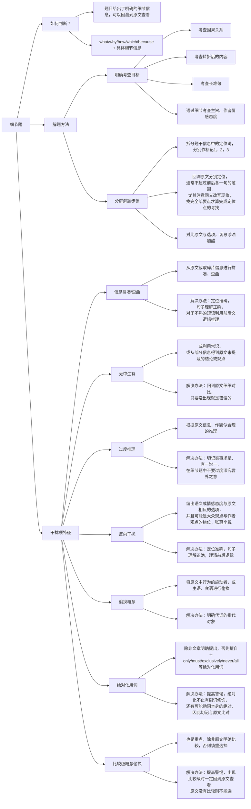

> [!warning] 笔者实力有限，因此本文的经验也许只适合一小部分人，千万慎用！
> ***笔者的 BG***：
> - 本科西电计科院物联网专业，GPA 3.1/4.0
> - 一份网络相关的科研经历，一份机器学习相关的毕设，无竞赛、无实习
> - 初试完学习了林轩田老师的《机器学习基石》系列课程和《动手学深度学习》，并找了一些 GitHub 的 NLP 项目练手，以及阅读复现了一些相关研究领域的论文
> - 初试成绩 342（小分是 71 82 91 98）
> - 英语：22 年 12 月份最后一次 CET-6 考了 445 分
> - 二战选手
> - 其它：*（想到了再补充）*
> 
> ***本文可能适合的人群***：
> - <u>本科时卷不动又躺不平的选手</u>，我自己就是个大摆子，但我对自己的能力有非常清醒的认识——==智商不足、努力来凑==。如果你的本科水平在西电等中部 211 层次之上，在武大华科等上流 985 守门员之下，那么这篇经验贴可能对你会有所帮助 *（太高了看我这个菜鸡的经验收效甚微，太低了我比较怀疑你的执行力是否能够完成，当然你能够做到并来打我脸，乐意至极）*
> - <u>二战选手</u>：我在这篇经验贴里，会回顾我在一战、二战中的所有经验，并分别给出建议，如果你觉得有道理，不妨尝试一下。*（关于对二战选手精神上的鼓励，我会在 [[从山西小镇做题家到北雷村再到五道口南山分口|姊妹篇]] 中详细分析我的备考经历，以及这篇我大一时写的 [关于高考复读](https://www.zhihu.com/question/328392017/answer/974171675) 的帖子，可能会对你有所帮助）*
> - <u>明确知道自己为什么要考研、考研目标定在清华意味着什么</u>
> - <u>尽量不要大跨</u>。你应该学习过数据结构、计算机组成原理、操作系统中的至少一门，或者是 211 数学系的学生，或者对计算机的整体结构有大致了解，否则我不建议你前来跨考（尤其 25 年极有可能被软微战神冲烂）更不建议弃保来跨考 912，除非你做好了两年起步的准备（二战真的很痛苦，我不建议你来尝试）
> 
> ***本文的宗旨***：
> - 极尽详细，无论从 0 开始准备考研，还是已经一战失败的朋友，都可能从中找到适合自己的经验。<u>这可能是你在网络上能够找到最详细的经验贴</u>，不自谦地说，作为努力型选手，我走过的坑也许会被大神们直接一脚迈过，但是其余迈不过去的选手读起来一定会受益匪浅
> - <u>与其说是经验贴，不如说是踩坑贴</u>，它会告诉你哪些事情做不得、哪些事情做了是白费工夫。*（我认为做加法很容易，但从一大堆事务中挑选出适合自己、能够完成自己目标的事情，这样的减法做起来很难，非得尝试过一遍才知道何对何错，因此<u>我的经验贴最重要的用处，就是帮你避雷</u>）*
> - <u>只针对 11912 的考生</u>，帮助其将每一分钟的时间都用在刀刃上。其余考生酌情学习，其中的部分指导对于其余考生可能会起反作用。并且清华的判卷属于京区，在政治、英语上有众所周知的压分现象（其实我觉得 23 压分了，24 没怎么压，但是其余同学感到 24 也压了，但是无论如何，京区压分是事实上存在的现象），这导致对预期分数可能较低（比如 75 分政治在京区可以称为“共产主义接班人”，但是在东北陕西等水区只能说平平常常）
> - <u>长文预警</u>：本文的长度可能需要你多达半小时甚至一小时的阅读
> - 本人一直坚持一个观点：<u>除非所有人都推荐必须看的视频课，否则能自己学习领悟的，都坚决不看视频课</u>。这是因为我感觉听视频时并不是我的思维在活跃地推导，单凭记忆不能理解那么多知识，我必须在听完课后自己手动再推导一遍才能理解深刻，因此如果我自己就能推导理解出来，那么听视频课完全是浪费时间
> - <u>这些经验完全是我的个人之谈</u>，并不一定适用其他人，也许其他上岸佬的学习方式与我完全不同，读者们见仁见智吧。
> 
> 如果你已经上岸，并且对文中有些内容有些意见，还请你不吝赐教，可以 QQ 联系我或在 [issue](https://github.com/chestNutLsj/senjl-quartz-space/issues) 中提交你的理解。
> 
> 总之，我的能力确实很有限，如果你觉得我的经验帮助到了你，那么希望你能够利用我的经验让自己尽量少地犯我遇到的错误，这就是本帖的最大价值，我们相忘于江湖；如果你觉得我这么菜的人也能捡漏考上清华，那就请你也来清华一展你的风采，我定然膜拜。

## 初试准备

![[How-to-prepare-for-11912-effectively?-初试总分.png]]

Fig1. 初试总分

![[How-to-prepare-for-11912-effectively?-公共课得分细则.png]]

Fig2. 我的公共课得分细则

### 政治

> 我的政治发挥得不错，考前临时抱佛脚背记的简答题在考试时也考到了不少，于是总分比较高。

我学习、使用的参考资料有：
- 一战时：徐涛核心考案+徐涛基础和强化课、徐涛优题库习题册、徐涛背诵册+徐涛冲刺课、肖 1000 题、肖四肖八徐六模拟卷、徐涛时政、徐涛二十题；
- 二战时：仓盾政治考研刷题小程序、肖的背诵书、肖八肖四、徐涛二十题。

**一战时**，
1. 我是 7 月份开始准备政治的，每天花 1h 用二倍速看徐涛的课，8 月底刚好看完，并且每天把听课部分的习题写了。*（评价：<u>有用</u>，可以帮助理解每个知识点的具体含义以及前后知识点的串联，<u>但是很费时间</u>，如果你在校备考并且舍友会很吵、或每天有段时间难以集中精力，那就把时间分配在这里，戴上耳机听课，与外界的喧闹隔离；如果你实在没有时间完成，并且对自己的记忆能力比较自信——指强行背记马原、毛概等知识点和题目——那么你也不必看视频）*
2. 之后 9 月时我把做过的错题全都改了一遍，10 月～11 月时把肖 1000 题册做完并改了一遍，每天用时 1.5～2 h。*（评价：这段时间的安排实属昏头，也是我倔驴脾气上来了，非要把某件事做到最好，实际上性价比极低。<u>我认为这对我一战的结果来说可以算是完全地浪费时间，并且这种在纸质课本上刷题的练习方式效率极低，我不再建议</u>，更好的办法请看下文）*
3. 12 月练习肖四肖八和背诵时政、徐涛二十题，但是临近考试染了新冠，每天头都剧痛无比，遂将之前所学忘得一干二净，在考试时简答题处一通胡写，选择题的正确率也极低，最后只有 55 分😒。

**二战时**，
1. 我 9 月开始准备政治，第一个月练习了仓盾小程序的精选 1600 题（就是腿姐、王吉等人的习题册的题库），每天用随机生成题目的方式刷两套（66 道题），每天刷完后把有价值的错题摘抄下来。*（评价：腿姐的题库纯一坨💩，这些人的题库与实际考试的考察方式相差甚远，甚至存在不少抠字眼的命题，这样的练习价值极低）*
2. 10 月~11 月上旬继续在小程序上刷题，把肖 1000 题按之前的模式刷了一个月。*（<u>评价：肖爷的含金量不容置疑！</u>这段练习很有效，强化了我对大量知识点的记忆和理解，并且小程序刷题可以方便地查看自己的做题记录，也可以快速地收集错题解析和查看评论区的理解，帮助自己记忆并做错题本）*
3. 11 月中旬开始刷肖八，先每天写两套肖八的选择题，然后改错；后来每两天抄写一份肖八的简答题，直到 11 月底，刚好完成。*（评价：肖八的题目质量很高，我大多情况选择题在 34 分上下，并且简答题押中了数道，帮助很大。但是**抄简答题没有任何用**，抄的时候只有手在动，脑子根本没有细细理解）*
4. 12 月把肖八的简答题根据每道题的知识点进行分类，并做笔记，<u>分析每道题考了什么知识点、怎样回答的、回答的时候涉及了哪些知识点、都运用了什么套话，背记时就根据这些知识点，用自己的语言重复一遍套话</u>。比如这样：![[How-to-prepare-for-11912-effectively?-政治简答题备考.png]]同样的，<u>肖四也进行如此处理</u>（肖四其实就是肖八的浓缩版，并且在其基础上扩充了少量知识点。因此如果时间实在紧张，可以直接背诵肖四的全部内容，据我所知有一位同样上岸的朋友，就是只背了肖四，最后选择 38 简答 34 分）最后<u>关于徐二十题</u>，他在 24 考研中押中了很多考题，我在考试前一晚通读、默背了该册，最后幸运地遇到好几道类似的题，因此侥幸取得了高分，因此我建议结合肖八肖四一起使用。

>[!summary] 总结经验与建议策略
>如果你的目标在 65~70 分（保底，多的分数就是临场发挥），那么我建议：
>- 首先不要花太多时间在政治上，**每天最多一个小时**；
>- 其次不要完全看徐涛的视频课，太浪费时间，我的**建议是观看马原、近代史、毛概及习概部分**（其余的部分没有任何价值，包括冲刺课也不要看，只看强化课）
>- 再者时政部分没有必要专门准备，做肖四肖八时就能够涉及，并且只有 3 分，花任何时间专门准备都是一种浪费；
>- 具体操作：有看过徐涛视频课的基础的话，9 月开始准备复习政治完全足够，否则你可能需要适当提前一些时间。
>	- 你可以**先花一个月时间看完我指出的视频课**，当然正如前文所言，你不看这些，凭借着过人的记忆力和对政治知识的敏感，也可以轻松完成后面的任务，不过这不代表我的建议对像我这样的普通人而言没有价值，
>	- **10 月份到 11 月上旬猛刷小程序的肖 1000 题**，每天练习 66 道题并适时地做错题记录（由于使用小程序刷题，因此错题记录只需要复制、粘贴，这样会轻松很多），比如这样：![[How-to-prepare-for-11912-effectively?-政治选择.png]][^1]
>	- **11 月中旬开始刷肖八，并且分析其中每一道简答题的回答思路**，自己用这样的思路能够复述出来即可，考试不会要求逐字逐句地一一对应，
>	- **12 月以同样的手法处理肖四**，然后到 12 月 20 号左右每天背 2h 你总结的简答题思路和徐涛二十题。

### 英语

> 我的英语发挥正常，主要是 24 的英一阅读和翻译难度实在够低，我仅在客观+翻译部分丢了 7 分。
> 
> 我的英语基础只能说一般，高考（全国卷一）英语 128 分，CET-4 是 510 分，CET-6 是 445 分，因此为了准备好英语，我颇下一番苦功。

我学习、使用的参考资料有：
- 一战时：田静《句句真研（长难句语法书）》、考纲词汇 5500（导出自 iPad 上的 *List 背单词* 程序，正序和乱序各一本）、唐迟《词汇的逻辑》、新东方《恋词》、新东方《完形填空精讲精练》、黄皮书真题（英一 2000~2022）、唐静《拆分与组合翻译法》、王江涛作文书、石雷鹏作文书
- 二战时：考纲词汇 5500、英语二真题（2010~2022）、唐迟《阅读的逻辑》、英语一真题（10、11、19、20、21、22 六年的真题）、潘赟作文书、自己写的作文模板并找 ChatGPT 及在线作文评判网站修改。

有人说准备考研英语比造原子弹还要复杂，其中的每个流程要看什么书、做什么题都要仔细斟酌，我并不反对这样的说法，对于英语基础薄弱的同学，这样按部就班地学习的确能够最大程度地保证你取得一个配得上努力的成果。*（对于英语高手——比如 23 网研第一的卓佬拥有托雅 1w5 词汇积累，或者常年留学在国外——特指 24 贵系第一HH 佬——这样的人，本文的价值就非常有限）*

**一战时**，
1. 我在 3 月下旬开始复习（之前恰好西安疫情推迟了期末考试，我在前 20 天忙于此事无暇学习）。我首先通过田静的《长难句分析》复习了语法知识（我个人的语法基础比较好），然后在乱序的考研词汇书上背单词，每天背 350 词左右，15 天过一轮，我 2 个月时间过了三轮。*（评价：<u>这是建立扎实基础不可或缺的一步，对于语法基础及格的同学可以跳过《长难句》，但是考纲词汇必须熟稔于心</u>，我每天背单词的数量比较多，大概要用 1h 20min，然后看 40min《长难句》。我的英语老师曾说过一句话“<u>没有人蠢到学不会英语，只有懒人学不会</u>”，我非常认同这个观点，因此我非常早地开始准备考研英语，并且动态地调整自己的学习规划，每个阶段完成最紧迫的事情。我认为英语基础不好得同学也非常有必要像我一样在 3 月份就开始学习英语，准备时间越早，后期需要投入的时间越少、得分也越理想）*
>[!tip] 记忆单词的小技巧
>在各类经验贴，或者英语学习教学中，提到了不少记忆单词的方法，我个人常用、并且认为效率较高的几种方法有：
>1. <u>词根词缀法</u>：记忆词根和词缀的含义，这样可以起到举一反三的效果，并且对于特殊情况，可以抽空统一地学习；对于相同词根的单词，会根据不同的词缀改变词性，这些都是有一定规律的，因此可以统一学习、记忆，这里我推荐使用**正序**的单词本来记忆；另外也可以收集一些前人总结好的词根词缀表，这个据我所知诸多辅导机构都由类似的讲义
>2. <u>情景记忆法</u>：将词汇放到一个情境中造句，通过上下文来整体记忆它的含义，顺带还能记忆其常用搭配；
>3. <u>词汇起源法</u>：有一些词汇的含义，与其起源、英美文化有非常紧密的联系，因此部分词汇也可以如此记忆
>
>此外，我比较推荐《词汇的逻辑》这本单词书，其中对常用词汇进行了非常详细的注解，包含了我上面提到的三个记忆方法，对于英语基础薄弱的同学非常有帮助。
2. 之后 5 月份，为了强化词汇的记忆和理解能力，我在新东方的《完形填空专项练习》上练习了英一、英二的 30 多套题目（没写完的部分在 7 月继续写），然后继续背单词。6 月份期末考，跳过。*（评价：通过完形填空，加深对常见词汇的理解和熟词僻义、短语搭配、近义词区分等知识的理解和记忆，非常有帮助）*
3. 7 月中旬，我继续开始备考，先把之前没做完的做完，然后月底开始做真题。做真题前，我建议先去找一些历年题目难度表，然后从易到难地刷题，否则一上来就做 10 年英一，你会被虐到想要退赛。我个人推荐的做题顺序如下：
	- 先做 00~09 的真题，这些年份的真题太过古老，出题风格也与近年不同，因此只可以用来练手、熟悉考研英语文章的难度
	- 接着做 10～24 的英一，<u>我个人建议做题顺序是 13～22，然后 10、11、12、23、24 这五套卷子作为卡时间的模拟训练</u>。（之所以这样安排，是因为 13～22 的难度都很简单，只有极个别较难的题目；而 10、11、23 的难度堪称地狱级，我每次做都怀疑人生，24 是最新的真题，保持考前的手感即可）
	- <u>如果你是二战选手，我建议你把英二的题目也掏出来做</u>，做题顺序则是 12、13、15、16、17、18、19、20、21、23，然后做 10、11、14、22、24，之后再做英一中 10、11、23、24 这四套卷子恢复对英一命题的熟悉度。*（之所以要做英二，是因为“英一（二）最好的模拟题就是英二（一）”，我非常不建议做任何老师的任何模拟题，因为他们的水平非常有限，没法模拟出一整套非常符合真题命题组的风格的题目，甚至钻牛角尖地出题会让你的大脑过拟合）*
4. 做真题是水磨工夫，不要着急，我建议的速度是每个月做 10 套题，每两天一套，最初练习时可以不卡时间，最后模拟的五套卷子时再卡时间。然后十天对做过的错题进行分析、积累，揣测自己的思路和正确答案的思路为什么不同，这个题目的类型是什么，我能够从中学习到什么，下次遇到这类题我怎么做才能不再犯错。*（评价：这是最重要的环节，直接决定了你最终的成绩是否理想，所以每一次做题都要拿出最好的状态，不要寄希望于自己改错时会把错题全部理解、吸收，因为短期的记忆会让你对题目的理解产生错觉——你并没有理解为什么错，你只是记住了这道题的答案在哪里找）*
5. 10 月下旬，我开始学习唐静老师的翻译，并开始在英一的真题上开始训练。*（评价：这倒没什么好说的，如果没有接触过翻译，最初遇到时会手忙脚乱，因此有一本撰写的还算不错的翻译书，会让你快速上手）*
6. 11 月下旬，开始准备作文。事实上，我在 5 月份就把王江涛的作文书看了一遍，并且把大多数文章都抄了一遍，期望边练字边背诵，然而正如前文所言，**抄写是最烂的学习方法**，又耗时、又没法在大脑中建立长期记忆的突触——建立在手上的肌肉记忆有什么用？而且准备得太早，中间没有再回顾，到了 11 月底我发现我还是没有办法写好一篇作文🤣时间已然不足，我只能抓紧背模板，我就找到了石雷鹏的作文课，对照着他的模板（他称之为关键句写作文法）自己练习写一些句子，就这样到了 12 月中旬，然后阳了，然后寄，最后考了 65 分。*（评价：<u>作文不要太早准备，也不要迷信模板，京区对模板的打压比较狠，写字的质量并不重要，只要规规矩矩能够看清即可</u>）*

**二战时**，我准备的过程就比较简单，从前一年的教训中学习，最后安排如下：
- 7 月背单词
- 8 月看唐迟的《阅读的逻辑》
- 9 月做英二的真题练习
- 10 月下旬开始准备作文模板，一直到 11 月底才完成
- 12 月背作文模板，复习错题，做了一下 10、11、12 的英一真题就上考场了

这里我重点表扬《阅读的逻辑》一书，此前我做题目都是凭自己经验和直觉来做，没有进行系统的整理，此书中对考研中的所有题型进行了分门别类的详细总结，我在此书的基础上建立了自己的思维导图，之后每遇到错题，就把思维导图翻出来，逐步分析自己过去错误的思维方式、在思维导图中如何建立正确的思维路径，于是错题率大幅降低，我在做英二的真题练习时正确率还比较高：
![[How-to-prepare-for-11912-effectively?-英二练习得分.jpg]]

我的思维导图示例如下，这是考题中非常常见的类型，我们需要从题干中找到题目所属的类型、然后回顾解题方法、最后分析每个选项何者正确何者错误（找出错误项的干扰特征，剩余的就是正确选项）：

关于作文，我借助了ChatGPT、Claude 2、[有道作文](https://write.youdao.com)、[批改网](http://www.pigai.org)、[微软爱写作](https://aimwriting.mtutor.engkoo.com/)、潘赟的作文书，对于每一个作文类型（23 年考纲始，不再区分英一、英二的作文类型，也就是说英一也完全可以出图表作文，虽然 23 仍然是图画作文，但 24 就是图画+图表的二合一作文，正是由于我的全面准备，考场上没有出太大的岔子）的每一个话题，我都准备了详细的作文案例，先自己写一遍，再根据潘赟老师的作文书进行简单修改，再扔到批改网、有道作文等网站上面判分后修改、最后扔给ChatGPT 等润色，然后把修改前后的作文都收集起来，统一背诵。比如我准备的模板之一如下：
![[How-to-prepare-for-11912-effectively?-英一作文模板.png]]

最后的结局已经知道，我取得了 82 的高分（虽然还有其他高手，但这个分数已然让我满意，我的努力也没有白费）。

>[!summary] 总结经验与建议策略
>如果你想取得 70～80 的分数，我建议你如下准备：
>- 4 月～5 月，准备单词，如果语法基础较差，同步学习田静的《长难句》等语法基础；对于二战的选手，这段时间应该在做毕设，可以酌情延后
>- 7 月～8 月，做完形填空，以及学习《阅读的逻辑》中的各种方法论，先学思路指导，在应用到实践中；接着把 00～09 的真题做完，熟悉好真题的难度
>- 9 月～10 月中旬，做英一的真题（二战的做英二），根据之前学到的方法，纠正自己的错误思路，培养好对英一出题人的敏感（我们是在应试，不要管这是不是真正学习英语的方法！）
>- 10 月下旬～11 月底，阅读唐静的翻译书（只需要把方法部分看完，然后就自己动手实操，和他的答案对比，切记不要和黄皮书的答案对比，我认为唐静的翻译素养还是比较高的）；并且同步准备作文，无论石雷鹏、潘赟，光看他们的课程和作文书，肯定是不够用的，你必须在考前自己动手写作十篇左右
>- 12 月复习真题练习的错题，继续背自己的作文模板；掏出 24 真题做一遍增长自信😋

### 数学

如你所见，91 分、倒数第一的数学，我完全给不了你任何经验，唯一的教训是，**如果你不好好学数学，那么你的总分将会很难看，并大概率会在面试时被拷打**。

我建议你阅读以下诸神的帖子，他们的学习方法可能会对你有很大帮助：
- 24 贵系上岸羊神的帖子：[2024一战清华大学计算机系经验贴 - 知乎](https://zhuanlan.zhihu.com/p/689494655)
- 23 网研第一、初试总分第二的卓佬的帖子：[从关山口到五道口（四）2023跨考网研院全程回顾](http://www.cskaoyan.com/thread-665035-1-1.html)
- *其他上岸佬的公开经验贴，并且对数学这部分写的比较好的，并且是我刷到的，我也会在这里贴上来*

如果你还是不死心，想要看看我的教训，我也有一些内容可以说道说道：
- 众所周知，考研数学一的三个部分中，高数是绝对的大头，因此每日练习中，要格外关注它，不能因为自己熟悉线代、概率论，就每天做线代概率，这样畏难心理种下的恶果最后还是会在你的分数中体现出来；
- 不要不在乎公式的推导、记忆，只有你把所有公式都记住、都学会如何推导，才能真正理解它，进而在不同的情境中应用自如；
- 数学题和 912 不一样，并非是贵精不贵多，你需要每天练习、保持题感；
- 我对科目选择听哪个老师并没有好的建议，我只能提出一些避雷：
	- 武忠祥老师的强化课适合用来打基础，但是对 24 这样灵活的出题，稍显力不从心，我听过武老师的基础课、强化课、17 堂课这三个视频课，并且做过基础篇、强化篇、17 堂课这三本练习册，660、330、强化篇附赠的那个习题册。<u>总的说起来，如果你觉得自己基础（可能）不够扎实，我建议你在 7～8 月结束前，至少完成武老师强化课的完整学习，并将书上的所有例题写完</u>
	- 王式安、李永乐的课程太拖沓，并且书本编撰非常古董，并且我也不认为他们那样的高龄还有精力再出一版新的课本，如果是套皮别人的资料，那还有什么必要听这二位的课程呢？我自己动手写过他们的基础篇、强化篇、660 和 330 部分，我觉得这些课程和习题虽然基础，但都不能适应 24 及以后的考研命题形式，因此不建议再学习；（PS：这二位的视频课是真的。。一言难尽，比较考验听力和耐心）
	- 姜晓千老师的《题源 150》口碑不错，可以考虑，有一位同样上岸的研友在做了一大堆模拟卷后，做了该书，向我大力推荐
	- 张宇老师的课本、视频课、练习题，经过多年的验证，非常契合真题的难度，不过我没有自己看过，并且听说今年他做了大量改动（以应对 24 出题的新形势），因此建议参考其他经验贴中的相关内容，自己权衡
	- 李林的 880 质量还可以，练习阶段可以做做，（比如可以搭配武老师的强化课）*但是去年李六李四的质量堪忧，而且印刷开卖的时间过晚（我不管他是因为与印刷商有什么矛盾，他实实在在地比其他老师的模拟题晚了十多天，这是不容争议的事实，对于考研这件时间大于一切的事情，这是抹不掉的污点，更多其他的小道消息，我不予置评）*
	- 李艳芳老师的真题册解析非常全面、到位，并且模拟三套卷难度非常恰到好处，我觉得去年的难度和 24 真题非常接近，有必要刷一刷
	- 其余老师我没有了解过，不做评价。如果你不怕我夹带私活，我建议你知乎上关注“新威考研”，威哥等人也在编撰数学相关的讲义，我买了初版进行学习，我觉得质量还不错。
- 关于真题，我认为 20 年之前的真题都没有练习的必要，上古时期的出题方式与如今已经天差地别，也许你可以作为学习完一个阶段（比如基础过完一遍），做几套题练练手，查缺补漏自己知识点哪些部分还没有掌握到位

### 912 专业课

> 912 考了 98 分，说实话我很不满意，这是我今年唯一不满意的科目（数学的付出太少得分低是应该的，而在专业课我分配了几乎 70%的精力）。我觉得以我的能力和付出，应该至少 110+ 的，但是考题中很多细节的知识和埋的坑，我全都掉了进去😇

我在**备考 912 时，用到的资源有**：
- [912_project: 清华大学计算机系考研攻略](https://github.com/stellarkey/912_project)：这里有大量的学习资料，不过过于丰富以至于眼花缭乱，我只建议取其精华地学习
- [清华大学计算机系课程攻略：THU-CST-Cracker documentation](https://rekcarc-tsc-uht.readthedocs.io/en/latest/)：这里可以找到历年期中期末真题和清本学生都学习了什么
- 学习交流群：[点击链接加入群聊【25.26 清华计算机 (912) 考研群】]( https://qm.qq.com/q/rcwi17j9ok )，或者手动搜索 qq 群号 790461315，即“新威考研”，下文会专门提及
- 各类前人的经验贴，比如：
	- [912 内容学习计划 | 思维之海](https://stellarkey.github.io/%E5%AD%A6%E5%A0%82%E5%9C%A8%E7%BA%BF-912%E5%AD%A6%E4%B9%A0%E5%86%85%E5%AE%B9%E8%AE%A1%E5%88%92/)：912_project 项目发起者的经验
	- [从关山口到五道口（四）2023跨考网研院全程回顾](http://www.cskaoyan.com/thread-665035-1-1.html)：23 网研第一、初试第二的华科神，数学 145 分的超级强者
	- [清华大学计算机类专业考研/保研--机试经验贴 - 知乎](https://zhuanlan.zhihu.com/p/614290119)：22 机试第一的 Mario 佬的机试经验，帮助我熟悉了机试的流程
	- 其余还有很多佬的经验贴都已经删库跑路，已经消散在时间流逝之中，就让我们相忘于江湖！江山代有才人出，学弟学妹们要自己找更多的资料充实自己的信息库啊！在这里歪个楼——**考研就考信息差，就今年我的经验来说，总结起来就一句话，选择 $\gg$ 努力**！
	- 语雀上有 uu 佬等诸位优秀的学长总结的经验与各科题目，虽然有些古老，但是这样的题集仍然不可多得🥰：
		- [2022清华912备考笔记](https://www.yuque.com/vanhope/tqtnrn)
		- [uu佬的知识库](https://www.yuque.com/moonflower-m2zyh/bqvak9?#)
		- [912THU历年期末考点考题整理(解答版)](https://www.yuque.com/dekeshile/iiy3kz/rx1tdp)
- 视频课：
	- 学习DSA，当然离不开邓老师的课程：[邓俊辉DSA官网](https://dsa.cs.tsinghua.edu.cn/~deng/ds/dsacpp/)；
	- 学习OS，你需要看陈渝老师的最新课程：[操作系统(RISC-V) - 清华大学 - 学堂在线](https://www.xuetangx.com/course/thu08091002729/12425488?channel=i.area.manual_search)，不过你如果有基础的 OS 认知的话，直接阅读课本可能是更高效地学习方式；另外，<u>这个课程里会开源最近三年的清本 OS 课程的期中期末题</u>，这是我们练习 OS 题目的唯一来源，其它任何题目我都不建议做 *（甚至包括真题，真题的误导性太强了，一年一个命题方向，完全把握不住）*
	- 学习计网，你可以看湖科大：[湖科大教书匠的个人空间](https://space.bilibili.com/360996402?spm_id_from=333.337.0.0)，虽然我是直接看书的，但是另一位上岸的同学看的是这个，最后他 912 取得了 110+ 的好成绩；上面语雀的经验贴里也有很多清本计网的练习题，不过太古董，近三年一道没考过🥲
- 关于书籍，我阅读/练习了：
	- 《数据结构C++版 3rd》：就是邓老师编撰的<u>绿皮书+配套习题解析</u>，当然还有**最关键的PPT**，这个建议下载最新版 *（这三个资源都可以在官网上下载到PDF，你可以自行打印或记录电子笔记）*；
	- 《算法导论》的习题部分，比如 [[B1-Sort-Exercise#12-1-补 三点取中法的失衡概率|快速排序的三点取中做轴点法的稳定性的分析]] 非常精妙；
	- 《数据结构 1800 题》：用来刷刷算法题还可以，其余的内容太老太接近 408，与 912 出题风格不符合，不过据我所知 23 年有个上岸 962 TBSI 的佬就是刷这个，962 只考一门严书的数据结构，因此比较适配；*（其实 912 的 DSA 部分根本不需要刷很多题，你只需要反复看PPT、习题解析，加深对其中各种题目的理解，并且如果你能找到清本的期中期末题拿来做，每一道题都抠明白，你就能拿到至少 40 分）*
	- 《深入理解计算机系统》（就是 CSAPP）：<u>其中第二章有关补码、IEEE 754 的计算和原理，第六章关于缓存等存储设备的计算，第八章异常控制流ECF值得一看</u>，其余部分由于是 x86 架构，与考题不符合，并且关于流水线（这是 912 的考察重点）的部分叙述过于简略，出题风格也不符合，因此不建议科班生阅读。<u>但是对于非科班生，尤其是大跨考生，我非常建议阅读此书</u>，你甚至应该在 7 月之前完成此书的绝大部分内容（指 1、2、3、4、6、8、9、10、12 章）的详细阅读，建立好一个对计算机的基本概念，这样在后面强化学习计算机组成原理、操作系统时才会事半功倍；
	- 南京大学袁春风老师的《计算机组成与体系结构 2nd》课本+配套习题：这个今年出最新的第三版了，从 MIPS 更换到 RISC-V 架构，并且第二版是 10 年左右的内容，太过古老，RISC-V 中提出了很多精妙的思路，非常建议学习 *（另外清本已经从 2020 年开始全面改向 RISC-V 教学，虽然 23、24 两年的 912 考试还是 MIPS ，但不能排除 25 考 RISC-V 的可能，尽管可能性确实不大。况且 RISC-V 与 MIPS 同属 RISC 风格的指令集，而且 RISC-V 的架构更先进、全面，文档也更加丰富，学好 RISC-V 是可以无缝兼容 MIPS 的，因此我还是<u>建议买袁老师第三版的书和习题</u>）*；
	- Patterson 的《计算机组成与设计：硬件软件接口RISC-V 版》：这本书是清本的参考书，我认为编写的也非常好，不过习题与 912 风格不太搭，备考的话从袁书和 P 书中挑选一个即可；
	- 《[RISC-V-Reader-Chinese-v2p1.pdf](http://riscvbook.com/chinese/RISC-V-Reader-Chinese-v2p1.pdf)》：RISC-V 的中文手册，我在学习 RISC-V 时仔细阅读了本书，如果你对RISC-V 不想浪费太多时间，那么就不必看，袁书中讲解的部分已经足够你学习；
	- 《操作系统：精髓与设计原理 9th》：书其实不算烂，但是翻译的错误太多，而且也太老了（2016 年的书），因此我不建议阅读 *（我自己阅读了其中关键内容，并且每个章节都做了完善的笔记，挑出了数十处错误）* 
	- 《[rCore-Tutorial-Book-v3 3.6.0-alpha.1 文档](https://rcore-os.cn/rCore-Tutorial-Book-v3/index.html)》：这是由陈渝老师主导、wyf 大佬编写、无数清本学生及 OS 爱好者学习检验过的书籍，其是一个利用 Rust 语言构建了一个在 RISC-V 开发板上实现批处理、分时任务、虚存、进程、文件系统等“麻雀虽小五脏俱全”的小型操作系统内核的构建文档，并且担任了清本操作系统课程的教科书的任务，我花了一个月的时间阅读它，非常棒。如果你的时间充裕，我是建议好好阅读一下的
	- 《操作系统导论》：就是 Operating System Three Easy Pieces 这本书的中文版，如果英语阅读能力还可以，我是建议直接阅读英文官网的最新版[^2]，这是清本操作系统课程的推荐教科书，其 PPT 的理论内容绝大部分都来自此书，因此我建议学习 OS 原理时，就看这本书
	- 《计算机网络：自顶向下方法 8th》：有点科普书的味道，太简单了，不过应对 912 的考试绰绰有余，按 23、24 出题的那个随机感，花更多时间准备计网似乎也没有什么价值（🥲
	- 《计算机网络 6th》：就是龙书的英文版，中文版好像最近也出第六版了，但我没看，我是在看《自顶向下》这本书时搭配看的龙书中更细节的部分，比如第八版自顶向下中对 IPv4 的讲解非常简略，但是 408 、912 的往年真题还非常喜欢考 IPv4，我就只能再翻出龙书的 IPv4 部分仔细阅读了一遍；
- 关于练习题，我刷了：
	- 《王道四件套》的习题部分：一坨💩
	- 《408 历年真题》：我做了 13～22 的题，有的题很好，有的题很烂，比如这道最恶心人的题：![[How-to-prepare-for-11912-effectively?-408.png]] 总而言之，我不建议刷这个东西，没有任何必要，有其他更好的练习题，我会在后面指出来。
	- 清本的 DSA、OS 的历年真题：神中神，我的评价是，清本学生均分不到 50 的含金量！反正我不翻书基本做不出来，正确率也很低，我建议你自己做完后找志同道合的群友对对答案（这两个资料你可以到 912 project、学堂在线的课程资料中找到，建议你在复习结束一轮并至少学完DSA 的习题解析、rCore Tutorial 的课后习题后再来做，否则会被虐到怀疑人生）

>[!warning] 突然意识到我为啥 912 的成绩太不理想
>太生草了，我在列完这些书单后，突然意识到我为啥 912 成绩那么让我不满意，我大抵是**过拟合**了罢！😅
>
>另外，NND 为什么一道 RISC-V 的题目都不出！？明明 20 年都已经全面改教，23 年OS 部分也出现了 rCore 相关的内容！你没教之前不考，你教了之后还不考，那不是白教了吗！？
>我哭死，出题老头你伤我太深🫠

其实 912 与 408 最大的差距就是不透明，你需要大量的时间搜索资料才知道要学习哪些资料和课程才能满足要求，因此当我列出如上的学习资源，你就已经超过了绝大部分临时查找资源的竞争者，下面我的经验，只是针对这些庞大资源中如何最有性价比地学习，提出的一些方法。

关于**数据结构**，
1. 已经有了官方指定资源——<u>邓老师的绿皮书+习题解析+PPT+视频课</u>，那么其余一切参考资料都不必要。
2. 如果你在学习过程中遇到实在难以解决的困难（至少是课本、习题解析、PPT 上你都一一查找过），那么
	- 你首先应当自己尝试在 Google、Stack Overflow、Wikipedia、[GeeksforGeeks](https://www.geeksforgeeks.org/) 上搜索相关问题，
	- 其次自己查找《算法导论》中同一章节的课后习题（PPT 中邓老师提出的小问题通常也是这个算法常见的问题），
	- 再次可以询问 GPT-4，详细地描述你的问题的前因后果，根据它的回答自己分析理解（注意！千万不要使用 GPT-3.5，并且对于 GPT 生成的一切内容，你都应该保持警惕，它完全可能通篇全部是错误的！）
	- 最后求助同样考研的、高水平的群友（效率可能最低也可能最高的一种办法，不要让请教问题变成水群！）
3. 关于学习 DSA 的用时，以我二战时的经验，我是在 9 月初开始复习，到了 10 月中旬结束时完成，每天学习 2h 多一些，我的复习方式是边看PPT，边给自己讲，然后把看过的内容都写成电子笔记记录下来，遇到的每个刁钻的问题都在 wiki、geeksforgeeks 等网站上搜索相关代码并记笔记；<u>如果你是一战选手，你可能需要多花一个月的时间听邓老师的视频课</u> *（说实话，听邓老师的课是一种享受，他会真正让你感受到数据结构与算法的美）*
4. 关于期中期末真题，下文提及的“新威考研”的课程群里会提供网络上能找到的一些题目，以及 23、24 完整的 912 真题，我自己也收集了一些题目[^3]，你也可以在网络上或者和群友们讨论、查找。
5. 关于算法题，我建议有余力时把 LeetCode 上中难的关于**树**的题目频繁的看一看、做一做，不过也不能保证就能拿到分，这里的 20 分太随机，也有可能你光把邓老师的 PPT 吃透就能解出来。
6. 总之，**完成以上内容，你应该至少能够拿到 40 分**。

关于**计算机组成原理**，
1. 正如前文所言，我建议大跨考生先阅读《深入理解计算机系统》的大部分章节；如果是小跨或科班考生，我建议直接阅读袁书第三版及其配套习题解析，**如果你能把习题解析的内容全部理解、记忆，你最后得分应该在 25+** （满分 30）；
2. 关于计组的学习用时，我二战时看 CSAPP 的那些章节用了 2 个月，然后去看着刘老师的 PPT 边给自己讲边做笔记，然后看了 RISC-V 的中文文档，这些用时 1 个月左右（每天 2h 多一些）；一战时看袁书用了 1 个月 20 天左右，但是没有好好做习题解析，二战时三天速刷了习题解析一遍，最后考试时用上一些，还算不错；
3. 没有做 408 真题的必要，只需要把袁书的习题解析全部吃透，这部分就不会有问题，另外关于海明码、IEEE 754 浮点数等知识的考法也越来越灵活，这部分每年必考，因此袁书上这部分的习题重点关注，考前多看几遍。

关于**操作系统**，
1. 前文书单已经列出，<u>我建议 OSTEP+PPT+清本期中期末考题的搭配学习</u>、练习，其余任何练习题都不必要。*（要完成这些内容，你大概需要 3 个月时间，依旧是每天 2 小时）*
2. 如果你担心会考 rCore 或 RISC-V 相关的部分，我也建议阅读《rCore Tutorial Book》这本书，在我看来，这本书实际上非常适合中国计算机学生阅读、学习，如果你在完成上一条的内容后留有余力，我非常建议仔细阅读本书 *（如果你想要参加贵系的复试，但是苦于项目经历单薄，我建议你参加 rCore 的春夏训练营，关注 [开源操作系统社区](https://os2edu.cn/) 或 [陈渝老师的 GitHub](https://github.com/chyyuu) 动态, 陈渝老师有言，如果能够在 2 个月内独立完成 rCore 的任务，视为有天赋、有能力的操作系统学员，可以向其课题组申请名额，没错，陈老师的课题组是贵系少数收取考研生的强组）*
3. 更多的知识就不必再准备，否则你也会和我一样过拟合，区区 30 分的考题，花费如此多的精力已经失去了性价比。**完成上述内容，你应该能取得 25 分左右**。

关于**计算机网络**，
1. 这是最令 24 考研人哭笑不得的两道题，请简述OSPF、BGP 两种协议的改进策略，请简述TCP-Cubic、BBR 两种算法相对于TCP-Reno 的改进性，每个协议/算法说出四点，共 8 分。*（出题老头太会搞心态了，还好大家得分都不高，我在这写了两篇小作文，用了 20 分钟，得了 4 分左右😇*
2. 并且 23 考研考了HTTP 2.0 的夹带特性，22 考研回忆版非常混沌，理解题意都非常困难。从近三年真题的经验看来，花费大量时间在计网上，是完全没有性价比的行为，我建议通过《自顶向下》这本书对计网有个大致了解就拉倒 *（这本书唯一的优点是比较新，我看的第 8 版英文版是 2020 年之后更新的，因此讲到了 TCP-Reno、TCP-Cubic、DCTCP（采用了和 BBR 相似的机制）、NETCONF、IMAP 等新的协议，有可能会契合 912 的命题方向）*
3. 我阅读、做笔记的时间大概是一个半月，仍然是每天两小时。
4. 习题的话可以做做 408 的真题计网部分，以及语雀那里的两篇经验贴中的习题，尽管也未必能有什么用，但是这也是我们备考时能做的最大准备了。
5. **完成这些，你可能能获得 10 分左右**。

> 我关于所有备考 912 的知识已经在上面详述，用时什么的也有提及，请你根据自己的学习方式、学习时间和精力，自行安排。接下来的备考路要自己走喽，加油，期待明年在清华校园里看到你😄

>[!tip] 关于新威考研
>不论你是否了解，新威考研（后文用“威神”这个主讲人来代替）已经成为 912 备考的关键因素——23 年贵系上岸 8/14 的比例、24 年贵系上岸 10/12 的比例、24 年清深一志愿上岸 18/26 的比例、24 网研上岸 6/10 的比例——都来自威神的学员，这是不容忽视的辅助力量。
>
>威神会在 9 月底开始报名后，创建一个专门用于该年初复试的交流群，凭借报名记录可以入群，在那里你会遇到接下来半天志同道合的一帮朋友，一起为了那个梦想中的院校努力奋斗。
>
>关于威神的课，他有一个 1k 多的 912 知识点精讲课，如果你觉得自己看书学得不踏实，不清楚 912 会考什么，那我建议你报名，这也是市面上最具性价比的课程；如果你是二战，或者清楚 912 如何考查，那么你可以等 9 月份那个群加入，在里面与优秀的同志们交流，这样进步飞快（去年我在群里就扮演一个积极交流问题的角色，这一方面也是因为我是个话痨，自己二战每天一个人学习，憋得过于寂寞😇
>
>另外威神还有一个模拟三套卷，大概不到 400 元的价格，绝对物超所值，能够帮助你回顾很多可能考到的知识点，不过切记不要过于依赖，如果你妄想只通过这三个卷子走捷径，就要考到 100+ 的分数，那只能祝你好运😂

## 考试经验

> 这里简单说说我两年考研的实战经验，也许可以帮到你。其它更详细的学习经验，可以在 [[从山西小镇做题家到北雷村再到五道口南山分口|姊妹篇]] 中查看

关于**政治**：
- 考题中，单选题 16 个，遵循 4A 4B 4C 4D 的原则，如果你对大部分答案都能肯定，可以利用这个技巧；但是也有风险，如果你对三个及以上的问题都不能肯定，那么用这个奇技淫巧很可能让你连错一大片，慎用！*（同样的道理在英语的完形填空中也适用，但我总是强行使用，在高考时错了 5 个丢了 10 分，在去年考研时错了 4 个丢了 2 分，教训惨痛🥲）*
- 多选题 17 个，常见情况下在马原、近代史部分选项是两到三个，在习概、世界形势部分是三到四个，这个规律再做肖八肖四时你也会意识到，但是并不准确，不要过于依赖
- 北京判卷比较严格，也就是老生常谈的“压分”，事实上北京给分应当是只有简答题中答到对应要点，才会得分，答不到要点则一分不给。这<u>启示我们答题时要将自己确信本题所要考的要点，都以醒目的标识标记出来，分列数点来作答</u>；然后自己不确定的要点，想要多编一些，或者抄抄材料什么的，就写到一个大的要点中。

关于**英语**：
- 一战时，由于作文准备不足，我就把作文放在开头写，花了 1 小时左右憋完，然后回头去做阅读题，但是正巧 23 年的变态难，我剩了一篇阅读没时间写（狡辩一下，🐑后综合征头疼，集中不了注意力）最后作文得分也不高，阅读错题也不少，得分 65 让我很不满意
- 二战时，吸取之前的教训，既然北京压作文分，那我干脆作文不花太多时间，把客观的 70 分尽可能拿到手！于是我花了 2h 20min 仔细阅读客观题，尽可能地保证准确率，然后再写作文，其中小作文写起来很顺手，就多写了几句，用了 25min，最后 15min 快速套模板憋出一篇💩一般的大作文，没想到最后两篇文章得分差不多（都是 60%左右的得分）
- 这两种策略都可以选择，看你的水平和需求吧。另一位同样二战上岸的佬，和我的策略完全相反（每一年都相反），但是他最后也取得了 79 分的好成绩
- 还有一点，慎用 ABCD 等数量原则，它并不准确，甚至会让你一错一大片；至于其它针对题目的技巧，我在上面已经谈到了该看哪些书，你按部就班地学习完，总结出适合自己的方法论，就不会有太大差池

关于**数学**：
- 教不了，告辞~
- 唯有一点，那就是不论考场上遇到多么难、多么恶心的题目，都要坚持下去，如果你认真准备了一整年还会觉得变态，那么别人也一样会有同样的感觉，你只需要坚持做完，剩余的交给正态分布。这是我在 24 考研数学结束后唯一的收获，我当时做完选择一看表，过去了 1h 20min，想弃考的心都有了😇不过还是咬牙坚持下来，最后低分过线，侥幸上岸

关于 **912**：
- 你可能会听说“912 只有不会写，没有做不完”这样的说法，我以两年的经历现身说法一下，这纯粹是扯淡。你仍然需要最高效地利用好自己考场上的每一分钟，912 的题量并不小，很多低性价比的题目不值得花费太多时间作答（说的就是你，24 网络的简答题！）并且，关于算法大题，如果你实在没有思路，暂且放弃，赶紧做别的题目，不要浪费超过 10 min 在思考上！
- 912 考试中，需要直接应用很多你积累的结论来作答，这样既准确又高效，尤其是DSA ，以及其他科目的选择、填空部分。这就需要你在平时的积累，诸如期中期末题中的问题要做一遍、牢记于心。
- 考试中你可能会遇到一些题目表述有歧义、甚至题目有些片面或错误的情况，你可以把它当成简答题在答题纸上简述一下。*（不过我考试这两年，还没有遇到过这个问题）*

关于**初试报名**：
- 今年的调剂情况还没出，有意 25 考研的朋友需要留心，很有可能今后只有报贵系才有复活甲，慎重考虑！

## 复试准备

### 机试

我听从 23 上岸的佬的经验，准备了AcWing 基础篇、AcWing 提高篇的 DP 部分、洛谷入门题单、真题、算法竞赛进阶指南的部分内容。但很可惜，我的算法题基础还是比较薄弱，考试时一道也没有用上😇
> PS: 酒井算协的出题人真的很刁钻，他们会把暴力的用时极限卡死，我第二题用尽一切办法优化，还是差了 100～200ms 才能通过。

我收藏了这些资料，可以分享：
- AcWing 基础篇的笔记：[[AcWing基础篇]]
- 洛谷往年真题的题单：[THU考研机试 - 题单 - 洛谷](https://www.luogu.com.cn/training/473147#problems)
- OI 人常用的网站：[OI Wiki](https://oi-wiki.org/)

### 面试

分为综合面和专业面，进复试后会给你专门发流程，告知你这些面试的内容有哪些，因此不必担忧。我能在不泄密的情况下说这么些要点：
- 深圳这边几位口碑不错的老师，面试时都很和蔼，会逐步提问、逐渐深入你的经历，考验你的综合能力，不必太过紧张；
- 决定面试是否高分，有几个buff：科班、初试高分、科研经历、论文产出、竞赛经历（有比没有强，但ACM 等过硬的含金量才会被认可）、项目经历、有相关实习或工作经历；有几个debuff：高龄（27+）、跨考、无科研无竞赛无项目的三无选手；
- 更详细的问题，等你完成了初试再来找我叭。

[^1]: 你可能注意到，我的所有笔记都是以 markdown 格式编写的，这是我正在探索的一种学习方式，利用Obsidian 的双链笔记功能，实现比纸质书更精确的随机查找，并且这样编写的笔记，更易于维护、查找、复习。关于如何做笔记，我会在另一份经验贴中详述，敬请关注！
[^2]: 你可以看到我推荐了很多英文书，这是因为英文原版的书其实并不晦涩，而一些术语翻译成中文时则会变得抽象难懂，不要畏惧它们，在阅读英文书的过程中，也会同步锻炼你的英语阅读能力和论文阅读能力。另外有一个我非常喜欢的学习方法，那就是同时打开中英文两份文档，我自己看一遍英文，如果理解没问题就直接做电子笔记；如果有些不明就里，就去看看中文文档是怎么翻译的。这样的学习方式让我对知识点的理解非常深刻，并且对英文术语的熟悉也有可能帮助到你后续的面试（综面读论文部分）——这个方法在我的计网笔记中体现得比较好，欢迎阅读计网笔记的传输层一章。
[^3]: 我是仓鼠癖人格，非常喜欢收集各类资料，并且我还会对这些资料整理后学习。博客主页已经放出了部分笔记，如果你试读后觉得还不错，可以联系我，低价出😊