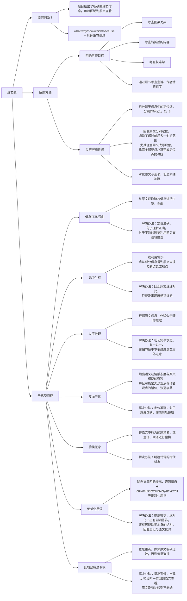

> [!warning] 作者实力有限，因此本文的经验也许只适合一小部分人，千万慎用！
> ***作者的BG***：
> - 本科西电计科院物联网专业，GPA 3.1/4.0
> - 一份网络相关的科研经历，一份机器学习相关的毕设，无竞赛、无实习
> - 初试完学习了林轩田老师的《机器学习基石》系列课程和《动手学深度学习》，并找了一些GitHub 的 NLP 项目练手，以及阅读复现了一些相关研究领域的论文
> - 初试成绩 342（小分是 71 82 91 98）
> - 英语：22 年 12 月份最后一次CET-6 考了 445 分
> - 二战选手
> - 其它：（想到了再补充）
> 
> ***本文可能适合的人群***：
> - <u>本科时卷不动又躺不平的选手</u>，我自己就是个大摆子，但我对自己的能力有非常清醒的认识——==智商不足、努力来凑==。如果你的本科水平在西电武理西南交大等中部 211 层次之上，在武大华科等上流 985 守门员之下，那么这篇经验贴可能对你会有所帮助 *（太高了看我这个菜鸡的经验收效甚微，太低了我比较怀疑你的执行力是否能够完成，当然你能够做到并来打我脸，乐意至极）*
> - <u>二战选手</u>：我在这篇经验贴里，会回顾我在一战、二战中的所有经验，并分别给出建议，如果你觉得有道理，不妨尝试一下。*（关于对二战选手精神上的鼓励，我会在 [[从北雷村到五道口南山分口|姊妹篇]] 中详细分析我的备考经历，以及这篇我大一时写的 [关于高考复读](https://www.zhihu.com/question/328392017/answer/974171675) 的帖子，可能会对你有所帮助）*
> - <u>明确知道自己为什么要考研、考研目标定在清华意味着什么</u>。
> - <u>尽量不要大跨</u>。你应该学习过数据结构、计算机组成原理、操作系统中的至少一门，或者是 211 数学系的学生，或者对计算机的整体结构有大致了解，否则我不建议你前来跨考（尤其 25 年极有可能被软微战神冲烂）更不建议弃保来跨考 912，除非你做好了两年起步的准备（二战真的很痛苦，我不建议你来尝试）
> 
> ***本文的特点***：
> - 事无巨细，适合从 0 开始准备考研的人群
> - 与其说是经验贴，不如说是踩坑贴，它会<u>告诉你哪些事情做不得、哪些事情做了是白费工夫</u>。*（我认为做加法很容易，但从一大堆事务中挑选出适合自己、能够完成自己目标的事情，这样的减法做起来很难，非得尝试过一遍才知道何对何错）*
> - <u>只针对 11912 的考生</u>，帮助其将每一分钟的时间都用在刀刃上。其余考生酌情学习，其中的部分指导对于其余考生可能会起反作用。并且清华的判卷属于京区，在政治、英语上有众所周知的压分现象（其实我觉得 23 压分了，24 没怎么压，但是其余同学感到 24 也压了，但是无论如何，京区压分是事实上存在的现象），这导致对预期分数可能较低（比如 75 分政治在京区可以称为“共产主义接班人”，但是在东北陕西等水区只能说平平常常）
> - 长文预警：本文的长度可能需要你多达半小时甚至一小时的阅读
> 
> 如果你已经上岸，并且对文中有些内容有些意见，还请你不吝赐教，可以 QQ 联系我或在 issue 中提交你的理解。
> 
> 总之，我的能力确实很有限，如果你觉得我的经验帮助到了你，那么希望你能够利用我的经验让自己尽量少地犯我遇到的错误，这就是本帖的最大价值，我们相忘于江湖；如果你觉得我这么菜的人也能捡漏考上清华，那就请你也来清华一展你的风采，我定然膜拜。

## 初试准备

![[如何高效备考11912-初试总分.png]]

Fig1. 初试总分

![[公共课得分细则.png]]

Fig2. 我的公共课得分细则

### 政治

> 我的政治发挥得不错，考前临时抱佛脚背记的简答题在考试时也考到了不少，于是总分比较高。

我学习、使用的参考资料有：
- 一战时：徐涛核心考案+徐涛基础和强化课、徐涛优题库习题册、徐涛背诵册+徐涛冲刺课、肖 1000 题、肖四肖八徐六、徐涛时政、徐涛二十题；
- 二战时：仓盾政治考研刷题小程序、肖背诵书、肖八肖四、徐涛二十题。

**一战时**我是 7 月份开始准备政治的，每天花 1h 用二倍速看徐涛的课，8 月底刚好看完，并且每天把听课部分的习题写了。*（评价：<u>有用</u>，可以帮助理解每个知识点的具体含义以及前后知识点的串联，<u>但是很费时间</u>，如果你在校备考并且舍友会很吵、或每天有段时间难以集中精力，那就把时间分配在这里，戴上耳机听课，与外界的喧闹隔离；如果你实在没有时间完成，并且对自己的记忆能力比较自信——指强行背记马原、毛概等知识点和题目——那么你也不必看视频）*
之后 9 月时我把做过的错题全都改了一遍，10 月~11 月时把肖 1000 题册做完并改了一遍，每天用时 1.5~2 h。*（评价：这段时间的安排实属昏头，也是我倔驴脾气上来了，非要把某件事做到最好，实际上性价比极低。我认为这对我一战的结果来说可以算是完全地浪费时间，并且这种在纸质课本上刷题的练习方式效率极低，我不再建议，更好的办法请看下文）*
12 月练习肖四肖八和背诵时政、徐涛二十题，但是临近考试染了新冠，每天头都剧痛无比，遂将之前所学忘得一干二净，在考试时简答题处一通胡写，选择题的正确率也极低，最后只有 55 分。

**二战时**我 9 月开始准备政治，第一个月练习了仓盾小程序的精选 1600 题（就是腿姐、王吉等人的习题册的题库），每天用随机生成题目的方式刷两套（66 道题），每天刷完后把有价值的错题摘抄下来。*（评价：腿姐的题库纯一坨💩，这些人的题库与实际考试的考察方式相差甚远，甚至存在不少抠字眼的命题，这样的练习价值极低）*
10 月~11 月上旬继续在小程序上刷题，把肖 1000 题按之前的模式刷了一个月。*（<u>评价：肖爷的含金量不容置疑！</u>这段练习很有效，强化了我对大量知识点的记忆和理解，并且小程序刷题可以方便地查看自己的做题记录，也可以快速地收集错题解析和查看评论区的理解，帮助自己记忆并做错题本）*
11 月中旬开始刷肖八，先每天写两套肖八的选择题，然后改错；后来每两天抄写一份肖八的简答题，直到 11 月底，刚好完成。*（评价：肖八的题目质量很高，我大多情况选择题在 34 分上下，并且简答题押中了数道，帮助很大。但是<u>抄简答题没有任何用</u>，抄的时候只有手在动，脑子根本没有细细理解）*
12 月把肖八的简答题根据每道题的知识点进行分类，并做笔记，<u>分析每道题考了什么知识点、怎样回答的、回答的时候涉及了哪些知识点、都运用了什么套话，背记时就根据这些知识点，用自己的语言重复一遍套话</u>。比如这样：
![[如何高效备考11912-政治简答题备考.png]]
同样的，肖四也进行如此处理（肖四其实就是肖八的浓缩版，并且在其基础上扩充了少量知识点。因此如果时间实在紧张，可以直接背诵肖四的全部内容，据我所知有一位同样上岸的朋友，就是只背了肖四，最后选择 38 简答 34 分）
最后关于徐二十题，他在 24 考研中押中了很多考题，我在考试前一晚通读、默背了该册，最后幸运地遇到好几道类似的题，因此侥幸取得了高分，因此我建议结合肖八肖四一起使用。

>[!summary] 总结经验与建议策略
>如果你的目标在 65~70 分（保底，多的分数就是临场发挥），那么我建议：
>- 首先不要花太多时间在政治上，**每天最多一个小时**；
>- 其次不要完全看徐涛的视频课，太浪费时间，我的**建议是观看马原、近代史、毛概及习概部分**（其余的部分没有任何价值，包括冲刺课也不要看，只看强化课）
>- 再者时政部分没有必要专门准备，做肖四肖八时就能够涉及，并且只有 3 分，花任何时间专门准备都是一种浪费；
>- 具体操作：有看过徐涛视频课的基础的话，9 月开始准备复习政治完全足够，否则你可能需要适当提前一些时间。
>	- 你可以**先花一个月时间看完我指出的视频课**，当然正如前文所言，你不看这些，凭借着过人的记忆力和对政治知识的敏感，也可以轻松完成后面的任务，不过这不代表我的建议对像我这样的普通人而言没有价值，
>	- **10 月份到 11 月上旬猛刷小程序的肖 1000 题**，每天练习 66 道题并适时地做错题记录（由于使用小程序刷题，因此错题记录只需要复制、粘贴，这样会轻松很多），比如这样：![[如何高效备考11912-政治选择.png]][^1]
>	- **11 月中旬开始刷肖八，并且分析其中每一道简答题的回答思路**，自己用这样的思路能够复述出来即可，考试不会要求逐字逐句地一一对应，
>	- **12 月以同样的手法处理肖四**，然后到 12 月 20 号左右每天背 2h 你总结的简答题思路和徐涛二十题。

### 英语

> 我的英语发挥正常，主要是 24 的英一阅读和翻译难度实在够低，我仅在客观+翻译部分丢了 7 分。
> 
> 我的英语基础只能说一般，高考（全国卷一）英语 128 分，CET-4 是 510 分，CET-6 是 445 分，因此为了准备好英语，我颇下一番苦功。

我学习、使用的参考资料有：
- 一战时：田静《长难句》、考纲词汇 5500（导出自 iPad 上的 *List 背单词* 程序，正序和乱序各一本）、唐迟《词汇的逻辑》、新东方《恋词》、新东方完形填空练习册、黄皮书真题（英一 2000~2022）、唐静翻译书、王江涛作文、石雷鹏作文
- 二战时：考纲词汇 5500、英语二真题（2010~2022）、唐迟《阅读的逻辑》、英语一真题（10、11、19、20、21、22 六年的真题）、潘赟作文书、自己写的作文模板并找 ChatGPT 修改。

有人说准备考研英语比造原子弹还要复杂，其中的每个流程要看什么书、做什么题都要仔细斟酌，我并不反对这样的说法，对于英语基础薄弱的同学，这样按部就班地学习的确能够最大程度地保证你取得一个配得上努力的成果。（对于英语高手——比如 23 网研第一的卓佬拥有托雅 1w5 词汇积累，或者常年留学在国外——特指 24 贵系第一HH 佬——这样的人，本文的价值就非常有限）

**一战时**，我在 3 月下旬开始复习（之前恰好西安疫情推迟了期末考试，我在前 20 天忙于此事无暇学习）。我首先通过田静的《长难句分析》复习了语法知识（我个人的语法基础比较好），然后在乱序的考研词汇书上背单词，每天背 350 词左右，15 天过一轮，我 2 个月时间过了三轮。*（评价：<u>这是建立扎实基础不可或缺的一步，对于语法基础及格的同学可以跳过《长难句》，但是考纲词汇必须熟稔于心</u>，我每天背单词的数量比较多，大概要用 1h 20min，然后看 40min《长难句》。我的英语老师曾说过一句话“<u>没有人蠢到学不会英语，只有懒人学不会</u>”，我非常认同这个观点，因此我非常早地开始准备考研英语，并且动态地调整自己的学习规划，每个阶段完成最紧迫的事情。我认为英语基础不好得同学也非常有必要像我一样在 3 月份就开始学习英语，准备时间越早，后期需要投入的时间越少、得分也越理想）*
>[!tip] 记忆单词的小技巧
>在各类经验贴，或者英语学习教学中，提到了不少记忆单词的方法，我个人常用、并且认为效率较高的几种方法有：
>1. 词根词缀法：记忆词根和词缀的含义，这样可以起到举一反三的效果，并且对于特殊情况，可以抽空统一地学习；
>	1. 对于相同词根的单词，会根据不同的词缀改变词性这些都是有一定规律的，因此可以统一学习、记忆，这里我推荐使用正序的单词本来记忆
>2. 情景记忆法：将词汇放到一个情境中造句，通过上下文来整体记忆它的含义，顺带还能记忆其常用搭配；
>3. 词汇起源法：有一些词汇的含义，与其起源、英美文化有非常紧密的联系，因此部分词汇也可以如此记忆
>
>此外，我比较推荐《词汇的逻辑》这本单词书，其中对常用词汇进行了非常详细的注解，包含了我上面提到的三个记忆方法，对于英语基础薄弱的同学非常有帮助。

之后 5 月份，为了强化词汇的记忆和理解能力，我在新东方的《完形填空专项练习》上练习了英一、英二的 30 多套题目（没写完的部分在 7 月继续写），然后继续背单词。6 月份期末考，跳过。*（评价：通过完形填空，加深对常见词汇的理解和熟词僻义、短语搭配、近义词区分等知识的理解和记忆，非常有帮助）*
7 月中旬，我继续开始备考，先把之前没做完的做完，然后月底开始做真题。做真题前，我建议先去找一些历年题目难度表，然后从易到难地刷题，否则一上来就做 10 年英一，你会被虐到想要退赛。我个人推荐的做题顺序如下：
- 先做 00~09 的真题，这些年份的真题太过古老，出题风格也与近年不同，因此只可以用来练手、熟悉考研英语文章的难度
- 接着做 10～24 的英一，<u>我个人建议做题顺序是 13～22，然后 10、11、12、23、24 这五套卷子作为卡时间的模拟训练</u>。（之所以这样安排，是因为 13～22 的难度都很简单，只有极个别较难的题目；而 10、11、23 的难度堪称地狱级，我每次做都怀疑人生，24 是最新的真题，保持考前的手感即可）
- <u>如果你是二战选手，我建议你把英二的题目也掏出来做</u>，做题顺序则是 12、13、15、16、17、18、19、20、21、23，然后做 10、11、14、22、24，之后再做英一中 10、11、23、24 这四套卷子恢复对英一命题的熟悉度。*（之所以要做英二，是因为“英一（二）最好的模拟题就是英二（一）”，我非常不建议做任何老师的任何模拟题，因为他们的水平非常有限，没法模拟出一整套非常符合真题命题组的风格的题目，甚至钻牛角尖地出题会让你的大脑过拟合）*
做真题是水磨工夫，不要着急，我建议的速度是每个月做 10 套题，每两天一套，最初练习时可以不卡时间，最后模拟的五套卷子时再卡时间。然后十天对做过的错题进行分析、积累，揣测自己的思路和正确答案的思路为什么不同，这个题目的类型是什么，我能够从中学习到什么，下次遇到这类题我怎么做才能不再犯错。*（评价：这是最重要的环节，直接决定了你最终的成绩是否理想，所以每一次做题都要拿出最好的状态，不要寄希望于自己改错时会把错题全部理解、吸收，因为短期的记忆会让你对题目的理解产生错觉——你并没有理解为什么错，你只是记住了这道题的答案在哪里找）*
10 月下旬，我开始学习唐静老师的翻译，并开始在英一的真题上开始训练。*（评价：这倒没什么好说的，如果没有接触过翻译，最初遇到时会手忙脚乱，因此有一本撰写的还算不错的翻译书，会让你快速上手）*
11 月下旬，开始准备作文。事实上，我在 5 月份就把王江涛的作文书看了一遍，并且把大多数文章都抄了一遍，期望边练字边背诵，然而正如前文所言，**抄写是最烂的学习方法**，又耗时、又没法在大脑中建立长期记忆的突触——建立在手上的肌肉记忆有什么用？而且准备得太早，中间没有再回顾，到了 11 月底我发现我还是没有办法写好一篇作文🤣时间已然不足，我只能抓紧背模板，我就找到了石雷鹏的作文课，对照着他的模板（他称之为关键句写作文法）自己练习写一些句子，就这样到了 12 月中旬，然后阳了，然后寄，最后考了 65 分。*（评价：<u>作文不要太早准备，也不要迷信模板，京区对模板的打压比较狠，写字的质量并不重要，只要规规矩矩能够看清即可</u>）*

**二战时**，我准备的过程就比较简单，从前一年的教训中学习，最后安排如下：
- 7 月背单词
- 8 月看唐迟的《阅读的逻辑》
- 9 月做英二的真题练习
- 10 月下旬开始准备作文模板，一直到 11 月底才完成
- 12 月背作文模板，复习错题，做了一下 10、11、12 的英一真题就上考场了
这里我重点表扬《阅读的逻辑》一书，此前我做题目都是凭自己经验和直觉来做，没有进行系统的整理，此书中对考研中的所有题型进行了分门别类的详细总结，我在此书的基础上建立了自己的思维导图，之后每遇到错题，就把思维导图翻出来，逐步分析自己过去错误的思维方式、在思维导图中如何建立正确的思维路径，于是错题率大幅降低，我在做英二的真题练习时正确率还比较高：
![[英二练习得分.jpg]]

我的思维导图示例如下，这是考题中非常常见的类型，我们需要从题干中找到题目所属的类型、然后回顾解题方法、最后分析每个选项何者正确何者错误（找出错误项的干扰特征，剩余的就是正确选项）：

关于作文，我借助了ChatGPT、Claude 2、[有道作文](https://write.youdao.com)、[批改网](http://www.pigai.org)、[微软爱写作](https://aimwriting.mtutor.engkoo.com/)、潘赟的作文书，对于每一个作文类型（23 年考纲始，不再区分英一、英二的作文类型，也就是说英一也完全可以出图表作文，虽然 23 仍然是图画作文，但 24 就是图画+图表的二合一作文，正是由于我的全面准备，考场上没有出太大的岔子）的每一个话题，我都准备了详细的作文案例，先自己写一遍，再根据潘赟老师的作文书进行简单修改，再扔到批改网、有道作文等网站上面判分后修改、最后扔给ChatGPT 等润色，然后把修改前后的作文都收集起来，统一背诵。比如我准备的模板之一如下：
![[如何高效备考11912-英一作文模板.png]]

最后的结局已经知道，我取得了 82 的高分（虽然还有其他高手，但这个分数已然让我满意，我的努力也没有白费）。

>[!summary] 总结经验与建议策略
>如果你想取得 70～80 的分数，我建议你如下准备：
>- 4 月～5 月，准备单词，如果语法基础较差，同步学习田静的《长难句》等语法基础；对于二战的选手，这段时间应该在做毕设，可以酌情延后
>- 7 月～8 月，做完形填空，以及学习《阅读的逻辑》中的各种方法论，先学思路指导，在应用到实践中；接着把 00～09 的真题做完，熟悉好真题的难度
>- 9 月～10 月中旬，做英一的真题（二战的做英二），根据之前学到的方法，纠正自己的错误思路，培养好对英一出题人的敏感（我们是在应试，不要管这是不是真正学习英语的方法！）
>- 10 月下旬～11 月底，阅读唐静的翻译书（只需要把方法部分看完，然后就自己动手实操，和他的答案对比，切记不要和黄皮书的答案对比，我认为唐静的翻译素养还是比较高的）；并且同步准备作文，无论石雷鹏、潘赟，光看他们的课程和作文书，肯定是不够用的，你必须在考前自己动手写作十篇左右
>- 12 月复习真题练习的错题，继续背自己的作文模板；掏出 24 真题做一遍增长自信😋

### 数学

如你所见，91 分、倒数第一的数学，我完全给不了你任何经验，唯一的教训是，**如果你不好好学数学，那么你的总分将会很难看，并大概率会在面试时被拷打**。

我建议你阅读以下诸神的帖子，他们的学习方法可能会对你有很大帮助：
- 24 贵系上岸羊神的帖子：[2024一战清华大学计算机系经验贴 - 知乎](https://zhuanlan.zhihu.com/p/689494655)
- 23 网研第一、初试总分第二的卓佬的帖子：[从关山口到五道口（四）2023跨考网研院全程回顾](http://www.cskaoyan.com/thread-665035-1-1.html)
- *其他上岸佬的公开经验贴，并且对数学这部分写的比较好的，并且是我刷到的，我也会在这里贴上来*

如果你还是不死心，想要看看我的教训，我也有一些内容可以说道说道：
- 众所周知，考研数学一的三个部分中，高数是绝对的大头，因此每日练习中，要格外关注它，不能因为自己熟悉线代、概率论，就每天做线代概率，这样畏难心理种下的恶果最后还是会在你的分数中体现出来；
- 不要不在乎公式的推导、记忆，只有你把所有公式都记住、都学会如何推导，才能真正理解它，进而在不同的情境中应用自如；
- 数学题和 912 不一样，并非是贵精不贵多，你需要每天练习、保持题感；
- 我对科目选择听哪个老师并没有好的建议，我只能提出一些避雷：
	- 武忠祥老师的强化课适合用来打基础，但是对 24 这样灵活的出题，稍显力不从心，
	- 王式安、李永乐的课程太拖沓，并且书本编撰非常古董，已经不能适应 24 及以后的考研命题形式，并且我不认为他们那样的高龄还有精力再出一版新的课本，如果是套皮别人的资料，那还有什么必要听这二位的课程呢？
	- 姜晓千老师的《题源 150》口碑不错，可以考虑
	- 张宇老师的课本、视频课、练习题，经过多年的验证，非常契合真题的思路，可以参考其他经验贴中的相关内容，自己权衡
	- 李林的 880 质量还可以，练习阶段可以做做，但是去年李六李四的质量堪忧，而且印刷开卖的时间过晚（我不管他是因为与印刷商有什么矛盾，他实实在在地比其他老师的模拟题晚了十多天，这是不容争议的事实，对于考研这件时间大于一切的事情，这是抹不掉的污点）
	- 李艳芳老师的真题册解析非常全面、到位，并且模拟三套卷难度非常恰到好处，我觉得去年的难度和 24 真题非常接近，有必要刷一刷
	- 其余老师我没有了解过，不做评价。如果你不怕我夹带私活，我建议你知乎上关注“新威考研”，威哥等人也在编撰数学相关的讲义，我买了初版进行学习，我觉得质量还不错。
- 关于真题，我认为 20 年之前的真题都没有练习的必要，上古时期的出题方式与如今已经天差地别，也许你可以作为学习完一个阶段（比如基础过完一遍），做几套题练练手，查缺补漏自己知识点哪些部分还没有掌握到位

### 912 专业课

## 考试经验

## 复试准备

### 机试

### 面试

## 复试经验

等你完成了以上内容，再来加我 QQ 或微信细谈叭。

[^1]: 你可能注意到，我的所有笔记都是以 markdown 格式编写的，这是我正在探索的一种学习方式，利用Obsidian 的双链笔记功能，实现比纸质书更精确的随机查找，并且这样编写的笔记，更易于维护、查找、复习。关于如何做笔记，我会在另一份经验贴中详述，敬请关注！