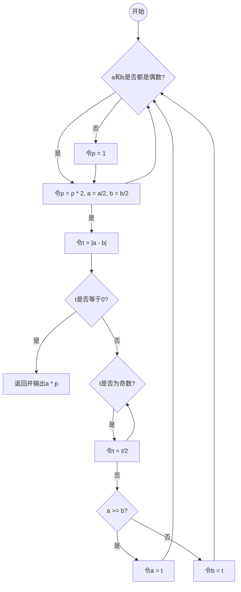

## 1-12 countOnes 算法改进
```cpp
int countOnes(unsigned int n){
	// 统计整数二进制展开中数位1的总数
	int ones=0;
	while(0<n){
		//在n缩减至0之前，反复地
		ones += (1&n); //检查最低位，为1时计数
		n >>=1;
	}
	return ones;
} //O(logn)
```

### 改进到 O (countOnes (n))
```cpp
int countOnes1 ( unsigned int n ) { 
	//O(ones)：正比于数位1的总数
	int ones = 0; //计数器复位
	while ( 0 < n ) { //在n缩减至0之前，反复地
		ones++; //计数（至少有一位为1）
		n &= n - 1; //清除当前最靠右的1
	}
	return ones; //返回计数
}
```
这里通过位运算的技巧，自低（右）向高（左）逐个地将数位1转置为0。

对于任意整数 n，不妨设其最低（右）的数位1对应于 2^k，于是 n 的二进制展开应该如下：
x x ... x 1 0 0 ... 0

其中数位x可能是0或1，而最低的k + 1位必然是" 1 0 0 ... 0 "，即数位1之后是k个0。于是相应地，n - 1的二进制展开应该如下：
x x ... x 0 1 1 ... 1

也就是说，其最低的k + 1位与n恰好相反，其余的（更高）各位相同。因此，二者做位与运算（n & (n - 1)）的结果应为：
x x ... x 0 0 0 ... 0

等效于将原整数 n 的二进制展开中的最低位1转置为0。
以上计算过程，仅涉及整数的减法和位与运算各一次。若不考虑机器的位长限制，两种运算均可视作基本运算，各自只需O(1)时间。因此，新算法的运行时间，应线性正比于n的二进制展开中数位1的实际数目。

### 改进到 O (logW), W=O (logn)为整数位宽
```cpp
#define POW(c) (1 << (c)) //2^c
#define MASK(c) (((unsigned long) -1) / (POW(POW(c)) + 1)) //以2^c位为单位分组，相间地全0和全1
// MASK(0) = 55555555(h) = 01010101010101010101010101010101(b)
// MASK(1) = 33333333(h) = 00110011001100110011001100110011(b)
// MASK(2) = 0f0f0f0f(h) = 00001111000011110000111100001111(b)
// MASK(3) = 00ff00ff(h) = 00000000111111110000000011111111(b)
// MASK(4) = 0000ffff(h) = 00000000000000001111111111111111(b)

//输入：n的二进制展开中，以2^c位为单位分组，各组数值已经分别等于原先这2^c位中1的数目
#define ROUND(n, c) (((n) & MASK(c)) + ((n) >> POW(c) & MASK(c))) //运算优先级：先右移，再位与
//过程：以2^c位为单位分组，相邻的组两两捉对累加，累加值用原2^(c + 1)位就地记录
//输出：n的二进制展开中，以2^(c + 1)位为单位分组，各组数值已经分别等于原先这2^(c + 1)位中1的数目

int countOnes2 ( unsigned int n ) { //统计整数n的二进制展开中数位1的总数
	n = ROUND ( n, 0 ); //以02位为单位分组，各组内前01位与后01位累加，得到原先这02位中1的数目
	n = ROUND ( n, 1 ); //以04位为单位分组，各组内前02位与后02位累加，得到原先这04位中1的数目
	n = ROUND ( n, 2 ); //以08位为单位分组，各组内前04位与后04位累加，得到原先这08位中1的数目
	n = ROUND ( n, 3 ); //以16位为单位分组，各组内前08位与后08位累加，得到原先这16位中1的数目
	n = ROUND ( n, 4 ); //以32位为单位分组，各组内前16位与后16位累加，得到原先这32位中1的数目
	return n; //迒回统计结果
} //32位字长时，O(log_2(32)) = O(5) = O(1)
```

可见，若计算模型支持的整数字长为 W，则对于任意整数 $n \in [0, 2^{W})$，都可在： $T(n) = O(\log_{2}W) = O(\log W) = O(\log\log n)$ 时间内统计出 n 所含比特1的总数。 

通常，$O(\log \log n)$ 可以视作常数。

## 1-14 power 2 () 递归版转迭代版
```cpp
// power2() 递归版
inline __int64 sqr(__int64){return a*a;}
__int64 power2(int n){
	//计算幂函数2^n
	if(0==n) return 1;//递归基，否则视n的奇偶分别递归
	return (n&1)?sqr(power2(n>>1))<<1 : sqr(power2(n>>1));
} // O(logn)=O(r),r为输入指数n的比特位数
```

```cpp
__int64 power2_I ( int n ) { 
	//幂函数2^n算法（优化迭代版），n >= 0
	__int64 pow = 1; //O(1)：累积器初始化为2^0
	__int64 p = 2; //O(1)：累乘项初始化为2
	while ( 0 < n ) { //O(logn)：迭代log(n)轮，每轮都
		if ( n & 1 ) //O(1)：根据当前比特位是否为1，决定是否
			pow *= p; //O(1)：将当前累乘项计入累积器
		n >>= 1; //O(1)：指数减半
		p *= p; //O(1)：累乘项自乘
	}
	return pow; //O(1)：返回累积器
} //O(logn) = O(r)，r为输入指数n的比特位数

```
与原先的递归版相比，该版本的原理完全一致，只不过计算方向却恰好颠倒过来：由低到高，依次检查 n 二进制展开中的各比特，在该比特为 1 时累乘以累乘项 p。

这里的辅助变量p，应始终等于各比特所对应的指数权重，亦即：
2^1, 2^2, 2^4, 2^8, 2^16, ...
因此，其初始值应置为：
2^1 = 2
而此后每经过一步迭代（并进而转向更高一位），p都会通过自平方完成更新。
不难看出，这个版本仅需 O(1)的辅助空间，故就空间复杂度而言，较之原递归的版本有了很大改进。

## 1-15 找出整数序列最大者
### 迭代版
```
int maxI ( int A[], int n ) {
	int m = INT_MIN; //初始化最大值记录，O(1)
	for ( int i = 0; i < n; i++ ) //对全部共O(n)个元素，逐一
		m = max ( m, A[i] ); //比较并更新，O(1)
	return m; //返回最大值，O(1)
} 
```

$O (1) + O (n)*O (1) + O (1) = O (n+2) = O (n)$ 
### 线性递归版
```
int maxR ( int A[], int n ) {
	if ( 2 > n ) //平凡情况，递归基
		return A[n - 1]; //直接（非递归式）计算
	else //一般情况，递归：在前n - 1项中最大值与第n - 1项之间，取大者
		return max ( maxR ( A, n - 1 ), A[n - 1] );
}
```

$O (1) * 递归深度 = O (1) * (n + 1) = O (n)$ 
### 二分递归版
```
 int maxR ( int A[], int lo, int hi ) { 
	if ( lo + 1 == hi ) //如遇递归基（区间长度已降至1），则
		return A[lo]; //直接返回该元素
	else { //否则（一般情况下lo + 1 < hi），则递归地
		int mi = ( lo + hi ) >> 1; //以中位单元为界，将原区间一分为二：A[lo, mi)和A[mi, hi)
		return max ( maxR ( A, lo, mi ), maxR ( A, mi, hi ) ); //计算子区间的最大值，再从中取大者
	}
}
```

$O (hi - lo)$，线性正比于区间长度

## 1-17 证明空间复杂度与递归深度关系
**试证明**：若每个递归实例仅需使用常数规模的空间，则递归算法所需空间总量将线性正比于最大递归深度。 

**解    答**：
根据递归跟踪分析法，在递归程序的执行过程中，系统必须动态地记录所有活跃的递归实例。在任何时刻，这些活跃的递归实例都可按照调用关系，构成一个调用链，该程序执行期间所需的空间，主要用于维护上述调用链。不难看出，按照题目所给的条件，这部分空间量应线性正比于 调用链的最大长度，亦即最大的递归深度。 

在教材的4.2.1节，还将针对递归实现机制——*函数调用栈*——做详细的介绍。届时，将了解上述过程更多的具体细节。简而言之，以上所定义的调用链，实际上就对应于该栈中的所有帧。在任何时刻，其中每一对相邻的帧，都对应于存在“调用与被调用”关系的一对递归实例。若各递归实例所需空间均为常数量，则空间占用量与栈内所含帧数成正比，并在递归达到最深层时达到最大。

## 1-19 Fib 二分递归的细节
### fib (k)的递归实例在执行中出现了多少次？
在该算法的递归跟踪图中，每向下递归深入一层，入口参数就减一（向左）或减二（向右）。在从入口 fib(n)通往每一 fib(k)递归实例的沿途，各递归实例的入口参数只能依次减一或减二。因此，fib(k)出现的次数，应该等于从 n 开始，经每次减一或减二，最终减至 k 的路径总数。
![[10-Introduction-fib(k).png]]
考查这些路径的最后一步，如图 x1.3所示无非两种可能：或由 fib(k + 1)向左抵达 fib(k)，或由 fib(k + 2)向右抵达 fib(k)。因此，若将 fib(k)出现的次数记作 F(k)，则可得递推式如下： 
- $F (n) = 1$
- $F (k) = F (k + 1) + F (k + 2)$
两式联合求解，即得：
- $F(k) = fib(n - k + 1)$

### 证明即使是打印 fib (n)也需要Ω(n)时间
从渐进角度看，$fib(n) = Θ(Φ^{n} )$。因此采用任何常数进制展开，fib(n)均由 $Θ(n)$ 个数位组成。这就意味着，即便已知 fib(n)的数值大小，将该数值逐位打印出来也至少需要 $Θ(n)$ 时间。

### 尝试 O (logn)时间内计算出 fib(n)
根据 Fibonacci 数的定义，可得如下矩阵形式的递推关系：
$$
\begin{pmatrix}
0\ 1\\1\ 1 
\end{pmatrix}
\begin{pmatrix}
fib(k-1)\\fib(k)
\end{pmatrix}
=
\begin{pmatrix}
fib(k)\\fib(k+1)
\end{pmatrix}
$$
递推可得：
$$
\begin{pmatrix}
fib(n)\\fib(n+1)
\end{pmatrix}
=
\begin{pmatrix}
0\ 1\\1\ 1 
\end{pmatrix}^{n}
\begin{pmatrix}
fib(0)\\fib(1)
\end{pmatrix}
=
\begin{pmatrix}
0\ 1\\1\ 1 
\end{pmatrix}^{n}
\begin{pmatrix}
0\\1 
\end{pmatrix}
$$

于是，若套用 power2()算法的流程，只要将其中的整数平方运算 sqr()换成矩阵的平方运算，即可实现 fib(n)的计算。更重要的是，这里仅涉及2x2矩阵的计算，每次同样只需常数时间，故整体的运行时间也是 O(logn)。

>[!note] 这两个问题是否构成悖论？
>以上结论在表面上的确构成悖论。究其根源在于，以上对 power 2 ()与 fib ()等算法的时间复杂度分析都假定，整数的乘法、位移和打印等基本操作各自只需 O (1)时间——即采用所谓的常数代价准则（uniform cost criterion）——而这只是在一定程度上的近似。
>
>设参与运算的整数（的数值）为 k。不难看出，上述基本操作都需要逐个地读取 k 的二进制展开的每一有效比特位，故更为精确地，这些操作的时间成本应该线性正比于 k 的有效位的总数 O (logk)——即采用所谓的对数代价准则（logarithmic cost criterion）。 
>
>当 k 不是很大时，两种准则之间的差异并不是不大；而当 k 很大甚至远远超出机器字长之后，二者之间的差异将不容忽略。仍以 Fibonacci 数为例。因 $fib(n) = Θ(Φ^n)$，故该数列应以 $Φ$ 为比率呈指数递增，各项的二进制展开长度 $log_2(Φ^n)$ 则以匀速呈线性递增。根据之前所给的估算经验，相邻项约相差 $log_2Φ = 0.694$ 个比特，大致每隔 36 项相差 25 个比特。也就是说，自 fib (48)后便会导致 32 位无符号整数的溢出，自 fib (94)后便会导致 64 位无符号整数的溢出。

## 1-25 LCD
### 更相减损术
过程描述：
1. 令 p = 1
2. 若 a 和 b 不都是偶数，则转 5)
3. 令 p = p * 2，a = a/2，b = b/2
4. 转 2)
5. 令 t = |a - b|
6. 若 t = 0，则返回并输出 a * p
7. 若 t 为奇数，则转10)
8. 令 t = t/2
9. 转 7)
10. 若 a >= b，则令 a = t；否则，令 b = t
11. 转5)



```
__int64 gcdCN ( __int64 a, __int64 b ) { 
	//assert: 0 < min(a, b)
	int r = 0; //a和b的2^r形式的公因子
	while ( ! ( ( a & 1 ) || ( b & 1 ) ) ) {
		//若a和b都是偶数
		a >>= 1; b >>= 1; r ++; //则同时除2（右秱），并累加至r
	} //以下，a和b至少其一为偶
	while ( 1 ) {
		while ( ! ( a & 1 ) ) a >>= 1; //若a偶（b奇），则剔除a的所有因子2
		while ( ! ( b & 1 ) ) b >>= 1; //若b偶（a奇），则剔除b的所有因子2
		( a > b ) ? a = a - b : b = b - a; //简化为：gcd(max(a, b) - min(a, b), min(a, b))
		if ( 0 == a ) return b << r; //简化至平凡情况：gcd(0, b) = b
		if ( 0 == b ) return a << r; //简化至平凡情况：gcd(a, 0) = a
	}
}
```

### 与辗转相除法比较
首先可以证明，算法“中”的渐进时间复杂度依然是 O(log(a + b))。
考查该算法的每一步迭代，紧接于两个内部while循环之后设置一个断点，观察此时的a和b。实际上，在a和b各自剔除了所有因子2之后，此时它们都将是奇数。接下来，无论二者大小如何，再经一次互减运算，它们必然将成为一奇一偶。比如，不失一般性地设a > b，则得到：
a - b （偶）
b （奇）
再经一步迭代并重新回到断点时，前者至多是：
(a - b)/2
两个变量之和至多是：
(a - b)/2 + b  <= (a + b)/2
可见，每经过一步迭代，a + b至少减少一半，故总体迭代步数不超过：
$\log_{2}(a + b)$

另外，尽管从计算流程来看，算法“中”的步骤似乎比算法“欧”更多，但前者仅涉及加减、位测试和移位（除2）运算，而不必做更复杂的乘除运算。因此，前者更适于在现代计算机上编程实现，而且实际的计算效率更高。
反之，无论是图灵机模型还是 RAM 模型，除法运算在底层都是通过减法实现的。因此，对于算法“欧”所谓的“除法加速”效果，不可过于乐观——而在输入整数大小悬殊时，尤其如此。

最后，较之算法“欧”，算法“中”更易于推广至多个整数的情况。

## 1-27 Ackermann 函数必然终止否？
$$
A(m, n) = \begin{cases}
              n + 1 & \text{if } m = 0 \\
              A(m - 1, 1) & \text{if } m > 0 \text{ and } n = 0 \\
              A(m - 1, A(m, n - 1)) & \text{if } m > 0 \text{ and } n > 0
          \end{cases}

$$
在可计算性理论中，Ackermann 函数是典型的非原始递归的递归函数。尽管其定义和计算过程较为复杂，依然可以证明其计算过程必然终止，故对任何(m, n)参数组合均有明确的定义。

以下，可以采用超限数学归纳法（transfinite induction）来证明上述论断。为此，我们首先需要在所有非负整数的组合(m, n)之间，定义如下次序：

对于任何(m1, n1)与(m2, n2)，若 m1 < m2，或者 m1 = m2且 n1 < n2，则称前者小于后者，记作(m1, n1) < (m2, n2)

实际上，所有的(m, n)组合与平面上第一象限内的整点一一对应。不难看出，任何两个整点都可按照这一定义比较大小，故这是一个全序。更重要地，该整点集的任何一个子集，都有最小元素——即该子集中的最左最低点（leftmost-then-lowest point）。其中特别地，全集的最小元素即为坐标原点(0, 0)。因此，如上定义的次序“<”，的确是一个良序（well order）。

由定义，任意形如(0, n)的输入都会立即终止——这可作为归纳基础。作为归纳假设，不妨假定：对于任意小于(m, n)的输入，Ackermann函数均能终止。现考查输入参数为(m, n)时，该函数的可终止性。

依然由定义可见，此时可能引发的递归实例无非三类：
Ackermann(m - 1, 1)
Ackermann(m - 1, \*)
Ackermann(m, n - 1)

可见，根据如上约定的次序，其对应的参数组合均小于(m, n)。故由归纳假设，以此参数组合对该函数的调用，亦必然会终止。

## 1-28 咖啡罐问题
考查所谓咖啡罐游戏（Coffee Can Game）：在咖啡罐中放有 n 颗黑豆与 m 颗白豆，每次取出两颗：若同色，则扔掉它们，然后放入一颗黑豆；若异色，则扔掉黑豆，放回白豆。
### 试证明该游戏必然终止（当罐中仅剩一颗豆子时）
尽管游戏的每一步都有（同色或异色）两个分支，但不难验证：无论如何，每经过一次迭代 罐中豆子的总数（n + m）必然减一。因此就总体而言，罐中豆子的数目必然不断地单调递减，直至最终因不足两颗而终止。

### 对于哪些 (n, m)组合，最后剩下的必然是白豆？
类似地，尽管这里有两个分支，但无论如何迭代，罐中白色豆子总数（m）的奇偶性始终保持不变。因此若最终仅剩一颗白豆，则意味着白色豆子始终都是奇数颗。反之，只要初始时白豆共计奇数颗，则最终剩余的也必然是一颗白豆。

## 1-29 Hailstone 的迭代实现
$$
Hailstone(n)=\begin{cases} \{1\} &(n=1)\\
\{n\} \cup Hailstone\left(\frac{n}{2}\right) &(n\ is\ even)\\
\{n\} \cup Hailstone(3n+1) &(n\ is\ odd)
\end{cases}
$$

```
template <typename T> struct Hailstone { 
	//函数对象：按照Hailstone规则转化一个T类对象
	virtual void operator() ( T& e ) {
		//假设T可直接做算术运算
		int step = 0; //转换所需步数
		while ( 1 != e ) { //按奇、偶逐步转换，直至为1
			( e % 2 ) ? e = 3 * e + 1 : e /= 2;
			step++;
		}
		e = step; //返回转换所经步数
	}
};

```
正如教材中已经指出的，“序列 Hailstone(n)长度必然有限”的结论至今尚未得到证明， 故以上程序未必总能终止，因而仍不能称作是一个真正的算法。

## 1-32 分析以下函数的渐进复杂度
### O (n^2)
![[10-Introduction-double-circular.png]]
```
//d
void F(int n) {
 for (int i = 0; i < n/2; i ++)
 for (int j = i; j < n; j ++);
}
```

```
//e
void F(int n) {
 for (int i = n/2; i < n; i ++)
 for (int j = 0; j < n - i; j ++);
}

```

### O (nlogn)
```
void F(int n) {
 for (int i = 0; i < n; i ++)
 for (int j = 1; j < n; j <<= 1);
}

```

```
void F(int n) {
 for (int i = 1; i < n; i ++)
 for (int j = 0; j < n; j += i);
}
```

此处内循环的控制变量 j 尽管是在 $[0, n)$ 内按算术级数递增，但步长并不固定。具体地，第 i 轮内循环采用的步长即为 i，故需做 n/i 次迭代。于是，所有循环的累计迭代次数为： 
$$
\sum\limits_{i=1}^{n-1} \sum\limits_{(k=\frac{j}{i})=0}^{\frac{n}{i}-1}1=\sum\limits_{i=1}^{n-1} \frac{n}{i}=\sum\limits_{i=1}^{n-1} \frac{1}{i} =O(n\log n)
$$
这里需要借助关于调和级数的以下性质：
$$
\sum\limits_{i=1}^{n} \frac{1}{i}=1 + \frac{1}{2} + \frac{1}{3} + ...+ \frac{1}{n}=\ln n+\gamma+\Theta(\frac{1}{2n})
$$
其中，$\gamma \approx 0.577216$ 为欧拉常数。

### O (√n）
```
void F(int n) { 
	for (int i = 0, j = 0; i < n; i += j, j ++); 
}
```
这里的变量 i 和 j 均从0开始不断递增，每经过一步迭代，i 递增 j，j 递增1。

| 迭代次序 t | 0 | 1   | 2     | 3       | 4         | ... |
|--------|---|-----|-------|---------|-----------|-----|
| 变量 i   | 0 | 0+0 | 0+0+1 | 0+0+1+2 | 0+0+1+2+3 | ... |
| 变量 j   | 0 | 1   | 2     | 3       | 4         | ... |

具体地，这一过程可以归纳如上表所示。故经过 k 次迭代后，必有：$i=\sum\limits_{t=0}^{k-1}t=\frac{k(k-1)}{2}$

在循环退出之前，必有：$i=\frac{k(k-1)}{2}<n$，或等价地，$k<\frac{1+\sqrt{1+8n}}{2}$ 故该函数的时间复杂度为 $O( \sqrt{n} )$。

### O (loglogn)
```
void F(int n) { 
	for (int i = 1, r = 1; i < n; i <<= r, r <<= 1); 
}
```
这里的变量 i 和 r 均从1开始不断递增，每经过一步迭代，i 递增为 $i\cdot 2^{r}$，r 递增为 $2\cdot r$。

| 迭代次序 t | 0   | 1       | 2         | 3           | 4             | ... |
| ---------- | --- | ------- | --------- | ----------- | ------------- | --- |
| 变量 i     | $2^0$ | $2^{0+1}$ | $2^{0+1+2}$ | $2^{0+1+2+4}$ | $2^{0+1+2+4+8}$ | ... |
| 变量 r     | 1   | 2       | 4         | 8           | 16            | ... |

故经过 k 次迭代后，必有
$$
i=\prod \limits_{t=0}^{k-1}2^{2^{t}}=2^{\sum\limits_{t=0}^{k-1}2^{t}}=2^{(2^{k}-1)}
$$
在循环退出前，必有 $i=2^{(2^{k}-1)}<n$，及 $2^{k}\le \log n \Rightarrow k\le \log \log n$

故该函数的时间复杂度为 O(loglogn)。
同样地，这里通过左移操作实现变量递增的方式，也为我们快捷地估算时间复杂度提供了新的视角和线索。从二进制展开的角度来看，变量 r 的展开宽度每次增加一位，而变量 i 则每次增加 r 位。也就是说，变量 i 的宽度将以（大致）加倍的指数速度膨胀，直至刚好超过 logn。因此，总体的迭代次数应不超过 logn 的对数，亦即 O(loglogn)。

### $O (\log^{*} n)$
```
void F(int n) { 
	for (int i = 1; i < n; i = 1 << i); }
```
每经一次迭代，i 即增长至2^i。设经过 k 次迭代之后，因 $i \ge n$ 而退出迭代。
现颠倒原迭代的方向，其过程应等效于反复令 $n = \log_{2} n$，并经 k 次迭代之后有 $n \le 1$。由此可知，若对 n 反复取对数直至其不大于1，则 k 等于其间所做对数运算的次数，记作 $k = \log^{*}n$，读作“log-星-n”。

我们知道，指数函数增长的速度本来就很快，而按照 i = 2^i 规律增长的速度更是极其地快。因此不难理解，作为反函数的 $T(n) = O(\log^{*}n)$ 尽管依然是递增的，但增长的速度应极其地慢。

另一方面，既然此前习题介绍的 $O(\log \log n)$ 通常可以视作常数，则 $O(\log^{*}n)$ 更应该可以。不妨仍以人类目前所能感知的宇宙范围内，所有基本粒子的总数 N = 10^81 = 2^270为例，不难验证有：$\log^{*}N < 5$

### 递归与调用 1
```
int F(int n) { return (n > 0) ? G(G(n ‐ 1)) : 0; }
int G(int n) { return (n > 0) ? G(n ‐ 1) + 2*n ‐ 1 : 0; }

```
首先，需要分析这两个函数的功能语义。不难验证，$G(n) = n^{2}$ 实现了整数的平方运算功能 (同样也是计算前 n 个奇数和)；相应地，$F(n)= ((n - 1)^{2})^{2}= (n - 1)^{4}$。

接下来为分析时间复杂度，这里及以下将F(n)和G(n)的时间复杂度分别记作f(n)和g(n)。
- G (n)属于线性递归（linear recursion），其原理及计算过程实质上可以表示为：$n^{2}= (2n - 1) + (2n - 3) + ... + 5 + 3 + 1$ 也就是说，经递归 n 层计算前 n 个奇数的总和。因此，其运行时间为 $g(n) = O(n)$。
- 请注意，这里的 F ()并非递归函数，其本身只消耗 O (1)时间。不过，F (n)会启动 G ()的两次递归，入口参数分别为 $n - 1$ 和 $(n - 1)^{2}$。故综合而言，总体运行时间应为：
$$
\begin{aligned}
f(n) &= O(1) + g(n - 1) + g((n - 1)^{2}) \\
&= O(1) + O(n - 1) + O((n - 1)^{2})\\
&= O(n^{2})
\end{aligned}
$$
需要强调的是，既然 $G((n - 1)^{2})$ 的递归深度为 $(n - 1)^{2}$，故在实际运行时此类代码比较容易因递归过深而导致存储空间的溢出。

### 递归与调用 2
```
void F(int n) { for (int i = 1; i < n/G(i, 0); i ++); }
int G(int n, int k) { return (n < 1) ? k : G(n - 2*k - 1, k + 1); }
```

同样地，首先需要分析这两个函数的功能语义。不难验证，$G(n, 0) =\lceil \sqrt{n} \rceil$ 实现了整数的开方运算功能；相应地，F(n)只不过是以1为步长，令变量 i 从1递增到 $n/\lceil \sqrt{n} \rceil$。

- G(n)属于线性递归（linear recursion），其原理实质上与前一题相同，只不过计算过程相反——从1开始，依次从 n 中扣除各个奇数，直至 n 不再是正数。因此与前一题同理，共需递归 $\lceil \sqrt{n} \rceil$ 层，其运行时间亦为：$g(n) = O(\lceil \sqrt{n} \rceil)$
- 这里的 F()本身只是一个基本的迭代，递增的控制变量 i 初始值为1。在迭代终止时，应有：$i \ge n/\lceil \sqrt{n} \rceil$ 亦即：$i = \Theta (n^{\frac{2}{3}})$

需要特别留意的是，函数F()中的循环每做一步迭代，都需要调用一次G(i, 0)以核对终止条件。故综合而言，总体运行时间应为：
$$
\begin{aligned}
f(n) &= O(\lceil \sqrt{1} \rceil) + O(\lceil \sqrt{2} \rceil) + O(\lceil \sqrt{3} \rceil) + ... + O\left(\lceil \sqrt{n^{\frac{2}{3}}} \rceil\right)\\
&=O(\int_{0}^{n^{\frac{2}{3}}}\sqrt{x})\\
 &= O(n)
\end{aligned}
 $$

即便计入 F()自身所需的 $O(n^{\frac{2}{3}})$ 时间，已不足以影响这一结论。

在以上分析的基础上稍加体会即不难理解，对于函数 F()而言，循环的终止条件实际上完全取决于输入参数 n_迭代过程等效于变量 i 从1逐步递增至 $n^{\frac{1}{3}}$。故就此问题而言，为提高算法的整体效率，应该直接估算出 $n^{\frac{1}{3}}$，然后将其作为越界点。为此，只需改写函数 G(n)并使之返回
$G(n) = n^{\frac{1}{3}}$，即可使得 F()仅需调用一次 G()。

### 递归与调用 3
```
int F(int n) { return (n > 0) ? G(2, F(n - 1)) : 1; }
int G(int n, int m) { return (m > 0) ? n + G(n, m - 1) : 0; }

```
同样地，首先需要分析这两个函数的功能语义。不难验证有：
- G (n, m) = n * m，实现了整数的乘法运算功能
- F(n) = 2^n，实现了2的整数次幂运算功能

接下来，分析这两个函数的时间复杂度：
- G(n, m)的计算过程，实质上就是将 n 累加 m 次，故其运行时间为：g(n, m) = O(m)
- 从 F (n)入口的递归跟踪过程如下：
![[10-Introduction-junction-recursion-function.png]]

实质上该过程的功能就是，通过对 G()的 n 次调用，实现对 n 个2的累乘。其中，函数 F()共计出现过n + 1个递归实例（在图中以白色矩形示意），各自需要O(1)时间。
在整个计算过程中，函数 G()的递归实例可以分为 n 组，各组的起始实例所对应的入口参数 m 依次从 $2^{n-1}$ 开始不断折半，直至 $2^0= 1$。这些起始实例，在图中以黑色矩形示意；为简洁起见，由其引发的后续实例则未予标出。

根据以上分析，G()属于单分支的线性递归，递归深度取决于入口参数 m。因此，各组递归实例的数目也从 $2^{n-1}$ 开始反复折半，直至最终的 $2^{0}= 1$。根据几何级数的特性，其总和应与最高项渐进地同阶，为 $O(2^n)$。
综合考虑 F()和 G()两类递归实例，总体时间复杂度取决于 G()，亦为 $O(2^{n})$。

也可采用递推方程法，来界定g()和f()。
- 首先考查 g ()。根据以上分析，可以得出如下边界条件和递推关系：
	- g (n, 0) = O (1)
	- g (n, m) = g (n, m - 1) + O (1)
	两式联合求解，即得：
	- g(n, m) = O(m)
- 至于 f()，根据以上分析，也可以得出如下边界条件和递推关系：- 
	- f (0) = O (1)
	- $f(n) = f(n - 1) + g(2, 2^{n-1})= f(n - 1) + O(2^{n-1})$
	两式联合求解，即得：
	- $f(n) = O(2^{n})$

同样地请注意，G()最大的递归深度为 $2^{m}$。这就意味着，递归深度将随着 m 的扩大急剧增加，故在实际运行时，此类代码极其容易因递归过深而导致存储空间的溢出。因此，在设计和实现算法时，应尽力避免这类形式的递归。

### 递归与调用 4
```
int F(int n) { 
	return (n > 3) ? F(n >> 1) + F(n >> 2) : n; }
```

该 F(n)函数属于典型的二分递归，以下采用递推方程法，对其做一分析。
根据该函数的定义，可以得出如下边界条件和递推关系：
$$
\begin{aligned}
f(0) &= f(1) = f(2) = f(3) = 1\\
f(4) &= 3\\
f(n) &= f(n/2) + f(n/4) + 1\\
\end{aligned}
$$
若令 $s(m) = f(2^m)$，则以上方程可等价地转换为：
$$
\begin{aligned}
s(0) &= 1\\
s(1) &= 1\\
s(2) &= 3\\
s(m) &= s(m - 1) + s(m - 2) + 1
\end{aligned}
$$
再令 $t(m) = \frac{s(m) + 1}{2}$，则可进一步转换为：
$$
\begin{aligned}
&t(0) = 1\\
&t(1) = 1\\
&t(2) = 2\\
&t(m) = t(m - 1) + t(m - 2)\\
\end{aligned}
$$
与 Fibonacci 数列做一对比，即可知有：$t(m) = fib(m + 1) = O(Φ^m)$,其中，$Φ = (1 + √5)/2 = 1.618$
于是有：

$$
\begin{aligned}
f(n) &= 2\cdot t(logn) - 1\\
&= 2\cdot O(\Phi^{\log n}) - 1\\
&= O(\Phi^{\log n}) \\
&= O(n^{\log\Phi}) \\
&= O(n^{0.694})
\end{aligned}
$$

饶有趣味的是，尽管该函数的形式属于二分递归，但经以上分析可见，其计算过程中出现的递归实例却远不足O(n)个，其复杂度亦远低于线性。
从分治策略的角度看，该算法模式意味着，每个规模为n的问题，均可在O(1)时间内分解为规模分别为n/2和n/4的两个子问题。实际上其复杂度之所以仅为o(n)，关键在于两个子问题的规模总和（3n/4）已经严格地小于原问题的规模（n）。

### 随机分支的复杂度分析
```
void F(int n) {
 for (int i = n; 0 < i; i ‐‐)
	 if (!(rand() % i))
		 for (int j = 0; j < n; j ++);
}

```
这是一种典型的随机算法（randomized algorithm）模式，其中通过随机数 rand()决定程序执行的去向，因此通常需要从概率期望的角度来界定其运行时间。
以下不妨基于随机均匀分布的假定条件（即rand()在整数范围内取任意值的概率均等），来分析该程序的平均运行时间。
这里的外循环共迭代n步。在每一步中，只有当随机数rand()整除外循环的控制变量i时，方可执行内循环。内循环的长度与变量i无关，共执行n步。*若内循环执行，则其对总体时间复杂度的贡献即为n；否则，贡献为0*。
既然假定属于均匀随机分布，故 rand()能够整除变量 i 的概率应为1/i。这就意味着，与每个变量 i 相对应的内循环被执行的概率为：1/i 反过来，内循环不予执行的概率即为：(i - 1)/i 。故就概率期望的角度而言，对应于变量 i 的内循环平均迭代 n/i 步。

于是根据期望值的线性律（linearity of expectation），整个程序执行过程中内循环迭代步数的期望值，应该等于在每一步外循环中内循环迭代步数期望值的总和，亦即：
$f(n) = (\frac{1}{n} + \frac{1}{n - 1} + ... + \frac{1}{3} + \frac{1}{2} + 1) \times n= expected-O(nlogn)$

这里同样需要借助关于调和级数的以下性质：
$\sum\limits_{i=1}^{n} \frac{1}{i}=1 + \frac{1}{2} + \frac{1}{3} + ... + \frac{1}{n}=\ln n+\gamma+\Theta(\frac{1}{2n})$
其中，$\gamma\approx0.577216$ 为欧拉常数。
即便再计入n步外循环本身所需的O(n)时间，总体的渐进复杂度亦是如此。
