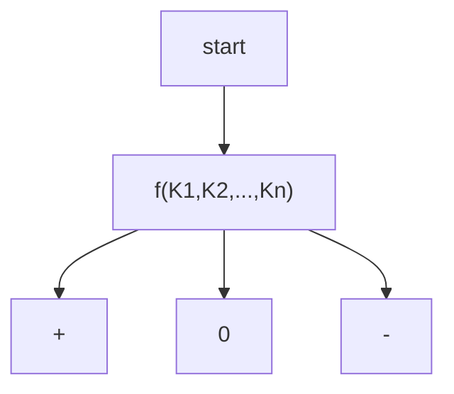

---
publish:
---
问题 P 若存在算法，则将所有算法中最低的复杂度称为 P 的**难度**。一旦算法的复杂度达到难度下界，则说明就 big-O-notation 而言，算法已达到最优。

有多种角度可以估算时间、空间的复杂度：
- 最好 best-case
- 最坏 worst-case
- 平均 average-case
- 分摊 amortized
对最坏情况的估计最保守、稳妥，因此首先考虑**最坏情况**下的最优算法。

## 判定树
### 以排序为例分析判定树
以排序为例，排序时间主要取决于：
- 关键码比较次数 `key comparison #`
- 元素交换次数 `data swap #`

那么排序算法最快有多快？语境不同答案不同，可以是指最坏情况时的最优算法，也可以是对一类主流算法而言……

==基于比较的算法==(CBA, comparison-based algo)在最坏情况下，都需要 $\Omega (n\log n)$ 时间才能排序完成。

与 CBA 算法对应的判定树：每一可能的输出都至少对应于判定树的一个叶节点，每一次运行过程都对应起始于根的某条路径。
![[10-Introduction-decision-tree.png]]

### 比较树
==比较树== Comparison Tree: 
![[14-Lowerbound-analyze-compare-tree.png]]
用圆节点表示算法过程中不同的状态，用有方向的边表示不同状态之间的相互转换，叶节点表示经一系列计算后某次运行的终止状态。

#### 性质
- 所有内部节点各对应于一次比对操作；
- 内部节点的左右分支，分别对应于在两种比对结果下的执行方向；
- 叶节点对应于算法某次执行的完整过程的输出；

### 代数判定树
针对 CBA 式算法，给定输入规模，将所有可能的输入所对应的一系列判断表示出来，就是**代数判定树**algebraic decision tree。

代数判定树是对比较树的推广，其中节点对应于根据某一代数表达式做出的判断。例如，比较树中各节点所对应的“a == b”以及“a < b” ，均可统一为根据一次代数表达式“a - b”取值符号的判断断。

代数判定：使用某一常次数代数多项式，将任意一组关键码作为变量，对多项式求值，根据结果的符号，确定算法推进的方向。

### CBA排序算法下界
==比较树是三叉树 ternary tree==，每一叶节点对应于起自根节点的一条通路，这条通路是某一可能的运行过程，叶节点对应的就是输出结果。

因此有三个等价关系：
- 叶的深度 $\sim$ 比较次数 $\sim$ 计算成本
- 树高 $\sim$ 最坏情况时的计算成本
- 树高的下界 $\sim$ 所有 CBA 的时间复杂度的下界

对于排序算法，必定有 $N\ge n!$：每一次输出对应于某一置换，依此置换可以将输入序列转换为有序序列。包含 N 个叶节点的排序算法 ADT，高度不低于 
$$
\log_{3}N\ge \log_{3}n!=\log_{3}e\cdot[n\ln n-n+O(\ln n)]=\Omega(n\log_{n})
$$

## 线性规约
规约 reduction 是确定下界的另一工具。
![[10-Introduction-reduction.png]]

![[10-Introduction-reduction-example.png]]

### 规约的详细定义
一般地，考查难度待界定的问题 B。若另一问题 A 满足以下性质：
1）问题 A 的任一输入，都可以在线性时间内转换为问题 B 的输入
2）问题 B 的任一输出，都可以在线性时间内转换为问题 A 的输出
则称“问题 A 可在线性时间内归约为问题 B”，或简称作“问题 A 可线性归约为问题 B”，或者称“从问题 A 到问题 B，存在一个线性（时间）归约（linear-time reduction）关系”，记作：$A \le_{N} B$

此时，若问题 A 的难度（记作|A|）已界定为严格地高于Ω(n)，亦即：
|A| = Ω(f (n)) = ω(n)
则问题 B 的难度（记作|B|）也不会低于这个复杂度下界，亦即：
|B| >= |A| = Ω(f (n))
实际上，若问题 A 果真可以线性归约为问题 B，则由后者的任一算法，必然同时也可以导出前者的一个算法。这一结论，可由图直接看出：为求解问题 A，可将其输入转化为问题 B 的输入，再调用后者的算法，最后将输出转化为前者的输出。
![[20-Vector-linear-reduction.png]]

因此，假若问题 B 具有一个更低的下界，则至少存在一个 o (f (n))的算法，于是由上可知， 问题 A 也存在一个 o (f (n))的算法——这与问题 A 已知的 ω(n)下界相悖。
![[20-Vector-small-notation.png]]

归纳起来，为运用线性归约界定问题 B 的难度下界，须经以下步骤：
1）找到难度已知为 ω(n)的问题 A
2）证明问题 A 可线性归约为问题 B——其输入、输出可在线性时间内完成转换

