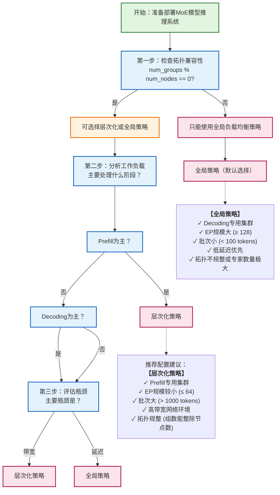

---
tags:
  - EP
  - DeepSeek
  - AlltoAll
  - LoadBalance
  - Inference
date: 2025-12-23
publish: "true"
zhihu-title: 【项目分析】从 EPLB 算法到 DeepSeek V3 推理实践的分析
zhihu-topics: MoE 负载均衡
zhihu-link: https://zhuanlan.zhihu.com/p/1991335445385199862
zhihu-created-at: 2026-01-05 02:29
---
[EPLB](https://github.com/deepseek-ai/EPLB) 是 DeepSeek 为了解决大规模 MoE 模型在推理时的专家负载不均衡问题而开发的负载均衡算法。本文将从 MoE 推理的背景知识、EPLB 算法本身实现、EPLB 在推理实践中的角色等方面，结合 [[DeepSeek_V3_Report：Annotation|DeepSeek V3 Technical Report]] 的相关内容进行深入的探讨分析。

## 1. 背景：MoE 推理与专家并行

### 什么是 MoE ？

在传统的稠密模型 (Dense Model) 中，每一层的前馈网络 (FFN) 是一个巨大的整体。而在 MoE 架构中，这个 FFN 被拆解成了许多个小型的 FFN，这些小 FFN 被称为**专家 (Experts)**。 ![[EPLB-transformer-vs-moe.gif]]

要理解为什么 FFN 可以被这样拆分，我们首先需要重新审视 FFN 在 Transformer 结构中究竟扮演了什么角色。在标准的 Transformer Block 中，自注意力机制 (Self-Attention) 主要负责处理 token 之间的**交互与上下文关联**，它聚合了不同位置的信息，解决了“当前词与谁相关”的问题。然而，Attention 层输出的向量虽然包含了丰富的上下文信息，但仍处于一种“混合”状态。紧随其后的 FFN 层，实际上是对每个 token 的特征进行独立加工与知识检索的场所。学术界普遍认为，Transformer 中的 FFN 层充当了**键-值记忆网络 (Key-Value Memory Networks)** 的角色。 ![[Dive-into-EPLB-transformer.png]] 
我们可以将 FFN 的第一层线性变换（升维过程）看作是许多个“Key”，它们负责检测输入 token 中是否包含特定的语义模式（例如“图灵奖”）；而第二层线性变换（降维过程）则是对应的“Value”，负责在模式匹配成功后输出相应的信息增益（例如“计算机科学最高荣誉”）。

> [!NOTE]- FFN 的结构
> **FFN 在本质上就是一个双层的多层感知机 (MLP)**。在标准的 Transformer（如 BERT 或 GPT）架构中，它位于 Attention 层之后，通常包含两个线性层（Linear Layer）和一个非线性激活函数。![[Dive-into-EPLB-FFN.png]]
> 
> 假设模型的隐藏层维度（Hidden Size）是 $d_{model}$，通常 FFN 的中间层维度 $d_{ff}$ 会被设计得比较大，通常是 $4 \times d_{model}$（例如 GPT-3 中就是这样）。FFN 的前向传播过程实际上发生了两次核心的矩阵变换，我们可以称之为“升维”和“降维”。
> 
> **第一阶段：升维与“Key”的匹配**
> 输入向量 $x$（形状为 $[Batch, Seq, d_{model}]$）首先经过第一个线性层 $W_1$（形状为 $[d_{model}, d_{ff}]$）。
> $$
> h_{inter} = \text{Activation}(x \cdot W_1 + b_1)
> $$
> 在这个公式中，可以把 $W_1$ 矩阵看作是由 $d_{ff}$ 个列向量组成的，每一个列向量就是一个 Key。当输入 $x$ 与 $W_1$ 相乘时，本质上是在做点积 (Dot Product)。点积衡量的是相似度，所以这一步实际上是在计算输入 $x$ 与 $d_{ff}$ 个“模式”的匹配程度。
> 这里的激活函数（如 ReLU，GELU 或 SwiGLU）起到了至关重要的“阈值”作用。如果 $x$ 与某个 Key 的匹配度不高（点积小或为负），激活函数会将其抑制为 0 或接近 0；只有匹配度足够高时，这个神经元才会被“点亮”。这就是之前提到的“检测输入 token 是否包含特定的语义模式”。
> 
> **第二阶段：降维与“Value”的读取**
> 经过激活后的中间向量 $h_{inter}$（形状为 $[Batch, Seq, d_{ff}]$）是一个高度稀疏的向量，因为大部分神经元都没被激活。接下来它会经过第二个线性层 $W_2$（形状为 $[d_{ff}, d_{model}]$）：
> $$
> output = h_{inter} \cdot W_2 + b_2
> $$
> 在这个步骤中，可以把 $W_2$ 的每一行（注意这里是行向量，对应中间层的每一个维度）看作是一个 Value 向量。
> 因为 $h_{inter}$ 是 $W_2$ 的系数，这个矩阵乘法本质上是在进行加权求和。只有在第一阶段被激活（被“点亮”）的那些神经元对应的 $W_2$ 中的行向量（Value），才会被加到最终的输出中。这就像是查字典：第一层不仅找到了索引（Key），第二层还把索引对应的内容（Value）取了出来并融合进了残差流 (Residual Stream) 中。
> 
> 以下是一段 PyTorch 实现的双层 FFN 示例：
> ```python
> import torch
> import torch.nn as nn
> import torch.nn.functional as F
> 
> class FeedForward(nn.Module):
>     def __init__(self, d_model: int, expansion_factor: int = 4):
>         super().__init__()
>         d_ff = d_model * expansion_factor
>         
>         # 第一层线性变换：升维 (Key Detection)
>         # 这里的 weight 形状是 [d_ff, d_model]，但在计算时转置使用
>         self.w1 = nn.Linear(d_model, d_ff) 
>         
>         # 第二层线性变换：降维 (Value Retrieval)
>         self.w2 = nn.Linear(d_ff, d_model)
> 
>     def forward(self, x: torch.Tensor) -> torch.Tensor:
>         # x shape: [batch_size, seq_len, d_model]
>         
>         # 1. 模式匹配 (Match Keys)
>         # 投影到高维空间，检测特征
>         projected = self.w1(x)
>         
>         # 2. 激活 (Filter)
>         # 非线性激活，过滤掉不匹配的模式，保留高响应的特征
>         activated = F.gelu(projected)
>         
>         # 3. 信息读取 (Retrieve Values)
>         # 将激活的特征对应的 Value 向量加权求和，投影回原空间
>         output = self.w2(activated)
>         
>         return output
> 
> # 示例维度
> # d_model = 1024 (GPT-2 medium size approximately)
> # d_ff = 4096 (Key/Value pairs quantity)
> ```

在传统的稠密模型中，这个 FFN 极其宽大，拥有成千上万个神经元。这意味着对于输入的每一个 token，无论它是一个简单的虚词还是一个深奥的专业术语，网络都会**激活所有的神经元来参与计算**。但这就带来了一个显著的冗余问题：**神经元的“多义性”与计算浪费**。实际上，对于某个特定的输入 token，可能只有极少部分的神经元（即特定的 Key-Value 对）真正对其做出了有效响应，其余大部分神经元的激活值可能极低或对最终结果贡献微乎其微。

正是基于 FFN 的这种“模式匹配”与“独立记忆”的特性，MoE 架构应运而生。既然 FFN 是由无数个潜在的语义模式探测器组成的，我们完全可以将这些探测器（神经元）按照某种潜在的逻辑进行分组。**这种分组的结果，就是所谓的“专家”**。数学上，一个巨大的权重矩阵 $W$ 可以被视为多个小矩阵 $[W_1, W_2, \ldots, W_n]$ 的拼接。MoE 的本质思想是：既然处理某个特定 token 时不需要全量参数参与，那我们就不再激活整个大矩阵，而是引入一个轻量级的**门控网络 (Gating Network/Router)**。这个 Router 会根据输入 token 的特征向量，动态地计算出最匹配的 Top-k 个专家（通常 $k=1$ 或 $2$），并只激活这几个小型的 FFN 进行计算，其余专家的权重保持静默。

通过这种拆分，MoE 成功地打破了参数规模与计算成本的强绑定，这意味着可以极大地扩展模型的**模型容量 (Model Capacity)**——将参数量从百亿推向万亿级别——以容纳更庞大的世界知识，同时却能将单次推理的**浮点运算量 (FLOPs)** 维持在一个较低的水平（例如 DeepSeek V3 的模型参数总量为 671B，但每次推理时只用到 37B）。

值得注意的是，并非所有的 MoE 架构都允许任意专家被任意 token 选择。以 DeepSeek V3 为例，其采用了细粒度的 MoE 设计和**节点限制路由** ( [[DeepSeek_V3_Report：Annotation#DeepSeekMoE with Auxiliary-Loss-Free Load Balancing|Node-Limited Routing]] ) 策略: 
1. 每个MoE层包含257个专家：1个shared expert和256个routed experts，全模型共有61个Transformer层，因此总共包含15,677个独立的专家参数集合（61层 × 257专家/层）。这种设计结合了两种专家的优势：
	- **Shared Expert**扮演"通用知识库"的角色。它被每个token无条件激活，不参与Router的选择过程。从计算的角度看，shared expert类似于标准的FFN层，只是它的参数独立于routed experts。在推理部署时，shared expert带来了特殊的挑战。由于它服务所有token，其计算负载远高于普通routed expert。在Decoding阶段，DeepSeek V3采用的策略是将shared expert也纳入EP的框架，将其视为一个"永远被选中"的特殊routed expert，通过复制到多个GPU来分摊负载。
	- **Routed Experts**则提供"专业化能力"。256个routed experts通过Router进行选择，每个token激活其中的Top-8。DeepSeek V3采用了**Node-Limited Routing**机制，即每个token的专家选择被限制在最多4个节点内，以控制跨节点通信的范围。 每个routed expert平均被激活的概率约为8/256 = 3.125%。在实际负载中，不同专家的激活率差异很大：热门专家可能达到5-10%的激活率，而冷门专家可能低于1%。 
2. 从负载均衡的角度看，这257个专家呈现出极度不均衡的激活模式： 
	- Shared expert：100%激活率，负载是平均值的32倍（100% / 3.125%） 
	- 热门routed experts：可能5-10%激活率，负载是平均值的1.5-3倍 
	- 普通routed experts：2-4%激活率，负载接近平均值 
	- 冷门routed experts：<1%激活率，负载远低于平均值
	- 这种不均衡在小批量场景（如Decoding阶段）下更为突出

### MoE 推理的详细流程

要理解专家并行（Expert Parallelism）的挑战，首先需要弄清楚一个 MoE 层在推理时的具体工作流程。MoE 层通常用于替代标准 Transformer 架构中的前馈网络 (FFN) 部分。其输入是来自上一层（如自注意力层）的 `[token_num, hidden_dim]` 形状的张量，输出是经过专家网络处理后的同形状张量。当专家被分散在多个 GPU 上时（即启用 EP），这个过程就由纯粹的计算转变为计算和通信的深度耦合。

整个流程大致可以分解为六个阶段：
![[Dive-into-EPLB-dsv3-arch.png]]

首先是**路由决策阶段**。一个被称为“门控网络”或“路由器”的小型神经网络（通常是一个简单的线性层）会为每一个输入 token 计算其与所有专家的匹配分数。这个过程主要涉及一个 `MatMul` 计算算子，输出一个 `[token_num, expert_num]` 形状的分数矩阵。

接下来是**专家选择阶段**。系统根据上一阶段获得的分数，为每个 token 选出得分最高的 Top-K 个专家。这一步的核心是 `TopK` 算子。选出的 K 个专家的分数随后会经过一个 `Softmax` 算子，转化为一组权重，用于后续对专家们的输出进行加权求和。至此，我们就明确了每个 token 将要被哪些专家处理，以及它们的计算结果将以多大的权重被采用。

然后便进入了 EP 的核心——**Token 分发阶段**。这是一个以通信为主的阶段。系统的输入是原始的 token 隐状态张量，以及上一步得到的每个 token 对应的专家索引。为了将 token 发送到持有对应专家的 GPU 上，系统会执行一次 `All-to-All` 通信操作。在具体实现中，为了提高效率，往往会先根据目标专家对 token 进行重排（Permutation），将发往同一个 GPU 的 token 聚集在一起，然后通过一次 `All-to-All` 通信算子将数据交换到目标 GPU。这个阶段是通信密集型的，其负载直接取决于 token 数量和隐状态维度，也是负载不均衡问题开始显现的地方。

第四阶段是**专家计算**。当每个参与 EP 的 GPU 收到被路由给自己的 token 后，便开始执行计算。每个 GPU 在本地执行其所持有的专家网络（通常是两个线性层和一个激活函数）的前向传播。这个阶段是计算密集型的，主要涉及 `MatMul`，`SiLU`/`GeLU` 等计算算子。如果一个 GPU 因为分摊到了热门专家而收到大量 token，其计算时间就会显著变长，成为整个系统的瓶颈。
![[Dive-into-EPLB-vllm-fused-moe.png]]
计算完成后，需要将结果送回 token 初始的位置，这便是**结果聚合阶段**。这个过程与分发阶段互为逆操作，同样涉及一次 `All-to-All` 通信，将处理后的 token 隐状态发送回它们各自原始的 GPU 上。这同样是一个通信密集型阶段。

最后一个阶段是**加权求和**。在每个 token 的原始 GPU 上，系统根据第二阶段保存的 `Softmax` 权重，对从不同专家返回的结果进行加权求和（通过 `Mul` 和 `Sum` 算子），得到 MoE 层的最终输出。这个输出随后会通过残差连接，输入到下一个 Transformer 层。

值得注意的是，上述六阶段流程发生在更宏观的 LLM 推理上下文中。通常，一次完整的 LLM 推理包含**预填充 (Prefill)** 和**解码 (Decoding)** 两个差别巨大的阶段。 ![[Dive-into-EPLB-prefill-decoding.png]] 我们描述的六阶段 MoE 流程会在 **每一次** 模型前向传播时执行，但其负载特征在 Prefill 和 Decoding 阶段完全不同。在 Prefill 阶段，模型一次性处理全部的输入 Prompt，`token_num` 巨大，因此专家计算是**计算密集型**，而 All-to-All 通信是**带宽密集型**。在 Decoding 阶段，模型逐个生成 token，`token_num` 极小（通常为1），专家计算因此变为**访存密集型**，All-to-All 通信则变为**延迟密集型**。理解这一差异，是理解 EPLB 为何采用两种不同均衡策略的关键。

| 特征维度     | Prefill 阶段                                                                 | Decode 阶段                                                                      |
| -------- | -------------------------------------------------------------------------- | ------------------------------------------------------------------------------ |
| **计算特征** | **计算密集型**。一次性处理用户 Prompt 中的成千上万个 Token。计算量大，更容易利用 GPU 并行能力。                | **访存密集型**。逐个生成 Token。计算量小，主要受限于显存带宽和通信延迟。                                      |
| **流量特征** | **突发**。虽然总 Token 数多，但 Router 分发到各个专家的负载相对符合统计分布，极端热点可能被掩盖，符合大数定律，负载可预测性较高。 | **稀疏且波动大**。因为只有 Batch Size 个 Token 在路由，随机性极强。某个 Token 选中某个专家，该专家负载瞬间 +1，否则为 0。 |
| **通信特征** | **带宽瓶颈**。海量 Token 需要跨 GPU 传输，All-to-All 通信的数据量巨大（GB 级别）。                   | **延迟瓶颈**。传输的数据包很小，但频率极高。跨节点的 IB 通信延迟会直接拖慢每一步的生成速度。                             |
| **策略核心** | **保带宽**。优先把同一组专家塞进同一个节点，尽量让 Token 在节点内（NVLink）传输，减少跨节点（IB）传输。              | **保均衡**。打破节点和组的限制，把热门专家复制并打散到全局所有 GPU 上，确保没有任何一个 GPU 成为计算短板。                   |
| **主要瓶颈** | AlltoAll 通信带宽                                                              | 单个 GPU 的 HBM 带宽 和 网络延迟                                                         |

### 什么是专家并行？

EP 的本质是一种特殊的**动态路由与数据重排**问题。在模型训练中，EP 解决了“**模型参数量过大无法放入单个 GPU**”的问题，但它与张量并行（Tensor Parallelism）将单个矩阵切分的逻辑不同，EP 是将完整的“专家”（即我们在上一节分析的那个独立的小 FFN 模块）分配到不同的物理设备上。假设我们有 $E$ 个专家和 $N$ 个 GPU，EP 策略通常会将 $E/N$ 个专家放置在每一个 GPU 上。这里**最本质的挑战**在于：输入数据通常是按照数据并行 (Data Parallelism) 的方式分布的，即每个 GPU 持有一部分 Batch 的数据，但这些数据在经过 Router 计算后，其需要的专家可能并不在当前 GPU 上，而是在网络的另一端。

这引出了 EP 实现中最核心的通信原语：**All-to-All**。在 Megatron-LM 中，前向传播被清晰地划分为“分发 (Dispatch)”和“聚合 (Combine)”两个阶段：
- **Dispatch**：当 Input Token 经过 Gating Network 计算出目标专家的索引后，如果该专家位于远程 GPU，系统必须将该 Token 的特征向量通过网络发送过去。这与 All-Reduce 这种每个节点数据量相同的规约操作不同，All-to-All 允许每个节点向其他所有节点发送不同大小的数据块（在更精确的集合通信领域的术语中，称为 All-to-Allv）。在 Megatron-LM 的实现层面上，通常会利用 `torch.distributed.all_to_all_single` 这样的 API 来完成跨节点的 Token 重排。可以将这个过程想象为一个大规模的 Shuffle ：GPU 0 上的某些 Token 被发往 GPU 1 处理，而 GPU 1 上的某些 Token 又被发往 GPU 0。
- **Combine**：当远程 GPU 完成 Expert 的计算后，还需要执行第二次逆向的 All-to-All，将计算后的结果（Token 的新特征）传回其原始所在的 GPU，以便进行后续的残差连接和下一层计算。这意味着 EP 会在网络中产生极其突发的、多对多的高带宽流量，这对互连架构（如 NVLink 或 InfiniBand）提出了极高的吞吐要求。

> [!question] 为什么 EP 必须使用 All2All 而不能是 AllReduce？
> 关键区别在于数据的**不对称性**。在数据并行的All-Reduce中,每个GPU发送和接收的数据量都是相同的(梯度或参数),且目标是所有GPU获得相同的聚合结果。而在EP中,每个GPU需要发送的token去往不同的目标GPU,且每个GPU接收的token数量由路由结果动态决定,完全不对称。这种"谁发给谁、发多少"完全由数据内容决定的特性,正是All-to-All这种点对点通信原语存在的意义。

然而，这种基础的 EP 实现存在两个显著的性能瓶颈，这也正是 DeepEP 试图解决的问题。**第一个瓶颈是计算效率**。由于 Gating 的结果是不确定的，分发到每个专家的 Token 数量（Workload）差异可能极大。在传统的 PyTorch 实现中，为了并行计算，往往需要对数据进行 Padding（填充）以对齐维度，或者分别对每个专家启动不同的 CUDA Kernel。前者会导致大量无效计算（算力浪费），后者则因为 Kernel Launch 的开销过大且无法占满 GPU 核心（低 Occupancy）而导致效率低下。**第二个瓶颈是通信与计算的串行阻塞**。在标准的 Megatron-LM 流程中，GPU 必须等待 All-to-All 通信完全结束后才能开始计算，反之亦然，这导致了宝贵的计算资源和网络带宽在时间轴上交替闲置。

为了解决这些问题，DeepEP 结合 CUTLASS 和底层通信原语引入了深度的优化。首先，针对计算效率，DeepEP（以及现在的 FlashAttention 等库）引入了 **Grouped GEMM**（或称 MoE GEMM）。这是一种高度优化的 CUDA Kernel，它允许在单次 Kernel 启动中完成多个不同大小矩阵的乘法运算。通过这种方式，我们不再需要对 Token 进行 Padding，也不需要循环启动小 Kernel，而是由一个统一的 Kernel 根据元数据（Metadata）直接调度 GPU 的 Streaming Multiprocessors (SMs) 去处理不同负载的专家计算，极大地提升了计算密度。

在通信层面，DeepEP 实现了一种细粒度的**通信与计算重叠 (Communication-Computation Overlap)** 机制。它不仅仅是简单的流水线，而是深入到了 SM 级别的控制。DeepEP 利用了 Hopper 架构 的 GPU 中 Copy Engine (DMA) 和 Compute Engine 可以并行工作的特性，在设计上利用了 GPU 内部的共享内存作为缓冲区。具体来说，当部分 Token 还在通过 NVLink 或 RDMA 传输时，GPU 核心已经开始处理那些已经到达的 Token 了。为了实现这一点，DeepEP 在底层使用了 C++ 和 CUDA 编写了定制的 Intrinsic 通信算子，绕过了高开销的 Python 层调度，直接控制 InfiniBand 的 QP (Queue Pair) 或 NVLink 的 Load/Store 指令。这种优化使得 MoE 模型在训练时，通信延迟几乎可以被计算时间完全掩盖 (Hide)，从而让整个集群的吞吐量接近理论上限[^1]。

### EP 的通信特征与挑战

MoE 所引入的 **All-to-All** 通信模式，在本质上完全打破了传统深度学习训练中以 Ring All-Reduce 为代表的、静态且规整的通信范式。传统的通信模式往往不仅是对称的，而且流量矩阵是确定性的，而 EP 带来的流量特征则是**数据驱动 (Data-Dependent)** 且极具**突发性 (Burstiness)** 的。

首先，我们需要从流量生成的根源来审视 **All-to-All 通信的动态性与网络压力**：
- 在 EP 过程中，通信流量不再是一个静态的配置参数，而是输入数据的函数。这意味着网络流量矩阵（Traffic Matrix）会随着每一个 Batch 甚至每一个 Step 的数据内容而剧烈波动。
- 对于大规模集群而言，当数千个 GPU 同时发起 All-to-All 操作时，这并非简单的多个点对点传输，而是在极短的时间窗口内，全网通过互连架构进行的一次大规模数据置换（Permutation）。在 Large Batch 训练场景下，这种通信模式会瞬间产生海量的“大象流”（Elephant Flows）。 ![[Dive-into-EPLB-elephant-flows.png]] 不同于 Parameter Server 架构中的多对一，也不像 Ring All-Reduce 那样链路负载均衡，All-to-All 极易在交换机层面引发**多对一的微突发（Micro-burst Incast）**。如果多个发送端（Source）同时将数据路由给同一个接收端（Destination）——比如恰好这一批数据都需要某个特定 GPU 上的专家处理——就会导致接收端 ToR 交换机的 egress 端口缓冲区瞬间填满，进而触发 PFC（Priority Flow Control）拥塞控制机制，甚至导致 HoL 阻塞，严重制约整个集群的有效带宽。

其次，我们要考虑特定专家过热（术语上称之为**负载偏斜**，Load Skew）带来的一系列问题。
- 在自然语言中，某些 token（如 "the"，"是"，","）出现的频率极高，导致负责处理这些通用语义的“明星专家”负载居高不下，而处理特定领域知识（如医学、法律）的专家则可能相对空闲。这种规律服从**奇普夫定律**（Zipf's Law）——这是一条经验定律，它指出当一组测量值按降序排列时，第 $n$ 个值通常与 $n$ 成近似反比，其最著名的实例适用于自然语言文本或语料库中的词频分布：$\text{work freq}\propto\frac{1}{\text{word rank}}$，例如，在美国英语文本的布朗语料库中，词"the"是最常见的词，它本身占所有词出现次数的近 7%（69,971 次，略超过 100 万次）。符合齐夫定律的是，第二位的词"of"占词出现次数的略超过 3.5%（36,411 次），其次是"and"（28,852 次）。这意味着热门专家必然成为流量热点。 ![[Dive-into-EPLB-expert-load-imbalance.png]]
	- 实际测量显示，在典型的自然语言工作负载中，负载最高的Top-10%专家往往处理了约40%-50%的总token量，而负载最低的Bottom-10%专家可能只处理了不到1%的token。这种极端的不均衡如果不加处理，会导致90%的GPU在等待那10%的"明星专家"完成计算。
- **这种偏斜在分布式系统中直接转化为同步屏障处的长尾延迟**。在 MoE 的并行计算图中，前向和后向传播都存在全局同步点，系统的整体吞吐量并不取决于平均处理速度，而是被那个负载最重、运行最慢的 GPU（即 Straggler）所“钳制”——即木桶效应。这意味着即使优化了 99% 的 GPU 的计算效率，只要有 1% 的 GPU 因为热点专家而过载，整个集群的 MFU 就会断崖式下跌。
- 更进一步，从内存管理的角度来看，极端的热点可能导致某个 GPU 瞬间接收数倍于平均值的 token，引发显存溢出，导致系统崩溃。**OOM 风险**不仅威胁着稳定性，更限制了系统设计的灵活性。当热点爆发时，特定的 GPU 不仅要承担额外的计算负荷，还需要为瞬间涌入的 Token 分配巨大的激活值缓冲区。在 CUDA 层面，这意味着我们无法静态预分配显存，或者必须预留极大的安全余量，这反过来又浪费了宝贵的 HBM 资源。为了缓解这个问题，业界（如 Google 的 GShard 或 Switch Transformer）通常会引入“辅助负载均衡损失（Auxiliary Load Balancing Loss）”来强行平滑路由分布，或者设置**容量因子（Capacity Factor）**——当发送给某个专家的 Token 超过阈值时，直接丢弃（Drop）多余的 Token。这本质上是在**模型精度**与**系统稳定性/性能**之间做出的无奈妥协：为了防止 OOM 和缓解 straggler，我们不得不人为地切断部分计算路径。而 DeepSeek V3 的设计是 No-Token-Drop 和 Auxiliary-Loss-Free 的—— [[DeepSeek_V3_Report：Annotation#DeepSeekMoE with Auxiliary-Loss-Free Load Balancing|DeepSeekMoe with Aux-Loss-Free Load Balancing]] .

最后，除了上述应用层面的挑战，All-to-All 还面临着**物理拓扑感知的挑战**。在现代 GPU 集群中，节点内（Intra-node）通常拥有极高带宽的 NVLink，而节点间（Inter-node）则是相对低带宽的 InfiniBand 或 RoCE。原生的 All-to-All 往往对这种层级结构视而不见，导致大量本可以通过节点内交换解决的数据被错误地推向了昂贵的跨节点网络。因此，在 DeepEP 等高性能库中，通常会采用**分层 All-to-All (Hierarchical All-to-All)** 的策略：先在节点内进行聚合或交换，尽可能减少跨节点的通信次数和数据量，这实际上是将一个纯粹的通信问题转化为了“通信+计算+拓扑规划”的综合优化问题。

## 2. EPLB 算法详解

经过详细的讲解分析，我们可以将视角落到一个关键点来解决 EP 中的不均衡问题——专家的负载均衡。EPLB 就是为了解决推理时不同专家的负载均衡问题而开发[^2]，其本身的代码非常简洁，仅仅 150 多行，在这里还能学到向量式编程的一些思想：

```python
from typing import Tuple

import torch


def balanced_packing(
    weight: torch.Tensor, num_packs: int
) -> Tuple[torch.Tensor, torch.Tensor]:
    """
    Pack n weighted objects to m packs, such that each bin contains exactly n/m objects and the weights of all packs
    are as balanced as possible.

    Parameters:
        weight: [X, n], the weight of each item
        num_packs: number of packs

    Returns:
        pack_index: [X, n], the pack index of each item
        rank_in_pack: [X, n], the rank of the item in the pack
    """
    num_layers, num_groups = weight.shape
    assert num_groups % num_packs == 0
    groups_per_pack = num_groups // num_packs

    if groups_per_pack == 1:
        pack_index = torch.arange(
            weight.size(-1), dtype=torch.int64, device=weight.device
        ).expand(weight.shape)
        rank_in_pack = torch.zeros_like(weight, dtype=torch.int64)
        return pack_index, rank_in_pack

    indices = weight.float().sort(-1, descending=True).indices.cpu()
    pack_index = torch.full_like(weight, fill_value=-1, dtype=torch.int64, device="cpu")
    rank_in_pack = torch.full_like(pack_index, fill_value=-1)
    for i in range(num_layers):
        pack_weights = [0] * num_packs
        pack_items = [0] * num_packs
        for group in indices[i]:
            pack = min(
                (i for i in range(num_packs) if pack_items[i] < groups_per_pack),
                key=pack_weights.__getitem__,
            )
            assert pack_items[pack] < groups_per_pack
            pack_index[i, group] = pack
            rank_in_pack[i, group] = pack_items[pack]
            pack_weights[pack] += weight[i, group]
            pack_items[pack] += 1
    return pack_index, rank_in_pack


def replicate_experts(
    weight: torch.Tensor, num_phy: int
) -> Tuple[torch.Tensor, torch.Tensor, torch.Tensor]:
    """
    Replicate `num_log` experts to `num_phy` replicas, such that the maximum load of all replicas is minimized.

    Parameters:
        weight: [X, num_log]
        num_phy: total number of experts after replication

    Returns:
        phy2log: [X, num_phy], logical expert id of each physical expert
        rank: [X, num_phy], the replica rank
        logcnt: [X, num_log], number of replicas for each logical expert
    """
    n, num_log = weight.shape
    num_redundant = num_phy - num_log
    assert num_redundant >= 0
    device = weight.device
    phy2log = torch.arange(num_phy, dtype=torch.int64, device=device).repeat(n, 1)
    rank = torch.zeros(n, num_phy, dtype=torch.int64, device=device)
    logcnt = torch.ones(n, num_log, dtype=torch.int64, device=device)
    arangen = torch.arange(n, dtype=torch.int64, device=device)
    for i in range(num_log, num_phy):
        redundant_indices = (weight / logcnt).max(dim=-1).indices
        phy2log[:, i] = redundant_indices
        rank[:, i] = logcnt[arangen, redundant_indices]
        logcnt[arangen, redundant_indices] += 1
    return phy2log, rank, logcnt


def rebalance_experts_hierarchical(
    weight: torch.Tensor,
    num_physical_experts: int,
    num_groups: int,
    num_nodes: int,
    num_gpus: int,
):
    """
    Parameters:
        weight: [num_moe_layers, num_logical_experts]
        num_physical_experts: number of physical experts after replication
        num_groups: number of expert groups
        num_nodes: number of server nodes, where the intra-node network (e.g, NVLink) is faster
        num_gpus: number of GPUs, must be a multiple of `num_nodes`

    Returns:
        physical_to_logical_map: [num_moe_layers, num_physical_experts]
        logical_to_physical_map: [num_moe_layers, num_logical_experts, X]
        logical_count: [num_moe_layers, num_logical_experts]
    """
    num_layers, num_logical_experts = weight.shape
    assert num_logical_experts % num_groups == 0
    group_size = num_logical_experts // num_groups
    assert num_groups % num_nodes == 0
    groups_per_node = num_groups // num_nodes
    assert num_gpus % num_nodes == 0
    assert num_physical_experts % num_gpus == 0
    phy_experts_per_gpu = num_physical_experts // num_gpus

    def inverse(perm: torch.Tensor) -> torch.Tensor:
        inv = torch.empty_like(perm)
        inv.scatter_(
            1,
            perm,
            torch.arange(perm.size(1), dtype=torch.int64, device=perm.device).expand(
                perm.shape
            ),
        )
        return inv

    # Step 1: pack groups to nodes
    tokens_per_group = weight.unflatten(-1, (num_groups, group_size)).sum(-1)
    group_pack_index, group_rank_in_pack = balanced_packing(tokens_per_group, num_nodes)
    log2mlog = (
        (
            (group_pack_index * groups_per_node + group_rank_in_pack) * group_size
        ).unsqueeze(-1)
        + torch.arange(group_size, dtype=torch.int64, device=group_pack_index.device)
    ).flatten(-2)
    mlog2log = inverse(log2mlog)

    # Step 2: construct redundant experts within nodes
    # [num_layers * num_nodes, num_logical_experts // num_nodes]
    tokens_per_mlog = weight.gather(-1, mlog2log).view(
        -1, num_logical_experts // num_nodes
    )
    phy2mlog, phyrank, mlogcnt = replicate_experts(
        tokens_per_mlog, num_physical_experts // num_nodes
    )

    # Step 3: pack physical_experts to GPUs
    # [num_layers * num_nodes, num_physical_experts // num_nodes]
    tokens_per_phy = (tokens_per_mlog / mlogcnt).gather(-1, phy2mlog)
    pack_index, rank_in_pack = balanced_packing(tokens_per_phy, num_gpus // num_nodes)
    phy2pphy = pack_index * phy_experts_per_gpu + rank_in_pack
    pphy2phy = inverse(phy2pphy)

    pphy2mlog = phy2mlog.gather(
        -1, pphy2phy
    )  # [num_layers * num_nodes, num_log_per_nodes]
    pphy2mlog = (
        pphy2mlog.view(num_layers, num_nodes, -1)
        + torch.arange(
            0,
            num_logical_experts,
            num_logical_experts // num_nodes,
            device=group_pack_index.device,
        ).view(1, -1, 1)
    ).flatten(-2)
    pphy2log = mlog2log.gather(-1, pphy2mlog)
    pphyrank = phyrank.gather(-1, pphy2phy).view(num_layers, -1)
    logcnt = mlogcnt.view(num_layers, -1).gather(-1, log2mlog)
    return pphy2log, pphyrank, logcnt


def rebalance_experts(
    weight: torch.Tensor,
    num_replicas: int,
    num_groups: int,
    num_nodes: int,
    num_gpus: int,
) -> Tuple[torch.Tensor, torch.Tensor, torch.Tensor]:
    """
    Entry point for expert-parallelism load balancer.

    Parameters:
        weight: [layers, num_logical_experts], the load statistics for all logical experts
        num_replicas: number of physical experts, must be a multiple of `num_gpus`
        num_groups: number of expert groups
        num_nodes: number of server nodes, where the intra-node network (e.g, NVLink) is faster
        num_gpus: number of GPUs, must be a multiple of `num_nodes`

    Returns:
        physical_to_logical_map: [layers, num_replicas], the expert index of each replica
        logical_to_physical_map: [layers, num_logical_experts, X], the replica indices for each expert
        expert_count: [layers, num_logical_experts], number of physical replicas for each logical expert
    """
    num_layers, num_logical_experts = weight.shape
    weight = weight.float().cpu()
    if num_groups % num_nodes == 0:
        # use hierarchical load-balance policy
        phy2log, phyrank, logcnt = rebalance_experts_hierarchical(
            weight, num_replicas, num_groups, num_nodes, num_gpus
        )
    else:
        # use global load-balance policy
        phy2log, phyrank, logcnt = rebalance_experts_hierarchical(
            weight, num_replicas, 1, 1, num_gpus
        )
    maxlogcnt = logcnt.max().item()
    log2phy: torch.Tensor = torch.full(
        (num_layers, num_logical_experts, maxlogcnt),
        -1,
        dtype=torch.int64,
        device=logcnt.device,
    )
    log2phy.view(num_layers, -1).scatter_(
        -1,
        phy2log * maxlogcnt + phyrank,
        torch.arange(num_replicas, dtype=torch.int64, device=log2phy.device).expand(
            num_layers, -1
        ),
    )
    return phy2log, log2phy, logcnt


__all__ = ["rebalance_experts"]

```

整个算法可以用下图这个示例来说明：

![[EPLB-fig-illustration.png]]

### 基础组件：启发式均衡打包 (Balanced Packing)

在深入EPLB的核心策略之前,我们需要先理解一个被反复调用的基础函数:`balanced_packing`。它解决的是一个经典的**装箱问题**(Bin Packing Problem):给定n个带权重的物品和m个容器,如何将物品分配到容器中,使得每个容器恰好装n/m个物品,且各容器的总权重尽可能均衡?

**函数签名与接口**：

```python
def balanced_packing(
    weight: torch.Tensor, num_packs: int
) -> Tuple[torch.Tensor, torch.Tensor]:
    """
    将n个带权重的物品装入m个容器,使每个容器恰好包含n/m个物品,且总权重尽可能均衡
    
    Parameters:
        weight: [X, n], 每个物品的权重
        num_packs: 容器数量m
    
    Returns:
        pack_index: [X, n], 每个物品被分配到的容器编号
        rank_in_pack: [X, n], 该物品在其容器内的排位(从0开始)
    """
```
- **参数说明**:
	- `weight`: 形状为`[X, n]`的张量,其中`X`是批次维度(对应MoE的层数),`n`是物品总数(对应专家或专家组的数量)
	- `num_packs`: 容器数量(对应节点数或GPU数)
- **返回值**:
	- `pack_index`: 记录每个物品被分配到哪个容器(0到num_packs-1)
	- `rank_in_pack`: 记录该物品是该容器内的第几个物品(从0开始计数)

**算法实现与逻辑**：

```python
def balanced_packing(weight: torch.Tensor, num_packs: int):
    num_layers, num_groups = weight.shape
    assert num_groups % num_packs == 0  # 确保可以均分
    groups_per_pack = num_groups // num_packs  # 每个容器应装的物品数

    # 特殊情况:如果每个容器只装1个物品,无需计算
    if groups_per_pack == 1:
        pack_index = torch.arange(
            weight.size(-1), dtype=torch.int64, device=weight.device
        ).expand(weight.shape)
        rank_in_pack = torch.zeros_like(weight, dtype=torch.int64)
        return pack_index, rank_in_pack

    # 步骤1:对物品按权重降序排序
    indices = weight.float().sort(-1, descending=True).indices.cpu()
    
    # 步骤2:初始化结果张量
    pack_index = torch.full_like(
        weight, fill_value=-1, dtype=torch.int64, device="cpu"
    )
    rank_in_pack = torch.full_like(pack_index, fill_value=-1)
    
    # 步骤3:贪心装箱 - 对每一层独立处理
    for i in range(num_layers):
        pack_weights = [0] * num_packs  # 记录每个容器的当前总权重
        pack_items = [0] * num_packs    # 记录每个容器的当前物品数
        
        # 按照权重从大到小遍历物品
        for group in indices[i]:
            # 从未满的容器中,选择当前总权重最小的那个
            pack = min(
                (i for i in range(num_packs) if pack_items[i] < groups_per_pack),
                key=pack_weights.__getitem__,
            )
            # 将物品放入选定的容器
            pack_index[i, group] = pack
            rank_in_pack[i, group] = pack_items[pack]
            pack_weights[pack] += weight[i, group]
            pack_items[pack] += 1
            
    return pack_index, rank_in_pack
```

**核心思想**: 这是一个**最长处理时间优先**(LPT, Longest Processing Time first)的变体。通过先处理重量级物品,避免最后剩下几个大物品无处安放的窘境。

1. **第1步 - 降序排序**: `indices = weight.float().sort(-1, descending=True).indices.cpu()`
	- `sort(-1, descending=True)`:在最后一维(物品维度)上降序排序
	- `.indices`:返回排序后的索引,而非值本身。例如,如果`weight[0] = [3, 1, 5, 2]`,则`indices[0] = [2, 0, 3, 1]`(因为第2个物品最重,权重为5)
	- `.cpu()`:将结果移到CPU,后续的装箱循环块在CPU上执行
		- 放在 CPU 上主要是因为 Python 的 for 循环配合张量索引在 CPU 上更灵活，写起来简单；而 GPU 更适合并行/向量化操作，但不适合频繁的小规模逐步索引、赋值的循环。这里权衡下选择在 CPU 上处理。

2. **第2步 - 初始化**: `pack_index`、`rank_in_pack` 都用 `-1` 填充,方便后续检查是否所有物品都被分配

3. **第3步 - 贪心分配**: 这是算法的核心。对每一层独立执行:
	```python
	for group in indices[i]:  # 按负载从重→轻的顺序遍历
	    pack = min(
	        (i for i in range(num_packs) if pack_items[i] < groups_per_pack),
	        key=pack_weights.__getitem__,
	    )
	  ```
	- 这一行代码极其精妙,我们拆解来看:
		1. `(i for i in range(num_packs) if pack_items[i] < groups_per_pack)`:生成器,遍历所有**未满**的容器
		2. `key=pack_weights.__getitem__`:以容器的当前总权重作为比较键
		3. `min(...)`:从未满的容器中,选择当前总权重**最小**的那个
	- 这样做的直觉是:**把重物品尽早放入,且总是放入最轻的容器,避免某个容器过早变重而无法承载后续的大物品**。

4. **更新状态**:
	```python
	pack_index[i, group] = pack                # 记录物品去向
	rank_in_pack[i, group] = pack_items[pack]  # 记录排位(当前是该容器的第几个)
	pack_weights[pack] += weight[i, group]     # 更新容器总重
	pack_items[pack] += 1                      # 更新容器物品数
	```

**时间复杂度与性能分析**：
- **排序**: $O(n \log n)$
- **贪心分配**: 对每个物品,遍历最多 $m$ 个容器,总计 $O(n \times m)$，通常$m$(容器数)通常远小于$n$(物品数)
- **总复杂度**: $O(\mathbf{X} \times n \log n + \mathbf{X} \times n \times m)$,其中 $\mathbf{X}$ 是层数

需要注意,这个贪心算法**不能保证全局最优**。装箱问题是NP-hard问题,找到绝对最优解需要指数时间。但这个贪心策略提供了一个快速且通常足够好的近似解,工程中的实测表明,其结果与最优解的差距通常在5%以内。对于EPLB的应用场景(专家负载均衡),这个精度已经完全足够,因为:
1. 输入的`weight`本身就是基于历史统计的估计值,并非绝对精确
2. 运行时的负载波动远大于算法带来的微小不均衡
3. 5%的负载差异不会成为系统瓶颈

`balanced_packing`在EPLB中被调用了两次:
1. **分配专家组到节点**(`rebalance_experts_hierarchical`的Step 1):将专家组均匀分配给若干个节点
2. **分配物理专家到GPU**(`rebalance_experts_hierarchical`的Step 3):将节点内的物理专家(包括副本)均匀分配给该节点的所有GPU

在这两个场景中,它都确保了"容器"(节点或GPU)的负载大致均衡,避免出现单点瓶颈。

### 核心思想：复制热门专家 (Replicate Experts)

EPLB 解决负载不均衡问题的核心手段不是“移动”专家，而是 **“复制”** 。这就好比超市收银台，如果发现 1 号柜台（热门专家）排队太长，最佳解决方案不是把 1 号业务的顾客赶到没人排队的 5 号柜台（冷门专家，无法处理该业务），而是**临时多开几个能处理 1 号业务的副本柜台**来分流。

#### 逻辑专家 ↔️ 物理专家

这种复制的思想很直观，但是实现起来却有难度——怎么分辨谁是原本、谁是复制品？怎样建立它们之间的关联？EPLB 给出的方案是，维护两个概念——逻辑专家和物理专家——之间的映射：`phy2log`、`log2phy`。

想象一家连锁餐厅的经营模式。总部设计了10种招牌菜（比如宫保鸡丁、鱼香肉丝等），这就是"菜单"——对应MoE模型中的**逻辑专家**。逻辑专家是模型定义中的抽象概念，它代表了一种特定的计算能力或知识领域。在DeepSeek V3中， 每个 MoE 层有 256+1 个逻辑专家，这是模型架构层面的设计参数，由配置文件定义。

然而，当餐厅开到不同城市时，我们会发现某些菜品（比如宫保鸡丁）在某个城市特别受欢迎，点单量远超其他菜品。此时，明智的做法是在这个城市的分店里，专门多配置几个厨师来做宫保鸡丁，而不是让所有菜品的厨师数量都一样。这些实际在厨房里工作的厨师，就是**物理专家**。物理专家是运行时实际占用GPU显存、执行计算的模型副本。

关键的映射关系是：
- **一对一的基础映射**：每个逻辑专家至少对应一个物理专家（相当于每道菜至少有一个厨师会做）
- **一对多的冗余映射**：热门的逻辑专家可以对应多个物理专家（相当于热门菜品配备多个厨师）
- **物理专家的唯一性**：每个物理专家只能承载一个逻辑专家的权重（一个厨师只能专精一道菜，而不是同时做多道菜）——很好理解，物理专家必然在 GPU 上占用某一块固定的显存空间，至少在它被激活、调用时，这块空间是独占的。

在直观的负载均衡思路中，我们可能会想"把过载GPU上的某些专家移动到空闲GPU上"。但这在MoE推理中是行不通的，原因有二：

1. **语义约束**：Router计算出的结果是逻辑专家ID（比如"token需要专家5"），我们不能擅自改变这个语义映射，否则模型的输出就会出错
2. **运行时成本**：在推理过程中实时搬运专家权重（通常每个专家数百MB）的开销极大，会严重拖累性能

EPLB的解决方案优雅而直接：既然我们不能改变"哪些token去找哪个专家"，那就增加"这个专家有多少个分身可以同时服务"。当专家5的负载很重时，我们就在多个GPU上都加载专家5的权重（这些是不同的物理专家，但都对应同一个逻辑专家5），这样，被路由到专家5的token就可以分流到这些副本上，从而实现负载均衡。

用更正式的语言描述：EPLB算法的输入是每个逻辑专家的历史负载统计，输出是一个**物理专家到逻辑专家的映射表**（Physical-to-Logical Map）。这个映射表告诉系统："在第i个GPU的第j个专家槽位上，应该加载哪个逻辑专家的权重"。通过巧妙地设计这个映射，EPLB确保了虽然逻辑层面的负载分布不均（由Router和数据特性决定），但物理层面的计算负载可以被均匀分摊到所有GPU上。

#### 专家复制算法

现在，让我们深入到实现这一策略的核心函数：`replicate_experts`。其目标是，**在给定逻辑专家的负载统计和可用的物理专家槽位总数后，决定每个逻辑专家应该被复制多少份，以及这些副本应该如何分配到物理槽位上，使得 GPU/节点 中承担的最大负载最小化**。

**函数签名与接口**：

```python
def replicate_experts(
    weight: torch.Tensor, 
    num_phy: int
) -> Tuple[torch.Tensor, torch.Tensor, torch.Tensor]:
    """
    将num_log个逻辑专家复制到num_phy个物理槽位，使得所有物理副本中承担的最大负载最小化
    
    Parameters:
        weight: [X, num_log], 每个逻辑专家的历史负载统计
        num_phy: 物理专家总数（即可用的GPU槽位总数）
    
    Returns:
        phy2log: [X, num_phy], 物理专家到逻辑专家的映射表
        rank: [X, num_phy], 每个物理专家是其对应逻辑专家的第几个副本
        logcnt: [X, num_log], 每个逻辑专家被复制的总份数
    """
```

- **参数说明**：
	- `weight` 记录了每个逻辑专家的负载情况。它的形状是 `[X, num_log]`，其中X代表MoE模型的层数。为什么需要这个层数维度？因为在多层MoE模型中，不同层的专家负载分布可能完全不同——第一层可能专家3很热门，第五层可能专家7很热门。EPLB通过在第一个维度上批量处理，为每一层独立计算最优的复制策略，同时利用 PyTorch 的广播机制，并行地处理多层的负载均衡，而无需写 Python 循环。
	- `num_phy`参数是物理槽位的总数，它必须大于或等于逻辑专家数`num_log`。两者的差值`num_redundant = num_phy - num_log`就是我们可以用来创建冗余副本的"额外空间"。例如，如果有256个逻辑专家，但我们有288个物理槽位，那就有32个额外槽位可以用来复制热门专家。
- **返回值**：
	- `phy2log` 是最核心的映射表，形状为 `[X, num_phy]`。它回答的问题是："第`i`层的第`j`个物理槽位上，应该加载哪个逻辑专家的权重？"例如，如果 `phy2log[0, 5] = 3`，意思是第0层的第5个物理槽位应该加载逻辑专家3的权重。这个表将被计算kernel使用，指导GPU加载正确的模型参数。
	- `rank` 记录副本的序号，形状同样是 `[X, num_phy]`。当一个逻辑专家被复制了多份时，我们需要区分这些副本——不是为了计算的区分（它们的权重完全相同），而是为了通信的正确性。例如，如果逻辑专家5被复制了3份，分别在物理槽位10、15、20上，那么 `rank[:, 10] = 0`、`rank[:, 15] = 1`、`rank[:, 20] = 2`。这个信息在All-to-All通信时至关重要，确保从不同副本返回的结果能被正确地聚合。
	- `logcnt` 张量统计了复制次数，形状为 `[X, num_log]`。它记录每个逻辑专家总共有多少个物理副本。这个信息在后续计算每个物理副本的预期负载时会用到——如果一个专家被复制了`n`份，那每份的平均负载就是总负载除以`n`。

**算法思想**：`replicate_experts` 采用了一个直观而高效的贪心策略，可以概括为一句话：**每次把一个空闲槽位分配给当前平均负载最高的那个逻辑专家**。为什么是"平均负载"而不是"总负载"？这是算法的巧妙之处。假设专家A的总负载是1000，但已经有2个副本（平均500）；专家B的总负载是800，但只有1个副本（平均800）。此时，虽然A的总负载更高，但B的单个副本更"累"，更容易成为瓶颈。因此，下一个槽位应该分配给B，创建它的第二个副本。这个贪心策略**不能保证全局最优解**，但它提供了一个快速且质量很好的近似解。更重要的是，这个算法的时间复杂度是 $O(\mathbf{X} \times \text{num\_redundant})$，其中 `num_redundant` 通常远小于专家总数，因此计算开销很小，可以在推理启动时快速完成。

**代码实现详解**：

```python
def replicate_experts(
    weight: torch.Tensor, 
    num_phy: int
) -> Tuple[torch.Tensor, torch.Tensor, torch.Tensor]:
    # 初始化阶段，建立物理、逻辑专家的 1:1 映射
    n, num_log = weight.shape
    num_redundant = num_phy - num_log # GPU上还有多少冗余槽位可供使用
    assert num_redundant >= 0
    device = weight.device
    
    # 第一步：初始化映射结构
    # 初始化phy2log的映射表，形状为[n, num_phy]
    phy2log = torch.arange(num_phy, dtype=torch.int64, device=device).repeat(n, 1)
    
    # 初始化用于建立映射的变量
    rank = torch.zeros(n, num_phy, dtype=torch.int64, device=device)
    logcnt = torch.ones(n, num_log, dtype=torch.int64, device=device)
    arangen = torch.arange(n, dtype=torch.int64, device=device)
    
    # 第二步：贪心策略分配冗余槽位，每次将空闲槽位分配给"最累"的那个专家
    for i in range(num_log, num_phy):
        # 找到当前平均负载最高的专家
        redundant_indices = (weight / logcnt).max(dim=-1).indices
        # 将物理槽位 i 分配给找到的最忙逻辑专家
        phy2log[:, i] = redundant_indices
        # 更新rank计数器，记录新副本
        rank[:, i] = logcnt[arangen, redundant_indices]
        # 为该专家增加一个副本
        logcnt[arangen, redundant_indices] += 1
    return phy2log, rank, logcnt
```

**细节讲解**：
1. **初始化阶段**：目标是为每个逻辑专家分配至少一个物理槽位，建立基础的一对一映射关系
	- 建立 `phy2log` 映射表时，`torch.arange(num_phy)` 生成了一个 `[0，1，...，num_phy-1]` 的序列，**这是所有物理槽位的 ID**。通过 `repeat(n, 1)` 操作，这个一维序列被扩展成形状为 `[n, num_phy]` 的二维张量。这里的 `repeat` 参数 `(n, 1)` 的含义是：在第0维（行维度）上重复 `n` 次，在第1维（列维度）上重复1次（即保持不变）。结果是每一行都是相同的 `[0, 1, 2, ..., num_phy-1]` 序列，一共有 `n` 行对应 `n` 层。这样做的目的是为模型的每一层都准备一份初始的映射表, 因为不同层的负载分布可能不同, 需要独立计算。当然，这只对前 `num_log` 个槽位有意义（因为只有 `num_log` 个逻辑专家），后面的槽位会在贪心循环中被重新分配。但这个初始化为前 `num_log` 个专家建立了基准——每个逻辑专家都至少有它自己的"本尊"。
	- `rank` 张量初始化为全 0，因为在这个阶段，所有专家都只有自己这一个副本，所以 `rank` 自然是0（第0个副本）。
	- `logcnt` 张量初始化为全 1，记录每个逻辑专家当前拥有的副本数。初始状态下，每个专家都只有1个副本（就是它自己）。
	- `arangen` 是一个辅助张量，包含 `[0, 1, ..., n-1]`，用于后续的高级索引操作。这是PyTorch中处理批量数据时的常用技巧——当我们需要在不同行选择不同列的元素时，需要同时提供行索引和列索引。
2. **贪心分配额外槽位阶段**：
	- **为什么贪心复制的循环要从 `num_log` 开始、遍历到 `num_phy-1` 结束**？因为索引 `0` 到 `num_log - 1` 的物理槽位已经被默认分配给了对应的逻辑专家（作为它们的第一份副本）。现在我们要填充的是从 `num_log` 开始的那些**额外**槽位。
	- **如何找到平均负载最大的专家**？`redundant_indices = (weight / logcnt). max (dim=-1). indices` 就是贪心策略的核心：
		- `weight / logcnt`: 计算每个专家的**平均负载**。这里利用了PyTorch的广播机制：`weight`的形状是`[n, num_log]`，`logcnt`也是`[n, num_log]`，两者逐元素相除。
		- `.max(dim=-1)` 在最后一个维度（专家维度）上寻找最大值。`dim=-1`意味着在每一层（每一行）中，找出平均负载最大的那个专家。这个操作返回一个namedtuple，包含values（最大值本身）和indices（最大值的位置）。
		- `.indices` 提取出这些最大值的索引。返回的 `redundant_indices` 形状是 `[n]`，对于每一层，它告诉我们：这一层中，哪个逻辑专家的单副本平均负载最高，因而最迫切需要一个新的副本来分担压力。
	- **如何完成分配**？
		- `phy2log[:,i] = redundant_indices` 这行将第 `i` 个物理槽位分配给刚才找到的最忙的逻辑专家。`[:, i]` 切片同时更新所有层的第i个槽位，而右侧的 `redundant_indices` 为每一层提供了不同的专家ID。这正是向量化编程的威力——一行代码完成了 `n` 层的独立决策。
		- `rank[:,1] = logcnt[arangen, redundant_indices]` 这行设置新副本的rank值。这里用到了PyTorch的高级索引：`logcnt[arangen, redundant_indices]` 的含义是"对于第 `i` 层，提取逻辑专家 `redundant_indices[i]` 的当前副本计数"。由于rank从0开始编号，如果某个专家当前已经有2个副本（`logcnt` 为2 ），那么新创建的副本应该标记为 `rank=2`（即第3个副本，但编号是2）。**新副本的 `rank` 正好等于该专家更新前的 `logcnt` 值**。
		- `logcnt[arangen, redundant_indices] += 1` 增加对应逻辑专家的副本计数。同样使用高级索引，对每一层中被选中的那个专家的计数器加 1。这样，在下一次迭代中，这个专家的平均负载就会因为分母变大而降低，从而自动"让位"给其他可能更需要副本的专家。

为了更直观地理解这个算法，让我们追踪一个**小规模的例子**：假设我们有2层、3个逻辑专家、5个物理槽位，负载分布如下：

```python
weight = torch.tensor([[100, 200, 150],   # 第0层
                       [180, 120, 200]])  # 第1层
num_phy = 5
num_log = 3
```

初始化后的状态：

```python
phy2log = [[0, 1, 2, 3, 4],    # 前3个位置对应专家0,1,2，后2个待分配
           [0, 1, 2, 3, 4]]
rank = [[0, 0, 0, 0, 0],
        [0, 0, 0, 0, 0]]
logcnt = [[1, 1, 1],
          [1, 1, 1]]
```

1. 第一次迭代（`i=3`）：
	- 计算平均负载：`[100, 200, 150]`（因为`logcnt`都是1）和`[180, 120, 200]`
	- 找最大值：第0层是专家1（200），第1层是专家2（200）
	- 更新：
	    - `phy2log[:, 3] = [1, 2]` 将第三个槽位分别分配给第一层的第 1 个逻辑专家和第二层的第 2 个逻辑专家（注意序号从 0 开始）
	    - `rank[:, 3] = [1, 1]` 两个专家之前都只有1个副本，所以rank 的值取1，这里就是说是该专家的第 1 个副本（注意序号仍然从 0 开始）
	    - `logcnt = [[1, 2, 1], [1, 1, 2]]`（专家1和2分别多了一个副本）

2. 第二次迭代（`i=4`）：
	- 计算平均负载：第0层是`[100, 100, 150]`（专家1的200/2=100），第1层是`[180, 120, 100]`（专家2的200/2=100）
	- 找最大值：第0层是专家2（150），第1层是专家0（180）
	- 最终更新：
	    - `phy2log = [[0, 1, 2, 1, 2], [0, 1, 2, 2, 0]]`
	    - `rank = [[0, 0, 0, 1, 1], [0, 0, 0, 1, 1]]`
	    - `logcnt = [[1, 2, 2], [2, 1, 2]]`

最终结果告诉我们：在第0层，专家1和2被复制了；在第1层，专家0和2被复制了。每一层根据自己的负载特征做出了不同的决策。

**复杂度分析**：
- 时间复杂度分析很直接：外层循环执行 `num_redundant` 次，每次迭代中，max操作的复杂度是 $O(\text{num\_log})$，其他都是常数时间的张量操作。因此总复杂度是 $O(\text{num\_redundant} × \text{num\_log})$。在典型配置下（ [[DeepSeek_V3_Report：Annotation#Prefilling|DeepSeek V3 推理 Prefill 阶段]]为 8:1 的冗余比例），这个开销很小。
- 空间复杂度主要来自三个输出张量，总共约为 $O(\rm n × num\_phy + n × num\_log)$，这在现代GPU显存中微不足道。

值得注意的是，虽然代码中有一个Python for循环，但它只是在"分配策略"层面迭代，每次迭代内部的所有计算都是向量化的，同时处理所有n层。这是一个巧妙的折衷：用少量的串行循环（通常只有几十次迭代）换取算法逻辑的清晰性，而真正的计算密集部分仍然充分利用了GPU的并行能力。

**专家复制算法的局限性与改进空间**：
- `replicate_experts` 虽然高效实用，但也存在理论上的局限。最主要的问题是它是一个贪心算法，不能保证全局最优。
- 然而，在EPLB的实际应用场景中，这个局限性并不严重，原因有三：第一，输入的 `weight` 本身就是基于历史统计的估计值，不是绝对精确的未来负载；第二，运行时的负载波动通常远大于算法本身的次优性带来的差异；第三，贪心策略的结果通常与最优解相差不大，且计算速度快得多。
- 如果确实需要更优的结果，可以考虑的改进方向包括：采用动态规划求解小规模子问题、使用启发式搜索（如模拟退火）、或者引入在线调整机制，在运行时根据实际负载进行微调。但这些优化的收益往往不足以弥补增加的复杂度。

**Shared Expert 的特殊处理**：
- 在调用 `replicate_experts` 时，输入的 `weight` 张量中，shared expert 对应的那一列（取决于实现，可能是第 0 列或最后 1 列）的值会显著高于其他列。假设一个批次有 4096 个 token，routed experts 平均每个被激活约 128 次（4096 × 8 / 256），而 shared expert 被激活 4096 次。这个 32 倍的差距会直接反映在 weight 张量中。
- 因此，`replicate_experts` 的贪心算法在前 num_redundant 次迭代中，几乎肯定会优先为 shared expert 分配副本。这确保了 shared expert 的负载被分摊到多个 GPU 上，避免单点瓶颈。具体分配比例取决于负载分布的具体形态。如果 routed experts 之间的负载差异也很大（比如某些专家处理 6%的 token，而某些只处理 1%），算法会在 shared expert 和这些热门 routed experts 之间平衡冗余分配。

### 两种均衡策略：层次化与全局

在理解了基础组件（`balanced_packing`）和专家复制机制（`replicate_experts`）之后，我们现在来看EPLB如何根据不同的部署场景，选择合适的负载均衡策略。EPLB的入口函数 `rebalance_experts` 根据集群拓扑和工作负载特征，提供了两种截然不同的均衡策略：

```python
def rebalance_experts(
    weight: torch.Tensor,
    num_replicas: int,
    num_groups: int,
    num_nodes: int,
    num_gpus: int
) -> Tuple[torch.Tensor, torch.Tensor, torch.Tensor]:
    num_layers, num_logical_experts = weight.shape
    weight = weight.float().cpu()
    
    if num_groups % num_nodes == 0:
        # 使用层次化负载均衡策略
        phy2log, phyrank, logcnt = rebalance_experts_hierarchical(
            weight, num_replicas, num_groups, num_nodes, num_gpus
        )
    else:
        # 使用全局负载均衡策略
        phy2log, phyrank, logcnt = rebalance_experts_hierarchical(
            weight, num_replicas, 1, 1, num_gpus
        )
    
    # ... 后续构建log2phy映射的代码
    return phy2log, log2phy, logcnt
```

条件 `num_groups % num_nodes == 0` 检查的是：**专家组数是否能被节点数整除**。这个看似简单的数学关系，实际上决定了是否存在一种"完美"的拓扑映射。

当这个条件成立时，意味着我们可以将专家组均匀地分配给节点，每个节点恰好承载整数个完整的专家组。回忆我们在第一章介绍的节点限制路由机制：在DeepSeek V3中，token首先被分配到某个专家组，然后只能从该组内选择Top-K专家。这种设计的初衷就是为了配合硬件拓扑——如果能将同一组的所有专家都部署在同一个物理节点上，那么一个被路由到该组的token，其所需的所有专家都在本地，**无需跨节点通信，最大化利用节点内 NVLink 的高带宽**。

这是一种理想的状态：组的逻辑边界与节点的物理边界完美对齐。在这种情况下，我们应当充分利用这个对齐关系，优先确保通信的局部性，**即使这意味着要在计算负载的绝对均衡上做出一些妥协**。

反之，如果专家组数无法被节点数整除，强行按节点分组就会产生问题。假设有64个专家组和5个节点，平均每个节点应该分到12.8个组。这意味着至少有些专家组会被"切开"，它的一部分专家在节点A，另一部分在节点B。这样一来，一个被路由到这个组的token，无论如何都需要跨节点通信。既然无法避免跨节点通信，那么继续尝试维护"组的完整性"就失去了意义，反而会限制我们优化负载均衡的自由度。此时，不如彻底放弃拓扑约束，在全局范围内寻找最佳的专家分布。

这两种策略分别应对 MoE 推理中 Prefill 和 Decoding 两个阶段完全不同的性能瓶颈，在 DeepSeek V3 所采用的 PD-disaggregated 架构下，这种策略分化更为高效。我们可以从计算特征、通信瓶颈以及负载可预测性三个维度来深入分析：
1. **场景一：带宽受限，负载相对稳定** 
	- 这常见于**Prefill 阶段**，模型一次性接收并并行处理用户输入的整个 Prompt（可能包含数千到数万个 Token）。这一阶段的核心特征是 **Compute-bound** 且伴随着极高吞吐的 **All-to-All 通信**——如果有4096个token，每个token的隐状态维度是5120，采用FP16精度，仅这一次All-to-All通信就需要传输约40MB的数据。当这些数据需要在多个节点间流动时，集群的跨节点网络带宽（通常是InfiniBand，单向带宽约50-100GB/s）很容易成为瓶颈。
	- 由于 Token 数量巨大，根据大数定律，Router 分发给各个专家的负载在统计上会相对平稳，虽然某些专家确实比其他专家更热门，但**这种不均衡程度是可控的**，不太可能出现极端的情况（比如90%的token都去了同一个专家）。在这种场景下，**通信带宽是主要矛盾，计算负载的微小不均衡是次要矛盾**。
	- 在这种场景下，**层次化均衡策略** 是最优解。这个策略的核心思想是：**牺牲一部分计算负载的绝对均衡性，换取通信的局部性**。具体来说，算法会确保同一个专家组的所有专家被部署在同一个节点内。这样，当一个token被路由到某个组时，它所需的Top-K专家之间的通信可以完全在节点内通过高速NVLink（带宽600-900GB/s）完成，避免占用宝贵的跨节点带宽（IB 的带宽通常在 50GB/s - 100GB/s）。
	- 这种策略的trade-off是明确的：可能某个节点因为分配到的专家组总负载较重，会比其他节点稍微繁忙一些，但这点计算上的不均衡远远小于通信瓶颈带来的性能损失——我们宁愿牺牲一点点节点之间的负载微不平衡，也要尽可能减少跨节点的 All-to-All 传输，因为在 Prefill 阶段，网络带宽饱和往往比个别 GPU 的计算微延迟更致命。
2. **场景二：延迟敏感，负载高度动态**
	- 反观 **Decoding 阶段**，情况发生了逆转。这是一个逐 Token 生成的过程，Batch Size 相对较小，核心特征是 **Memory-bound** 且对 **Latency** 极度敏感。在这一阶段，通信的数据量很小（只是少量的 hidden states，量级在数个 KB），网络带宽不再是主要矛盾，**Straggler** 才是最大的瓶颈——**负载的随机性导致的计算不均衡**。
	- 由于样本量小，路由分布的随机性被显著放大。可能某一步中，大部分请求恰好都需要某个热门专家，导致持有该专家的GPU需要串行处理大量请求，而其他GPU则处于空闲等待状态。这种"木桶效应"会严重拖累系统的整体延迟——即使99%的GPU已经完成了计算，系统仍然要等待最慢的那1%。
	- 在这种场景下，**通信局部性的价值大幅下降**。原因有二：第一，由于专家数量远多于节点数（比如256个专家分布在8个节点上），一个token需要的专家大概率不在本地节点，无论如何都需要跨节点通信；第二，**通信的数据量很小，即使全部走InfiniBand，延迟也远小于因计算不均衡导致的等待时间**。
	- 此时应当采用**全局均衡策略**。这个策略彻底放弃了拓扑感知，将所有节点和GPU视为一个扁平的资源池，在全局范围内优化负载均衡。具体来说，算法会将热门专家的副本打散到尽可能多的GPU上，不考虑它们是否在同一个节点。这样，即使某个专家极度热门，它的多个副本也能并行处理请求，避免单点过载。
	- 这种策略的trade-off同样明确：会产生更多的跨节点通信。但在小批量场景下，通信延迟的增加（可能是几微秒）远小于避免straggler带来的收益（可能是几毫秒甚至几十毫秒）。就像在快递配送中，我们宁愿司机多跑一些路（通信开销），也要确保没有哪个配送点积压太多包裹（计算热点）。

总结来说，层次化策略是以**带宽换吞吐**，服务于 Prefill 的“大宗物流”模式；而全局策略是以**带宽换延迟**，服务于 Decoding 的“快递急送”模式。

观察代码会发现一个有趣的现象：两种策略都调用了同一个函数`rebalance_experts_hierarchical`，只是传入的参数不同。
**层次化策略**传入真实的拓扑参数：
```python
rebalance_experts_hierarchical(weight, num_replicas, num_groups, num_nodes, num_gpus)
```

而**全局策略**则传入了特殊的参数：
```python
rebalance_experts_hierarchical(weight, num_replicas, 1, 1, num_gpus)
```

这里将`num_groups`和`num_nodes`都设为1，实际上是在告诉算法："假装整个集群只有1个节点，所有专家属于1个组"。在这种设定下，层次化算法的第一步（将组分配给节点）会退化为平凡操作，第二步（节点内专家复制）会在"全局"范围内执行，第三步（将专家分配给GPU）会直接在所有GPU上进行。这样，层次化算法就自然地退化为了全局算法。

这种设计体现了一个深刻的 insight：**全局均衡本质上是层次化均衡在极端扁平拓扑（单节点单组）下的特例**。通过参数化拓扑结构，EPLB用一套代码实现了两种策略，既减少了代码重复，也保证了两种策略在算法逻辑上的一致性。这是软件工程中"参数化设计"的优秀范例。

理解了两种策略的适用场景后，我们可以总结出一个简单的决策树：
1. **首先问**：专家组数能否被节点数整除？如果不能，直接使用全局策略，不再继续判断。
2. 如果可以整除，**继续问**：当前的主要瓶颈是什么？如果是通信带宽（大批量、高吞吐场景），使用层次化策略；如果是计算延迟（小批量、低延迟场景），使用全局策略。

在实际的生产部署中，这种策略的动态切换需要硬件支持。最理想的方式是采用Prefill-Decoding分离架构：将GPU集群划分为两个子集群，Prefill集群在初始化时使用层次化策略部署专家权重，Decoding集群在初始化时使用全局策略部署。这样，两个阶段可以各自使用最适合自己的拓扑布局，无需在运行时动态调整（那会引入巨大的权重迁移开销）。

关于这种分离架构的具体配置和工程实践，我们将在第三章结合DeepSeek V3的实际部署进行详细分析。现在，让我们深入到层次化策略的具体实现细节。

#### 策略一：层次化负载均衡

层次化负载均衡是EPLB中最复杂也最精妙的部分。它需要同时考虑三个层级的优化目标：专家组到节点的分配、节点内的专家复制、以及物理专家到GPU的打包。这三个步骤环环相扣，共同实现了"通信局部性"与"负载均衡"的微妙平衡。它充分利用了现代 GPU 集群的层级式网络拓扑（节点内高速 NVLink，节点间低速 IB）和 DeepSeek V3 的“节点限制路由” 特性。

**函数签名与接口**：

```python
def rebalance_experts_hierarchical(
    weight: torch.Tensor,
    num_physical_experts: int,
    num_groups: int,
    num_nodes: int,
    num_gpus: int,
) -> Tuple[torch.Tensor, torch.Tensor, torch.Tensor]:
    """
    在层次化拓扑下进行专家复制与负载均衡
    
    Parameters:
        weight: [num_moe_layers, num_logical_experts], 每个逻辑专家的负载统计
        num_physical_experts: 物理专家总数（复制后）
        num_groups: 专家组数量
        num_nodes: 服务器节点数量
        num_gpus: GPU总数（必须是num_nodes的倍数）
    
    Returns:
        physical_to_logical_map: [num_moe_layers, num_physical_experts], 物理到逻辑的映射
        logical_to_physical_map: [num_moe_layers, num_logical_experts, X]
        logical_count: [num_moe_layers, num_logical_experts], 每个逻辑专家的副本数量
    """
```

> [!question]- 澄清：定义中返回值与实际返回值的差异
> 在深入分析函数之前，我们需要先澄清一个重要的细节：函数的 docstring 中声明的返回值名称与代码实际返回的变量之间存在一些差异。这种差异反映了代码在不同抽象层次上的设计考量。
> 
> 函数的文档字符串使用了描述性的长名称来说明返回值的语义含义。它声明返回三个值：`physical_to_logical_map`（物理专家到逻辑专家的映射）、`logical_to_physical_map`（逻辑专家到物理专家的映射）、以及`logical_count`（每个逻辑专家的副本计数）。这是面向函数调用者的接口描述，强调的是"这些数据代表什么意义"。
> 
> 然而，当我们查看函数的实际实现时，会发现它返回的是：
> 
> ```python
> return pphy2log, pphyrank, logcnt
> ```
> 
> 这三个变量名分别是`packed-physical-to-logical`、`packed-physical-rank`和`logical-count`的缩写。更重要的是，文档字符串中提到的第二个返回值`logical_to_physical_map`（一个三维张量，记录每个逻辑专家的所有物理副本位置）并不是这个函数直接计算和返回的。
> 
> 这个看似矛盾的设计实际上有其合理性。`rebalance_experts_hierarchical`函数专注于"正向"计算——从物理槽位的角度出发，确定每个槽位应该加载哪个逻辑专家。这是因为在实际的模型加载和计算过程中，GPU按照物理槽位的顺序依次加载权重，因此这个正向映射是最核心的输出。而"反向"映射（从逻辑专家查询其所有物理副本）则是在外层的`rebalance_experts`函数中，通过对正向映射进行索引重组来构建的。
> 
> 让我们看看`rebalance_experts`函数如何调用这个函数并处理返回值：
> 
> ```python
> def rebalance_experts(weight, num_replicas, num_groups, num_nodes, num_gpus):
>     # ... 前面的判断逻辑
>     
>     if num_groups % num_nodes == 0:
>         phy2log, phyrank, logcnt = rebalance_experts_hierarchical(
>             weight, num_replicas, num_groups, num_nodes, num_gpus
>         )
>     else:
>         phy2log, phyrank, logcnt = rebalance_experts_hierarchical(
>             weight, num_replicas, 1, 1, num_gpus
>         )
>     
>     # 在这里构建反向映射 log2phy
>     maxlogcnt = logcnt.max().item()
>     log2phy = torch.full(
>         (num_layers, num_logical_experts, maxlogcnt),
>         -1, dtype=torch.int64, device=logcnt.device
>     )
>     log2phy.view(num_layers, -1).scatter_(
>         -1, phy2log * maxlogcnt + phyrank,
>         torch.arange(num_replicas, ...).expand(num_layers, -1)
>     )
>     
>     return phy2log, log2phy, logcnt
> ```
> 
> 从这段代码可以看出，`rebalance_experts`接收到`rebalance_experts_hierarchical`返回的三个值后，将前两个值（`phy2log`和`phyrank`）作为输入，通过一个scatter操作构建出反向映射`log2phy`，这才是文档字符串中所说的`logical_to_physical_map`。最终，`rebalance_experts`返回`phy2log`、`log2phy`和`logcnt`这三个值，这时才真正符合文档字符串的描述。
> 
> 因此，准确的理解是：`rebalance_experts_hierarchical`的文档字符串实际上描述的是整个EPLB算法链条的最终输出，而不仅仅是这个函数本身的直接返回值。这个函数返回的中间结果会在外层被进一步处理，最终产生完整的映射信息。
> 
> 在后续的讲解中，为了与代码实现保持一致，我们将使用实际的变量名`pphy2log`、`pphyrank`和`logcnt`，并会在适当的时候说明它们与文档描述之间的对应关系。

- **参数说明**：
	- `weight` 张量的形状是 `[num_moe_layers, num_logical_experts]`，这与 `replicate_experts` 函数保持一致。但在层次化策略中，这个负载统计不仅要用于决定专家复制，还要用于专家组的分配。算法会先将逻辑专家按组聚合，计算每个组的总负载，然后决定哪些组应该分配到哪些节点。
	- `num_physical_experts` 参数指定复制后的物理专家总数。它与 `num_logical_experts` 的差值决定了有多少"额外"的副本可以用于分担热点。这个参数必须能被 `num_gpus` 整除，确保每个GPU分配到的专家数量相同。
	- `num_groups`、`num_nodes`和`num_gpus`这三个参数定义了集群的层次化拓扑结构。函数内部会进行一系列断言检查，确保它们之间的关系是合理的：`num_logical_experts % num_groups == 0`（专家能被均匀分组）、`num_groups % num_nodes == 0`（组能被均匀分配给节点）、`num_gpus % num_nodes == 0`（GPU能被均匀分配给节点）。这些约束保证了每一层的分配都是均匀的，不会出现"余数"导致的特殊情况。
- **返回值**：现在让我们详细解释函数实际返回的三个张量的含义和用途。
	- 第一个返回值 `pphy2log`（Packed-Physical to Logical）是形状为 `[num_moe_layers, num_physical_experts]` 的张量，它是整个算法最核心的输出。这个映射表回答的问题是："在最终的内存布局中，第i层的第j个物理槽位应该加载哪个逻辑专家的权重？"这里的"packed"（打包后的）强调它已经经过了所有三个步骤的优化——专家组被合理地分配给了节点，热门专家被复制了多份，物理副本被均匀地打包到了GPU上。计算kernel在实际运行时，会按照这个表的指示，依次加载对应的专家权重到GPU显存中。
	- 第二个返回值 `pphyrank`（Packed-Physical Rank）同样是形状为 `[num_moe_layers, num_physical_experts]` 的张量。它记录的是：每个物理专家是其对应逻辑专家的第几个副本。当一个逻辑专家被复制成多个物理副本时，我们需要给这些副本编号——第一个副本的rank是0，第二个是1，依次类推。这个信息在通信阶段至关重要。当All-to-All通信将token发送到不同的物理专家进行计算后，结果需要被送回原处并进行聚合。如果不知道每个物理专家的rank，系统就无法正确地将来自同一个逻辑专家的多个副本的结果进行合并。
	- 第三个返回值 `logcnt`（Logical Count）的形状是 `[num_moe_layers, num_logical_experts]`，它统计了每个逻辑专家被复制的总份数。这个信息有两个用途：首先，在计算每个物理副本的预期负载时，需要用逻辑专家的总负载除以 `logcnt`，得到单个副本应该承担的负载；其次，在后续构建反向映射时，需要知道为每个逻辑专家预留多大的空间来存储其所有副本的位置信息。

需要特别强调的是，这三个返回值还不是EPLB算法的最终输出。正如我们在前面提到的，外层的 `rebalance_experts` 函数还需要根据 `pphy2log` 和 `pphyrank` 构建反向映射 `log2phy`。这个反向映射回答的是另一个重要问题："当Router判定某个token需要逻辑专家X时，我应该把这个token发送到哪些物理槽位？"这种"一对多"的查询在运行时非常常见，因为系统需要在一个逻辑专家的多个副本之间进行负载分配或者选择最空闲的那个副本。

通过将正向映射（pphy2log）和反向映射（log2phy）结合使用，EPLB为MoE系统提供了完整的双向查询能力：既能从物理角度知道"每个GPU槽位该做什么"，也能从逻辑角度知道"要完成某个专家的计算有哪些选择"。这种设计充分考虑了推理系统中不同组件的不同需求。

**算法设计**：三步走策略——层次化负载均衡的核心思想是"分而治之"，将全局问题分解为三个局部问题，逐步求解
1. **第一步：将专家组打包到节点**（Group-to-Node Packing）
	- 目标是充分利用组限制路由的特性。如果一个token被路由到组A，而组A的所有专家都在节点1，那么该token的整个处理过程（选择Top-K专家、分发、计算、聚合）都可以在节点1内部通过NVLink完成，完全不需要跨节点通信。
	- 实现思路是将专家组视为"大颗粒"，计算每个组的总负载（该组内所有专家的负载之和），然后调用`balanced_packing`算法，将这些组均匀分配给各个节点。这样，负载较重的组和负载较轻的组会被混合分配，确保每个节点的总负载大致相等。

2. **第二步：在节点内复制专家**（Intra-Node Replication）
	- 在确定了每个节点负责哪些专家组后，问题转化为多个独立的子问题：在每个节点内部，如何利用该节点的冗余槽位来复制热门专家？这正是`replicate_experts`函数的用武之地。
	- 关键之处在于，这一步是在"节点内"独立进行的。不同节点的专家复制策略可以完全不同——节点1可能需要复制专家5，而节点2可能需要复制专家102。这种局部独立性既简化了算法设计，也确保了复制的副本不会"逃离"它所属的节点，保持了通信的局部性。

3. **第三步：将物理专家打包到GPU**（Physical-to-GPU Packing）
		- 经过前两步，我们已经确定了每个节点内有哪些物理专家（包括原始专家和副本）。但这些物理专家如果随意分配给GPU，可能会导致某些GPU过载。因此，第三步需要在节点内部，将所有物理专家均匀分配给该节点的所有GPU。
		- 这一步再次调用`balanced_packing`算法，但此时的"物品"是物理专家，"权重"是每个物理专家的预期负载（逻辑专家的总负载除以副本数），"容器"是节点内的GPU。通过这一步，我们确保同一节点内的所有GPU的计算负载是均衡的。

4. **三步之间的关联**：这三步不是独立的，而是通过"坐标系"关联起来的。第一步产生的映射（`log2mlog`）将原始的逻辑专家ID转换为"按节点分组后的新ID"；第二步在这个新坐标系下进行复制；第三步在节点内的局部坐标系下进行打包。最后，我们需要一个"链式回溯"过程，将最终的物理槽位ID翻译回原始的逻辑专家ID。这个回溯过程是整个算法最烧脑的部分。

在深入各个步骤之前，我们先看函数的整体框架和一个关键的辅助函数：

```python
def rebalance_experts_hierarchical(
    weight: torch.Tensor,
    num_physical_experts: int,
    num_groups: int,
    num_nodes: int,
    num_gpus: int,
):
    num_layers, num_logical_experts = weight.shape
    
    # 参数校验
    assert num_logical_experts % num_groups == 0
    group_size = num_logical_experts // num_groups
    assert num_groups % num_nodes == 0
    groups_per_node = num_groups // num_nodes
    assert num_gpus % num_nodes == 0
    assert num_physical_experts % num_gpus == 0
    phy_experts_per_gpu = num_physical_experts // num_gpus

	# 参与逆映射的工具函数
    def inverse(perm: torch.Tensor) -> torch.Tensor:
        inv = torch.empty_like(perm)
        inv.scatter_(
            1,
            perm,
            torch.arange(perm.size(1), dtype=torch.int64, device=perm.device).expand(
                perm.shape
            ),
        )
        return inv

    # Step 1: pack groups to nodes
    ...

    # Step 2: construct redundant experts within nodes
    ...

    # Step 3: pack physical_experts to GPUs
    ...

	# 链式回溯：Packed Phy -> Phy -> Mapped Log -> Log
	# ...
	
    return pphy2log, pphyrank, logcnt
```

**辅助函数inverse的作用**：在整个算法中，我们会多次创建"排列映射"（Permutation），比如"专家A应该放到位置5"。但在后续计算中，我们经常需要反向查询："位置5放的是哪个专家？"这就需要逆映射。`inverse`函数接收一个排列张量`perm`，返回其逆映射。其核心是`scatter_`操作。让我们通过一个例子理解它的工作原理：

```python
# 假设 perm = [[2, 0, 3, 1]]  # 含义: 专家0→位置2, 专家1→位置0, 专家2→位置3, 专家3→位置1
# 我们想得到: inv = [[1, 3, 0, 2]]  # 含义: 位置0放专家1, 位置1放专家3, 位置2放专家0, 位置3放专家2

inv = torch.empty_like(perm)  # 先创建空张量
source = torch.arange(4).expand(perm.shape)  # [0, 1, 2, 3]
# scatter_(dim=1, index=perm, src=source) 的含义:
#   在dim=1上, 将source[i]写入到inv[0, perm[0,i]]位置
#   即: inv[0, 2] = 0, inv[0, 0] = 1, inv[0, 3] = 2, inv[0, 1] = 3
# 结果: inv = [[1, 3, 0, 2]] ✓
```

这个函数看似简单，但它是整个坐标变换链条的基石。每当我们需要"反向查询"时，都会用到它。

接下来我们终于可以开始查看“三步走策略”的具体实现了！

**第 1 步：专家组到节点的打包** (Group-to-Node Packing)
```python
	# Step 1: pack groups to nodes
	# 计算每个专家组的总负载
	tokens_per_group = weight.unflatten(-1, (num_groups, group_size)).sum(-1)
	
	# 调用打包算法
	group_pack_index, group_rank_in_pack = balanced_packing(tokens_per_group, num_nodes)
	
	# 坐标变换
	log2mlog = (
	  (
		  (group_pack_index * groups_per_node + group_rank_in_pack) * group_size
	  ).unsqueeze(-1)
	  + torch.arange(group_size，dtype=torch.int64，device=group_pack_index.device)
	).flatten(-2)
	mlog2log = inverse(log2mlog)
```
1.  计算每个专家组的总负载：
	- `unflatten` 是一个关键的形状变换，原始的 `weight` 形状是 `[num_layers, num_logical_experts]`，比如 `[60, 256]`（60层，256个专家）。`unflatten` 操作将最后一维拆分成两个维度，变成 `[num_layers, num_groups, group_size]`，比如 `[60, 64, 4]`（64个组，每组4个专家）。这个操作的前提是 `num_logical_experts = num_groups * group_size` 必须成立，这正是我们在函数开头assert检查的。**`unflatten`不会改变数据的存储顺序，只是改变了我们"看待"这些数据的方式**——原本的256个连续的专家，现在被视为64个组，每组包含4个连续的专家。
	- 然后，`.sum(-1)`在最后一维（组内专家维度）上求和，结果形状变为`[num_layers, num_groups]`。这样，`tokens_per_group[i, j]`就表示第`i`层的第`j`个专家组的总负载（该组内4个专家的负载之和）。
2.  调用打包算法：
	- `balanced_packing(tokens_per_group，num_nodes)` 将这些专家组视为"物品"，节点视为"容器"，执行均衡打包。返回的 `group_pack_index` 形状为 `[num_groups]`，记录了每个组被分到了第几个 Node；`group_rank_in_pack` 记录了该组是这个 Node 里的第几个组。
3. **最难点：坐标变换**。当知道了“哪个组去哪个 Node”，但我们需要把它翻译回“哪个**逻辑专家**去哪个 Node 的哪个位置”，这就是 `log2mlog` 这个变量计算公式的作用。
	- `group_pack_index * groups_per_node + group_rank_in_pack`: 计算每个组在**重排后**的“新组号”。
	- `* group_size`: 把组号换算回专家号的基数。
	- `.unsqueeze(-1)`在最后增加一维，形状从`[num_layers, num_groups]`变为`[num_layers, num_groups, 1]`。
	- `+ torch.arange(group_size)`: 加上组内的偏移量。由于PyTorch的广播机制，这个形状为 `[group_size]` 的张量会自动扩展为 `[num_layers, num_groups, group_size]`。
	- `.flatten(-2)` 将最后两维展平，形状从`[num_layers, num_groups, group_size]`变回`[num_layers, num_logical_experts]`。
	- **结果**：`log2mlog` (Logical to Mapped Logical) 是一个映射表。意思是：**“原来的逻辑专家 ID，在经过节点级重排后，变成了什么样的新 ID？”** 这个新 ID 保证了同一个 Node 的专家是连续排列的。
	- `mlog2log = inverse(log2mlog)` 利用 `inverse` 辅助函数，算出反向映射：**“现在的第 i 个位置，对应原来是哪个逻辑专家？”** 后面我们需要用这个来提取真正的权重。

> [!example]- 例子来理解坐标变换
> 让我们通过一个具体的例子来理解。假设有8个逻辑专家，分为4个组，每组2个专家：
> - 组0包含专家[0, 1]
> - 组1包含专家[2, 3]
> - 组2包含专家[4, 5]
> - 组3包含专家[6, 7]
> 
> 假设打包结果是：
> - 组0分配给节点0，是节点0的第0个组
> - 组2分配给节点0，是节点0的第1个组
> - 组1分配给节点1，是节点1的第0个组
> - 组3分配给节点1，是节点1的第1个组
> 
> 那么重排后，我们希望的顺序是：先是节点0的组（组0、组2），然后是节点1的组（组1、组3）。展开到专家级别，就是：[0, 1, 4, 5, 2, 3, 6, 7]。这就是"映射逻辑ID"——专家0的新ID是0，专家4的新ID是2，专家2的新ID是4，等等。
> 
> 现在来看坐标变换：首先，`group_pack_index * groups_per_node + group_rank_in_pack`计算每个组在重排后的新组号。在我们的例子中，假设每个节点分配2个组（groups_per_node=2）：
> 
> - 组0: 0 * 2 + 0 = 0（新组号0）
> - 组2: 0 * 2 + 1 = 1（新组号1）
> - 组1: 1 * 2 + 0 = 2（新组号2）
> - 组3: 1 * 2 + 1 = 3（新组号3）
> 
> 然后，`* group_size`将组号转换为该组内第一个专家的ID基数。在我们的例子中（group_size=2）：
> 
> - 组0的基数: 0 * 2 = 0
> - 组2的基数: 1 * 2 = 2
> - 组1的基数: 2 * 2 = 4
> - 组3的基数: 3 * 2 = 6
> 
> `unsqueeze(-1)` 在最后增加一维，形状从 `[num_layers, num_groups]` 变为 `[num_layers, num_groups, 1]`。然后加上 `torch.arange(group_size)` 这个组内偏移量，最终结果再通过 `flatten(-2)` 将最后两维展平，形状从`[num_layers, num_groups, group_size]`变回`[num_layers, num_logical_experts]`。
> 
> 让我们完整追踪专家4的变换过程：
> 
> - 专家4属于组2
> - 组2的新组号是1
> - 新组号1的基数是2
> - 专家4是组内第0个，所以偏移量是0
> - 最终映射ID: 2 + 0 = 2
> 
> 验证：`log2mlog[4] = 2`，意思是"原来的专家4，现在的ID是2"。反过来，`mlog2log[2]` = 4，意思是"现在位置2放的是原来的专家4"。

**第 2 步：节点内的专家复制** (Intra-Node Replication)
```python
	# Step 2: construct redundant experts within nodes
	# [num_layers * num_nodes，num_logical_experts // num_nodes]
	tokens_per_mlog = weight.gather(-1, mlog2log).view(
        -1, num_logical_experts // num_nodes
    )
    phy2mlog, phyrank, mlogcnt = replicate_experts(
        tokens_per_mlog, num_physical_experts // num_nodes
    )
```
1. 对全局的 `weight` 进行重排并重塑：
	- `weight.gather(-1, mlog2log)` 的含义是: 在 `weight` 的最后一维上, 按照 `mlog2log` 中指定的索引提取元素。
	- `gather` 操作的含义是：对于结果的位置 `[i, j]`，其值来自 `weight[i, mlog2log[i, j]]`。由于 `mlog2log` 是"新ID到旧ID"的映射，这个操作实际上将原本按照用户定义顺序排列的专家负载, 重新组织成按照节点分配顺序排列, 使得属于 Node 0 的专家负载连续排列, 其后是 Node 1 的专家负载,以此类推。
	- 然后，`.view(-1, num_logical_experts // num_nodes)`进行形状重塑。原始形状是`[num_layers, num_logical_experts]`，现在变为`[num_layers * num_nodes, num_logical_experts // num_nodes]`。这个操作的含义是：将每一层按节点"切片"，变成多个独立的子问题。
	- 于是 `tokens_per_mlog` 中的每一行，不再代表“整个模型的一层”，而是代表“某一层中，某个 Node 负责的那一部分专家” ，并行度从 `num_layers` 变成 `num_layers * num_nodes` 。
2. 调用专家复制函数：调用 `replicate_experts` 在节点的范围内独立进行专家复制
	- **注意复制函数的第二个参数**为 `num_physical_experts // num_nodes`，意即“我们只分配节点内的物理槽位，不是全局的”
	- 返回的 `phy2mlog`、`phyrank` 和 `mlogcnt` 都是在节点内的局部坐标系下的。`phy2mlog` 记录物理位置到映射后的逻辑专家 ID 的变化（此处是 Node 内部的局部 ID），`phyrank` 记录的是副本 ID，例如 Expert A 负载很重，被复制了 3 分，那么 3 分复制的物理专家虽然权重相同，但仍然要做区分，以便计算梯度时聚合回去；`mlogcnt` 记录每个逻辑专家被复制了几次
	- 例如，`phy2mlog[0, 5]` 表示"第0层-节点0的第5个物理槽位对应该节点内的第几个映射逻辑专家"。这里的"映射逻辑专家ID"是相对于节点内部的，范围是0到`num_logical_experts // num_nodes - 1`。

> [!example]- 例子理解 `weight.gather.view` 的变换
> 举例说明：假设有2层、8个专家、2个节点。原始weight是：
> 
> ```
> [[w00, w01, w02, w03, w04, w05, w06, w07],  # 第0层
>  [w10, w11, w12, w13, w14, w15, w16, w17]]  # 第1层
> ```
> 
> `gather`+`view`之后，`tokens_per_mlog`变为：
> 
> ```
> [[w00, w01, w02, w03],  # 第0层-节点0
>  [w04, w05, w06, w07],  # 第0层-节点1
>  [w10, w11, w12, w13],  # 第1层-节点0
>  [w14, w15, w16, w17]]  # 第1层-节点1
> ```

**第 3 步：物理专家到 GPU 的打包** (Physical-to-GPU Packing)
```python
	# Step 3: pack physical_experts to GPUs
	# [num_layers * num_nodes，num_physical_experts // num_nodes]
	tokens_per_phy = (tokens_per_mlog / mlogcnt).gather(-1, phy2mlog)
	pack_index, rank_in_pack = balanced_packing(tokens_per_phy, num_gpus // num_nodes)
	
	# 计算物理专家在GPU上的最终绝对位置索引
	phy2pphy = pack_index * phy_experts_per_gpu + rank_in_pack
	pphy2phy = inverse(phy2pphy)
```
1.  首先计算每个物理专家的预期负载：`tokens_per_phy = (tokens_per_mlog / mlogcnt).gather(-1，phy2mlog)`
	- `tokens_per_mlog / mlogcnt`：由于进行了热门专家的复制，因此负载要除以副本数。这依然是一个广播操作：`tokens_per_mlog` 和 `mlogcnt` 的形状都是 `[num_layers * num_nodes, num_logical_experts // num_nodes]`。
	- 然后，`.gather(-1, phy2mlog)` 按照物理专家对应的逻辑专家ID提取负载。结果 `tokens_per_phy` 的形状是 `[num_layers * num_nodes, num_physical_experts // num_nodes]`，每个元素表示对应物理专家（副本）的预期负载。
2.  打包到 GPU：
	- `balanced_packing(tokens_per_phy，num_gpus // num_nodes)`，将节点内的物理专家打包到节点内的GPU上。注意这里仍然是节点内的局部操作——每个节点有 `num_gpus // num_nodes` 个GPU，我们只在这些GPU内部进行打包。
	- 返回的 `pack_index` 指示每个物理专家应该去哪个GPU（节点内的相对GPU编号），`rank_in_pack` 指示它在该GPU内的槽位编号。
3. 计算最终的全局物理位置：
	- `phy` (Physical Expert Index) 是 Step 2 刚生成副本时的顺序。此时，属于同一个逻辑专家的副本是挨在一起的（或者按某种简单顺序排列），**但它们可能负载极不均衡**，不能直接按这个顺序填入 GPU；`pphy` (Packed Physical Expert Index) 是为了让 GPU 负载均衡，经过 `balanced_packing` 算法重新洗牌后的最终顺序。`phy2pphy` 记录了“原本的第 i 个专家，现在被挪到了全局内存的哪个下标？”；`pphy2phy` 记录了“现在排在最终内存位置 i 的，是原来那个索引的专家？”
	- 这里的计算就是 `phy2pphy = pack_index * phy_experts_per_gpu + rank_in_pack` 将(GPU编号, 槽位编号)这个二维坐标转换为一维的全局物理位置。这是一个标准的"行主序"坐标转换：`全局位置 = GPU编号 × 每GPU专家数 + GPU内槽位` 。例如，如果每GPU有8个专家槽位，某个专家被分配到GPU 2的槽位5，那么它的全局位置是2 × 8 + 5 = 21。

> [!question] `phy2pphy` 和 `pphy2phy` 的实例
> ```
> # pack_index:    [0，1，1，0]  (每个专家去哪个 GPU)
> # rank_in_pack:  [0，0，1，1]  (每个专家在 GPU 里的第几个位置)
> # phy_experts_per_gpu = 2
> 
> # phy2pphy: "原来的第 i 个专家，现在被挪到了全局内存的哪个下标？"
> phy2pphy = pack_index * 2 + rank_in_pack
> # phy2pphy = [0*2+0，1*2+0，1*2+1，0*2+1] 
> #          = [0，    2，    3，    1]
> # 含义：
> # 原来的 Expert 0 -> 去了位置 0
> # 原来的 Expert 1 -> 去了位置 2
> # 原来的 Expert 2 -> 去了位置 3
> # 原来的 Expert 3 -> 去了位置 1
> 
> pphy2phy = inverse(phy2pphy)
> # 结果: [0，3，1，2]
> # 位置 0 放的是 -> 原 Expert 0
> # 位置 1 放的是 -> 原 Expert 3
> # 位置 2 放的是 -> 原 Expert 1
> # 位置 3 放的是 -> 原 Expert 2
> ```

**链式回溯的过程解析**：
```python
	# 第一步：从打包后位置回溯到打包前位置
	pphy2mlog = phy2mlog.gather(-1, pphy2phy)
	
	# 第二步：修正节点偏移，转换为全局映射逻辑ID
	pphy2mlog = (
	    pphy2mlog.view(num_layers, num_nodes, -1)
	    + torch.arange(
	        0,
	        num_logical_experts,
	        num_logical_experts // num_nodes,
	        device=group_pack_index.device,
	    ).view(1, -1, 1)
	).flatten(-2)
	
	# 第三步：从全局映射逻辑ID回溯到原始逻辑ID
	pphy2log = mlog2log.gather(-1, pphy2mlog)
	
	# 同时回溯副本序号
	pphyrank = phyrank.gather(-1, pphy2phy).view(num_layers, -1)
	
	# 恢复原始坐标系下的副本计数
	logcnt = mlogcnt.view(num_layers, -1).gather(-1, log2mlog)
	
	return pphy2log, pphyrank, logcnt
```

这是这段代码最精彩的部分。我们最终需要回答 Router 一个问题：“最终排在第 3 个 GPU 的第 2 个槽位上的那个模型，它到底是原始模型定义里的哪一个逻辑专家（比如第 1024 号）？它是该专家的第几个副本？” 为了回答这个问题，我们需要从**最终状态**一步步回推到**原始状态**。让我们一步步跟踪变量的变化：
1. 第一步回溯：从最终位置 (Packed Physical) 回溯到 打包前的位置 (Mapped Physical)
	- `phy2mlog.gather(-1, pphy2phy)` 的含义是：对于每个打包后的位置`pphy[i]`，查找它对应的打包前位置`phy[i]`（通过`pphy2phy`），然后查`phy2mlog`表，找到该位置对应的节点内映射逻辑ID。
	- 这一步解决的是Step 3引入的坐标变换：从"GPU+槽位"的最终布局回到"节点内物理专家池"的中间状态。

2. 第二步修正节点偏移：
	- 现在 `pphy2mlog` 中的ID还是节点内的相对ID（范围0到 `num_logical_experts // num_nodes - 1`）。我们需要将它们转换为全局的映射逻辑ID。
	- 首先，`.view(num_layers, num_nodes, -1)` 将形状从 `[num_layers * num_nodes, X]` 恢复为三维 `[num_layers, num_nodes, X]`，这样第二维就明确代表了节点编号。
	- 然后，加上每个节点的基准偏移量：`torch.arange(0, num_logical_experts, num_logical_experts // num_nodes)` 。这生成一个序列 `[0, num_logical_experts // num_nodes, 2 * num_logical_experts // num_nodes, ...]`，代表每个节点的起始ID。通过 `.view(1, -1, 1)`，它的形状变为 `[1, num_nodes, 1]`，可以与 `[num_layers, num_nodes, X]` 进行广播加法。
	- 这样，节点0的专家ID保持不变（+0），节点1的专家ID加上偏移量，节点2的专家ID加上更大的偏移量，最终得到全局的映射逻辑ID。

3. 第三步最终回溯：
	- `mlog2log.gather(-1, pphy2mlog)` 是最后一步，从"全局映射逻辑ID"回溯到"原始逻辑ID"。这正是我们在Step 1计算的mlog2log逆映射的用途。
	- 至此，我们终于得到了`pphy2log`：对于每个最终的物理槽位，它应该加载哪个原始定义的逻辑专家。

4. 副本序号与计数的回溯：`pphyrank` 通过类似的gather操作，从打包后位置回溯到对应的副本序号。`logcnt` 则需要从"映射逻辑坐标系"转换回"原始逻辑坐标系"，因为最终的输出应该告诉 Router "原始专家X被复制了几次"，而不是"映射后的专家X被复制了几次"。

整个回溯过程就像是一层层的**指针解引用**：

```
最终内存布局 (Packed Physical)
      |
      |  使用 pphy2phy (逆向重排)
      v
节点内物理池 (Physical Experts)
      |
      |  使用 phy2mlog (副本归并)
      v
节点内逻辑 ID (Mapped Logical - Local)
      |
      |  使用 + offset (全局坐标对齐)
      v
全局重排逻辑 ID (Mapped Logical - Global)
      |
      |  使用 mlog2log (组/节点分配逆映射)
      v
原始逻辑 ID (Original Logical Experts) -> 这是 Router 需要的最终答案
```

> [!example]- 完整示例理解 三个步骤和回溯过程
> 为了验证我们的理解，让我们追踪一个具体的例子。假设配置如下：
> 
> - 1层、8个逻辑专家、4个专家组（每组2个专家）
> - 2个节点（每节点分配2个组）
> - 4个GPU（每节点2个GPU）
> - 10个物理槽位（比8个逻辑专家多2个冗余槽位）
> 
> 假设负载分布和打包结果是：
> 
> ```
> 逻辑专家负载: [10, 50, 30, 20, 40, 60, 25, 15]
> 组负载: [60, 50, 100, 40]  # 组0=[10+50], 组1=[30+20], 组2=[40+60], 组3=[25+15]
> ```
> 
> Step 1打包结果：组2和组0分配给节点0，组1和组3分配给节点1。映射后的顺序：[4,5, 0,1, 2,3, 6,7]。
> 
> Step 2复制结果：节点0内，专家5（负载60）被复制1次；节点1内，无额外复制。
> 
> Step 3打包结果：10个物理专家均匀分配给4个GPU，每GPU2-3个专家。
> 
> 最终，`pphy2log`应该是一个长度为10的数组，告诉我们每个物理槽位对应哪个原始逻辑专家。通过链式回溯，我们能够正确地追踪"第7个物理槽位→它在节点1的GPU 1→它是节点1的第X个物理专家→它对应节点1的第Y个映射逻辑专家→它对应原始的第Z个逻辑专家"。

**算法复杂度分析**：
- 时间复杂度分析：
	- Step 1: unflatten和sum是O(num_logical_experts)，balanced_packing是O(num_groups × log(num_groups) + num_groups × num_nodes)
	- Step 2: reshape和gather是O(num_logical_experts)，replicate_experts是O(num_redundant × num_logical_experts)
	- Step 3: 类似于Step 2
	- 总复杂度: O(num_layers × num_logical_experts × num_nodes)，在实际配置下（num_nodes通常不超过10）完全可接受
- 空间复杂度分析：主要来自中间张量和输出张量，总计约O(num_layers × num_physical_experts)。

**向量化实现的优势**：
- 尽管算法逻辑复杂，但代码始终保持高度向量化。所有的坐标变换、gather、scatter操作都是张量级的，没有Python循环遍历每个专家。这意味着这些操作都可以在GPU上高效并行执行。
- 即使在只有一个Python for循环的 `replicate_experts` 中，循环次数也只是冗余槽位数（通常只有几十个），而循环体内的所有操作都是向量化的，同时处理所有层和所有专家。
- 这种"用空间换时间，用复杂的坐标变换换取并行性"的设计哲学，正是现代深度学习系统编程的精髓。

#### 策略二：全局负载均衡

在理解了层次化负载均衡的复杂机制之后，我们来看另一种策略——**全局负载均衡**。相比层次化策略的三步走流程和复杂的坐标变换，全局策略在实现上要简洁得多。这种简洁并非因为它的功能更简单，而是因为它巧妙地复用了层次化算法的代码，通过参数退化实现了完全不同的优化目标。

全局负载均衡并没有一个独立的函数实现，它是通过 `rebalance_experts` 函数的策略选择逻辑来触发的。让我们先看完整的 `rebalance_experts` 函数签名和实现：

```python
def rebalance_experts(
    weight: torch.Tensor,
    num_replicas: int,
    num_groups: int,
    num_nodes: int,
    num_gpus: int,
) -> Tuple[torch.Tensor, torch.Tensor, torch.Tensor]:
    """
    EPLB算法的统一入口点
    
    Parameters:
        weight: [layers, num_logical_experts], 所有逻辑专家的负载统计
        num_replicas: 物理专家总数（复制后），必须是num_gpus的倍数
        num_groups: 专家组数量
        num_nodes: 服务器节点数量
        num_gpus: GPU总数，必须是num_nodes的倍数
    
    Returns:
        phy2log: [layers, num_replicas], 物理到逻辑的映射（每个物理槽位对应的逻辑专家）
        log2phy: [layers, num_logical_experts, max_replicas], 逻辑到物理的映射（每个逻辑专家的所有副本位置）
        logcnt: [layers, num_logical_experts], 每个逻辑专家的副本数量
    """
    num_layers, num_logical_experts = weight.shape
    weight = weight.float().cpu()
    
    # 策略选择：根据拓扑兼容性决定使用哪种均衡策略
    if num_groups % num_nodes == 0:
        # 使用层次化负载均衡策略
        phy2log, phyrank, logcnt = rebalance_experts_hierarchical(
            weight, num_replicas, num_groups, num_nodes, num_gpus
        )
    else:
        # 使用全局负载均衡策略
        phy2log, phyrank, logcnt = rebalance_experts_hierarchical(
            weight, num_replicas, 1, 1, num_gpus
        )
    
    # 构建反向映射：从逻辑专家到物理副本的查询表
    maxlogcnt = logcnt.max().item()
    log2phy = torch.full(
        (num_layers, num_logical_experts, maxlogcnt),
        -1,
        dtype=torch.int64,
        device=logcnt.device,
    )
    log2phy.view(num_layers, -1).scatter_(
        -1,
        phy2log * maxlogcnt + phyrank,
        torch.arange(num_replicas, dtype=torch.int64, device=log2phy.device).expand(
            num_layers, -1
        ),
    )
    
    return phy2log, log2phy, logcnt
```

- **参数说明**：
	- `weight` 张量是算法的核心输入，它包含了从历史统计中获得的每个逻辑专家的负载信息。这个负载通常以token数量来衡量——某个专家在过去一段时间内处理了多少个token。形状为 `[layers, num_logical_experts]` 的设计允许算法为每一层独立计算最优的负载均衡方案，因为不同层的专家负载分布可能完全不同。
	- `num_replicas` 参数定义了物理专家的总数，它必须大于等于逻辑专家数，两者的差值决定了有多少冗余副本可以用于负载均衡。这个参数还必须能被`num_gpus`整除，以确保每个GPU分配到的专家槽位数量相同，避免因硬件资源分配不均而产生的额外不平衡。
	- `num_groups`、`num_nodes`和`num_gpus`这三个参数共同描述了集群的拓扑结构。在全局策略被触发时（即else分支），这些参数虽然仍然需要传入，但它们对算法决策的影响方式完全不同——系统会假装拓扑是完全扁平的，忽略节点间的物理边界。
- **返回值**：与 `rebalance_experts_hierarchical` 不同，`rebalance_experts` 返回的是EPLB 算法的最终完整输出，这也是为什么文档字符串在这里与返回值完全对应的原因。
	- 第一个返回值 `phy2log` 是物理到逻辑的正向映射表。它的形状是 `[layers, num_replicas]`，对于每一层，它告诉我们从第 `0` 个物理槽位到第 `num_replicas-1` 个物理槽位，每个位置应该加载哪个逻辑专家的权重。**这个映射表是计算kernel的直接输入**——GPU在前向传播时，按顺序遍历这个表，依次加载对应的专家权重并执行计算。
	- 第二个返回值 `log2phy` 是逻辑到物理的反向映射表，这是最终输出中唯一一个不是从hierarchical函数直接获得的。它的形状是三维的 `[layers, num_logical_experts, maxlogcnt]`，其中 `maxlogcnt` 是所有逻辑专家中被复制次数最多的那个的副本数。对于每个逻辑专家，这个表记录了它的所有物理副本的位置。如果某个专家只被复制了3次，那么它在第三维的前3个位置存储副本的物理槽位ID，剩余的位置填充为-1表示无效。这个反向映射是Router的关键输入——当Router决定某个token需要专家X时，它查询这个表，找到专家X的所有可用副本，然后根据运行时的负载情况选择一个最合适的副本来处理该token。
	- 第三个返回值 `logcnt` 记录了每个逻辑专家实际被复制的次数。虽然 `log2phy` 的第三维预留了 `maxlogcnt` 个位置，但大部分专家的实际副本数都小于这个值。`logcnt` 告诉系统每个专家真正有多少个有效副本，避免访问那些填充了 `-1` 的无效位置。

> [!NOTE]- 参数化设计实现函数重用的范例
> 全局负载均衡策略的实现是软件工程中"参数化设计"的经典范例。它没有重新编写一套专门的算法，而是通过巧妙地设置参数，让层次化算法自然地退化成全局算法。
> 
> 当`num_groups % num_nodes != 0`时，else分支被触发：
> 
> ```python
> phy2log, phyrank, logcnt = rebalance_experts_hierarchical(
>     weight, num_replicas, 1, 1, num_gpus
> )
> ```
> 
> 这里的关键在于将`num_groups`和`num_nodes`都设置为1。这两个参数的含义发生了本质的变化——我们在告诉算法："假装整个集群只有1个节点，所有的逻辑专家属于同一个组。"**在这种极端的拓扑假设下，层次化算法的每一步都会发生退化**。
> 
> 1. 在第一步（专家组到节点的打包）中，只有1个专家组需要分配给唯一的1个节点。这个步骤变成了一个平凡操作——所有专家都"分配"给这唯一的节点，实际上没有发生任何真正的分配决策。`log2mlog`映射变成了一个恒等映射，因为没有重排的必要。
> 
> 2. 在第二步（节点内专家复制）中，由于只有1个节点，所谓的"节点内"实际上就是全局范围。调用`replicate_experts`函数时，它在整个集群的所有物理槽位范围内进行专家复制，而不是局限在某个节点内部。这正是全局策略的核心——专家的副本可以被分配到集群中的任何位置，完全不考虑节点边界。
> 
> 3. 在第三步（物理专家到GPU的打包）中，由于"节点内的GPU"在只有1个节点的假设下就等同于所有的GPU，这一步直接在所有 `num_gpus` 个GPU上进行 `balanced_packing`。这确保了全局范围内所有GPU的负载均衡，而不是仅在节点内部均衡。
> 
> 这种设计的精妙之处在于，通过改变对"节点"和"组"的定义，我们改变了算法优化的作用域，而无需修改算法的任何逻辑。层次化策略优化的是"在满足节点内通信局部性约束的前提下的负载均衡"，而全局策略优化的是"在完全忽略拓扑约束的前提下的负载均衡"。两者在数学上都是在求解带约束的优化问题，只是约束条件不同。通过参数化约束条件，一套代码就能处理两种截然不同的场景。
> 
> 从软件工程的角度看，这种设计避免了代码重复，降低了维护成本，也确保了两种策略在算法逻辑上的一致性。更重要的是，它揭示了一个深刻的洞察：全局均衡本质上是层次化均衡在极端扁平拓扑（单节点单组）下的特例。这种"特殊情况是一般情况的退化形式"的关系，是优雅算法设计的标志。

现在回到 `rebalance_experts` 代码的后半段，我们来看它如何实现从 `rebalance_experts_hierarchical` 返回的三个中间结果（`phy2log`、`phyrank`、`logcnt`）中构建 `log2phy` ——这个从逻辑专家到物理副本的反向映射。这个步骤对于层次化策略和全局策略是完全相同的，因为它只依赖于正向映射的结果，而不关心正向映射是如何计算出来的。

```python
    ...
    if num_groups % num_nodes == 0:
        # use hierarchical load-balance policy
        ...
    else:
        # use global load-balance policy
        phy2log, phyrank, logcnt = rebalance_experts_hierarchical(
            weight, num_replicas, 1, 1, num_gpus
        )
    # 找出逻辑专家副本数量的最大值
    maxlogcnt = logcnt.max().item()
    # 初始化log2phy变量，全部元素为-1，表示此处无副本
    log2phy: torch.Tensor = torch.full(
        (num_layers，num_logical_experts，maxlogcnt),
        -1,
        dtype=torch.int64,
        device=logcnt.device,
    )
    # 完成反向映射的关系构建
    log2phy.view(num_layers，-1).scatter_(
        -1,
        phy2log * maxlogcnt + phyrank,
        torch.arange(num_replicas，dtype=torch.int64，device=log2phy.device).expand(
            num_layers，-1
        ),
    )
    return phy2log，log2phy，logcnt
```

1. **确定反向映射的维度**：`maxlogcnt = logcnt.max().item()`
	- 首先，我们需要知道在所有逻辑专家中，被复制次数最多的那个有多少个副本。logcnt张量的形状是 `[num_layers, num_logical_experts]`，对它进行max操作会找出全局最大的副本数。这个值决定了log2phy的第三个维度的大小——我们需要为每个逻辑专家预留足够的空间来存储其所有副本的位置。
	- 调用`.item()`将这个零维张量转换为Python标量。虽然某些专家可能只被复制了2次，而其他专家被复制了5次，我们必须为所有专家都预留5个位置（假设maxlogcnt是5）。这会导致一些空间浪费（那些只有2个副本的专家会有3个未使用的位置），但这种均匀的数据结构使得后续的索引操作变得简单高效，避免了使用不规则的嵌套列表结构。
2. **初始化反向映射张量**：`log2phy = torch.full((num_layers，num_logical_experts，maxlogcnt),-1)`
	- 创建一个三维张量，形状为 `[num_layers, num_logical_experts, maxlogcnt]`，并用-1填充所有位置。这个-1 的选择是有意为之的——它是一个明确的"无效标记"。当系统在运行时查询某个专家的副本列表时，如果遇到-1，就知道已经到达了有效副本列表的末尾，不应该继续访问后面的位置。
3. **完成反向映射的构建**：`log2phy.view(num_layers, -1).scatter_(...)`
	- 这是整个反向映射构建过程中最核心也最难理解的一行代码。它使用PyTorch的`scatter_`操作，在一次调用中完成了所有物理槽位到逻辑专家的"反向注册"。让我们逐步分解这个复杂的操作。
	- 首先，`log2phy.view(num_layers, -1)` 将三维张量临时展平成二维。原始形状是 `[num_layers, num_logical_experts, maxlogcnt]`，现在变成 `[num_layers, num_logical_experts * maxlogcnt]`。这个展平是必要的，因为 `scatter_` 操作在二维张量上更容易表达和理解。我们可以把展平后的每一行想象成一个长的一维数组，其中每个逻辑专家占据了连续的 `maxlogcnt` 个位置。
	- 接下来是 `scatter_` 操作：其语义是对于 `src` 中的每个元素 `src[i, j]`，将它写入到 `self[i, index[i, j]]` 位置。翻译成我们的场景就是：对于每个物理槽位 `j`（其ID就是 `j`），找到它对应的逻辑专家和副本序号，计算出应该写入 `log2phy` 的哪个位置，然后把 `j` 这个物理槽位ID写到那个位置。
		- `scatter_` 操作的第一个参数是维度 `dim=-1`，表示在最后一个维度（即展平后的第二维）上进行scatter。
		- 第二个参数是 `index`，也就是 `phy2log * maxlogcnt + phyrank`，它的形状是 `[num_layers, num_replicas]`，告诉`scatter_`每个源数据应该写到哪个目标位置。
			- 这里索引计算用到了二维坐标转一维坐标的数学技巧。我们想把“物理槽位 ID”填入 `log2phy[layer，expert_id，replica_id]` 这个位置。但在扁平化视图下，位置变成了 `log2phy[layer，index]`。这个 index 应该等于：$\text{Expert\_ID} \times \text{Row\_Width} + \text{Replica\_Rank}$ 。对应代码就是：$\text{phy2log} \times \text{maxlogcnt} + \text{phyrank}$
		- 第三个参数是源数据 `src`，也就是物理槽位的 ID：`torch.arange(num_replicas)` 生成 `[0，1，2，...，num_replicas-1]`，这就是**所有物理槽位的 ID**。`expand(num_layers, -1)` 将它扩展成形状为 `[num_layers, num_replicas]` 的张量，确保每一层都有完整的物理槽位 ID 列表。

> [!example]- 通过示例理解 `scatter_` 过程
> 
> 假设我们有2层、2个逻辑专家、3个物理槽位，maxlogcnt是2。
> 
> 正向映射的结果是：
> 
> ```python
> phy2log = [[0, 1, 1],   # 第0层：槽位0→专家0, 槽位1→专家1, 槽位2→专家1
>            [1, 0, 0]]   # 第1层：槽位0→专家1, 槽位1→专家0, 槽位2→专家0
> 
> phyrank = [[0, 0, 1],   # 第0层：槽位0是专家0的第0个副本, 槽位1是专家1的第0个副本, 槽位2是专家1的第1个副本
>            [0, 0, 1]]   # 第1层：槽位0是专家1的第0个副本, 槽位1是专家0的第0个副本, 槽位2是专家0的第1个副本
> ```
> 
> 初始的`log2phy`（展平前是`[2, 2, 2]`，展平后是`[2, 4]`）：
> 
> ```python
> log2phy = [[-1, -1, -1, -1],
>            [-1, -1, -1, -1]]
> ```
> 
> 计算索引：`phy2log * 2 + phyrank`：
> 
> ```python
> index = [[0*2+0, 1*2+0, 1*2+1],   # = [0, 2, 3]
>          [1*2+0, 0*2+0, 0*2+1]]   # = [2, 0, 1]
> ```
> 
> 源数据：
> 
> ```python
> src = [[0, 1, 2],
>        [0, 1, 2]]
> ```
> 
> 执行`scatter_`后（逐个处理）：
> 
> 对于第0层：
> 
> ```
> src[0, 0] = 0，写入log2phy[0, index[0, 0]] = log2phy[0, 0]：`[0, -1, -1, -1]`
> src[0, 1] = 1，写入log2phy[0, index[0, 1]] = log2phy[0, 2]：`[0, -1, 1, -1]`
> src[0, 2] = 2，写入log2phy[0, index[0, 2]] = log2phy[0, 3]：`[0, -1, 1, 2]`
> ```
> 
> 对于第1层
> 
> ```
> src[1, 0] = 0，写入log2phy[1, index[1, 0]] = log2phy[1, 2]：`[-1, -1, 0, -1]`
> src[1, 1] = 1，写入log2phy[1, index[1, 1]] = log2phy[1, 0]：`[1, -1, 0, -1]`
> src[1, 2] = 2，写入log2phy[1, index[1, 2]] = log2phy[1, 1]：`[1, 2, 0, -1]`
> ```
> 
> 最终的 `log2phy`（展平后）：
> 
> ```python
> log2phy = [[0, -1, 1, 2],
>            [1, 2, 0, -1]]
> ```
> 
> 将它reshape回三维`[2, 2, 2]`（虽然代码中没有显式执行这个reshape，但在返回时`log2phy`会自动恢复为三维）：
> 
> ```python
> log2phy = [[[0, -1],    # 第0层，专家0的副本：[槽位0, 无]
>             [1, 2]],    # 第0层，专家1的副本：[槽位1, 槽位2]
>            
>            [[1, 2],     # 第1层，专家0的副本：[槽位1, 槽位2]
>             [0, -1]]]   # 第1层，专家1的副本：[槽位0, 无]
> ```
> 
> 验证：这个结果是正确的。比如第0层的专家1被复制到了槽位1和槽位2，查询 `log2phy[0, 1]` 得到 `[1, 2]` ，与phy2log一致。

使用 `scatter_` 而不是Python循环遍历每个物理槽位，带来了显著的性能优势。`scatter_` 是一个完全向量化的操作，它在GPU上可以高度并行执行。当 `num_replicas` 很大（比如几百个）时，`scatter_` 能够在一个kernel启动中完成所有的写入操作，而循环则需要启动数百次Python解释器的迭代，中间还涉及大量的Python-C-CUDA的边界跨越开销。此外，`scatter_` 自动处理了内存布局和缓存优化。PyTorch的底层实现会根据硬件特性选择最优的内存访问模式，这是手写循环很难达到的。

最后，就可以返回 `phy2log`、`log2phy`、`logcnt` 这三个完整映射表了，这三个张量共同构成了 EPLB 算法的输出接口，会被传递给 MoE 推理系统的不同组件：
- `phy2log` 被传递给模型加载器和计算kernel。模型加载器在启动时按照这个表的顺序，依次将对应的逻辑专家权重加载到GPU显存中。在前向传播时，计算kernel按照物理槽位的顺序调度GPU的计算单元，每个槽位负责处理被路由到对应逻辑专家的token。
- `log2phy` 被传递给Router和通信调度器。当Router完成专家选择后，它查询这个表来决定将token发送到哪些物理槽位。如果一个专家有多个副本，调度器会根据当前各个副本的排队情况，选择负载最轻的那个，实现运行时的动态负载均衡。
- `logcnt`被用于多个场景：在计算时，它帮助系统正确地对来自同一个逻辑专家的多个副本的输出进行加权平均（每个副本的权重是1/logcnt）；在监控时，它提供了负载均衡策略的可观测性，运维人员可以看到哪些专家被大量复制，从而判断负载分布是否合理。

#### 全局策略和层次化策略的对比总结

从算法复杂度来看，全局策略和层次化策略在渐进复杂度上是相同的，都是 $O(\rm num\_layers × num\_logical\_experts × 复制因子$)。

从内存占用来看，两种策略完全相同，因为它们返回的张量形状是一样的。唯一的区别在于张量内部的值——全局策略产生的`phy2log`中，同一个逻辑专家的副本会分散在不同的节点上，而层次化策略会尽量让副本聚集在同一个节点内。

从适用场景来看，这才是两种策略的本质区别。
- 全局策略适合于：小批量、高并发、延迟敏感的场景（如Decoding阶段）；拓扑结构不规则或专家组数无法被节点数整除的场景；极度追求计算负载绝对均衡，愿意为此付出通信代价的场景。
- 层次化策略则适合于：大批量、高吞吐、带宽敏感的场景（如Prefill阶段）；拓扑结构规整且支持组限制路由的场景；需要平衡通信局部性和负载均衡的场景。

理解这两种策略的实现和取舍，是掌握EPLB算法的关键。在下一章中，我们将看到这些理论设计如何在实际的生产环境中落地，特别是在DeepSeek V3这样的大规模MoE系统中，两种策略如何被灵活地应用于不同的推理阶段，从而实现系统性能的全局最优。

## 3. EPLB 在推理实践中的角色

在前一章中，我们深入分析了EPLB算法的设计原理和实现细节。现在，让我们将视角从算法转向工程实践，看看这些精心设计的负载均衡策略如何在真实的生产环境中发挥作用。本章将以DeepSeek V3的实际部署为案例，展示EPLB在大规模MoE模型推理中的应用。

### 部署决策：如何选择 EPLB 的均衡策略？

总结前文对 MoE 推理时的特征 和 EPLB 的算法分析，我们可以得出下面这个选择 EPLB 特定均衡策略的决策树：



### 案例分析：DeepSeek V3 的 PD 分离架构

按照 [[DeepSeek_V3_Report：Annotation#Inference and Deployment|DeepSeek V3 Technical Report]] 中的描述，DeepSeek 采用了 **Prefill-Decoding 分离** 的部署架构。这种架构将GPU集群物理地划分为两个子集群，分别专门负责Prefill和Decoding两个阶段。这种分离使得EPLB的两种策略可以同时部署，各自在最适合的场景下发挥作用。

![[pd-agg-LLM-serving.gif]]

在传统的非分离架构中，每个GPU既要处理Prefill请求，又要处理Decoding请求。这导致两个问题：第一，两种负载的特征差异巨大，很难用一套配置同时优化两者；第二，两种负载相互干扰，Prefill的大批量计算会阻塞Decoding的低延迟响应。

![[pd-disagg-LLM-serving.gif]]
PD分离架构通过物理隔离解决了这些问题。当一个用户请求到达时，它首先被路由到Prefill集群。Prefill集群快速处理完整个输入Prompt，生成初始的KV Cache和第一个输出token。随后，这个请求连同其KV Cache一起被转移到Decoding集群。Decoding集群接管后续的逐token生成过程，直到遇到终止符或达到最大长度。

这种架构的优势是显著的。Prefill集群可以配置较小的GPU数量但很高的计算密度，因为Prefill是计算密集型任务，重点是提高单位时间内处理的token总量。Decoding集群则配置大量GPU但相对较低的单GPU利用率，因为Decoding需要大量并发处理能力来保证每个请求的低延迟。

从EPLB的角度看，PD分离架构的最大价值在于：它**允许两个集群使用完全不同的专家布局策略**。Prefill集群可以从一开始就按照层次化策略部署专家，将同组的专家绑定在同一节点上；Decoding集群则按照全局策略部署，将热门专家的副本打散到所有GPU上。这避免了在运行时动态调整专家位置的高昂成本（那需要在节点间迁移数GB的权重数据）。

#### Prefill 集群的配置与 EPLB 应用

DeepSeek V3 的 Prefill 集群采用了以下配置：

1. **硬件拓扑**：
	- 节点数：4个服务器节点
	- 每节点GPU数：8块GPU
	- 总GPU数：32块
	- 节点内互连：NVLink（双向带宽约900 GB/s）
	- 节点间互连：InfiniBand（单向带宽约100 GB/s）
2. **MoE参数**：
	- 逻辑专家总数：256个路由专家 + 1个共享专家
	- Top-K：Top 8 Experts（每个token选择8个路由专家），Top 4 Nodes（每个 token 最多发给 4 个最亲近节点）
3. **并行策略**：
	- 注意力层：TP4 + SP + DP8（张量并行度4，序列并行，数据并行度8）
	- MoE层：EP32（专家并行度32，即 Prefill 集群的所有GPU 都参与EP）。
4. **EPLB配置**：
	- 使用策略：层次化负载均衡
	- 每个 GPU 托管：8 个原始 routed experts + 1 个 redundant expert = 9 个物理专家槽位
	- 总物理专家数：32 GPU x 9 个/GPU = 288 个
	- 冗余槽位数与比例：288-256=32 个冗余槽位，其相对比例为 12.5%（32/256）
	- 原论文在 Prefill 阶段没有明确说明 shared expert 如何部署，我的推测是同样将 shared expert 纳入 EPLB 的管理，占用部分冗余槽位——EPLB根据历史负载统计，将32个冗余槽位分配给最需要复制的专家。如果shared expert被纳入管理，由于其100%的激活率，它几乎肯定会获得优先复制。通过在4-6个GPU上部署副本，shared expert的单副本负载可以从32倍平均值降低到约5-8倍，接近热门routed experts的水平。

让我们分析这个配置背后的工程权衡。
1. 首先，**为什么选择 EP32 而不是更小或更大的值**？EP32意味着256个专家平均分配到32个GPU上，每个GPU托管8个逻辑专家。这个粒度有几个好处。从计算效率角度，假设一个 batch 有4096个token需要处理，经过路由后，平均每个专家会分到约128个token（4096 × 8 / 256）。这些token在32个GPU上进一步分散，每个GPU平均处理32个token。这个批次大小足以让GEMM计算达到较高的算术强度，避免访存瓶颈。如果EP更小（比如EP16），每GPU要托管16个专家，虽然每个专家分到的token更多，但会导致显存占用过高，限制可支持的 batch size。如果EP更大（比如EP64），每个专家分到的token太少，GEMM计算会变成访存密集型，浪费GPU算力。
2. 从通信角度看，**EP32 与节点数4的关系很微妙**。64个专家组需要分配给4个节点，每个节点恰好分配16个组。这满足了层次化策略的前提条件：`64 % 4 == 0`。更重要的是，每个节点内部有8个GPU，可以容纳16组×4专家/组=64个逻辑专家，再加上节点内的冗余副本（约8个），总共72个物理专家槽位，正好是每GPU 9个槽位。这种精心设计的数字关系，使得专家组的边界与节点的边界完美对齐。
3. **冗余比例设置为12.5%是一个保守但实用的选择**。这意味着在256个逻辑专家之外，系统额外预留了32个物理槽位用于复制热门专家。根据Zipf's Law，在自然语言负载中，最热门的10%的专家往往处理了约30%-40%的token。12.5%的冗余容量可以为这些热门专家各增加一个副本，将它们的单副本负载从原来的3-4倍平均值降低到1.5-2倍平均值。这个缓冲已经足以消除大部分的straggler效应，同时没有过度占用显存（过高的冗余比例会挤压KV Cache的空间，影响可支持的批次大小）。

EPLB算法在这个配置下的运行结果是：64个专家组被均匀分配给4个节点，每个节点分配16个完整的组。在节点内部，`replicate_experts` 函数识别出每个节点内最热门的2个专家，为它们各创建一个副本。然后，`balanced_packing` 将节点内的所有物理专家（64个原始专家 + 8个副本）打包到8个GPU上，确保每个GPU的预期负载大致相等。

从通信流量的角度分析，这个配置下，一个被路由到某个专家组的token，它所需的Top-8专家全部在同一个节点内（因为每组只有4个专家，而路由是组限制的，Top-8中最多涉及2-3个不同的组，这些组被EPLB分配到了同一个节点）。因此，该token的All-to-All通信可以完全在节点内通过NVLink完成，避免了占用宝贵的IB带宽。

#### Decoding 集群的配置与 EPLB 应用

DeepSeek V3的Decoding集群采用了截然不同的配置策略：

1. **硬件拓扑**：
	- 节点数：40个服务器节点
	- 每节点GPU数：8块GPU
	- 总GPU数：320块
	- 互连配置：与Prefill集群相同（节点内NVLink，节点间IB）
2. **MoE参数**：
	- 与Prefill集群完全相同（模型结构不变）
3. **并行策略**：
	- 注意力层：TP4 + SP + DP80 （注意 Prefill 阶段是 TP4+SP+DP8）
	- MoE层：EP320（所有GPU参与EP）
4. **EPLB配置与 MoE 专家部署**：
	- 使用策略：全局负载均衡
	- 每个 GPU 托管：1 个专家
	- 64 个 GPU 专门用于托管冗余专家和 shared expert 的副本
	- 基础槽位：256 个，对应 256 个 routed expert
	- 总专家槽位数：256 + 64（冗余）= 320 个
	- 冗余比例：25% = 64/256
	- Shared Expert 的处理：
		- 论文明确说明："During decoding, we treat the shared expert as a routed one"。这意味着：Shared expert被纳入EPLB的负载均衡框架 。在逻辑上，系统管理257个专家（256 routed + 1 shared），每个token"选择"9个专家：8个通过 Router 选出的routed experts + 1个必然选中的shared expert
		- 由于shared expert的100%激活率，它的负载是普通routed expert平均值的32倍。如果不进行复制，托管shared expert的那个GPU会成为严重瓶颈。 EPLB通过将shared expert复制到多个GPU（估计10-15个），显著降低了这个瓶颈。这种分配策略使得所有GPU的负载分布更加均衡，避免了单个GPU的过度拥堵。

这个配置与Prefill集群形成了鲜明对比。
1. **每 GPU 托管 1 个专家的考量**：EP320意味着每个GPU只托管1个专家。这种"一对一"的极致设计是为了让每个专家能够独占其所在GPU的全部HBM带宽。回忆一下，Decoding阶段是访存密集型的——每次只生成一个token，计算量很小，主要时间花在从HBM加载专家权重上。**如果一个GPU托管多个专家，当同时有多个请求需要这些不同的专家时，GPU必须在多个专家的权重之间来回切换，导致HBM带宽被分割**。每个专家只能获得1/n的有效带宽（如果GPU托管n个专家）。通过让每个GPU只托管1个专家，系统确保了每个请求到达时，GPU可以用全部HBM带宽（H800 为约3.35 TB/s）来加载那唯一的专家权重，将访存延迟降到最低。
2. **冗余比例提升到25%的考量**。在Decoding阶段，由于批次小、随机性强，负载不均衡的程度比Prefill阶段严重得多。某个热门专家可能在短时间内收到大量请求（比如连续10个请求都恰好需要专家5），如果没有足够的副本，这些请求只能串行等待，造成严重的延迟尖刺。25%的冗余意味着最热门的约64个专家（256×25%）可以有一个额外副本，将它们的峰值负载减半。考虑到共享专家的特殊性——它被每个token无条件激活，负载是普通专家的32倍（8/256）——系统会为共享专家分配更多的副本（在实际部署中，共享专家可能被复制10-15次），这占用了大部分的冗余预算。

EPLB算法在这个配置下以全局策略模式运行：将 `num_groups` 和 `num_nodes` 都设为1，让层次化算法退化为全局算法。算法识别出共享专家的极端负载，为它创建约10个副本，分散到10个不同的节点上。对于路由专家，算法根据历史负载统计，为那些负载超过平均值1.5倍的专家各创建一个副本。最终，320个物理槽位被填满，每个GPU托管恰好1个专家。

从通信的角度看，这个配置下的流量特征完全不同。由于专家被极度打散（256个逻辑专家分布在40个节点上），**一个token需要的任何专家都大概率不在本地节点**。计算显示，约90%以上的专家访问需要跨节点通信。但这在Decoding阶段是可以接受的，因为每次通信的数据量很小（一个token的隐状态向量，约20KB），即使全部走IB，延迟也只有几十微秒。相比之下，如果某个GPU因为托管了热门专家而过载，导致请求排队等待，延迟可能是几毫秒甚至几十毫秒，是通信延迟的百倍。因此，在Decoding阶段，系统宁愿牺牲通信局部性，也要确保计算负载的绝对均衡。

由于专家物理位置已固定 (1-to-1 mapping)，EPLB 不再进行“重排”。其负载均衡信息（副本位置）转而用于**运行时的动态路由**：当一个 Token 需要访问热门专家 A 时，如果 A 有多个副本（位于 GPU-1，GPU-5，GPU-100），推理框架的调度器会根据 EPLB 的输出和实时排队情况，将请求发往当前最空闲的那个副本。

为了解决无处不在的跨节点通信，系统严重依赖 **IBGDA** (InfiniBand GPUDirect Async) 等技术，实现 GPU 间绕过 CPU 的低延迟直接内存访问。

#### Prefill-Decoding 资源配比的思考

DeepSeek V3的部署中，Prefill集群和Decoding集群的GPU数量比约为1:10（32 vs 320）。这个看似极端的配比实际上精确地反映了两个阶段的时间消耗比例。

考虑一个典型的用户请求：输入500个token的Prompt，生成2000个token的输出。在Prefill阶段，系统并行处理这500个token，由于计算高度并行化，整个过程可能只需要50-100毫秒。在Decoding阶段，系统串行生成2000个token，每个token的生成时间约为10-20毫秒（受限于访存带宽），总共需要20-40秒。因此，Decoding的总时间是Prefill的200-400倍。

为了保证系统的整体吞吐量不受限于任何一个阶段，两个集群的处理能力需要匹配用户请求流中两个阶段的时间占比。如果Decoding平均占用了总时间的90%，那么Decoding集群就应该配置系统约90%的GPU资源。1:10的配比正是基于这样的工作负载分析得出的。

这个配比还受到另一个因素的影响：批次效率的差异。Prefill阶段由于批次大，计算效率很高，GPU利用率可以达到70%-80%。Decoding阶段由于批次小且访存密集，GPU利用率往往只有20%-30%。为了达到相同的有效吞吐量，Decoding需要更多的GPU来弥补单GPU利用率的不足。

从成本的角度看，这个配比意味着系统的大部分硬件成本（约90%）花在了Decoding集群上。这也解释了为什么优化Decoding阶段的性能如此重要——即使只提升10%的Decoding效率，也能节省大量的硬件成本或提升系统的整体容量。EPLB的全局均衡策略正是为了榨取Decoding集群的每一分性能潜力而设计的。

### 监控与调优：EPLB 在生产环境中的持续优化

虽然 DeepSeek 官方并没有对 EPLB 的后续改进给出说明，但我们依然可以根据背景知识进行一些推导——一个完整的EPLB部署方案需要包含的监控和调优机制。

1. **关键监控指标**：在运行EPLB部署的系统时，有几个关键指标需要持续监控：
	- **负载均衡度指标**：
		- GPU间负载方差：计算所有GPU处理的token数量的方差，方差越小表示负载越均衡
		- 专家命中率分布：统计每个逻辑专家被路由的次数，识别热门专家和冷门专家
		- Straggler发生率：记录每个批次中最慢的GPU比平均GPU慢多少，如果超过20%则认为发生了straggler
	- **通信效率指标**：
		- 节点内通信占比：在层次化策略下，这个值应该在70%以上
		- IB链路利用率：如果经常超过80%，说明跨节点带宽成为瓶颈
		- All-to-All通信延迟：分别统计节点内和节点间的通信时间
	- **端到端性能指标**：
		- Prefill吞吐量：每秒处理的Prefill token总数
		- Decoding延迟分布：特别关注P99延迟，它直接影响用户体验
		- 每GPU的MFU（Model FLOPs Utilization）：反映GPU计算核心的利用率
	- 这些指标应该在不同的时间粒度上聚合：秒级用于实时告警，分钟级用于发现短期趋势，小时级用于日常优化，天级用于长期规划。

2. **调优策略**：当监控发现性能问题时，有几种常见的调优手段：
	- **调整冗余比例**：如果发现straggler发生率持续偏高，说明当前的冗余比例不足以应对负载不均衡。此时可以适当增加`num_replicas`参数，为系统提供更多的冗余副本。反之，如果负载已经很均衡，可以减少冗余比例以节省显存。
	- **重新采集负载统计**：EPLB算法依赖的`weight`输入是基于历史数据的。如果用户请求的分布发生了显著变化，历史统计可能失效。此时需要重新采集最近一段时间的负载数据，重新运行EPLB算法生成新的专家布局，然后滚动重启服务。
	- **调整EP规模**：如果发现通信成为瓶颈（IB链路饱和），可以考虑减少EP规模（比如从EP32降到EP16），让更多专家聚集在同一个GPU上，减少通信总量。反之，如果计算不均衡严重，可以增加EP规模，提供更细粒度的负载均衡。但需要注意，EP规模的调整会影响每个专家分到的批次大小，进而影响计算效率，需要综合评估。
	- **在线负载感知路由**：EPLB提供的`log2phy`映射给出了每个专家的所有副本位置，但没有指定如何在这些副本之间选择。一个更激进的优化是在Router中实现在线负载感知——维护每个物理副本的实时排队长度，当需要访问某个逻辑专家时，动态选择当前排队最短的那个副本。这相当于在EPLB的静态规划之上叠加了一层动态调度。

3. **故障处理**：EPLB 其实并没有实现这一步，但它提供的冗余为我们留下了想象空间
	- 如果失效的GPU托管的都是有副本的专家，系统可以立即将流量切换到副本上，实现故障无感知。
	- 如果失效的GPU托管了某个没有副本的冷门专家，系统需要从备用GPU池中选择一个新的GPU，加载该专家的权重，然后更新 `log2phy` 映射。这个过程可能需要几秒到几十秒，期间访问该专家的请求会失败或超时。
	- 对于计划性的维护（比如更换硬件或升级系统），可以尝试生成一个剔除了待维护节点的新布局，然后执行权重迁移，最小化服务中断时间。

4. **成本优化视角**：从成本的角度看，EPLB帮助系统在固定的硬件预算下最大化吞吐量，或在固定的性能目标下最小化硬件成本。一个有趣的问题是：增加10%的GPU是否比增加10%的冗余副本更划算？
	- 答案取决于当前系统的瓶颈在哪里。如果瓶颈是某些极度热门的专家导致的straggler，增加冗余副本的收益很高——额外10%的显存开销（用于存储副本权重）可以换来显著的延迟降低和吞吐量提升。但如果系统整体负载已经很均衡，只是绝对计算能力不足，那么增加GPU才是正确的投资。
	- EPLB的监控数据可以帮助做出这个决策：查看负载方差和straggler发生率，如果方差大于均值的30%或straggler发生率超过5%，优先考虑增加冗余；否则，考虑扩展GPU规模。

### 与其他系统组件的协同

EPLB不是孤立运行的，它需要与MoE推理系统的其他组件紧密协同。理解这些协同关系有助于更好地部署和优化EPLB。

1. **与KVCache管理的协同**
	- 在PD分离架构中，Prefill集群生成的KVCache需要传输到Decoding集群。这个传输的时机和方式会影响EPLB的效果。如果KVCache传输占用了大量的节点间带宽，可能会与专家通信竞争IB链路。一个优化是让KVCache传输使用专门的RDMA通道，与专家通信的All-to-All操作隔离开。
2. **与批处理策略的协同**
	- EPLB假设输入的weight是准确的负载预测。但批处理策略会影响实际负载分布。如果系统采用了选择性批处理（Selective Batching）——即将相似的请求（比如长度相近、主题相关）打包成一个批次——那么批次内的token可能会倾向于选择相似的专家，导致负载比随机批处理更不均衡。此时EPLB需要根据批处理策略调整其冗余分配。
3. **与模型更新的协同**
	- 当模型参数更新时（比如进行了增量训练），专家的权重会发生变化，负载分布也可能随之改变。一个完整的MLOps流程应该在模型更新后自动触发EPLB重规划：在灰度环境中采集新模型的负载统计，运行EPLB生成新的布局，然后逐步灰度切换到新布局。这个过程需要与模型版本管理系统集成。
4. **与GPU资源调度的协同**
	- 在云环境中，GPU资源可能是动态分配的。当系统需要弹性扩缩容时，EPLB需要支持增量式的重规划。比如，当增加一个新节点时，系统不应该完全重新计算专家布局（那会导致大量权重迁移），而应该计算一个"增量布局"——只决定新节点应该托管哪些专家，同时尽量保持现有布局不变。这需要扩展EPLB算法，支持"固定部分专家位置，只优化剩余部分"的约束优化。

### 未来展望：EPLB 的演进方向

虽然EPLB已经在DeepSeek V3的生产环境中证明了其价值，但它仍有进一步优化的空间。基于当前的实践经验，我们可以展望几个可能的演进方向。

**实时的负载均衡**：当前的EPLB基于历史统计进行静态规划，那么如何进行动态的、实时的规划呢？直觉上可能会引入机器学习的小模型来来预测负载——根据请求的元数据（长度、语言、主题等）实时预测它会激活哪些专家，然后基于预测进行动态的副本分配或请求路由。但实际上这个可行性并不高：负载均衡本身不应占用太多的系统资源，并且要求负载均衡给出的结果足够精确、速度足够快，这都是机器学习小模型无法实现的。DeepSeek 给出的方案是，在 MoE 每一层的 AlltoAll 通信前，调用 CUDA 编写的线性规划求解器，实时计算最优的通信方案，然后再予以执行——这就是 LPLB[^2]。

**硬件感知的优化**：当前的EPLB主要考虑了网络拓扑（节点和GPU的层级结构），未来可以进一步感知更细粒度的硬件特性。比如，某些GPU可能因为芯片的物理位置而具有更快的NVLink连接速度，某些节点的IB链路可能因为交换机的级联结构而有不同的延迟。通过将这些硬件异构性纳入EPLB的优化目标，可以榨取更多的性能潜力。

**与编译器的协同优化**：EPLB目前是在推理框架层面进行的优化，与底层的计算图编译和kernel调度是解耦的。未来可以探索将EPLB的信息传递给编译器——比如告诉编译器某些专家经常被一起访问，编译器可以生成fusion kernel来减少kernel启动开销；或者告诉编译器某个GPU托管的专家负载特别轻，编译器可以降低该GPU上的kernel优先级以节省能源。

这些演进方向并非纸上谈兵。随着MoE模型规模的继续增长（从千亿参数向万亿参数迈进）和部署场景的日益复杂（从单数据中心向多区域、多云部署扩展），这些优化会逐渐从研究探索转变为生产必需。EPLB作为一个模块化、可扩展的框架，为这些未来的创新提供了坚实的基础。

---

通过这一章的分析，我们看到了EPLB如何从理论走向实践，如何在真实的大规模系统中发挥作用。DeepSeek V3的案例展示了精心设计的负载均衡策略对于MoE模型性能的巨大影响。更重要的是，我们理解了EPLB不是一个一劳永逸的解决方案，而是一个需要持续监控、调优和演进的系统组件。在下一章中，我们将进一步探讨EPLB背后的一些理论问题和开放性挑战，为更深入的研究和创新提供思路。

## 4. 进阶讨论与延伸思考

在深入学习EPLB算法并结合DeepSeek V3的实际部署后，我们积累了对MoE推理系统的系统性认识。但理论的完整性还需要回答一些从实践中自然涌现出来的疑问。以下四个问题并非孤立的技术细节，它们串联起了并行策略选择、硬件特性、通信模式和性能优化这条完整的认知链条。让我们像解开一个个环环相扣的谜题那样，逐一深入分析。

### Prob 1. 并行策略的选择：应避免使用流水线并行 (PP)？

在EPLB的GitHub issue和社区讨论中，DeepSeek的技术人员提到："在部署LLM时，应该优先尝试TP/EP/DP/SP，而将PP作为最后的选择。"这个建议很容易引发困惑，因为在训练大模型时，PP是一个常用的策略（比如Megatron-LM中的GPipe、PipeDream等实现）。我们需要先澄清一个重要的上下文：**这个建议主要针对的是推理阶段，而非训练阶段**。

让我们首先理解训练和推理两个阶段对并行策略的需求差异。在训练阶段，系统处理的是大批量数据（比如一个批次有数千个样本），目标是最大化吞吐量——即在给定时间内处理尽可能多的样本。在这个场景下，PP通过"微批次流水线"(micro-batch pipelining)能够有效地隐藏不同阶段之间的等待时间，保持GPU的持续工作。虽然存在流水线气泡(pipeline bubble)导致的效率损失，但对于训练的整体吞吐量影响相对可控（通常在5%-15%的范围）。

然而，在推理阶段，特别是在线服务场景下，优化目标发生了根本性变化：**不再是吞吐量，而是单个请求的端到端延迟**。一个用户发送一条query，等待模型生成回复，他们关心的是从点击发送到看到第一个字符（首token延迟，TTFT）以及后续字符逐个出现的速度（每token延迟，TPOT）。在这个约束下，PP的劣势就暴露无遗了。

在训练时，PP之所以能工作，是因为我们可以将大批次切分成多个微批次，让它们在流水线的不同阶段同时执行，形成"流水线的充盈"。但在推理的Decoding阶段，每次只生成一个token，**根本没有足够多的并发请求来填满流水线**（或者说，即使有很多请求，我们也希望每个请求单独的延迟尽可能低，而不是平均吞吐量高）。

- **TP/EP 的优势**: 这两种策略是真正的“并行”。
	- 以TP为例，当我们对一个大的矩阵乘法进行张量并行时，比如将一个 `[batch, seq, hidden]×[hidden, hidden]` 的计算切分到4个GPU上，每个GPU负责 `[batch, seq, hidden]×[hidden/4, hidden]` 的子问题，然后通过AllReduce通信聚合结果。在这个过程中，**所有4个GPU是在同一时刻并行计算的**，没有谁在等待谁。单个token的延迟只是单GPU的计算时间加上一次AllReduce通信的时间，而不是4倍的计算时间。
	- EP的情况类似。在MoE层中，虽然不同的GPU计算的是不同的专家，但它们是在同一时刻并行工作的。一个token需要的Top-K个专家可能分布在不同的GPU上，但这些GPU可以同时启动计算，然后通过AlltoAll通信交换结果。关键在于"同时"——没有明显的先后依赖关系。
- **DP和SP的辅助角色**：
	- DP 在推理中主要用于处理多个独立的请求。如果我们有8个GPU，可以让每个GPU独立处理1/8的请求。这种并行是天然的，几乎没有通信开销（除了偶尔的KVCache交换），对延迟也没有负面影响。
	- SP则是一种巧妙的内存优化策略。它将序列维度切分到不同的GPU上，主要目的是降低attention计算时的显存峰值。虽然会引入一些通信开销，但因为是在同一个forward pass内部进行的并行切分，不会像PP那样引入串行依赖。
- **PP 的劣势**: 流水线并行 (Pipeline Parallelism) 将模型的不同层切分给不同 GPU（例如，1-10 层在 GPU A，11-20 层在 GPU B）。这本质上是一种**串行**执行，会产生“流水线气泡” (Pipeline Bubble)。当 GPU A 计算时，GPU B 必须等待，造成算力闲置。对于单个 token 的生成，其延迟是所有阶段延迟的**总和**，非常高。

**PP 的“唯一”优势**: 它的核心价值在于**解决显存瓶颈**。
- 训练一个670B参数的模型，即使使用FP16，仅模型权重就需要约1.3TB的显存。加上优化器状态（使用Adam时，需要额外存储momentum和variance，总共是模型参数的3倍）、梯度、中间激活值，总显存需求可能达到5-10TB。即使一张A100有80GB显存，你也需要上百张卡才能装下模型。
- TP和EP虽然能切分模型，但它们主要切分的是计算，而不是完全解决显存问题。比如TP将一个层的权重按列切分到多个GPU，但每个GPU仍然需要存储完整的输入激活值和梯度。当模型层数很深时，激活值的显存占用仍然可能爆掉单卡。
- PP的价值就在于**它彻底地切分了模型的深度维度**。GPU A只需要存储第1-15层的权重、优化器状态和对应的激活值，完全不需要知道第16-61层的任何东西。这种切分是"物理隔离"的，使得我们可以在单卡显存有限的情况下，通过堆叠更多的GPU来训练超大模型。
- 因此，PP在训练中的使用是一种**不得已的显存解决方案**。它牺牲了一定的效率（流水线气泡），**但换来了"能够训练"的可能性**。而在推理阶段，由于不需要存储梯度和优化器状态，显存压力大幅降低，TP+EP的组合通常就足以装下模型，此时就没有必要再引入高延迟的PP了。

![[Dive-into-EPLB-GPipe.png]]

回到DeepSeek V3的实际部署，我们看到：

- Prefill阶段：TP4 + SP + DP8 + EP32
- Decoding阶段：TP4 + SP + DP80 + EP320

注意，完全没有使用PP。这是因为：

1. **显存已经不是瓶颈**：通过EP的极致切分（EP320意味着每个GPU只托管1个专家），加上MLA压缩的KVCache，模型能够装进GPU
2. **延迟是第一优先级**：在线推理服务对延迟极度敏感，绝不能接受PP引入的串行累加延迟
3. **吞吐量通过DP扩展**：如果需要更高的系统吞吐量，DeepSeek选择增加DP的规模（比如从DP8扩展到DP80），而不是引入PP

### Prob 2. GPU 上为什么不能设置太多专家？

为何“每个 GPU 上专家数量太多（>32）会显著增加延迟”？这背后是**算术强度 (Arithmetic Intensity)** 的问题。在深入计算之前，让我们先明确DeepSeek V3的实际参数配置。

根据技术报告，DeepSeek V3的MoE层配置为：

- 隐藏层维度：`d_model = 7168`
- **每个专家的中间隐藏层维度：`d_ff = 2048`**（这是关键参数）
- 每个token激活8个routed experts
- 使用FP16精度（每个参数2字节）

这里需要特别注意，`d_ff = 2048`这个数值远小于传统稠密模型中的FFN中间维度（通常是`4×d_model`）。这是MoE设计的一个重要特点：通过增加专家数量（256个）来补偿单个专家容量的减小，从而在总参数量和计算效率之间找到平衡。

#### 算术强度定义与 GPU 特性

算术强度定义为：

$$
\text{算术强度} = \frac{\text{浮点运算次数(FLOPs)}}{\text{内存访问字节数(Bytes)}}
$$

这个比值衡量的是"每读取一个字节的数据，能进行多少次计算"。高算术强度意味着任务是**计算密集型**(compute-bound)——GPU的计算单元能够持续工作，大部分时间都在执行乘加运算，偶尔等待数据。低算术强度意味着任务是**访存密集型**(memory-bound)——GPU的计算单元大部分时间都在空闲，等待从HBM(高带宽内存)中读取数据。

现代GPU（如H100/A100）的设计是为了高算术强度的任务优化的。它们拥有强大的Tensor Core可以高速执行矩阵乘法（对 FP16 来说，峰值理论算力为 2000TFLOPS），但HBM的带宽相对有限（约3.35 TB/s）。因此理论平衡点是 2000 TFLOPS / 3.35 TB/s ≈ 597 FLOP/Byte。当任务的算术强度高于这个平衡点，它是计算密集型的（compute-bound），GPU的瓶颈在计算能力；当低于这个平衡点，它是访存密集型的（memory-bound），GPU的瓶颈在内存带宽。

这个597 FLOP/Byte的平衡点是一个非常高的阈值，它揭示了H100设计的一个重要特点：**H100的计算能力相对于其内存带宽是非常强大的**。这意味着在大多数实际应用中，系统更容易受限于内存带宽而非计算能力，除非任务具有极高的算术强度。

#### 专家数量对算术强度的影响

现在考虑MoE层中的专家计算。假设每个专家的权重矩阵是`[d_model, d_ff]`，我们需要计算`[batch_size, d_model] × [d_model, d_ff]`。这个GEMM操作的：
- 浮点运算量：$2 \times \text{batch\_size} \times d_{\text{model}} \times d_{ff}$
- 内存读取量：$\text{batch\_size} \times d_{\text{model}} + d_{\text{model}} \times d_{ff} + \text{batch\_size} \times d_{ff}$（输入+权重+输出）

当batch_size很大时（比如1024），内存读取量中的权重部分`d_model × d_ff`会被1024个token共享——我们只需要读取一次权重，就能为1024个token计算。此时算术强度很高，GPU的Tensor Core能够高效工作。

但当batch_size很小时（比如只有16），情况就变了。我们仍然需要读取整个权重矩阵`d_model × d_ff`，但只能为16个token计算。大量的内存读取没有得到充分的计算复用，算术强度大幅下降。

让我们用DeepSeek V3的实际参数来计算。假设一个 batch 有 4096 个 token 需要处理：

**场景A：每个GPU托管1个专家（EP256或更大）**

- 假设通过均匀的路由，每个专家平均分配到 $4096 \times 8 / 256 = 128$ 个token
- GEMM规模：$[128, 7168] \times [7168, 2048]$
- 浮点运算量：$2 \times 128 \times 7168 \times 2048 \approx 3.78 \text{ GFLOP}$
- 内存访问量：需要读取输入、权重和写入输出：
	- 输入读取：$128 \times 7168 \times 2 \text{ bytes} = 1.83 \text{ MB}$
	- 权重读取：$7168 \times 2048 \times 2 \text{ bytes} = 29.4 \text{ MB}$ （可以看到读取权重占内存访问的主导地位）
	- 输出写入：$128 \times 2048 \times 2 \text{ bytes} = 0.52 \text{ MB}$，共计 $31.75 \text{ MB}$
- 算术强度：$\frac{3.78 \text{ GFLOP}}{29.4 \text{ MB}} \approx 128.6 \text{ FLOP/Byte}$ （以读取权重作为内存开销的指标）
- **性能分析**： 这个算术强度显著低于GPU的理论平衡点（597 FLOP/Byte），意味着这是一个典型的**访存密集型任务**。让我们估算实际性能：从 HBM 读取 29.4MB 的时间约为 $\frac{29.4 \text{ MB}}{3.35 \text{ TB/s}} \approx 8.8 \text{ us}$，而执行 3.78GFLOP 计算的理论时间（按打到峰值算力的 50% 估计）约为 $\frac{3.78 \text{ GFLOP}}{1000 \text{ TFLOPS}} \approx 3.8 \text{ us}$。由于读取时间（8.8微秒）显著大于计算时间（3.8微秒），总时间主要由内存访问决定，约为**10-12微秒**（考虑到L2 Cache的部分命中，实际读取时间可能略低于理论值）。

在这种配置下，GPU的Tensor Core在等待数据的时间约占总时间的**60-70%**。虽然没有达到满负荷运行，但这是一个相对合理的工作状态——GPU既没有严重空转，计算和访存也处于可接受的比例。这种水平在实际部署中是常见的，特别是考虑到通过L2 Cache、权重预取等技术可以进一步优化访存效率。

**场景B：每个GPU托管64个专家（比如EP4）**

- 假设负载服从均匀分布，则每个专家分配到 $4096 \times 8 / 256 / 64 = 2$ 个token（这里假设256个逻辑专家均匀分布到4个GPU，每个GPU托管64个）
- 每个专家的GEMM规模：$[2, 7168] \times [7168, 2048]$
- 单个专家的浮点运算量：$2 \times 2 \times 7168 \times 2048 \approx 59 \text{ MFLOP}$
- 权重读取：仍然是 $29.4 \text{ MB}$（必须完整读取）
- 单个专家的算术强度：$\frac{59 \text{ MFLOP}}{29.4 \text{ MB}} \approx 2 \text{ FLOP/Byte}$

这个算术强度远低于平衡点（597 FLOP/Byte），算术强度暴跌了 64 倍！GPU陷入极度严重的访存密集型状态。让我们看看实际性能：从 HBM 读取权重的时间依旧是 8.8us，执行 59MFLOP 计算的理论时间约为 $\frac{59 \text{ MFLOP}}{1000 \text{ TFLOPS}} \approx 0.06 \text{ us}$。总时间被内存访问完全主导，约为**9微秒**。计算时间只占总时间的约**0.7%**！这意味着GPU的Tensor Core在99%以上的时间里都在等待数据，这是极度低效的状态。

但这只是单个专家的时间！GPU需要处理64个这样的专家，即使它们可以某种程度上并行处理，还会面临另外的严重问题：

1. **Kernel启动开销累积**：如果这64个专家需要启动64个独立的CUDA kernel（最坏情况），每个kernel启动开销约5微秒，总计320微秒。这个开销是实际计算时间（64 × 0.06 = 3.8微秒）的**84倍**！
	- 在CUDA编程中，每次启动一个kernel都有固定的开销（通常是几微秒）。这包括：CPU向GPU发送kernel配置参数、GPU调度器分配SM资源、设置寄存器和共享内存等步骤。
	- 当GEMM规模很大时，这几微秒的开销相对于毫秒级的计算时间可以忽略不计。但当GEMM很小，计算时间本身可能也只有几微秒，kernel启动开销就占了显著比例。
2. **无法有效使用Tensor Core**：Tensor Core设计用于大矩阵乘法。当batch size只有2时，矩阵太小，无法充分利用Tensor Core的WMMA（Warp Matrix Multiply-Accumulate）指令的并行度，实际利用率可能远低于理论的50%。

#### 算术强度下降的临界点

让我们对比两种场景的算术强度：

```
场景A (batch=128, 1专家): 128.6 FLOP/Byte
场景B (batch=2, 64专家): 2 FLOP/Byte
比值: 128.6 / 2 ≈ 64倍
```

算术强度下降了64倍！这正好等于专家数量的比值（1:64），这不是巧合。当我们将batch size缩小N倍时（从128降到2，N=64），浮点运算量也缩小N倍，但权重读取量不变，因此算术强度下降N倍。

现在的关键问题是：在哪个点上，算术强度的下降会导致性能的显著恶化？

由于H100的理论平衡点高达597 FLOP/Byte，实际上即使在场景A（128.6 FLOP/Byte）下，任务仍然是访存密集型的。关键问题不是"何时跨越平衡点"（因为MoE推理很难达到那么高的算术强度），而是**何时访存密集型的程度恶化到不可接受的地步**。

根据GPU优化的实践经验，当算术强度低于约20-30 FLOP/Byte时，GPU利用率会跌破5%，计算资源被严重浪费。我们用这个作为"不可接受"的临界条件：以更保守的阈值（30 FLOP/Byte）作为估计，$\frac{128.6}{N} \geq 30$，则 $N \leq 4.3$。这个计算表明每GPU应该托管不超过4-6个专家。

这个理论分析在DeepSeek V3的实际配置中得到了验证：

- **Prefill阶段**：EP32，每个GPU托管$256 / 32 = 8$个原始routed experts（加上冗余共9个）
    - 大 batch 场景下，每个专家平均分到 $4096 \times 8 / 256 / 8 \approx 16$ 个token（batch size 还可以更大，比如 8k～128k），对应的算术强度从 16FLOP/Byte 可以提升到 512 FLOP/Byte，这就非常接近我们前面计算的 597 FLOP/Byte 的算术强度平衡点了——或许这也可以解释为什么 DeepSeek 官方提供的 API 都是 64k～128k 上下文。
    - 实际的GPU MFU（Model FLOPs Utilization，相对于理论峰值的利用率）可以达到30-40%，这在MoE推理中是相当不错的水平。需要注意的是，由于MoE的稀疏激活特性，很难达到像稠密模型训练那样的50-70%的MFU。
- **Decoding阶段**：EP320，每个GPU托管1个专家
    - 小 batch （64 token）场景下（即使batch_size只有几十，每个专家也能获得这完整的几十个token），浮点运算量约为 $2 \times 64 \times 7168 \times 2048 \approx 1.89 \text{ GFLOP}$，内存访问依旧 $29.4 \text{ MB}$，算术强度为 $\frac{1.89 \text{ GFLOP}}{29.4 \text{ MB}} \approx 64 \text{ FLOP/Byte}$
    - 通过连续批处理累积更多请求（batch size增大到256-512），算术强度可以进一步提升，在 batch 提升到 512 tokens 时，算术强度约为 $512 \text{ FLOP/Byte}$

#### 总结

每个GPU托管太多专家会增加延迟，根本原因在于：

1. **专家数量越多，分到每个专家的token越少**
2. **小batch的GEMM算术强度低，GPU利用率极低**
3. **多个小kernel的启动开销累积**
4. **无法充分利用GPU的并行计算能力**

这启示我们：**EP的规模选择不是越大越好，需要平衡负载均衡和计算效率**。在Prefill这样的大批量场景，适中的EP规模（如EP32）能在保证每个专家有足够batch_size的前提下，提供足够的并行度。在Decoding这样的小批量场景，需要极致的EP规模（如EP320），让每个专家独占一个GPU，避免GPU内部的资源竞争和小batch问题。

### Prob 3. Decoding 阶段 IB 通信占比的定量分析

在分析EPLB的两种策略时，我们多次提到"Prefill阶段通信更多发生在节点内，Decoding阶段通信更多发生在节点间"。但这种定性的描述不够精确。要真正理解EPLB的设计权衡，我们需要定量地计算：在不同的EP规模和策略下，跨节点通信（通过InfiniBand）到底占总通信量的多少比例？这个问题的答案直接影响了我们对系统瓶颈的判断。

让我们建立一个简单的**通信占比概率模型**来分析这个问题。假设：

- 系统有`N_nodes`个节点，每个节点有`N_gpus_per_node`个GPU
- 总共有`N_experts`个逻辑专家（这里指routed experts，暂不考虑shared expert的复杂性）
- 专家均匀分布到所有GPU上，每个GPU托管`N_experts / (N_nodes × N_gpus_per_node)`个专家
- 一个token需要路由到`K`个专家（Top-K routing）

现在，对于一个token需要访问的任意一个专家，它位于本地节点（即发起token所在的节点）的概率是多少？

如果专家是完全随机分布的，本地节点有$N_{\text{gpus\_per\_node}} \times (N_{\text{experts}} / (N_{\text{nodes}} \times N_{\text{gpus\_per\_node}})) = N_{\text{experts}} / N_{\text{nodes}}$个专家。因此，任意一个专家在本地节点的概率是：

$$
P_{\text{local}} = \frac{N_{\text{experts}} / N_{\text{nodes}}}{N_{\text{experts}}} = \frac{1}{N_{\text{nodes}}}
$$

那么，一个token需要的K个专家中，平均有多少个在本地节点呢？这是一个超几何分布的期望值问题，但在$N_{\text{experts}}$远大于$K$时，我们可以近似为：

$$
E[\text{本地专家数}] \approx K \times P_{\text{local}} = \frac{K}{N_{\text{nodes}}}
$$

相应的，需要跨节点通信的专家数的期望是：

$$
E[\text{远程专家数}] \approx K \times (1 - P_{\text{local}}) = K \times \left(1 - \frac{1}{N_{\text{nodes}}}\right) = \frac{K \times (N_{\text{nodes}} - 1)}{N_{\text{nodes}}}
$$

因此，跨节点通信（IB）占总通信的比例约为：

$$
\text{IB通信占比} \approx \frac{N_{\text{nodes}} - 1}{N_{\text{nodes}}} = 1 - \frac{1}{N_{\text{nodes}}}
$$

这是一个非常简洁的结果：**IB通信占比主要由节点数决定，与EP规模或专家总数关系不大（在均匀分布假设下）**。

#### 层次化策略下的修正

但上述分析忽略了一个关键因素：**EPLB的层次化策略**。在Prefill阶段，EPLB并不是随机分配专家，而是尝试将"某种意义上相关"的专家放在同一个节点上，配合node-limited routing机制。

虽然原论文没有明确说明具体的分组方式，但我们可以推断：如果node-limited routing限制每个token最多从4个节点选择专家，那么理想情况下，EPLB应该将专家分成4个"簇"，每个簇对应一个节点。这样，大部分token需要的Top-K专家会集中在某一个或少数几个节点上。

让我们考虑一个简化的模型：假设256个routed experts被DeepSeek V3的Router软性地分成了4个"亲和组"（affinity group），每组64个专家，每组主要服务某一类query。EPLB的层次化策略将每组的64个专家尽量部署在同一个节点上（4个节点，每节点64个专家）。

在这种情况下，如果一个token的query类型使它倾向于选择某一个亲和组的专家，那么它的Top-8专家很可能都在同一个节点上。此时，本地通信的概率就大幅提高了。

但这只是理想情况。实际的负载分布可能不那么清晰——一个query可能需要跨越多个亲和组的专家。我们可以建立一个混合模型：

- 假设70%的query有明确的亲和组倾向，其Top-8专家都在同一节点
- 30%的query是"混合型"，其专家需求随机分布

在这个模型下：

$$
\text{IB通信占比} \approx 0.7 \times 0 + 0.3 \times \left(1 - \frac{1}{4}\right) = 0.3 \times 0.75 = 22.5\%
$$

这与我们在第三章中提到的"Prefill阶段约70-80%的通信留在节点内"的说法相符。

#### Prefill阶段的具体计算

现在让我们用DeepSeek V3 Prefill阶段的实际配置来计算：

- 4个节点，每节点8个GPU，共32个GPU
- EP32：256个routed experts分布到32个GPU
- 每个节点托管：`256 / 4 = 64`个routed experts
- 每个token需要Top-8个routed experts

如果我们采用完全随机分布的假设（这是全局策略的情况）：

$$
\begin{align}
P_{\text{local}} &= \frac{1}{4} = 25\% \\
E[\text{本地专家数}] &= 8 \times 0.25 = 2 \text{个} \\
E[\text{远程专家数}] &= 8 \times 0.75 = 6 \text{个} \\
\text{IB通信占比} &\approx 75\%
\end{align}
$$

但由于实际采用了层次化策略，并考虑到node-limited routing的约束，我们预期：

- 有相当比例的token（比如60-70%）能够将其所需的大部分专家（比如Top-8中的6-8个）找到在本地节点
- 剩余30-40%的token需要较多跨节点通信

一个合理的估计是：

$$
\begin{align}
\text{平均每个token的IB通信专家数} &\approx 0.65 \times 1 + 0.35 \times 6 = 2.75 \text{个} \\
\text{IB通信占比} &\approx \frac{2.75}{8} \approx 34\% \\
\text{节点内通信占比} &\approx 66\%
\end{align}
$$

这与"70-80%节点内通信"的说法在数量级上一致。

#### Decoding阶段的具体计算

Decoding阶段的配置：

- 40个节点，每节点8个GPU，共320个GPU
- EP320：每个GPU托管1个专家
- 256个routed experts分布到320个GPU（其中64个GPU托管冗余专家）
- 每个节点托管：`256 / 40 = 6.4`个专家（简化为每节点约6-7个不同的逻辑专家的副本）

由于采用全局策略，专家分布是打散的。对于一个token需要的任意一个专家：

$$
P_{\text{local}} = \frac{\text{本节点专家数}}{\text{总专家数}}
$$

这里需要注意，由于有冗余，同一个逻辑专家可能在多个节点都有副本。但从通信的角度看，token只需要访问其中一个副本。假设EPLB的复制策略使得热门专家的副本均匀分布在不同节点，那么：

$$
P_{\text{local}} \approx \frac{\text{副本数}}{N_{\text{nodes}}}
$$

对于一个被复制了n次的专家（总共有n个副本分布在不同节点），它至少有一个副本在本地节点的概率约为$\frac{n}{40}$（假设副本均匀分布）。

但这个计算变复杂了，因为不同专家的复制次数不同。shared expert可能被复制15次，热门routed expert被复制2次，冷门expert只有1个副本。

为了简化，我们可以采用一个保守估计：**假设大部分专家都只有1-2个副本，并且副本的分布相对分散**。在这种情况下：

$$
\begin{align}
E[\text{某个专家在本地的概率}] &\approx \frac{1.5}{40} = 3.75\% \\
E[\text{Top-8中在本地的专家数}] &\approx 8 \times 0.0375 = 0.3 \text{个} \\
E[\text{Top-8中需要远程通信的专家数}] &\approx 8 - 0.3 = 7.7 \text{个} \\
\text{IB通信占比} &\approx \frac{7.7}{8} \approx 96\%
\end{align}
$$

这个结果表明，**在EP320的Decoding阶段，几乎所有的专家通信都需要跨节点进行**。即使考虑到部分专家有多个副本，IB通信占比也会在85-95%的范围内。

#### 通信数据量的进一步分析

上述分析计算的是"需要跨节点通信的专家访问次数"占比，但实际的通信开销还取决于每次通信的数据量。在MoE的AlltoAll通信中，主要有两个阶段：

1. **Dispatch阶段**：将token的隐状态向量发送到对应的专家所在GPU
2. **Combine阶段**：将专家的计算结果发回原GPU

每个token的通信数据量是：

$$
\begin{align}
\text{单token通信量} &= 2 \times d_{\text{model}} \times \text{sizeof(fp16)} \times K \\
&= 2 \times 7168 \times 2 \text{ bytes} \times 8 \\
&\approx 229 \text{ KB（来回）}
\end{align}
$$

如果一个批次有4096个token，总通信量约为：

$$
\text{总通信量} \approx 4096 \times 229 \text{ KB} \approx 938 \text{ MB}
$$

在Prefill的EP32配置下，如果34%的通信走IB：

$$
\begin{align}
\text{IB流量} &\approx 938 \text{ MB} \times 0.34 \approx 319 \text{ MB} \\
\text{NVLink流量} &\approx 938 \text{ MB} \times 0.66 \approx 619 \text{ MB}
\end{align}
$$

在Decoding的EP320配置下，如果96%的通信走IB：

$$
\begin{align}
\text{IB流量} &\approx 938 \text{ MB} \times 0.96 \approx 900 \text{ MB} \\
\text{NVLink流量} &\approx 938 \text{ MB} \times 0.04 \approx 38 \text{ MB}
\end{align}
$$

考虑到IB的带宽约为100 GB/s（单向），而NVLink约为900 GB/s，我们可以计算通信延迟：

$$
\begin{align}
\text{Prefill阶段IB通信时间} &\approx \frac{319 \text{ MB}}{100 \text{ GB/s}} \approx 3.2 \text{ ms} \\
\text{Decoding阶段IB通信时间} &\approx \frac{900 \text{ MB}}{100 \text{ GB/s}} \approx 9 \text{ ms}
\end{align}
$$

这个9ms的IB通信时间在Decoding的总延迟中占了相当大的比例（通常一个token的生成时间在15-30ms）。Decoding阶段虽然需要大量IB通信，但系统仍然能够接受——相比于负载不均衡导致的straggler（可能是几十到上百毫秒的延迟），9ms的通信开销是可以接受的代价。

#### 总结

IB通信占比的定量分析揭示了：

1. **节点数是决定性因素**：$\text{IB占比} \approx \frac{N_{\text{nodes}} - 1}{N_{\text{nodes}}}$
2. **层次化策略能显著降低IB占比**：通过智能的专家放置，Prefill可以将IB占比从理论的75%降到实际的30-40%
3. **全局策略几乎完全依赖IB**：Decoding阶段的IB占比接近95%
4. **这种权衡是合理的**：Prefill带宽敏感但负载相对均衡，值得优化通信局部性；Decoding延迟敏感但负载极度不均，必须牺牲通信局部性来保证负载均衡

### Prob 4. Decoding 阶段能否通过增大 Batch Size 来摆脱内存带宽限制？

其实这个问题在 4.2.3 节中算术强度下降的临界点里已经有了分析。现在我们要注意的是，如何扩增大 Decoding 阶段的 Batch Size？

在推理服务中，系统通常不是只服务一个用户请求，而是同时处理成百上千个请求。**当这些请求处于不同的生成阶段时，我们可以将它们组织成一个批次一起处理**：

假设系统当前有1000个活跃请求正在进行Decoding：

- 请求A正在生成第5个token
- 请求B正在生成第120个token
- 请求C正在生成第30个token
- ...

虽然每个请求单独看是"串行生成"（一次一个token），但从系统的角度，这1000个请求的"当前token"可以组成一个batch一起处理。这就是所谓的**连续批处理**(continuous batching)或**迭代级批处理**(iteration-level batching)。

#### MLA的关键推动作用

那么，为什么DeepSeek V3能够实现如此大的Batch Size？这里就要提到MLA（Multi-head Latent Attention）的关键作用了。

传统的MHA（Multi-head Attention）在Decoding阶段的显存瓶颈主要来自于KVCache。对于一个长度为N的序列，MHA需要存储：

$$
\text{KVCache大小} = 2 \times N \times \text{num\_layers} \times \text{num\_heads} \times \text{head\_dim} \times \text{sizeof(fp16)}
$$

对于DeepSeek V3（61层，128个head，head_dim=128）：

$$
\begin{align}
\text{单请求KVCache} &\approx 2 \times N \times 61 \times 128 \times 128 \times 2 \text{ bytes} \\
&= 2 \times N \times 2 \text{ MB} \\
&= 4N \text{ MB}
\end{align}
$$

如果支持N=4096的上下文长度，单个请求就需要16GB的KVCache！一张A100（80GB显存）只能同时服务5个这样的请求，batch_size被严格限制。

但MLA通过低秩压缩(low-rank compression)极大地减小了KVCache：

$$
\text{MLA的KVCache大小} \approx 2 \times N \times \text{num\_layers} \times \text{latent\_dim} \times \text{sizeof(fp16)}
$$

其中latent_dim远小于$\text{num\_heads} \times \text{head\_dim}$。根据DeepSeek V3的设计，压缩比可以达到**5-10倍**。这意味着：

$$
\text{单请求KVCache(MLA)} \approx \frac{4N}{5} \text{ MB} = 0.8N \text{ MB}
$$

对于N=4096，单个请求只需约3.2GB的KVCache。一张A100可以同时服务20-25个请求！这为大Batch Size创造了可能。

#### 总结

Decoding阶段通过增大Batch Size确实可以摆脱内存带宽限制，但这个结论需要细致的限定：

1. **前提条件**：需要像MLA这样的技术压缩KVCache，使得大Batch成为可能
2. **拐点效应**：存在一个明确的性能拐点（batch_size约256-512），在此之上系统从访存密集型转为计算密集型
3. **负载均衡仍然关键**：即使在计算密集型区域，负载不均衡仍会导致straggler，EPLB的价值不减
4. **通信开销增加**：大Batch意味着更多的通信数据量，但这是为了充分利用GPU计算能力的必要代价

这个分析揭示了一个深刻的系统设计原则：**优化不是消除瓶颈，而是平衡多个相互制约的因素**。大Batch消除了访存瓶颈但带来了通信压力；EPLB缓解了负载不均但需要更多冗余。最优的系统是在这些权衡之间找到最佳平衡点的系统。

## 5. 学习总结：软硬件协同的艺术

回顾整个学习EPLB的过程，我发现自己经历了三个层次的认知提升，每一层都为理解现代AI基础设施打开了一扇新的窗户。

**第一层：向量化编程的艺术**

在深入EPLB的代码实现时，我第一次真正理解了向量化编程的精髓。过去我只是机械地知道"应该用NumPy/PyTorch而不是Python循环"，但不明白为什么。通过分析replicate_experts函数中的贪心算法，我看到了一个精妙的设计：外层用一个简单的Python for循环进行策略决策（只迭代num_redundant次，通常几十次），但循环体内的所有操作都是张量级的，同时处理所有层和所有专家。

这种设计巧妙地平衡了算法逻辑的清晰性（用串行循环表达贪心策略）和计算的高效性（每次迭代都是向量化的）。更深刻的是，我意识到向量化不仅仅是性能优化技巧，它是一种**思维方式的转变**——从"对每个元素做什么"转变为"对整个数据集做什么"。这种思维方式在PyTorch这样的框架中无处不在，理解它是迈向高效深度学习编程的第一步。

**第二层：并行编程中的索引转换迷宫**

如果说向量化是EPLB给我的第一课，那么层次化负载均衡中的多重坐标变换就是第二课，而这一课要难得多。

在分析rebalance_experts_hierarchical函数时，我遭遇了一个让人头晕目眩的变换链：逻辑专家ID → 映射逻辑ID(按节点重排) → 节点内物理ID → 全局物理ID → 打包后物理ID，然后还要通过inverse函数和gather操作回溯到原始逻辑ID。每一步变换都涉及精巧的索引计算，比如`(group_pack_index * groups_per_node + group_rank_in_pack) * group_size`这样的嵌套表达式。

刚开始接触时，我感到非常困惑——为什么要经过这么多坐标系的转换？直到我意识到，**每个坐标系都对应了一个优化视角**：

- 原始逻辑ID：这是模型定义的视角，Router输出的就是这个ID
- 按节点重排的ID：这是通信优化的视角，让同节点的专家在ID上连续
- 物理ID：这是硬件部署的视角，每个GPU槽位有一个物理地址
- 打包后ID：这是负载均衡的视角，保证每个GPU的负载相近

在不同视角之间转换，就需要复杂的索引映射。虽然这些代码仍然晦涩、复杂，让我需要反复推敲才能理解，但这个过程让我初步接触到了**并行编程中的核心挑战：如何在逻辑结构、物理布局和性能优化之间建立正确的映射关系**。这种索引转换的技巧在分布式训练、多GPU推理等场景中无处不在。虽然我还远未精通，但至少现在我知道了这座山的存在，知道了攀登它的意义。

**第三层：AI基础设施的系统性认知**

第三层收获来自于将EPLB放回到DeepSeek V3的实际部署中去理解。当我看到Prefill和Decoding两个阶段采用完全不同的EP规模（EP32 vs EP320）和策略（层次化 vs 全局），并将这与四个进阶问题的分析联系起来时，我开始理解AI基础设施的设计不是在解单一的优化问题，而是在**多个相互制约的因素之间寻找动态平衡**。

这些因素包括：

- 计算效率 vs 通信开销（为什么Prefill用EP32而不是更大的EP规模）
- 负载均衡 vs 通信局部性（为什么Decoding放弃节点内通信优化）
- 延迟 vs 吞吐量（为什么推理避免PP而训练使用PP）
- 显存容量 vs 计算效率（为什么Decoding每GPU只托管1个专家）

更重要的是，我理解了**硬件特性决定了软件优化的方向**：

- NVLink的900 GB/s带宽决定了节点内通信的优化价值
- HBM的3.35 TB/s带宽决定了Decoding阶段的瓶颈
- Tensor Core的算术强度需求决定了每个专家需要的最小batch size
- IB的100 GB/s带宽决定了跨节点通信的代价

这种软硬件协同的认知，让我看到了LLM推理系统设计的全貌。EPLB不是孤立的算法，它是整个系统工程中的一块拼图，与MLA（压缩KVCache）、node-limited routing（控制通信范围）、PD分离架构（隔离不同负载特性）等组件共同构成了一个精密的整体。

### 相辅相成的双向理解

更让我感到兴奋的是，EPLB算法的学习与LLM推理配置的理解形成了一个**正向反馈循环**：

当我理解了EPLB的层次化策略时，我回头看DeepSeek V3的Prefill配置（4节点、32GPU、EP32），突然明白了为什么是这些数字——4节点对应node-limited routing的4节点约束，32GPU正好能让每个专家分到足够的batch size保持高算术强度。这些配置不是随意选择的，而是精确计算出来的最优点。

反过来，当我看到Decoding使用EP320、每GPU只托管1个专家时，我回头重新理解了replicate_experts的贪心算法——为什么它要不断地为最繁忙的专家分配副本，直到所有专家的"单副本负载"都接近。因为在极致的EP规模下，每个专家独占一个GPU，单副本负载的均衡直接等价于GPU负载的均衡。

这种双向的理解深化，让我不仅知道"是什么"和"怎么做"，更理解了"为什么这样做"。这是我在学习EPLB过程中最大的收获。

### 从困惑到领悟的必经之路

诚实地说，这个学习过程并不轻松。层次化算法中的多重坐标变换让我反复推演才能理解；四个进阶问题的定量分析需要我查阅大量的硬件规格和性能模型；将所有碎片拼成完整图景需要我在不同的抽象层次之间跳跃。

但正是这种"烧脑"的过程，让我真正理解了现代AI系统的复杂性和精妙性。EPLB不是一个可以"一眼看穿"的简单算法，它承载着对硬件特性的深刻洞察、对负载模式的精确刻画、对性能权衡的细致平衡。理解它需要时间、需要反复咀嚼、需要在迷雾中摸索。

但当我最终站在山顶，回望来时的路，我发现自己不仅学会了EPLB这个算法，更重要的是，**我学会了如何思考分布式系统、如何分析性能瓶颈、如何在约束条件下寻找最优解**。这些能力将伴随我继续深入AI基础设施这个激动人心的领域。

### 致未来的自己，也致每一位学习者

如果未来的我，或者任何一位读到这里的学习者，在面对其他复杂的系统（无论是分布式训练、模型压缩、还是新的并行范式）时感到困惑，我希望你能记住学习EPLB时的这段旅程：

复杂性是表象，理解的钥匙藏在"为什么"里。当你追问"为什么Prefill和Decoding采用不同策略"，当你计算"为什么32个专家是一个阈值"，当你推导"为什么IB通信占比是(N-1)/N"，你就在一点点拨开迷雾，触及系统设计的本质。

而那些看似晦涩的索引转换、复杂的坐标映射，也不是要考验你的记忆力，而是在训练你的系统思维——理解问题的多个视角、掌握抽象的变换技巧、在不同层次间自如穿梭。这些能力一旦习得，就能迁移到无数其他场景。

最重要的是，记住学习是一个**迭代的过程**。第一遍看不懂某个公式很正常，第一次无法理解某个设计决策也很正常。但当你结合更多的上下文、补充更多的背景知识、从不同角度重新审视时，豁然开朗的时刻总会到来。EPLB教会我的，正是这种对复杂性的耐心和对理解的执着。

带着这些收获，我准备好了继续探索AI基础设施的更深处。因为我知道，每一个复杂的系统背后，都藏着一个等待被理解的优雅设计。

---
# Footnotes

[^1]: 更多关于 DeepEP 的分析，请移步：
[^2]: 训练时保证专家间负载均衡通过 Aux-Loss-Free Load Balancing 技术实现，这也在 DeepSeek V3 技术报告中有详细讲解，这一步的代码级实现则被 DeepSeek 称之为 [LPLB](https://github.com/deepseek-ai/LPLB)，对于 LPLB 的讲解可以移步：