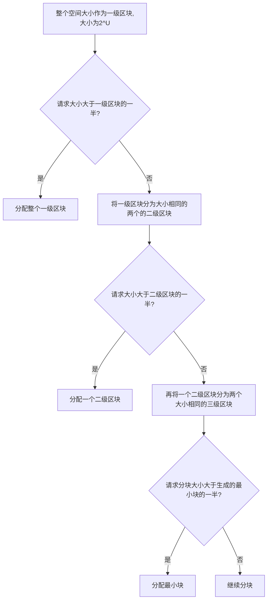
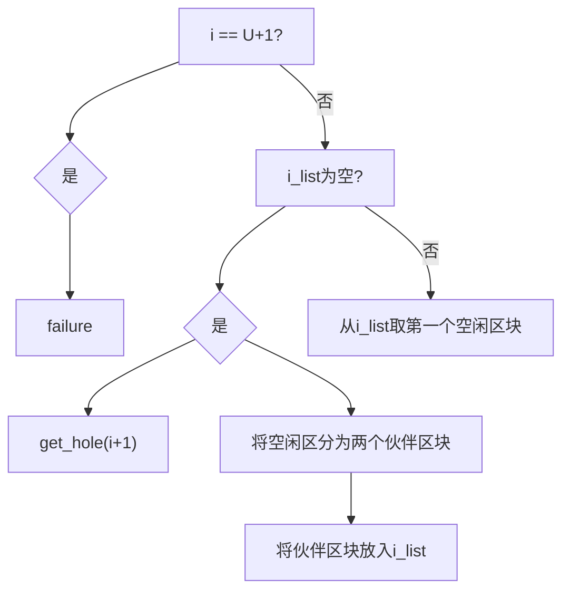
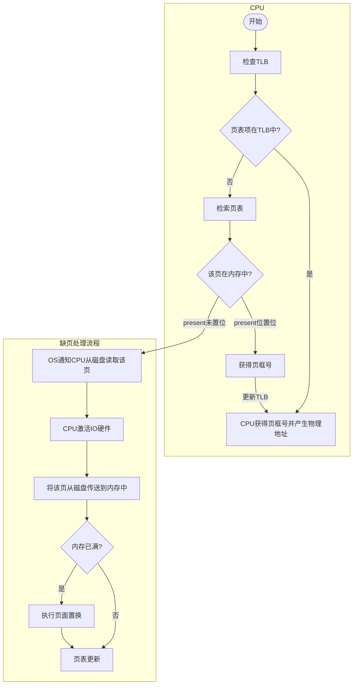
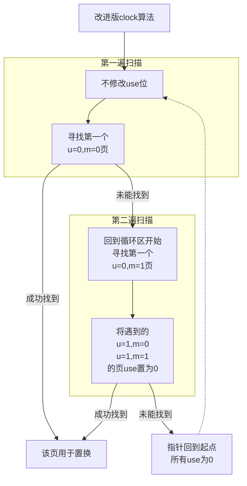

![[40-内存与虚存-mindmap-compressed.png]]
## 内存管理的需求
- **内存管理**：多道程序设计中，内存除了一部分供给 OS 使用（驻留监控程序、OS 内核等），还要进一步细分出“用户空间”供多进程的使用。“细分内存”这一任务由 OS 动态完成。
### 重定位
- 重定位技术的背景：
	1. 可用内存空间被==多个进程共享==；
	2. 程序员==事先不知道程序在运行期间会有哪些程序驻留在内存中，也不知道该把程序放在哪里==；
	3. 通过就绪进程池，将活动进程换入内存或阻塞进程换出内存，可以使处理器利用率最大化，但是==换入换出不能保证前后在内存中位置一致==

![[Pasted image 20230821123552.png]]

- 实现重定位需要了解哪些信息、需要哪些软硬件参与？
	- 根据进程映像的信息，可知 **OS 需要知道进程控制信息和运行栈的位置，以及进程开始执行的入口点**。
	- 因此**处理器硬件和 OS 软件必须能够将程序代码中的内存访问逻辑地址转换为实际的物理内存地址**，并反应程序在内存中的当前位置。

### 保护
- **内存保护**
	- ==用户进程不能访问 OS 的任何部分==；
	- 进程不能在未经授权时跳转到另一进程的指令，==不允许其他进程未经授权地访问==。

重定位技术导致进程在内存中位置不定，增大了进程保护的难度，即*进程保护不能通过编译时检查逻辑地址来解决*——**必须在运行时检查进程产生的所有内存访问，以确保进程只访问分配获得的自身内存空间**。

- 内存保护的实现
	- ==内存保护必须由处理器硬件实现==，而非操作系统满足。这是由于效率原因，OS 审查每个指令是否合法地访问内存，非常耗时。
	- ==处理器硬件主要是通过基址寄存器和界限寄存器来实现内存访问保护==的：
		1. 基址寄存器: 存储每个程序的逻辑地址空间的起始物理地址。
		2. 界限寄存器: 记录逻辑地址空间的大小, 即地址的上边界。
		3. 在地址转换时, CPU 会检查访问的逻辑地址是否在基址和界限寄存器规定的范围内。
		4. 如果逻辑地址超出了允许范围, 则触发内存访问异常, 由操作系统处理。
		5. 通过检查边界, 限制每个程序只能访问自己地址空间的数据, 实现访问保护。
		6. 操作系统可以灵活设置不同进程的基址和界限, 进行内存调度。
		7. 现代处理器将基址和界限放在了段描述符中, 采用段表来管理。

### 共享
内存管理系统
- 在不损害基本保护的前提下，必须允许**对内存共享区域进行受控访问**。

### 逻辑组织
- 计算机系统中==内存和外存都以一维的物理地址空间进行组织==，但程序本身的逻辑性是以模块组织的，
- 要想将程序的模块映射到计算机中的线性地址空间，可以采用**分段**技术。

### 物理组织
计算机存储分为内存和外存两级，因此 OS 需要关注内存和外存之间信息流的组织。

- **覆盖** *overlaying* 技术：
	- 程序和数据过大时，内存不足，这就产生不同模块被分配到同一内存区域的情况，因此 OS 需要在模块换入和换出时，覆写内存。

## 内存管理技术
1. Fixed Partitioning
	1. ==Description==: Main memory is divided into a number of static partitions at system generation time. A process may be loaded into a partition of equal or greater size.
	2. ==Strengths==: Simple to implement; little operating system overhead.
	3. ==Weaknesses==: Inefficient use of memory due to internal fragmentation; maximum number of active processes is fixed.
2. Dynamic Partitioning
	1. ==Description==: Partitions are created dynamically, so each process is loaded into a partition of exactly the same size as that process.
	2. ==Strengths==: No internal fragmentation; more efficient use of main memory.
	3. ==Weaknesses==: Inefficient use of processor due to the need for compaction to counter external fragmentation
3. Simple Paging
	1. ==Description==: Main memory is divided into a number of equal-size frames. Each process is divided into a number of equal-size pages of the same length as frames. A process is loaded by loading all of its pages into available, not necessarily contiguous, frames.
	2. ==Strengths==: No external fragmentation.
	3. ==Weaknesses==: A small amount of internal fragmentation.
4. Simple Segmentation
	1. ==Description==: Each process is divided into a number of segments. A process is loaded by loading all of its segments into dynamic partitions that need not be contiguous.
	2. ==Strengths==: No internal fragmentation; improved memory utilization and reduced overhead compared to dynamic partitioning.
	3. ==Weaknesses==: External fragmentation.
5. Virtual Memory Paging
	1. ==Description==: As with simple paging, except that it is not necessary to load all of the pages of a process. Nonresident pages that are needed are automatically brought in later.
	2. ==Strengths==: No external fragmentation; higher degree of multiprogramming; large virtual address space.
	3. ==Weaknesses==: Overhead of complex memory management.
6. Virtual Memory Segmentation
	1. ==Description==: As with simple segmentation, except that it is not necessary to load all of the segments of a process. Nonresident segments that are needed are automatically brought in later.
	2. ==Strengths==: No internal fragmentation, higher degree of multiprogramming; large virtual address space; protection and sharing support.
	3. ==Weaknesses==: Overhead of complex memory management.


1. 固定分区
   1. **描述**：主存储器在系统生成时被划分为若干静态分区。一个进程可以加载到大小相等或更大的分区中。
   2. **优势**：实现简单，操作系统开销小。
   3. **劣势**：由于内部碎片化，内存利用效率低；活动进程的最大数量是固定的。

2. 动态分区
   1. **描述**：分区是动态创建的，因此每个进程加载到与该进程完全相同大小的分区中。
   2. **优势**：没有内部碎片；主存储器利用更高效。
   3. **劣势**：由于需要压缩以解决外部碎片问题，处理器利用效率低。

3. 简单分页
   1. **描述**：主存储器被划分为若干大小相等的帧。每个进程被划分为与帧相同长度的若干大小相等的页面。通过将进程的所有页面加载到可用但不一定是连续的帧中来加载进程。
   2. **优势**：没有外部碎片。
   3. **劣势**：存在一小部分内部碎片。

4. 简单分段
   1. **描述**：每个进程被划分为若干段。通过将进程的所有段加载到不一定是连续的动态分区中来加载进程。
   2. **优势**：没有内部碎片；相比动态分区，内存利用和开销更低。
   3. **劣势**：存在外部碎片。

5. 虚拟内存分页
   1. **描述**：与简单分页类似，但不需要加载进程的所有页面。需要的非居住页面会自动后期加载。
   2. **优势**：没有外部碎片；更高的多道程序设计程度；大的虚拟地址空间。
   3. **劣势**：复杂内存管理的开销。

6. 虚拟内存分段
   1. **描述**：与简单分段类似，但不需要加载进程的所有段。需要的非居住段会自动后期加载。
   2. **优势**：没有内部碎片，更高的多道程序设计程度；大的虚拟地址空间；提供保护和共享支持。
   3. **劣势**：复杂内存管理的开销。

## 内存分区

### 固定分区
![[Pasted image 20230821140657.png]]

#### 大小相等的固定分区
- **弊端**：
	1. 程序太大而不能放到一个分区中。此时必须要用覆盖技术设计程序，任何时候只将需要用到的部分放入内存中，当需要部分不在内存时要装入、覆写；
	2. 内存利用率很低，即使小程序也要占用一整个分区。

- **放置策略**：
	- 只要存在可用分区，进程就装入空闲分区中。使用哪个分区效果都一样。
	- 若所有分区都被占用，则需要根据进程的调度策略换出进程。

#### 大小不等的分区
可以缓解 equal-sized partition 的两个缺点，但不能解决。

- **放置策略**：
	1. *将每个进程分配到能够容纳它的最小分区*；
		- 因此==每个分区都要维护一个调度队列==，用于保存从该分区换出的进程；
		- 优点是每个分区内部浪费的空间最少；
		- 缺点是可能造成有分区空闲，但因为没有满足该区域大小上下界的进程而继续空闲，浪费空间；
	2. *为所有进程只提供一个等待队列*，
		- 需要将进程装入内存时，选择可以容纳该进程的最小可用分区，
		- 若所有分区都被占用则必须进行交换。

![[Pasted image 20230821141645.png]]

#### 固定分区的优缺点
- 优点：实现简单，OS 软件的处理开销很小；
- 缺点：
	1. ==分区数量在系统生成阶段确定==，限制了系统中活动进程的数量；
	2. ==分区大小预先设置==，因此小作业不能有效利用分区空间，除非事先知道所有作业的内存需求。

### 动态分区
![[Pasted image 20230821143130.png]]
动态分区最初效果不错，但随着时间推移，==内存中形成了越来越多的内存碎片，内存利用率快速下降==。

- 为了克服外碎片，需要压缩技术 *compaction* ：
	- 操作系统不时移动进程，使进程占用的空间连续，并使所有空闲空间连成一片。

- **压缩的困难之处**：
	1. ==浪费大量处理器时间==，非常费时；
	2. ==需要动态重定位的能力==，即将程序从内存的一块区域移动到另一块区域，并且不会使程序中的内存访问无效。

由于压缩操作的高昂代价，OS 需要选择合适的放置策略，尽量减少外碎片的产生。由此有三种方法：
- **放置策略**：
	1. 最佳适配 Best-fit：选择与需求最接近的块；
	2. 首次适配 First-fit：从头开始扫描内存，选择第一个满足需求的可用块；
	3. 下次适配 Next-fit：从上一次放置的位置开始，找到第一个可用块；

![[Pasted image 20230821144307.png]]

- *有关放置策略的一般性结论*：
	1. 首次适配算法：最简单、最快、最好；
	2. 下次适配算法：差于首次适配，常在内存末尾分配空间，导致存储空间末尾的最大空闲存储块很快分裂为小碎片，因此需要多次压缩；
	3. 最佳适配：性能最差，不仅在查找时花费时间最多，而且会很快使内存中形成许多小到无法满足任何内存分配请求的小块，需要更频繁的压缩；

### 伙伴系统
- buddy system 中可用内存块的大小是 $2^K$ 个字，而分配的最小块尺寸为 $2^L$ 字，最大块尺寸（整个内存空间）为 $2^U$ 字。它们关系是 $L\le K\le U$。
- 策略：
	- 任何时候，伙伴系统为所有大小为 $2^i$ 的空闲区块维护一个列表，
	- 空闲区块可以通过对半分裂从第 $i-1$ 级列表中移出，并在第 $i$ 级列表中产生两个大小为 $2^i$ 的伙伴；
	- 当第 $i$ 级列表中的一对伙伴都空闲时，将它们从第 $i$ 级列表中移出，合并为第 $i-1$ 级列表中的一个块。
- 优点：
	- 克服了固定分区和可变分区方案的缺陷，在并行系统中有很多应用，是并行程序分配和释放内存的有效方法。
#### buddy system分块流程图



#### buddy system 查找空洞算法
请求一个大小为 k ($2^{i-1}<k\le 2^{i}$)的块时，从下列递归算法找到一个大小为 $2^i$ 的空洞：
```
void get_hole(int i){
 if (i == (U + 1)) <failure>; //判断不超过最大空间
 if (<i_list empty>) {
	 get_hole(i + 1);
	 <split hole into buddies>;
	 <put buddies on i_list>;
 }
 <take first hole on i_list>;
}
```


#### buddy system举例
![[Pasted image 20230821151546.png]]

![[Pasted image 20230821151632.png]]

### 重定位
- 几种地址的概念辨析：
	- ==逻辑地址==：与当前数据在内存中的物理分配地址无关的访问地址，在执行对内存的访问之前必须转换为物理地址；
	- ==相对地址==：逻辑地址的一个特例，是相对于某些已知点（程序开始点）的存储单元；
	- ==物理地址==或绝对地址：数据在内存中的实际位置；

- **静态重定位**： ^6b6500
	- 在*每个分块都有调度队列的固定分区方案*中，装入新进程后不论是否换出、换入，都使用同一分区。
	- 实现这一方案需要==简单重定位加载器==——首次加载一个进程时，代码中的相对内存访问被绝对内存地址代替，这个绝对地址由进程被加载到的基地址确定。

- **动态重定位**： ^f55749
	- *分块相等或只有一个公共调度队列的分块不等固定分区方案*中，进程在生命周期中可能占用不同的分区，进程访问的位置不固定。
	- 因此==需要运行时动态加载的方式==把使用相对地址的程序加载到内存，==被加载进程的所有内存访问都相对于程序的开始点==。因此需要有相对地址转换为物理内存地址的硬件机制。

![[Pasted image 20230821153503.png]]
- 基址寄存器与界限寄存器的作用：
	- ==基址寄存器==：存放程序在内存中的起始地址；
	- ==界限寄存器==：指明程序的终止位置；这两个信息存放在进程的 PCB 中，进程在执行时将 PCB 中这两则信息放入寄存器中；
	- 相对地址和基址相加得到的结果会与界限进行比较，越界会发出中断信号，不越界则正常查找；
	- 每个进程映像根据基址和界限寄存器的内容隔离，以免受到其他进程的越权访问，即**内存保护**。 ^55c770

## 简单分页
- 内存被划分为大小固定、相等的若干块，称为页框 frame；
- 每个进程也同样划分为若干同样大小的块，称为页 page。
- 简单分页类似于固定分区，但分块相当小，一个程序可以不连续地占用多个分区。

分页技术可以不产生外碎片，而只在每个进程的最后一页的最后部分形成内碎片。
![[Pasted image 20230821154335.png]]
可以看到 D 进程需要 5 个页框，而 e 状态没有一个空闲页框段可以满足，但是它被划分为两块分别存放。这是由于：
- OS 为每个进程维护一个页表 page table，==页表中的页表项给出了进程每页所在页框的位置==。

![[Pasted image 20230821155006.png]]

- 逻辑地址如何转换为物理地址？
	1. 程序中==每个逻辑地址包括一个页号和在该页中的偏移量==，
	2. 分页技术中，逻辑地址到物理地址的转换依然由处理器硬件完成，且处理器必须知道如何访问当前进程的页表。
	3. 给出逻辑地址后，根据页号、偏移量处理器使用页表可以查找、产生物理地址（页框号、偏移量）

![[Pasted image 20230821155316.png]]
- 分页地址转换示例
	- 16 bit 地址，页大小为 1 KB。相对地址 1502 的二进制为 0000010111011110，页大小 1 KB 代表偏移量需要占用 10 bit，则剩余 6 bit 表示页号，即一个程序最多 $2^6=64$ 页。
	- 通过简单分页的表示，可以看到相对地址 1502 映射到页 1 (000001) 的偏移量为 478 (0111011110)

- 分页逻辑地址的透明性：
	- ==逻辑地址方案对编程者、汇编器、链接器是透明的==，程序的每个逻辑地址与其相对地址一致，
	- 硬件实现运行时动态地址转换的效率高、可靠性高、也较为简单。

![[Pasted image 20230821160146.png]]


## 简单分段
- 特点（逻辑模块、外碎片、可见性）：
	- ==分段技术可以把程序和相关数据划分到一个段中==，段类似于页，但其内部有逻辑关系并自成模块。分段技术的逻辑地址也有两部分——段号和偏移量。
	- 简单分段类似于动态分区，同样一个程序可以占用不连续的多个分区。分段技术消除了内碎片，但会产生外碎片。
	- 分段对程序员是可见的，并且作为组织程序和数据的一种方便手段提供给程序员。==程序员利用编译器将程序和数据指定到不同的段==。

- 不便之处：
	1. 程序员必须知道段的最大长度限制；
	2. 逻辑地址和物理地址间不再简单对应，==系统需要维护一个内存中的空闲块列表，并为每个进程维护一个段表==。段表中的段表项给出相应段在内存中的起始地址、段长度。

![[Pasted image 20230821161256.png]]

与后文虚拟分页、分段、段页式的差别之处在于，**简单分页、分段一次性将进程所有内容都装入内存**。

## 虚拟内存

分页、分段技术有两个关键突破：1. 进程中所有内存访问都是逻辑地址，==逻辑地址在运行时由硬件动态地转换为物理地址==；2. 进程划分为若干块，==块可以离散地分布于内存中==，只需要利用页表或段表进行动态运行时地址转换。

- **虚存技术的特点**：
	1. ==驻留集思想==：
		- 进程执行中，不需要所有页或段都存在于内存，只要保存有待取下一条指令的块即可运行。
	2. ==部分装入==：
		- 在内存中可以保留更多的进程，因为每个进程都只装入其部分块，任何时刻都至少有一个进程处于就绪态；
	3. ==虚拟空间==：
		- 进程可以比内存的全部空间还大，而不必程序员手动通过覆盖技术分块过大的进程，这一切都由硬件和 OS 完成。
	4. ==实存虚存划分==：
		- 进程实际上是在内存中执行，这称为实存储器 real memory；==程序员感知到的是更大的内存空间，由内存和外存共同组成==，这称为虚存储器 virtual memory。
	5. ==支持更有效的系统并发度==，
		- 解除用户与内存之间没有必要的紧密约束。

进程在任何执行阶段都放在内存的部分称为进程的常驻集 resident set。进程执行时若所有访问都在常驻集，则程序顺利进行；若要访问一个不在内存中的块，则会产生缺页异常中断，OS 置其为阻塞态，等待 IO 操作将需要的页读入内存。

### 局部性原理
- 程序的空间局部性原理表明，
	- ==内存中装入过多的块实际上仍只有部分块得到利用，由此造成了内存的浪费==。
	- 因此进程只保留必要的块在内存中，发生缺页异常时再移入需要的块。

- 时间局部性与抖动：
	- ==有一个问题是在块被换出内存后，若短时间又需要使用它，就不得不换入，造成了大量处理器时间用于 IO，这称为抖动 thrashing==。
	- 因此 OS 需要抉择较好的置换策略，最好是基于最近的历史猜测将来可能用到的块。 ^18bf0a

- 虚存的基本支持原理就是局部性原理，要使虚存更加有效，需要：
	1. 必须有对所采用分页或分段方案的硬件支持；
	2. OS 必须有管理页或段在内存和辅存之间移动的软件支持；

### 虚拟分页
![[Pasted image 20230821171305.png]]
虚拟页表的虚拟地址和页表项内容。由于进程只有部分页在内存中，因此
- 页表项中需要的标记位：
	- 存在位 P (present)表明页是否在内存中，
	- 修改位 M (modified)表示页从上次装入内存到现在是否被修改过，若被修改过，则页换出时要用页框中的内容覆盖原页。

#### 页表结构
![[Pasted image 20230821171449.png]]

- 虚拟地址和物理地址结构：
	- 虚拟地址（逻辑地址）包含页号和偏移量，而物理地址由页框号和偏移量组成，因此需要使用页表实现页号到页框号的映射。
- 虚拟地址转换到物理地址：
	- 虚拟地址的页号与基址寄存器中的起始地址结合后，用于在页表中查找相应页框号，若页表项中显示页已存在于内存，则获得页框号，页框号将与偏移量组成实地址。
- 页表也服从虚拟分页管理：
	- ==使用单级页表时，当进程占用空间过大时，页表可能很长，因此页表也存放在虚存中，页表和其它页一样服从虚拟分页管理==。一个进程在执行中，其页表至少有一部分在内存中，其中包含正在运行页的页表项。

#### 多级页表
以二级页表为例讲解多级页表：通过页目录表管理页表，页目录表中的每个表项指向一个页表，页表中的表项指向内存中的页框。即若页目录中表项为 $X$ 条、页表中最大页表项为 $Y$ 条时，该进程最多有 $XY$ 页。

典型情况下，**一个页表的大小被限制为 1 页**。

![[Pasted image 20230821171650.png]]
- 该图中页大小为 $4 KB$（以字节编码，占用 12 位），则用户空间 $4 GB$ 需要 $4GB\div 4KB=2^{20}$ 页，
- 若创建页表映射这个空间，需要 $2^{20}$ 个页表项，每个页表项 $4B$，则需要 $4MB$ 的内存空间用于页表存储，相当于 $4MB/4KB=2^{10}$ 页，
- 由于 $2^{10}$ 页存储的页表过大，只需要一部分在内存即可，因此创建页目录表映射所有页表，而页目录表有大小限制为 1 页即 $4KB=2^{12}B$，因此页目录表的表项大小为 $2^{12}B\div 2^{10}=4B$；
- 由此可以知道，虚拟地址 32 位中，前 10 位用于检索页目录表，中间 10 位用于检索页表，最后 12 位是页中偏移量。 ^6d9569

![[Pasted image 20230821171716.png]]

#### 倒排页表
- 页表结构的缺点在于，
	- 页表大小与虚拟地址空间大小成正比，这将导致页表过大。

- 倒排页表技术策略：
	- 页表结构称为倒排的原因，在于使用页框号进行索引，而非虚拟页号。
	- ==使用散列函数将虚拟地址的页号部分映射到散列表中==，散列表包含指向倒排页表的指针，倒排页表中包含页表项用于查找页框。

- 倒排页表的优点和冲突处理：
	- ==不论有多少进程、支持多少虚拟页，页表都只需要实存中一个固定部分==。对于散列表中的==冲突，可以使用链地址技术管理==。

![[Pasted image 20230822141829.png]]
- 对于物理内存 $2^m$ 个页框的情况，==倒排页表项也是 $2^m$ 条，一一对应==；
- 页表项中包含：
	- *页号*——对应虚拟地址的页号部分，
	- *进程标志符*——使用该页的进程，页号和 PID 共同标志特定进程的虚拟地址空间的特定一页，
	- *控制位*：对页的标记，如有效、访问和修改、保护和锁定等
	- *链指针*：若某项没有链项，则该域为空，否则包含链中下一项的索引值（用于处理散列冲突）

![[Pasted image 20230821171952.png]]

#### 快表（转换检测缓冲区）
- 虚存访问的缺点：
	- 每次虚存访问都要经过——访问页表、访问页，这需要两步物理内存访问。
- 解决办法：
	- 使用特殊的高速缓存——转换检测缓冲区 (translation lookaside buffer)，俗称快表。

![[Pasted image 20230821172109.png]]
- 快表表项和使用
	- 快表包含最近用过的页表项，对于给定的虚拟地址，CPU 首先检查 TLB，若 TLB 中包含所需页表项，则直接得到页框号形成实地址；
	- 若 TLB 访问失败，则 CPU 检索页表，查找对应页表项，若对应页表项*存在位*置位，则获得页框号形成实地址，并更新 TLB 包含该新页表项；若页表项中*存在位*未置位，则发生缺页故障，硬件向 OS 发送缺页中断，调用 OS 装入所需页；


![[Pasted image 20230821172420.png]]
- TLB 具体细节
	- 由于 TLB 仅包含部分表项，因此 ==TLB 的表项必须包含页号和完整页表项==；
	- CPU 中==硬件机制允许同时查询多个 TLB 表项，这就是关联映射== associative mapping；
	- TLB 设计时==还需要考虑 TLB 中表项的组织方法，以及读取一个新项时置换哪一项==，这类似于 cache 设计策略；

![[Pasted image 20230822154428.png]]
- TLB、虚存、cache：
	- 虚存机制须与 cache 机制交互，首先内存系统查看 TLB 中是否存在匹配的页表项，若存在则组合页框号和偏移量形成实地址，若不存在则从页表读取页表项；
	- 产生由一个标记 tag 和其余部分组成的实地址后，查看 cache 中是否存在包含这个字的块，若有，则返回给 CPU；否则，从内存中检索；
##### 快表机制流程图



#### 页尺寸
- 页尺寸大小的影响：
	1. 内部碎片：页越小，==内部碎片的总量就越小，但同时导致页表越长，甚至可能产生两次缺页中断==——一次缺页表，一次缺页；
	2. 多数辅存设备的物理特性希望==页尺寸较大，从而使数据块传送更有效==；

![[Pasted image 20230821172708.png]]
1. **缺页率与页尺寸**：
	- 由于局部性原理，当页尺寸很小时，一段时间运行后内存中包含最近访问的部分，缺页率较低；
	- 尺寸增加时，每页包含的单元与任一最近访问过的单元越来越远，局部性原理被削弱，缺页率开始增加；
	- 尺寸足够大时，退化向固定分区，缺页率开始下降；
2. **缺页率与分配得到的页框数**： ^55cc15
	- ==内存中进程得到的页框数增加时，缺页率会先快后慢地下降==，因此分配给每个进程的内存总量影响着硬件设计页尺寸的决策（保持缺页率不超过 $W$ 对应的点，可使最大化利用内存）

- 页尺寸的设计问题和物理内存大小、程序设计技术有关：
	- ==内存增大时，应用程序可用地址空间相应增长，这可能导致局部性下降==，尤其在 TLB 大小给定时，因此需要采用更大的页；
	- ==现代程序设计鼓励小程序和数据模块，它们的引用短时间分布在较多对象中，并且多线程应用也会导致指令流分散和内存访问的突然变化==；

- TLB 性能瓶颈：
	- TLB 给定大小，在内存突然增大或局部性降低时，TLB 访问的命中率降低，这时 TLB 成为性能瓶颈，
- 解决办法是：
	- 增大 TLB，
	- 采用更大的页，但这又会导致性能下降，
	- ==采用多种页尺寸==，但这通常是硬件提供了能力，OS 却没有相应支持，要使 OS 支持多种页尺寸是一项复杂任务。

![[Pasted image 20230822160609.png]]

### 虚拟分段
- 段式结构相比页式结构有如下**优点**：
	1. ==简化了对不断增长的数据结构的处理==；（可扩展性强）
	2. ==允许程序独立地改变或重新编译==，而不要求整个程序集重新链接和重新加载；
	3. ==有助于进程间共享==：程序员可以在段中放置一个实用工具程序或一个有用的数据表，供其他进程访问；
	4. ==有助于保护==：<u>段被构造为包含明确定义的程序或数据集，能够方便地指定访问权限</u>；

![[Pasted image 20230821171332.png]]
- 段表项的标记位：
	- 除了包括标记位 P、M 及其它控制位，
	- 还需要段基址和段长度两块区域；

![[Pasted image 20230822161604.png]]
- 段表逻辑地址的转换：
	1. 基址寄存器保存段表的起始地址，
	2. 虚拟地址中的段号与基址结合后检索段表，
	3. 得到段长度（作为界限保护）和段基址；

### 段页式
- 段页式策略的思路、可见性：
	- 分页对程序员透明，消除了内存的外部碎片，更有效的使用内存，并且长度可预测，方便开发精致的内存管理算法；
	- 分段对程序员可见，能够处理不断增长的数据结构，也支持共享和保护；
	- 段页式结合了两者的优点，用户地址空间划分为若干段，每段划分为若干页，即每个进程使用一个段表和若干页表，每个进程段使用一个页表。

![[Pasted image 20230821171348.png]]
- 段页式逻辑地址在程序员和系统看来不同：
	- ==程序员看来逻辑地址由段号和段偏移量组成==，
	- ==系统看来段偏移量可以指定段中一个页号和页偏移量==。

![[Pasted image 20230822162857.png]]
- 段页式中段表项和页表项的标记位：
	- 段表项包含段长度、指向页表的基域，不包含修改位和存在位，但是可能包含共享和保护位；
	- ==页表项包含修改和存在位、页框号及其它控制位==；

### 保护和共享
- 分段可以控制访问长度，由此实现保护；
- ==共享段可能在多个进程的段表中引用，但是物理位置只需要一个段，不同段表中该共享段的逻辑地址可能不同==；

- 更高级的机制是环状保护结构——VAX/VMS 访问模型，
	- 其编号小的环拥有更高的特权，0 号环为 OS 内核函数保留，应用程序位于高层环。
	- 程序可以只访问驻留在同一个环或更低特权环中的数据，
	- 程序可以调用驻留在相同或更高特权环中的服务。

![[Pasted image 20230822163616.png]]

## OS 软件

OS 面临的多数内存管理问题都来自分页式，并且为了性能最佳——缺页中断发生频率最小，需要合理抉择策略。并不存在“银弹”能够完美解决所有内存管理问题和情形，对于小型机可以尝试根据当前系统的状态设置“看起来还行”的策略，对于大型系统则需要配备监视和控制工具，便于系统管理员根据系统状态调整 OS。

### 读取策略
决定何时将某页换入内存，有两种策略：
- **请求分页** demand paging：
	- ==只有当访问到某页中一个单元时才读入内存==。这将使进程首次启动时，短时间内出现大量缺页，随着时间增加局部性原理导致大多数访问的页已经存在于内存，缺页率降到很低；
- **预先分页** prepaging：
	- 利用磁盘设备的物理特性，如寻道时间和延迟，==读取连续的页到内存中==。但若局部性失效时，效率很低。
- 结合二者，可以在程序启动时采用预先分页，运行一段时间后采用请求分页。
- 预先分页与交换不同：
	- ==进程被阻塞而换出内存时，**所有驻留页**都会被换出==，而被唤醒时，以前所有在内存中的页都会重新读回内存。

### 放置策略
- 对于纯分段系统，无关紧要，最佳适配、首次适配都可以；
- 对于纯分页或段页式系统，也无所谓，
	- 因为地址转换硬件和内存访问硬件能够以相同的效率为任何页框组合执行相应功能。

但对于非一致存储访问多处理器 (NonUniform Memory Access Multi-processor)，其中==分布的共享内存可被任何处理器访问，但访问特定物理单元所需时间与处理器间的距离成正比==，因此这里的放置策略希望能够将页放置到能够提供最佳性能的内存（扩充举例，考研不考）。

### 置换策略
内存所有页框都满时，需要置换策略决定哪一个页被换出，通常都是基于过去的行为预测将来的行为。

- 锁定不予置换：
	- 注意当页被“锁定”——预留给 OS 内核或其它重要控制结构时，就不会被置换。锁定是通过每个页框关联一个“锁定位 lock”实现的。
#### OPT
- 原理：选择置换下次访问距离当前时间最长的页。
- 特点：OS 必须知道将来发生的事件，因此这只是一种衡量其它算法性能的标准，而不可能实现。
- OPT 导致的缺页中断最少。

![[Pasted image 20230823143657.png]]

>[! warning] 区分缺页与缺页异常
>- 页框空时自然缺少所需要的页，这里算作缺页，不是异常；
>- 页框满时，缺少需要的页，说明需要采取置换策略，称为缺页异常；
>- 重复对同一页的缺页请求，只算做一次缺页异常；
>- $缺页率=\frac{缺页异常数}{页面访问总次数}$

#### LRU
- 原理：
	- 置换内存中最长时间未被引用的页。==根据局部性原理，这是最近最不可能访问的页==。
- 性能接近 OPT 策略
- 实现较复杂，开销很大：有两种实现方式
	1. 为==每页添加一个最后访问的时间戳==，每次访问内存都要更新该时间戳（全部活动页）
	2. ==维护一个关于访问页的栈==: [[70-Beyond-physical-memory#**stack 方法**|stack方法]] 

#### FIFO
- 原理：
	- 将分配给进程的页框视为循环缓冲区，并按循环方式移动页。它只需要一个指针，该指针在进程的页框中循环；
- 实现简单，但性能较差：
	- ==尤其当需要访问的页的周期正好大于页框时，就会被反复换入换出==；

#### Clock
- 原理：
	- 为每个页框关联一个“使用位 use”，当页首次被装入内存或被访问时，use 置为 1，
	- 用于置换的候选页框集被视为一个循环缓冲区，有一个指针与之关联，当一页被置换时指针指向下一个页框，
	- 需要置换一页时，指针扫描循环缓冲区，==查找到 1 的页框则置为 0，找到 0 的页框则用于置换==；
- 特点：
	- 类似于 FIFO，但又结合了部分 LRU 的特点——最近访问过的页只是置为 0，而不被换出。

![[Pasted image 20230823145615.png]]
#### improved-Clock
- 原理：增加时钟算法中关于置换时考量的位数
	- 以“使用位 use”和“修改位 modified”为例，最近是否被访问和是否被修改可以有四种组合：(u=0, m=0), (u=1, m=0), (u=0, m=1), (u=1, m=1)
	- 因此扫描时置换顺序相应改变：
		1. 第一遍扫描过程中不修改 use 位，选择遇到的第一个 (u=0, m=0) 的页用于置换；
		2. 若 1 失败，则重新扫描查找 (u=0, m=1) 的页框，将遇到的第一个用于置换，扫描过程中将每个跳过的页框（指 (u=1, m=0), (u=1, m=1)这两种）的 use 置为 0；
		3. 若 2 失败，则指针回到最初位置，缓冲区中所有 use 位都是 0，重复第 1 步中的查找；

![[40-内存虚存-imp-clock.gif]]

##### improved-Clock 流程图


#### 性能比较
![[Pasted image 20230823145857.png]]

结合分配页框数与缺页率的图像：
![[Pasted image 20230823150210.png]]

因此维持缺页率较低、分配页框数较少的综合考量是比较好的选择。

#### LFU
Least Frequently Used.

- 原理：==置换访问次数最少==的页面；
- 实现：每个页面设置一个访问计数，访问页面时该计数➕1，缺页时置换计数最小的页面；
- 特点：
	- 开销大，需要修改访问页、遍历所有页；
	- ==一开始频繁使用，而后面使用较少的页面难以置换出去==，改进办法是计数定期减少；
- 与 LRU 区别：
	- LRU 关注多久未访问，时间越短越好；LFU 关注访问次数，次数越多越好；

#### 页缓冲
- 原理：
	- VAX/VMS 系统的页面置换算法是 FIFO，但==换出的页并不直接丢弃，而是分配到两个链表中：
	- 若页被修改过，则分配到修改页链表；
	- 若未被修改过，则分配到空闲页链表。
	- ==页在内存中并不物理性地移动，而是**只移动对应的页表项到空闲页链表或修改页链表中**==。
- 空闲页链表与修改页链表具体操作：
	- 空闲页链表含有可以读取页的一系列页框，VMS 在任何时刻保留一小部分空闲块。
	- ==需要读入一页时使用居于空闲页链表头部的页框，换出原本在那个位置的页==；
	- 未被修改过的页被置换时，仍在内存中，只是页框被添加到空闲页链表的尾部。
	- 修改过的页被写出和置换时，其页框被添加到修改页链表的尾部。
- 特点：
	- 被置换的页仍在内存中，进程访问时==可以快速返回该进程的驻留集==。
	- ==空闲页链表和修改页链表充当缓存的角色==；
	- 修改页链表中的页按簇写回，这是应用了局部性原理

![[Pasted image 20230823162110.png]]

![[Pasted image 20230823161914.png]]

#### Belady 现象
- 现象：
	- 采用 FIFO 等算法时，==出现分配的物理页面数量增加，缺页次数反而升高的异常现象==；
- 原因：
	- FIFO 算法的==置换特征与进程访问内存的动态特征矛盾==；
	- 被置换出去的页面不一定是近期不会访问的页面；
- 哪些置换算法没有 Belady 现象？
	- OPT LRU LFU（不清空计数版——所谓清空计数，指的是页面换出时清空 reference counts）
	- 清空计数的 LFU 是可能出现 Belady 现象的：
		- ![[40-内存与虚存-LFU-clear-counts.png]]
		- 清空计数 LFU 之所以 belady，是因为表面上页帧数增加了，但只要换出页后被清空，它再换回时实际可用的页帧数反而减小了，因为其它页的计数都比它大。只有运行一段时间并且使得换回页的计数超过一些其它页的计数，才不会发生抖动。所以这种连续换出换入同一个页的情况，就会 belady。

- Clock 算法为什么有 Belady 现象？ ^e36fc3
	- 这是因为 "Clock" 算法的策略是按照页面的访问位进行置换，
	- 当物理内存增加时，原本可能因为访问位被标记为未访问而被置换出去的页面，现在有了更多的物理内存可以使用而被保留在内存中，导致更多的缺页中断。

### 驻留集管理
#### 驻留集大小
- 设置驻留集大小时有三个事实需要考虑：
	1. 分配给一个进程的内存越少，驻留在内存中的进程数就越多, 就绪进程队列就越长，CPU 用于进程交换的时间就越少；
	2. 进程在内存中获得页框数越少，缺页率就越高；
	3. 而由于局部性原理，==分配页框数超过一定量时，缺页率没有明显变化==；

- 因此分配策略自然有两种：
	- 固定分配策略
	- 可变分配策略：
		- 缺页率高时多分配一些页框，缺页率低时减少一些分配的页框。缺点是需要 OS 评估进程的行为和状态，开销较大；

#### 置换范围
- **局部置换策略**：
	- 置换目标仅在当前产生缺页的进程的驻留页中选择

- **全局置换策略**：
	- 内存中所有未被锁定的页都是置换时的候选页；
	- 优点：实现简单，开销较小

|          | 局部置换                           | 全局置换                                                         |
| -------- | ---------------------------------- | ---------------------------------------------------------------- |
| 固定分配 | 从分配给进程的固定数量页框中置换   | 无                                                               |
| 可变分配 | 从分配给进程的动态工作集页框中置换 | 从内存中所有可用页框中选择被置换页，会导致进程驻留集大小不断变化 |

- *固定分配、局部置换*：缺页中断时，OS 从当前进程的驻留页中选择一页用于置换；
- *可变分配、全局置换*：缺页中断时，==OS 会将置换后的页框添加到缺页进程的驻留集中，导致其驻留集变大==；
	- 难点在于置换页的选择，没有空闲页时进行置换，必然会导致其他进程的驻留页减少，这<u>会影响其它进程的缺页率</u>；
	- <u>解决性能问题的一个选择是页缓冲策略</u>；
- *可变分配，局部置换*：==试图克服全局置换策略的问题==：
	- 新进程进入内存时，分配一定数量的页框作为驻留集，使用预先分页或请求分页填满；
	- 发生缺页中断时，从产生缺页中断的进程驻留集中选择一页用于置换；
	- 不断评估进程的页框分配情况，增加或减少分配的页框，以提高整体性能；
	- ==关键在于驻留集大小的确定原则和变化的时间安排==，好的办法就是**工作集策略**。

#### 工作集策略
- 工作集表示为 
$$
W(t,\Delta)
$$
	- $t$ 表示==虚拟时间（时刻）==，
	- $\Delta$ 表示考量的过去虚拟时间单位的数量，作为==虚拟时间窗口==，
	- ==函数结果是==该虚拟时间段内被访问到的==页集==（元素唯一性）

*虚拟时间定义*：内存访问具有先后顺序，以 $r(1),r(2),...,r(i)$ 表示进程第 i 次访问内存产生的页，其中 i 就是进程内部虚拟时间。

![[Pasted image 20230823173657.png]]

- *工作集大小*
	- 是关于虚拟时间窗口 $\Delta$ 的一个==非减函数==，即 $W(t,\Delta+1)\supseteq W(t,\Delta)$ 
	- 若以 $|W(t,\Delta)|=n$ 表示工作集大小为 n 页，则有 $1\le|W(t,\Delta)|\le min(\Delta,N)$，表示==工作集最小为 1 个页面，最大为进程的所有页面==；

![[Pasted image 20230823173730.png]]
- 工作集变化趋势：
	- $\Delta$ 固定时，工作集大小会随时间不断变化，并==在局部时间内趋于稳定，**瞬变表明进程进入了一个新的局部==**；

- **如何利用工作集指导驻留集大小？**
	- 监视每个进程的工作集，
	- ==周期性从进程的驻留集中移出不在工作集中的页==，类似于 LRU 策略，
	- ==只有当进程的工作集都在内存中时，才执行进程==（避免出现缺页中断，I/O 代价过于高昂）；

- **工作集策略存在的问题**：
	- *过去并不总能预测未来*，尤其是到达新的局部时；
	- 为每个进程真实测量工作集是*不切实际*的，因为需要为每个进程的每次页访问都使用虚拟时间作标记，每个进程都要维护基于时间顺序的页序列；
	- $\Delta$ 的值未知，且不同情况下大小也不同；

- **如何使用工作集的思想？**——考虑进程缺页率
	- ==不要局限于精确的页访问，而是考量进程的缺页率==。通过监视进程的缺页率，可以考量驻留集的大小是否足够工作集使用；(思考这个图：[[40-内存与虚存#^55cc15|页框分配数与缺页率的关系图]])
	- 若进程的缺页率低于最小阈值，则可以减小其驻留集而不致缺页率大幅提高；
	- 若进程缺页率高于最大阈值，则应当增大进程的驻留集，注意不要过于影响系统的性能；

#### 缺页中断频率算法 PFF
PFF 算法：Page Fault Frequency Algo

- 思路：
	- 要求内存中每页都有“使用位 use”，页面被访问时置为 1；==发生缺页中断时，OS 记录上次缺页到现在的虚拟时间==，通过维护页访问计数器实现；
	- 定义阈值 F，若从上次缺页到现在缺页的时间间隔小于 F，则将该页添加到驻留集中 (说明缺页频发)；
	- 否则淘汰所有 use 为 0 的页，减小驻留集大小，同时其余页的 use 都置为 0 (说明缺页不频繁)；
	- 改进可以是使用两个阈值，$F_{min}$ 和 $F_{max}$；
- 分析：**缺页中断发生的时间间隔与缺页率成反比**。采用页缓冲补充 PFF 时性能会相当不错；
- 缺点（考虑局部性过渡阶段）：
	- 在==转移到新的局部性阶段时，过渡过程中的执行效果不好==——只有<u>上次访问开始经过 F 单位时间后还未被访问的页才会从驻留集中淘汰</u>，
	- 而在局部性过渡期间==快速而连续的缺页中断会导致该进程的驻留集在旧局部性中的页被淘汰前快速膨胀==；

#### 可变采样间隔的工作集 VSWS
Variable-internal Sampled Working Set

- 思路：**根据经过的虚拟时间在采样实例中评估一个进程的工作集**；
	- 采样开始处，进程所有驻留页的 use 位重置为 0，
	- 采样末尾处，==只有采样区间内被访问过的页才设置它们的使用位，这些页保留在驻留集中，未被访问页则淘汰出驻留集==，
	- ==驻留集的大小只在采样区间的末尾处减小==，==采样区间内每个缺页中断都会被添加到驻留集==，因此采样区间内驻留集保持非减；
- VSWS 策略由三个参数驱动：
	- $M$ 采样区间的最大宽度，$L$ 采样区间的最小宽度，$Q$ 采样实例间允许发生的缺页中断数量
- 详细描述：
	1. 若从上次采样至今的时间单位达到 $L$，则挂起该进程并扫描使用位；
	2. 若在 $L$ 虚拟时间间隔内，发生了 $Q$ 次缺页中断：
		a. 若从上次采样到现在时间间隔小于 $M$，则等待直到虚拟时间到达 $M$ 时挂起进程并扫描 use 位；
		b. 若时间间隔大于 $M$，则直接挂起并扫描 use 位；
- 特点：
	- 选择==合适的参数值，使上次扫描后发生第 $Q$ 次缺页中断时能正确地激活采样==（情况 2b），$L$ 和 $M$ 提供边界保护。
	- ==VSWS 通过增加采样频率，减少突然的局部性过渡所引发的内存请求高峰，进而在缺页中断速度增加时，减少未使用页淘汰出驻留集的速度==。
	- 实现起来和 PFF 一样简单，并且更加有效；

### 清除策略
用于确定何时将已修改的页写回辅存。

- **请求式清除**：demand cleaning
	- 只有==页被用于置换时才被写回辅存==；
	- 写回旧页与换入新页是成对出现的，且写回在读入之前。但==意味着发生缺页中断的进程在解除阻塞之前必须等待两次页传送==（I/O 的代价极大）

- **预约式清除**：precleaning
	- ==将已修改的多页在需要使用它们占据的页框之前成批地写回辅存==；
	- 缺陷：写回辅存的一页可能仍然留在内存中(写回也需要时间)，直到页面置换算法选中并换出，若在此期间又被修改，则之前的写回没有意义；

- **改进**：==结合页缓冲策略==
	- 只清除可用于置换的页，但去除清除和置换之间的成对关系；
	- 修改表中的页可以周期性地成批写出，再转移至未修改表；
	- 未修改表中的页要么因为被访问到而回收，要么在页框被分配给另一页时被淘汰；

### 加载控制
- 含义：
	- ==指限制驻留在内存中的进程数量，这个指标是系统并发度==；
- 驻留进程数量的影响：
	- 驻留进程太少时，所有进程都处于阻塞态的概率较大，会有大量时间花费在进程交换的 IO 上；
	- 驻留进程太多时，缺页率快速上升，导致系统抖动；

![[Pasted image 20230823185748.png]]

- **抖动解决办法**： ^668f31 ^c1a7bf
	1. ==工作集策略、PFF 算法都隐含了加载控制——只允许执行那些驻留集足够大的进程==；
	2. $L=S$ 准则：通过调整系统并发度，==使缺页中断之间的平均时间等于一次缺页中断处理所需的平均时间，即 50%准则==，使分页设备的利用率保持在 50%，这样 CPU 的利用率可以达到最大
	3. ==采用 Clock 算法==，在全局范围内监视扫描页框的指针循环通过缓冲区的速度。
		1. *当速度低于某个最小阈值时*，表明：
			- 很少发生缺页中断，因此很少需要请求指针前进，
			- 对每个请求指针扫描的平均页框数很小，表明有很多驻留页为被访问，处于闲置状态，因此系统并发度可以安全地增加；
		2. 当*速度高于某个最大阈值时*，表明要么缺页率很高，要么很难找到可置换页（所有页都在被使用），说明系统并发度太高，需要降低；

- **进程挂起的可能选择**：
	1. 最低优先级进程
	2. 缺页中断进程
	3. 最后一个被激活的进程
	4. 驻留集最小的进程
	5. 最大空间的进程
	6. 具有最大剩余窗口的进程