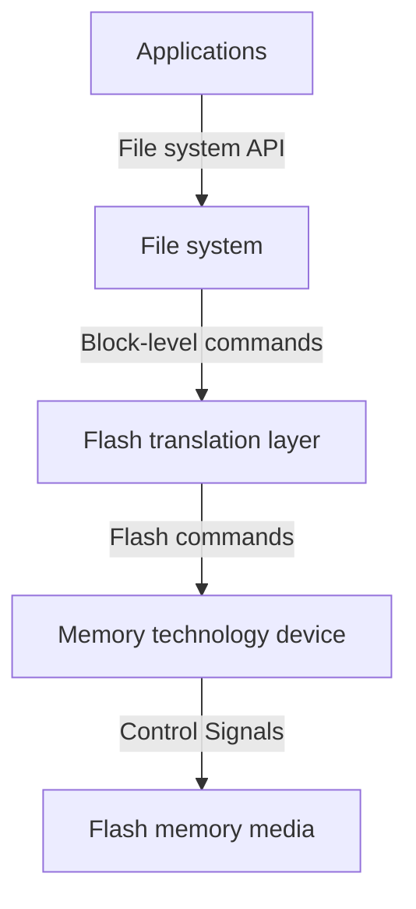

![[62-SSD-mindmap.png]]
## Introduction
SSD 是一种非易失性存储设备，代表固态驱动器，可以使用传统硬盘驱动器（HDD）的 SATA 和 SAS 等协议。新的外形规格（如 M.2 外形）和新的 I/O 协议（如 NVM Express）已被开发出来，以满足 SSD 中使用的闪存技术的特定要求。

### What is SSD？
**固态硬盘 （SSD）** 是一种固态存储设备，它使用集成电路组件作为内存来存储数据, 没有物理磁盘（指旋转的以磁性方向做记录的盘）。  
SSD 中==没有移动的机械组件==。这使得它们不同于传统的机电驱动器，如硬盘驱动器（HDD）或软盘，后者包含可移动的读/写磁头和旋转磁盘。与机电设备相比，SSD 通常更能抵抗物理冲击、静默运行、访问时间更快、延迟更低。随着时间的推移，SSD 的价格持续下降。

在 2017 年，大多数 SSD 使用基于 3D TLC NAND 的闪存。它是一种==**非易失性**==存储器，即使在断电时也能保留数据。SSD 可以从随机存取存储器 （RAM） 构建，用于需要快速访问但不一定在断电后保持数据持久性的应用。电池可以用作此类设备中的集成电源，以便在外部电源丢失后将数据保留一定时间。

SSD 将数据存储在电荷中，如果没有电源，电荷会随着时间的推移而缓慢泄漏。这就是为什么 SSD 不适合存档目的的原因，因为磨损的驱动器（已超过其耐用性等级）通常在存储一年（如果在 30°C 下存储）到两年（在 25°C 下）后开始丢失数据。

混合驱动器或固态混合驱动器 （SSHD） 包含一个大型硬盘驱动器和一个 SSD 缓存，以提高经常访问的数据的性能。Apple 的 Fusion Drive 在同一单元中结合了 SSD 和 HDD 的功能，可以被视为混合驱动器的一个例子。

### Features
- **更快的读/写速度：** 
	- SSD 的读写速度明显快于使用旋转磁盘和机械读/写磁头的传统硬盘驱动器 （HDD）。这意味着更快的启动时间、应用程序加载时间和整体系统性能。
- **低功耗：** 
	- SSD 比 HDD 消耗更少的功率，使其成为笔记本电脑、平板电脑和其他依赖电池供电的移动设备的理想选择。
- **无移动部件：** 
	- 与具有旋转磁盘和机械读/写磁头的 HDD 不同，SSD 没有移动部件。这使得它们更能抵抗冲击和振动，并且不易发生机械故障。
- **更高的可靠性：** 
	- 由于 SSD 没有移动部件，因此它们通常比易受机械磨损影响的 HDD 更可靠。由于读/写错误，SSD 的数据丢失率也较低。
- **更低的噪音和发热：** 
	- SSD 产生的噪音和热量比 HDD 少，非常适合在安静的环境或冷却有限的系统中使用。
- **更高的每 GB 成本**：
	- 按每 GB 成本计算，SSD 通常比 HDD 贵，尽管近年来价格有所下降。这使得 SSD 在需要大量存储的系统中使用不太实用。(2023 考古，现在长存的 SSD 每 GB 成本低于 HDD)
- **有限的写入耐久性：** 
	- 在基于 NAND 的闪存单元降级之前，SSD 的写入周期数有限。但是，现代 SSD 使用磨损均衡和过度配置等技术来延长驱动器的使用寿命。

### SSD vs. HDD
| 参数     | HDD                              | SSD                                                                             |
| -------- | -------------------------------- | ------------------------------------------------------------------------------------ |
| 长期储存 | HDD 对于长期存储更可靠。         | SSD 对于长期存储的可靠性相对较低，因为如果长时间不通电超过一年，可能会发生数据泄漏。 |
| 访问速度 | 与 SSD 相比，数据访问速度较慢。    | 与 HDD 相比，数据访问速度要高得多。                                                    |
| 性能     | 性能因碎片化而受到影响。         | 性能不会因为碎片而受到影响。                                                         |
| 适用于   | 硬盘适用于: 大容量存储、长期储存 | 固态硬盘适用于：快速数据检索、笔记本电脑或台式机，因为低功耗和尺寸低。               |

### Structure
只是为了提高容量、存取性能，SSD 提供了多个闪存芯片以及闪存翻译层：
![[62-SSD-structure.png]]
- ==闪存芯片==代替传统旋转磁盘中的机械驱动器，
- ==闪存翻译层==将来自 CPU 的逻辑块读写请求翻译成对底层物理设备的读写控制信号，扮演磁盘控制器的角色；

![[62-SSD-arch.png]]
- 闪存存储阵列中，Die 就是晶片——最大的一个物理结构：每个 NAND 闪存芯片通常由多个 "die" 组成，每个 "die" 包含多个 NAND 存储块和相应的控制逻辑。每个 "die" 都可以独立操作，但它们通常协同工作以提供更大的存储容量和更好的性能

![[62-SSD-die.png]]

- Die 接下来会分块，块内分页和有各自的寄存器，页是读写的基本单位；
- SSD 的随机写较慢，主要原因在于擦除块较慢。写操作若试图修改已有数据的页 Pi，那这个块中所有含有用数据的页都必须复制到另一个新块中，之后才能进行对页 Pi 的写操作。

>[! info] What is 0-die problem?
>"0-die" 问题是一个与 SSD 的性能和可用性有关的概念，通常涉及到 RAID（冗余磁盘阵列）配置。在某些 RAID 配置中，如果系统中的所有 SSD 都失效，或者其中一个 "die" 失效，那么整个 RAID 组可能会无法正常工作。这被称为 "0-die" 问题，因为在这种情况下，整个存储系统的可用性降为零。
>
>为了解决 "0-die" 问题，一些 RAID 配置需要至少一个冗余 "die"，这意味着即使一个 "die" 失效，仍然可以继续运行。这可以通过使用不同级别的 RAID（如 RAID 1、RAID 5 或 RAID 6）来实现，这些级别提供了不同程度的冗余性，以保护数据免受 "0-die" 问题的影响。

## OS Operate flow

## Flash translation layer
![[62-SSD-FTL.png]]
提供的功能：
- 逻辑到物理的地址映射
- 垃圾回收：
	- 确保在 SSD 中释放被删除或标记为无效的数据块。这些已删除的数据块中可能包含坏块或高度耗损的存储单元。垃圾回收会擦除这些块，将它们恢复为可用状态，从而减少存储单元的不均匀耗损。
- 掉电保护和数据恢复
- 坏块管理
- 磨损均衡
- 错误校验码

更详细的内容，可以参考：[PPT - Flash Translation Layer (FTL)](https://www.slideserve.com/azura/flash-translation-layer-ftl)

## Scheduling algo
SSD 没有物理磁头，且本身随机读的速度相当快，因此
- 直接采用 FCFS 进行 I/O 请求的调度。

## Wear Leveling
固态硬盘的闪存擦写寿命有限，通常是几百次到几千次。如果读写数据集中在 SSD 的一部分闪存，那么这部分闪存的寿命损耗会特别快，而部分闪存的损坏会导致整块 SSD 性能大幅下降或直接损坏，因此使得磨损均衡是有效提升 SSD 使用寿命的合适手段。
### 动态磨损均衡
写入数据时，自动选择较新的闪存块。
### 静态磨损均衡
在没有数据写入时，SSD 检测并自动进行数据分配，让老的闪存块承担无需数据覆写的存储任务，同时给新的闪存块让出空间。

相对而言，静态磨损均衡更佳。