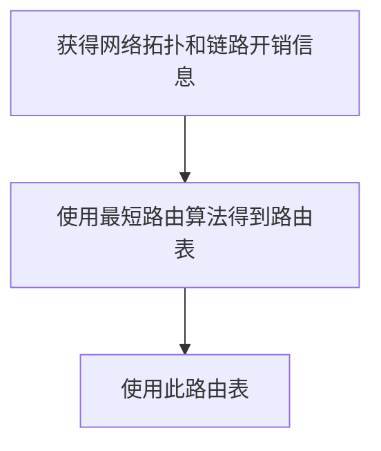
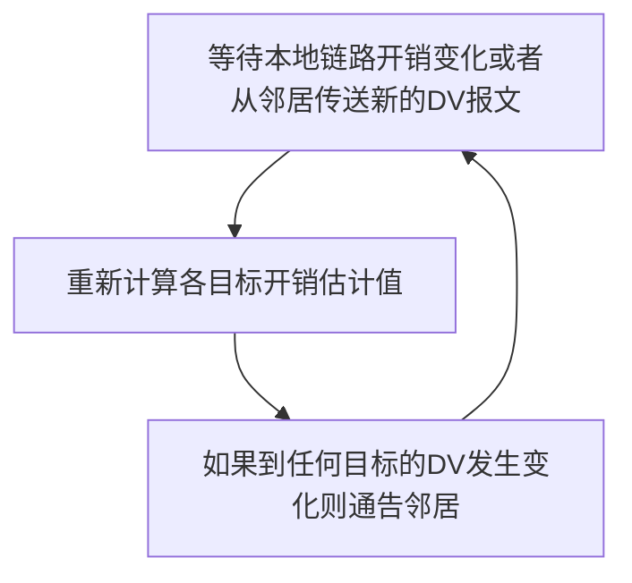

## 5.1 概述
### 控制平面介绍
控制平面的作用，就是对路由器的转发表/流表进行计算、维护、安装等操作。根据上一章的讲解，了解到有两种路由控制策略：

![[50-Network-layer-control-plane-perrouter-control.png]]
- ***Per-router control***. Figure 5.1 illustrates the case ==where a routing algorithm runs in each and every router; both a forwarding and a routing function are contained within each router==. Each router has a routing component that communicates with the routing components in other routers to compute the values for its forwarding table. This per-router control approach has been used in the Internet for decades. The OSPF and BGP protocols that we’ll study in Sections 5.3 and 5.4 are based on this per-router approach to control.
> 每一台路由器都运行路由选择算法（OSPF、BGP 等），每台路由器都包含转发和路由选择功能。
> 
> 每台路由器都由一个路由选择组件，用于与其它路由器中的路由选择组件通信，以计算其转发表的值。

![[50-Network-layer-control-plane-logically-centralized-control.png]]
- ***Logically centralized control***. Figure 5.2 illustrates the case in which ==a logically centralized controller computes and distributes the forwarding tables to be used by each and every router==. As we saw in Sections 4.4 and 4.5, the generalized match-plus-action abstraction allows the router to perform traditional IP forwarding as well as a rich set of other functions (load sharing, firewalling, and NAT) that had been previously implemented in separate middleboxes.
- The controller interacts with a control agent (CA) in each of the routers via a well-defined protocol to configure and manage that router’s flow table. Typically, the CA has minimum functionality; its job is to communicate with the controller, and to do as the controller commands. Unlike the routing algorithms in Figure 5.1, the CAs do not directly interact with each other nor do they actively take part in computing the forwarding table. This is a key distinction between per-router control and logically centralized control
> 控制协议与路由器中的控制代理进行交互，以配置和管理该路由器的流表。控制代理 CA 功能很少，只需与控制器通信并按命行事，CA 不能互相直接地交互、也不能主动参与计算流表。

### 路由
- 路由(route)：按照某种指标（传输延迟，所经过的站点数目等）找到一条从源节点到目标节点的较好路径
    - 较好路径：按照某种指标较小的路径
    - 指标：站数，延迟，费用，队列长度等，或者是一些单纯指标的加权平均
    - 采用什么样的指标，表示网络使用者希望网络在什么方面表现突出，什么指标网络使用者比较重视
- 以网络为单位（子网到子网）进行路由（路由信息通告+路由计算），而非主机到主机（主机到主机的路由规模比子网到子网大2-3个数量级）
    - 网络为单位进行路由，路由信息传输、计算和匹配的开销低
    - 前提条件是：一个网络所有节点地址前缀相同，且物理上聚集
    - **路由就是：计算网络到其他网络如何走的问题**
- 网络到网络的路由 = 路由器-路由器之间路由
    - 网络对应的路由器到其他网络对应的路由器的路由
    - 在一个网络中：路由器-主机之间的通信，链路层解决
    - 到了这个路由器就是到了这个网络
- 路由选择算法(routing algorithm)：网络层软件的一部分，完成路由功能

## 5.2 路由选择算法

### 网络的拓扑图抽象
![[50-Network-layer-control-plane-abstract-graph-network.png]]
- Graph $G = (N, E)$ is a set N of nodes and a collection E of edges, where each edge is a pair of nodes from N.
- In the context of network-layer routing, the ==nodes in the graph represent routers==—the points at which packet-forwarding decisions are made—
- and the ==edges connecting these nodes represent the physical links== between these routers.


边和路径的开销：
- For our purposes, we’ll simply take the edge costs as a given and won’t worry about how they are determined. For any edge (x, y) in E, we denote c (x, y) as the cost of the edge between nodes *x* and y. If the pair (x, y) does not belong to E, we set c (x, y) = ∞.
- Also, we’ll only consider undirected graphs in our discussion here, so that edge (x, y) is the same as edge (y, x) and that c (x, y) = c (y, x); however, the algorithms we’ll study can be easily extended to the case of directed links with a different cost in each direction.
- Also, a node *y* is said to be a ***neighbor*** of node *x* if (x, y) belongs to E.

网络拓扑图中的路径及路径开销：
- a path in a graph G = (N, E) is a sequence of nodes (x1, x2, g, xp) such that each of the pairs (x1, x2), (x2, x3), g, (xp-1, xp) are edges in E.
- The cost of a path (x1, x2, g, xp) is simply the sum of all the edge costs along the path, that is, c (x1, x2) + c (x2, x3) + g+ c (xp-1, xp). Given any two nodes *x* and y, there are typically many paths between the two nodes, with each path having a cost. One or more of these paths is a ***least-cost path***.
- $$ \text{Cost of path } (x_1, x_2, x_3, ... , x_p) = c(x_1, x_2) + c(x_2, x_3) + ... + c(x_{p-1}, x_p) $$
### 路由算法的目标与原则

路由算法的天然目标就是寻找最低开销路径：
- The least-cost problem is therefore clear: Find a path between the source and destination that has least cost.
- In Figure 5.3, for example, the least-cost path between source node u and destination node w is (u, x, y, w) with a path cost of 3.
- Note that if all edges in the graph have the same cost, the least-cost path is also the shortest path (that is, the path with the smallest number of links between the source and the destination).

最优化原则 (optimality principle)
- 汇集树 (sink tree)
    - 此节点到所有其它节点的最优路径形成的树——数据结构里的SPT
    - 路由选择算法就是为所有路由器找到并使用汇集树（最短路径树）

路由选择算法的原则
- 正确性 (correctness)：算法必须是正确的和完整的，使分组一站一站接力，正确发向目标站；完整：目标所有的站地址，在路由表中都能找到相应的表项；没有处理不了的目标站地址；
- 简单性 (simplicity)：算法在计算机上应简单：最优但复杂的算法，时间上延迟很大，不实用，不应为了获取路由信息增加很多的通信量；
- 健壮性 (robustness)：算法应能适应通信量和网络拓扑的变化：通信量变化，网络拓扑的变化算法能很快适应；不向很拥挤的链路发数据，不向断了的链路发送数据；
- 稳定性 (stability)：产生的路由不应该摇摆
- 公平性 (fairness)：对每一个站点都公平
- 最优性 (optimality)：某一个指标的最优，时间上，费用上，等指标，或综合指标；实际上，获取最优的结果开销较高，可以是次优的

### 路由算法的分类

- 全局或者局部路由信息？
    - 全局：集中式路由选择算法
        - 所有的路由器拥有完整的拓扑和边的开销的信息（上帝视角）
        - A ***centralized routing algorithm*** computes the least-cost path between a source and destination using complete, global knowledge about the network. That is, the algorithm takes the connectivity between all nodes and all link costs as inputs. ==This then requires that the algorithm somehow obtain this information before actually performing the calculation==. The calculation itself can be run at one site (e.g., a logically centralized controller as in Figure 5.2) or could be replicated in the routing component of each and every router (e.g., as in Figure 5.1). ==The key distinguishing== feature here, however, ==is that the algorithm has complete information about connectivity and link costs==. 
        - Algorithms with global state information are often referred to as ***link-state*** (LS) algorithms, since the algorithm must be aware of the cost of each link in the network. We’ll study LS algorithms in Section 5.2.1.
    - 分布式：分散式路由选择算法
        - 路由器只知道与它有物理连接关系的邻居路由器，和到相应邻居路由器的开销
        - 迭代地与邻居交换路由信息、计算路由信息
        - In a ***decentralized routing algorithm***, the calculation of the least-cost path is carried out in an iterative, distributed manner by the routers. ==No node has complete information about the costs of all network links. Instead, each node begins with only the knowledge of the costs of its own directly attached links==. Then, through an iterative process of calculation and exchange of information with its neighboring nodes, a node gradually calculates the least-cost path to a destination or set of destinations.
        - The decentralized routing algorithm we’ll study below in Section 5.2.2 is called a ***distance-vector*** (DV) algorithm, because ==each node maintains a vector of estimates of the costs (distances) to all other nodes in the network==. 
        - Such decentralized algorithms, with interactive message exchange between neighboring routers is perhaps ==more naturally suited to control planes where the routers interact directly with each other==, as in Figure 5.1.

- 静态或者动态的？
    - 静态：
        - 路由随时间变化缓慢
        - 人工手动调整
        - 非自适应算法 (non-adaptive algorithm)：不能适应网络拓扑和通信量的变化，路由表是事先计算好的
    - 动态：
        - 路由变化很快
        - 周期性更新
        - 根据链路开销的变化而变化
        - 容易受路由选择循环、路由震荡之类的问题影响
        - 自适应路由选择 (adaptive algorithm)：能适应网络拓扑和通信量的变化

负载敏感的还是迟钝的？
- In a ***load-sensitive algorithm***, link costs vary dynamically to reflect the current level of congestion in the underlying link. If a high cost is associated with a link that is currently congested, a routing algorithm will tend to choose routes around such a congested link. While early ARPAnet routing algorithms were load-sensitive `[McQuillan 1980]`, a number of difficulties were encountered `[Huitema 1998]`.
- Today’s Internet routing algorithms (such as RIP, OSPF, and BGP) are ***load-insensitive***, as a link’s cost does not explicitly reflect its current (or recent past) level of congestion.

### 链路状态路由选择算法
#### LS 路由的基本工作过程




1. 发现相邻节点，获知对方网络地址
	- 一个路由器上电之后，向所有线路发送广播分组
	- 其它路由器收到广播分组，回送应答，在应答分组中，告知自己的 IP 地址

2. 测量到相邻节点的开销（延迟，开销）
	- 实测法，发送一个分组要求对方立即响应
	- 回送一个 ECHO 分组
	- 通过测量时间可以估算出延迟情况

3. 组装一个 LS 分组，描述它到相邻节点的开销情况
	- 发送者 hostname + IP address
	- 序号，年龄
	- 列表：给出它相邻节点，和它到相邻节点的延迟/开销

4. 将分组通过泛洪扩散的方法发到所有其它路由器（这 4 步让每个路由器获得拓扑和边开销）
	- 顺序号：用于控制无穷的扩散，每个路由器都记录（源路由器，顺序号），发现重复的或老的就不扩散
		- 具体问题1：循环使用问题
		- 具体问题2：路由器崩溃之后序号从0开始
		- 具体问题3：序号出现错误
	- 解决问题的办法：年龄字段(age)
		- 生成一个分组时，年龄字段不为0
		- 每个一个时间段，AGE字段减1
		- AGE字段为0的分组将被抛弃
	- 关于扩散分组的数据结构
		- Source：从哪个节点收到LS分组
		- Seq.，Age：序号，年龄
		- Send flags：发送标记，必须向指定的哪些相邻站点转发LS分组
		- ACK flags：本站点必须向哪些相邻站点发送应答
		- DATA：来自source站点的LS分组
		- 如：节点B的数据结构

5. 通过 Dijkstra 算法找出最短路径（这才是路由算法）
	- 每个节点独立算出来到其他节点（路由器=网络）的最短路径
	- 迭代算法：第 k 步能够知道本节点到 k 个最近的其他节点（近指开销，不是物理上的举例）
		1. 路由器获得各站点 LS 分组和整个网络的拓扑
		2. 通过 Dijkstra 算法计算出到其它各路由器的最短路径
		3. 将计算结果安装到路由表中

#### LS的应用情况
- OSPF 协议是一种 LS 协议，被用于 Internet 上
- IS-IS(intermediate system-intermediate system)：被用于Internet主干中，Netware

#### Dijkstra 算法

- 符号标记：
    - $c(i, j)$：从节点 i 到 j 的链路开销（初始状态下非相邻节点之间的链路开销为 $\infty$ ）
    - $D(v)$：从源节点到节点 V 的最低开销路径的开销（节点的开销）
    - $p(v)$：从源到节点 V 的路径前序节点
    - $N'$：当前已经知道最优路径的的节点集合（永久节点的集合）

该集中式路由选择算法由一个初始化步骤和其后的循环组成，循环执行的次数与网络中的节点个数相同，一旦终止，该算法就计算出从源节点 u 到网络中每个其他节点的最短路径。（无向图中最短路径树是唯一的）

```
# Link-State Algorithm for Source Node u

Initialization: 
	N’ = {u}
	for all nodes v
		if v is a neighbor of u
			then D(v) = c(u,v) 
		else D(v) = ∞

Loop:
	find w not in N’ such that D(w) is a minimum
	add w to N’
	update D(v) for each neighbor v of w and not in N’:
		D(v) = min(D(v), D(w)+ c(w,v) )
	/* new cost to v is either old cost to v or known least path cost to w plus cost from w to v */
	until N’= N
```

- LS路由选择算法的工作原理
    - 节点标记：每一个节点使用(D(v), p(v)) 如：(3, B)标记
        - D(v)从源节点由已知最优路径到达本节点的距离
        - P(v)前序节点来标注
    - 算法过程中节点有两类：
        - 临时节点(tentative node)：还没有找到从源节点到此节点的最优路径的节点
        - 永久节点(permanent node) N'：已经找到了从源节点到此节点的最优路径的节点
- Dijkstra算法的框架
    1. 初始化
        - 除了源节点外，所有节点都为临时节点
        - 节点开销除了与源节点开销相邻的节点外,都为 $\infty$
    2. 从所有临时节点中找到一个节点开销最小的临时节点，将之变成永久节点（当前节点）W
    3. 对此节点的所有在临时节点集合中的邻节点(V)
        - 如果 D(v) > D(w) + C(w, v)，则重新标注此点为 (D(v) + C(w, v), W)
        - 否则，不重新标注
    4. 开始一个新的循环（第2步）
    5. 最终搜索得源节点到所有节点的最优路径，算法终止

>[! example] LS 算法的例子
> 考查网络：计算从 u 到所有可能目的地的最低开销路径
> ![[50-Network-layer-control-plane-abstract-graph-network.png]]
> 
> 计算过程如下表：
> ![[50-Network-layer-control-plane-ls-algo-on-fig5-3.png]]
> 
> 具体步骤如下：
> 1. In the ***initialization step***, the currently known least-cost paths from u to its directly attached neighbors, v, x, and w, are initialized to 2, 1, and 5, respectively. Note in particular that the cost to w is set to 5 (even though we will soon see that a lesser-cost path does indeed exist) since this is the cost of the direct (one hop) link from u to w. ==The costs to *y* and *z* are set to infinity because they are not directly connected to u==.
> 2. In the ***first iteration***, we look among those nodes not yet added to the set N′ and ==find that node with the least cost as of the end of the previous iteration==. That node is x, with a cost of 1, and thus *x* is added to the set N′. Line 12 of the LS algorithm is then performed to update D (v) for all nodes v, yielding the results shown in the second line (Step 1) in Table 5.1. The cost of the path to v is unchanged. The cost of the path to w (which was 5 at the end of the initialization) through node *x* is found to have a cost of 4. Hence this lower-cost path is selected and w’s predecessor along the shortest path from u is set to x. Similarly, the cost to *y* (through x) is computed to be 2, and the table is updated accordingly.
> 3. In the second iteration, nodes v and *y* are found to have the least-cost paths (2), and we break the tie arbitrarily and add *y* to the set N′ so that N′ now contains u, x, and y. The cost to the remaining nodes not yet in N′, that is, nodes v, w, and z, are updated via line 12 of the LS algorithm, yielding the results shown in the third row in Table 5.1.
> 4. And so on . . .
> 
> LS 算法终止时，每个节点都得到从源节点沿最低开销路径的前一节点，前一节点又有前一节点，直到串联起整个图，得到最小路径树（汇集树）
> 
> 通过对每个目的节点存放从 u 到目的地的最低开销路径的下一跳节点，在一个节点中的转发表能够根据此信息而构建：
> ![[50-Network-layer-control-plane-least-cost-path.png]]


- Dijkstra算法的复杂度：考虑 $n$ 节点的情况
	- 每一次迭代：需要检查所有不在永久集合 N 中的节点
	- $n(n+1)/2$ 次比较： $O(n^2)$
	- 有很有效的实现： $O(n\log{n})$ 最小堆 or 斐波那契堆

#### 震荡问题

![[50-Network-layer-control-plane-oscillations.png]]
- 链路开销非对称时：$c(u,v) \ne c(v,u)$ 
	- In this example, node *z* originates a unit of traffic destined for w, node *x* also originates a unit of traffic destined for w, and node *y* injects an amount of traffic equal to e, also destined for w. The initial routing is shown in Figure 5.5 (a) with the ==link costs corresponding to the amount of traffic carried==.
	- When the LS algorithm is next run, node *y* determines (based on the link costs shown in Figure 5.5 (a)) that the clockwise path to w has a cost of 1, while the counterclockwise path to w (which it had been using) has a cost of 1 + e. Hence y’s least-cost path to w is now clockwise. Similarly, *x* determines that its new least-cost path to w is also clockwise, resulting in costs shown in Figure 5.5 (b).
	- When the LS algorithm is run next, nodes x, y, and *z* all ==detect a zero-cost path to w in the counterclockwise direction, and all route their traffic to the counterclockwise routes==.
	- The next time the LS algorithm is run, x, y, and *z* all then route their traffic to the clockwise routes.
- 解决方案是让路由器不同时运行 LS 算法：
	- Interestingly, researchers have found that routers in the Internet can self-synchronize among themselves `[Floyd Synchronization 1994]`. That is, ==even though they initially execute the algorithm with the same period but at different instants of time, the algorithm execution instance can eventually become, and remain==, synchronized at the routers.
	- One way to avoid such ***self-synchronization*** is for each router to randomize the time it sends out a link advertisement.

### 距离向量路由选择算法

距离矢量路由选择(distance vector routing)：迭代式、异步、分布式算法
- It is ***distributed*** in that each node receives some information from one or more of its directly attached neighbors, performs a calculation, and then distributes the results of its calculation back to its neighbors.
- It is ***iterative*** in that this process ==continues on until no more information is exchanged between neighbors==. (Interestingly, the algorithm is also self-terminating—there is no signal that the computation should stop; it just stops.)
- The algorithm is ***asynchronous*** in that it does not require all of the nodes to operate in lockstep with each other. 

#### Bellman-Ford 方程

令 $d_{x}(y)$ 代表从节点 *x* 到节点 *y* 的最低路径开销，则其与 Bellman-Ford 方程相关：
$$d_x(y) = \min_{v}(c(x, v) + d_v(y))\quad (5-1)$$
- 其中 $c(x, v)$ 为 $x$ 到邻居 $v$ 的开销， $d_v(y)$ 为从邻居 $v$ 到目标 $y$ 的开销， $\min_v$ 为取所有 $x$ 的邻居取最小的 $v$ 
- 这个算法的本质思想是贪心——每一步都选择朝向目标方向的最短距离。

![[50-Network-layer-control-plane-bellman-ford-algo.png]]

>[! note] Bellman-Ford 方程的两个重要应用
>The Bellman-Ford equation is not just an intellectual curiosity. It actually has significant practical importance: 
>1. ***the solution to the Bellman-Ford equation provides the entries in node x’s forwarding table***.
>	- To see this, let v* be any neighboring node that achieves the minimum in Equation 5.1.
>	- Then, if node *x* wants to send a packet to node *y* along a least-cost path, it should first forward the packet to node v*. 
>	- Thus, node x’s forwarding table would specify node v* as the next-hop router for the ultimate destination y. 
>
>2. Another important practical contribution of the Bellman-Ford equation is that ***it suggests the form of the neighbor-to-neighbor communication that will take place in the DV algorithm***.

#### DV 算法的思想

每个节点 $x$ 以 $D_{x}(y)$ 开始，对网络 $N$ 中所有其他节点 $y$，估计从 $x$ 到 $y$ 的最低开销路径的开销。

1. 令 $\textbf{D}_{x}=[D_{x}(y):y\in N]$ 为节点 $x$ 的距离向量，其是从 $x$ 到网络 $N$ 中其它所有节点 $y$ 的开销的估计。

2. 使用 DV 算法，每个节点 $x$ 维护下列路由选择信息：
    - 从 $x$ 到所有直连邻居 $v$ 的开销记为 $c(x,v)$
    - 节点 $x$ 的距离向量 $\textbf{D}_{x}$，包含了 $x$ 到 $N$ 中所有目的地 $y$ 的开销的估计值 
    - 对于 $x$ 的每个邻居 $v$，各自维护 $\textbf{D}_v = [D_v(y): *y* \in N]$

3. DV 算法的核心思路：
    - 每个节点都将自己的距离矢量的副本传送给邻居，定时或者DV有变化时，让对方去算
    - 当 $x$ 从邻居那里收到新的距离向量时，保存 $v$ 的距离向量，然后使用 Bellman-Ford 方程更新 $x$ 自己的距离矢量：
        - $$D_x(y) \leftarrow \min_v{c(x,v) + D_v(y)}, \qquad \text{for every $y \in N$ } $$ 
        - 其中 $D_x(y)$ 为 $x$ 往 $y$ 的开销， $c(x,v)$ 为 $x$ 到邻居 $v$ 开销， $D_v(y)$ 为 $v$ 声称到 $y$ 的开销
    - 如果节点 $x$ 的距离向量因为这个步骤而改变，那么 $x$ 接下来将向它的每个邻居发送更新后的距离向量，继而让所有邻居扩散地更新各自的距离向量。
    - 只要所有的节点继续以异步的方式交换它们的距离向量，$D_x(y)$ 估计值最终会收敛于实际的最小开销值 $d_x(y)$



```
// Distance-Vector Algorithm

// At each node x:
Initialization: 
	for all destinations *y* in N: 
		Dx(y)= c(x,y)/* if *y* is not a neighbor then c(x,y)= ∞ */ 
	for each neighbor w
		Dw(y) = ? for all destinations *y* in N
	for each neighbor w
		send distance vector Dx = [Dx(y): *y* in N] to w

loop:
	wait (until I see a link cost change to some neighbor w or  until I receive a distance vector from some neighbor w)
	for each *y* in N:
		Dx(y) = min_v{c(x,v) + Dv(y)}
	
if Dx(y) changed for any destination y
	send distance vector Dx = [Dx(y): *y* in N] to all neighbors 
	
forever
```

In the DV algorithm, a node *x* updates its distance-vector estimate when it either sees a cost change in one of its directly attached links or receives a distance-vector update from some neighbor. But to update its own forwarding table for a given destination y, what node *x* really needs to know is not the shortest-path distance to *y* but instead the neighboring node v*(y) that is the next-hop router along the shortest path to y. As you might expect, the next-hop router v*(y) is the neighbor v that achieves the minimum in Line 15 of the DV algorithm. (If there are multiple neighbors v that achieve the minimum, then v*(y) can be any of the minimizing neighbors.) 
> DV 算法中，节点 *x* 在得知其直接链路开销的改变、或收到邻居更新后的距离向量，会更新自己的距离向量。但是为了更新自己通向远处节点 *y* 的转发表，x 并不直接与 *y* 通信，而是只需要了解能够到达 *y* 的最小开销路径的下一条路由器 v* 节点即可。

Thus, in Lines 14-15, for each destination y, node *x* also determines v*(y) and updates its forwarding table for destination y.

- Recall that the ***LS algorithm is a centralized*** algorithm in the sense that it requires each node to first obtain a complete map of the network before running the Dijkstra algorithm.
- The ***DV algorithm is decentralized*** and does not use such global information. Indeed, the only information a node will have is the costs of the links to its directly attached neighbors and information it receives from these neighbors. Each node waits for an update from any neighbor (Lines 13), calculates its new distance vector when receiving an update (Line 15), and distributes its new distance vector to its neighbors (Lines 17-18).

DV-like algorithms are used in many routing protocols in practice, including
- the Internet’s ***RIP*** and ***BGP***,
- ISO ***IDRP***,
- Novell ***IPx***,
- and the ***original ARPAnet***.

#### DV 算法的实例

- 距离矢量路由选择的基本思想
    - 各路由器维护一张路由表
    - 各路由器与相邻路由器交换路由表
    - 根据获得的路由信息，更新路由表
- 开销及相邻节点间开销的获得
    - 跳数 (hops)，延迟 (delay)，队列长度
    - 相邻节点间开销的获得：通过实测
- 路由信息的更新（定期测量它到相邻节点的开销，定期与相邻节点交换路由表 (DV)）
    - 根据实测得到本节点 A 到相邻站点的开销（如：延迟）
    - 根据各相邻站点声称它们到目标站点 B 的开销
    - 计算出本站点 A 经过各相邻站点到目标站点 B 的开销
    - 找到一个最小的开销，和相应的下一个节点 Z，到达节点 B 经过此节点 Z，并且开销为 A-Z-B 的开销
    - 其它所有的目标节点一个计算法

> [! example] 例子：DV 算法初始化、更新、停止
> 
> ![[50-Network-layer-control-plane-DV-operation.png]]
> 
> The leftmost column of the figure displays three initial routing tables for each of the three nodes. For example, the table in the upper-left corner is node x’s initial routing table.
> 
> Within a specific routing table, each row is a distance vector— specifically, each node’s routing table includes its own distance vector and that of each of its neighbors. Thus, the first row in node x’s initial routing table is $\textbf{D}_{x} = [D_{x}(x), D_{x}(y), D_{x}(z)] = [0, 2, 7]$. The second and third rows in this table are the most recently received distance vectors from nodes *y* and z, respectively. Because at initialization node *x* has not received anything from node *y* or z, the entries in the second and third rows are initialized to infinity.
> > 路由选择表的每一行是一个距离向量，而每个节点的路由表除了自身的距离向量外，还有直接邻居的距离向量的 copy。一开始还未从邻居接收到距离向量，因此初始化为无穷大。
> 
> After initialization, each node sends its distance vector to each of its two neighbors. This is illustrated in Figure 5.6 by the arrows from the first column of tables to the second column of tables. For example, node $x$ sends its distance vector $D_x = [0, 2, 7]$ to both nodes $y$ and $z$. After receiving the updates, each node recomputes its own distance vector. For example, node $x$ computes
> $$
  \begin{aligned}
  D_{x}(x) &= 0\\
  D_{x}(y) &= min\{c(x,y) + D_{y}(y), c(x,z) + D_{z}(y)\} = min\{2 + 0, 7 + 1\} = 2 \\
  Dx(z) &= min\{c(x,y) + D_{y}(z), c(x,z) + D_{z}(z)\} = min\{2 + 1, 7 + 0\} = 3
  \end{aligned}
> $$
> The second column therefore displays, for each node, the node’s new distance vector along with distance vectors just received from its neighbors.
> > 第二列路由转发表显示了根据邻居节点的新的距离向量进行计算后的结果，并且原封不动地保存了来自邻居的距离向量
> 
> Note, for example, that node x’s estimate for the least cost to node z, Dx (z), has changed from 7 to 3. Also note that for node x, neighboring node *y* achieves the minimum in line 15 of the DV algorithm; thus, at this stage of the algorithm, we have at node *x* that v*(y) = *y* and v*(z) = y.
> > 对于节点 x，在 DV 算法中确定了不论到 *y* 还是 z，下一跳 *y* 都是最近的路线，y 是下一条最近路线上的邻居。
> 
> After the nodes recompute their distance vectors, they again send their updated distance vectors to their neighbors (if there has been a change). This is illustrated in Figure 5.6 by the arrows from the second column of tables to the third column of tables. Note that only nodes *x* and *z* send updates: ***node y’s distance vector didn’t change so node *y* doesn’t send an update***. After receiving the updates, the nodes then recompute their distance vectors and update their routing tables, which are shown in the third column.
> > 注意到 *y* 节点的距离向量在上一轮没有变化，因此其不必再更新，也就不必再发送自己的距离向量通知邻居。
> 
> The process of receiving updated distance vectors from neighbors, recomputing routing table entries, and ==informing neighbors of changed costs of the least-cost path to a destination ***continues until no update messages are sent***==. At this point, since no update messages are sent, no further routing table calculations will occur and the algorithm will enter a quiescent state; that is, all nodes will be performing the wait in Lines 13 of the DV algorithm. The algorithm remains in the quiescent state until a link cost changes, as discussed next.
> > 没有更新报文发送时，停止路由转发表的计算，算法停留在静止状态。

#### DV 的无穷计算 Count-to-Infinity 问题

The settling of routes to best paths across the network is called convergence. Distance vector routing is useful as a simple technique by which routers can collectively compute shortest paths, but it has a serious drawback in practice: although it converges to the correct answer, it may do so slowly. In particular, it ***reacts rapidly to good news, but leisurely to bad news***. 

Consider a router whose best route to destination *x* is long. If, on the next exchange, neighbor A suddenly reports a short delay to x, the router just switches over to using the line to A to send traffic to x. In one vector exchange, the good news is processed.
> 好消息意味着断路变通路、长路边变短路，此时只需要一次向量交换即可传递好消息。

To see how fast good news propagates, consider the fiv e-node (linear) network of `Fig.5-10`, where the delay metric is the number of hops. Suppose A is down initially and all the other routers know this. In other words, they have all recorded the delay to A as infinity.
> 这里延迟的指标是跳数。最初时 A 宕机，其它所有节点都知道这一特点，即距离为无穷大。

![[50-Network-layer-control-plane-count-to-infinity.png]]
When A comes up, the other routers learn about it via the vector exchanges. For simplicity, we will assume that there is a gigantic gong somewhere that is struck periodically to initiate a vector exchange at all routers simultaneously. At the time of the first exchange, B learns that its left-hand neighbor has zero delay to A. B now makes an entry in its routing table indicating that A is one hop away to the left. All the other routers still think that A is down. At this point, the routing table entries for A are as shown in the second row of `Fig.5-10(a)`. On the next exchange, C learns that B has a path of length 1 to A, so it updates its routing table to indicate a path of length 2, but D and E do not hear the good news until later. Clearly, ==the good news is spreading at the rate of one hop per exchange==. In a network whose longest path is of length N hops, within N exchanges everyone will know about newly revived links and routers.
> 好消息传播时，每一次向量的交换可以向外传递一层（类似图的 BFS）。因此要传递到全图，需要的交换次数也不过是图的直径（顶点距离最长）。

Now let us consider the situation of `Fig.5-10(b)`, in which all the links and routers are initially up. Routers B, C, D, and E have distances to A of 1, 2, 3, and 4 hops, respectively. Suddenly, either A goes down or the link between A and B is cut (which is effectively the same thing from B’s point of view).
> 初始时路径开销为跳数，突然 A 宕机或 A 到 B 的链路切断，坏消息发生，并需要传递。
![[50-Network-layer-control-plane-count-to-infinity-2.png]]

At the first packet exchange, B does not hear anything from A. Fortunately, C says “Do not worry; I have a path to A of length 2.” Little does B suspect that C’s path runs through B itself. For all B knows, C might have 10 links all with separate paths to A of length 2. As a result, B thinks it can reach A via C, with a path length of 3. D and E do not update their entries for A on the first exchange.
> 在第一次数据包交换时，B 没有收到 A 的任何消息（AB 链路已断）。然而，C 的向量中到 A 的开销仍然为 2 没有改变，B 却没有怀疑 C 的路径穿过 B 本身，B 还以为 C 有其它通向 A 的路径。因此，B 认为它可以通过 C 到达 A，路径长度为 3。D 和 E 在第一次交换时由于更靠近 C，C 的距离向量不更新 CD 或 CE 之间的开销，因此 D 和 E 也不更新它们到 A 的条目。

On the second exchange, C notices that each of its neighbors claims to have a path to A of length 3. It picks one of them at random and makes its new distance to A 4, as shown in the third row of `Fig.5-10(b)`. Subsequent exchanges produce the history shown in the rest of `Fig.5-10(b)`.
> 在第二次交换中，C 注意到它的每个邻居都声称有一条长度为 3 的路径通往 A。它随机选择其中一个邻居，并将其到 A 的新距离定为 4，如图第三行所示。
> 随后的交换产生了其余部分所示的历史记录。

From this figure, it should be clear why bad news travels slowly: ***no router ever has a value more than one higher than the minimum of all its neighbors***. Gradually, all routers work their way up to infinity, but the number of exchanges required depends on the numerical value used for infinity. For this reason, it is wise to set infinity to the longest path plus 1. 
> 从这张图中，我们可以清楚地看到坏消息传播缓慢的原因：***没有一个路由器的数值比其所有邻居的最小值高出一个以上***。逐渐地，所有路由器都会达到无穷大，但所需的交换次数取决于无穷大的数值。
> 因此，将无穷大设置为最长路径加 1 是可选的。

Not entirely surprisingly, this problem is known as the ***count-to-infinity*** problem. There have been many attempts to solve it, for example, preventing routers from advertising their best paths back to the neighbors from which they heard them. Split horizon with poisoned reverse rule are discussed in `RFC 1058`. However, none of these heuristics work well in practice despite the colorful names. ==The core of the problem is that when *x* tells *y* that it has a path somewhere, *y* has no way of knowing whether it itself is on the path==.
> 即使是毒性逆转、水平分裂的方法在实践中也不是那么有效。这里的核心原因在于，当 *x* 告知 y——其有某条路径，但 *y* 却无法确定自身是否在这条路径之上。

#### 毒性逆转

![[50-Network-layer-control-plane-poisoned-reverse.png]]

***Poisoned Reverse***: if *z* routes through *y* to get to destination *x*, then *z* will advertise to *y* that its distance to *x* is infinity, that is, *z* will advertise to *y* that $D_{z}(x) = ∞$ (even though *z* knows $D_{z}(x) =5$ in truth). *z* will continue telling this little white lie to *y* as long as it routes to *x* via *y*. Since *y* believes that *z* has no path to *x*, *y* will never attempt to route to *x* via z, as long as *z* continues to route to *x* via *y* (and lies about doing so).
> **毒性逆转**：如果 *z* 需要经过 *y* 才能到达 *x* ，则 *z* 向 *y* 告知——z 到 *x* 的开销为∞，即 *y* 无法通过 *z* 到达 *x* 

Let’s now see how poisoned reverse solves the particular looping problem we encountered before in Figure 5.5(b). As a result of the poisoned reverse, *y*’s distance table indicates $D_{z}(x) = ∞$. When the cost of the (x, y) link changes from 4 to 60 at time t0, *y* updates its table and continues to route directly to *x*, albeit at a higher cost of 60, and informs *z* of its new cost to *x*, that is, $D_{y}(x) = 60$. After receiving the update at t1, *z* immediately shifts its route to *x* to be via the direct (*z*, *x*) link at a cost of 50. Since this is a new least-cost path to *x*, and since the path no longer passes through *y*, *z* now informs *y* that $D_{z}(x) = 50$ at t2. After receiving the update from *z*, *y* updates its distance table with $D_{y}(x) = 51$. Also, since *z* is now on *y*’s least-cost path to x, *y* poisons the reverse path from *z* to *x* by informing *z* at time t3 that $D_{y}(x) = ∞$ (even though *y* knows that $D_y(x)$ = 51 in truth). 
> 当链路（x,y）的开销在 t0时刻从 4增加至 60 时，y 相应地更新其路由表并通知 z—— $D_{y}(x)=60$。在 t1时刻 z 收到来自 y 的消息，于是立即知道通过（z,x）的直连路径开销更小（50），因此 z 不再通过 y 到达 x。于是 t2时刻 z 通知 y—— $D_{z}(x)=50$。接下来，t3时刻 y 得到 z 的消息，并更新自身到达 x 的开销—— $D_{y}(x)=51$，途中经过 z，因此同时为 `z->y->x` 添加毒性逆转—— $D_{y}(x)=∞$。

Does poisoned reverse solve the general count-to-infinity problem? It does not. you should convince yourself that loops involving three or more nodes (rather than simply two immediately neighboring nodes) will not be detected by the poisoned reverse technique.
> 毒性逆转策略并没有从根本上解决无穷计算的问题，事实上只要节点超过 3个，毒性逆转就会失效。

> [! note] 另一种说法——水平分裂
> 通过 水平分裂 (split horizon)算法 减少上面所说的坏消息的环路的情况
> - 水平分裂（毒性逆转）策略优化了什么？
> 	- C 知道要经过 B 才能到达 A，所以 C 向 B 报告它到 A 的距离为 INF；C 告诉 D 它到 A 的真实距离
> 	- D 告诉 E，它到 A 的距离，但 D 告诉 C 它通向 A 的距离为 INF
> 	- 第一次交换：B 通过测试发现到 A 的路径为 INF，而 C 也告诉 B 到 A 的距离为 INF，因此，B 到 A 的距离为 INF
> 	- 第二次交换：C 从 B 和 D 那里获知，到 A 的距离为 INF，因此将它到 A 的距离为 INF
> 	- ……
> 	- 坏消息以一次交换一个节点的速度传播
> 
> - 水平分裂存在的问题：在某些拓扑形式下会失败（存在环路）
> 	- 例子：
> 		- ![[50-Network-layer-control-plane-split-horizon.png]]
> 		- A, B 到 D 的距离为 2，C 到 D 的距离为1
> 		- 如果 C-D 路径失败
> 		- C 获知到 D 为 INF，从 A，B 获知到 D 的距离为 INF，因此 C 认为 D 不可达
> 		- A 从 C 获知 D 的距离为 INF，但从 B 处获知它到 D 的距离为 2。因此 A 到 B 的距离为3，导致 A 选择从 B 走
> 		- B 也有类似的问题
> 		- 经过无限次之后，A 和 B 都知道到 D 的距离为 INF 

### LS 与 DV 算法的比较

- 消息复杂度（DV胜出）
    - LS：有 N 个节点，E 条链路，要求每个节点知道通往全局链路的开销，因此发送报文 $O(|N|\times |E|)$ 个
        - 局部的路由信息改变时，需向全局传播新的链路开销；
    - DV：仅在链路状态改变时，和邻居交换信息
        - 通过局部的消息传递，进而获知全图；

- 收敛时间（LS胜出）
    - LS： $O(|N|^2)$ 算法，尽管有可能震荡
    - DV：收敛较慢
        - 可能存在路由环路
        - count-to-infinity 问题

- 健壮性：路由器故障会发生什么（LS胜出）
    - LS：
        - 节点会通告不正确的链路开销
        - 每个节点只计算自己的路由表，可以丢弃任何收到的 LS 广播分组
        - 错误信息影响较小，局部，路由较健壮
    - DV：
        - DV节点可能通告对全网所有节点的不正确路径开销
        - 每一个节点的路由表可能被其它节点使用，错误因此可能扩散到全网

## 5.3 因特网中自治系统内部的路由选择

LS 和 DV 路由算法的简单模型，并不能很好地概括巨构网络的形态，原因有下：
- ***Scale***. As the number of routers becomes large, the overhead involved in communicating, computing, and storing routing information becomes prohibitive. Today’s Internet consists of hundreds of millions of routers. ==Storing routing information for possible destinations at each of these routers would clearly require enormous amounts of memory==. The overhead required to broadcast connectivity and link cost updates among all of the routers would be huge! A distance-vector algorithm that iterated among such a large number of routers would surely never converge. Clearly, something must be done to reduce the complexity of route computation in a network as large as the Internet.
> 巨构网络中，存储路由信息的内存开销不可接受，并且 DS 算法永远不会真正地收敛。

- ***Administrative autonomy***. As described in Section 1.3, the Internet is a network of ISPs, with each ISP consisting of its own network of routers. An ISP generally desires to operate its network as it pleases (for example, to run whatever routing algorithm it chooses within its network) or to hide aspects of its network’s internal organization from the outside. Ideally, an organization should be able to operate and administer its network as it wishes, while still being able to connect its network to other outside networks.
> 区域管理自治：ISP 的局部网络，希望获得一定的自治权，自治系统 Autonomous System 在保护自身隐蔽的同时，一定程度上减轻了巨构网络的路由信息开销和复杂度。

自治系统内运行的路由选择算法，称为**自治系统内部路由选择协议**(Intra-autonomous system routing protocol) 或 **内部网关协议**(Interior Gateway Protocol)。

IGP 通常有三种：
1. 距离向量路由协议
	- *RIP*、*IGRP*
	- 这类协议使用 Bellman-Ford 算法计算路径。
	- 在距离-矢量路由协议中，每个路由器并不了解整个网络的拓扑信息。它们只是向其它路由器通告自己的距离、也从其它路由器那里收到类似的通告。每个路由器都通过这种路由通告来传播它的路由表。在之后的通告周期中，各路由器通告其整张路由表。该过程持续至所有路由器的路由表都收敛至一稳定状态为止。
	- 这类协议具有收敛缓慢、无穷计算的缺点，然而，它们通常容易处理且非常适合小型网络。

2. 连接状态路由协议
	- *OSPF*、*IS-IS*
	- 在链路状态路由协议中，每个节点都知晓整个网络的拓扑信息。各节点使用自己了解的网络拓扑情况来各自独立地对网络中每个可能的目的地址计算出其最佳的转发地址（下一跳）。所有最佳转发地址汇集到一起构成该节点的完整路由表。
	- 与距离-矢量路由协议使用的那种每个节点与其相邻节点分享自己的路由表的工作方式不同，链路状态路由协议的工作方式是节点间仅传播用于构造网络连通图所需的信息。
	- 最初创建这类协议就是为了解决距离-矢量路由协议收敛缓慢的缺点，然而，为此链路状态路由协议会消耗大量的内存与处理器能力。

3. 高级距离向量路由协议
	- *EIGRP*（思科研发的私有协议）
	- 又名混合路由协议或者平衡混合路由协议，是继距离-矢量路由协议与链路状态路由协议之后的又一个内部网关协议，强调了前两者的优点，规避了它们的不足。

### 5.3.1 RIP

#### 简介

RIP(Routing Information Protocol)
- 在1982年发布的 BSD-UNIX 中实现
- 基于 Distance vector 算法
    - 距离矢量：每条链路 cost=1，总跳数作为衡量到达目的网络的距离（跳数最大为 15，若 cost=16 即表示目标不可达）
- 通过 UDP 报文进行路由信息交换，使用端口号 520
- DV 每隔30秒和邻居交换 DV，通告(AD)
- 每个通告包括：最多25个目标子网

![[50-Network-layer-control-plane-RIP-hops.png]]

#### RIP 通告(advertisements)

- 在邻居之间每30秒交换通告报文
    - 定期，而且在改变路由的时候发送通告报文
    - 在对方的请求下可以发送通告报文
- 每一个通告：至多AS内部的25个目标网络的DV（用于小型网，开销小，简单）
    - 目标网络 + 跳数

> [! example] RIP 例子
> ![[50-Network-layer-control-plane-RIP.png]]
> 
> ![[50-Network-layer-control-plane-RIP-next.png]]

#### RIP：链路失效和恢复
- 如果180秒没有收到通告信息-->邻居或者链路失效
    - 发现经过这个邻居的路由已失效
    - 新的通告报文会传递给邻居
    - 邻居因此发出新的通告（如果路由变化的话）

- 链路失效在整网中传输，可能存在无穷计算问题。想要解决由于网络环路导致的低性能，有以下几种方法：
	- **水平分割**：水平分割指的是 RIP 从某个接口学到的路由，不会从该接口再发回给邻居设备。在帧中继和X.25等 NBMA 网络中，水平分割功能缺省为禁止状态。
	- **毒性逆转**：毒性逆转指的是 RIP 从某个接口学到路由后，将该路由的开销设置为16（即指明该路由不可达），并从原接口发回邻居设备。阻止 ping-pong 回路（不可达的距离：跳数无限 = 16 段）
	- **滞留计时器** (Hold-down timer): 一但抑制计时器被触发后，那么将会引起该路由进入长达 180 秒（即 6 个路由更新周期）的抑制状态阶段。在抑制计时器超时前，路由器不再接收关于这条路由的更新信息。
	- **触发更新**：触发更新是指路由信息发生变化时，立即向邻居设备发送触发更新报文，通知变化的路由信息。（触发更新不会触发接收路由器重置自己的更新定时器）

> [! tip] 水平分割和毒性逆转有什么不同？
> Distance vector protocols have no idea what the overall topology looks like.
> 
> They believe that their neighbors tell them, which can lead top issues in certain topologies where routers advertise a route that is no longer reachable, simply because they are still rxing that route from another peer.
> 
> This advertisement will happen over and over again until the protocols infinite metric (rip/eigrp) or infinite update ttl (eigrp) are reached.
> 
> ***Split horizon*** simply states that you shouldn't advertise a route out an interface upon which you learned the route.
> 
> ***Poison reverse*** takes this a step further. It says "if you've told me this route is unreachable through you, I WILL advertise that route to you, but with an infinite metric."
> 
> The end result is that the state information is kept much cleaner during topology changes, which means faster convergence.

#### RIP进程处理
- RIP以**应用进程**的方式实现：route-d (daemon)
- 通告报文通过UDP报文传送，周期性重复
- 网络层的协议使用了传输层的服务，以应用层实体的方式实现

![[50-Network-layer-control-plane-RIP-levels.png]]

### 5.3.2 OSPF

#### OSPF 特点

OSPF(Open Shortest Path First) 开放最短路径优先协议
- “open”：标准可公开获得
- 是一种 LS 协议：
	- **洪泛链路状态信息**：LS 分组在网络中（一个 AS 内部）分发，全局网络拓扑、开销在每一个节点中都保持
	- **Dijkstra 算法**在本地计算，确定以当前节点为根的全局最短路径树；
	- 链路开销的配置不固定——OSPF does not mandate a policy for how link weights are set (that is the job of the network administrator), but instead provides the mechanisms (protocol) for determining least-cost path routing for the given set of link weights.
- 向自治系统中的所有其它路由器广播路由选择信息，而不仅是邻居路由器
- 每当一条链路的状态变化时（如开销变化、连接或中断状态的变化等），路由器就会广播链路状态信息。
- 即使链路状态未发生变化，也要周期性地广播链路状态（通常 30min），这增加了健壮性；
- OSPF 通告(advertisement)包含在 OSPF 报文中，并且在 IP 数据报上直接传送 OSPF 报文，并以 89 作为协议号的标记。因此 OSPF 协议需要自己实现可靠报文传输、链路状态广播等功能；—— OSPF runs over IPv4 and IPv6, but does not use a transport protocol such as UDP or TCP. It encapsulates its data directly in IP packets with protocol number 89. This is in contrast to other routing protocols, such as the Routing Information Protocol (RIP) and the Border Gateway Protocol (BGP). OSPF implements its own transport error detection and correction functions. OSPF also uses multicast addressing for distributing route information within a broadcast domain. 
- 需要检查链路是否正在运行（向邻居发送 HELLO 报文），并允许 OSPF 路由器获得相邻路由器的网络范围链路状态的数据库。

#### OSPF 优点

- **安全**：所有的 OSPF 报文都是经过认证的（防止恶意的攻击），手段有简单密钥和 MD5；
- **允许有多个开销相同的路径存在**（在RIP协议中只有一个），可以在多条路径之上做负载均衡
- 对于每一个链路，对于不同的 TOS(Terms of Service) 有多重开销矩阵
    - 例如：卫星链路开销对于尽力而为的服务开销设置比较低，对实时服务开销设置的比较高
    - **支持按照不同的开销计算最优路径**，如：按照时间和延迟分别计算最优路径
- **对单播和多播的综合支持**: 
    - Multicast OSPF (MOSPF) 提供多播路由选择的扩展，使用现有的 OSPF 链路拓扑数据库，并为现有 OSPF 链路状态广播机制增加了一种新型的链路状态通告；
- **在大型网络中支持层次性 OSPF**：
	- ![[50-Network-layer-control-plane-OSPF-hierarchy.png]]
	- 层次化配置多个区域，==每个区域都运行自己的 OSPF 协议==，区域内的每台路由器都向该区域内的所有其他路由器广播链路状态；
	- 每个区域内，一台或多台==边界路由器==负责为流向该区域以外的分组提供路由选择；
	- OSPF 的层次性有 2 个级别：本地区域，主干区域。
		- 主干区域在同一个 AS 中只有一个，其主要作用就是为该 AS 中其他区域之间的流量提供路由选择。主干需要包含本 AS 中所有区域边界路由器；
		- 本地区域之间不直接连通，需要分组先路由到区域边界路由器，再通过主干路由到目的区域的区域边界路由器，进而最终到达目的地；
	- 特点总结：
		- 链路状态通告仅仅在本地区域 Area 范围内进行
		- 每一个节点拥有本地区域的拓扑信息；
			- 关于其他区域，知道去它的方向，通过区域边界路由器（最短路径）传到其他区域
		- 区域边界路由器：“汇总”到自己区域内网络的距离，向其它区域边界路由器通告（区域边界路由器参与多个区域的计算）
		- 骨干路由器：仅仅在骨干区域内，运行 OSPF 路由
		- 边界路由器：连接其它的 AS’s
		- 层次性的好处：每个链路状态分组仅仅在一个区域内进行泛洪

## 5.4 ISP之间的路由选择：BGP

- 分组若要跨越多个 AS 进行路由，则需要自治系统间路由选择协议 (Inter-autonomous System Routing Protocol)。
- AS 通信需要协调，因此采用统一的路由选择协议——边界网关协议 (Broder Gateway Protocol)
- BGP 是一种分布式的、异步的协议。

> [! note] 平面路由 Vs. 层次路由
> **平面路由**
> - 一个平面的路由
> 	- 一个网络中的所有路由器的地位一样
> 	- 通过 LS，DV，或者其他路由算法，所有路由器都要知道其他所有路由器（子网）如何走
> 	- 所有路由器在一个平面
> 
> - 平面路由的问题
> 	- 规模巨大的网络中，路由信息的存储、传输和计算开销巨大
> 		- DV：距离矢量很大，且不能够收敛
> 		- LS：几百万个节点的 LS 分组的泛洪传输，存储以及最短路径算法的计算
> 	- 管理问题：
> 		- 不同的网络所有者希望按照自己的方式管理网络
> 		- 希望对外隐藏自己网络的细节
> 		- 还希望和其它网络互联
> 
> **层次路由**
> - 层次路由：将互联网分成一个个 AS（路由器区域）
> 	- 某个区域内的路由器集合，自治系统“autonomous systems”(AS)
> 	- 一个 AS 用 AS Number (ASN)唯一标示
> 	- 一个 ISP 可能包括 1 个或者多个 AS
> - 路由变成了：2 个层次路由：自治区域内+自治区域间
> 	- AS 内部路由：在同一个 AS 内路由器运行相同的路由协议
> 		- “intra-AS” routing protocol：内部网关协议
> 		- 不同的 AS 可能运行着不同的内部网关协议（私有）
> 		- 能够解决规模和管理问题
> 		- 如：RIP, OSPF, IGRP
> 		- 网关路由器：AS 边缘路由器，可以连接到其他 AS
> 	- AS 间运行 AS 间路由协议（每个自治区域只表现为一个点）
> 		- “inter-AS” routing protocol：外部网关协议
> 		- 解决 AS 之间的路由问题，完成 AS 之间的互联互通
> - 层次路由的优点
> 	- 解决了规模问题
> 		- 内部网关协议解决：AS 内部数量有限的路由器相互到达的问题，AS 内部规模可控
> 		- 如 AS 节点太多，可分割 AS，使得 AS 内部的节点数量有限
> 		- AS 之间的路由的规模问题
> 		- 增加一个 AS，对于 AS 之间的路由从总体上来说，只是增加了一个节点=子网（每个 AS 可以用一个点来表示）
> 		- 对于其他 AS 来说只是增加了一个表项，就是这个新增的 AS 如何走的问题
> 		- 扩展性强：规模增大，性能不会减得太多
> 	- 解决了管理问题
> 		- 各个 AS 可以运行不同的内部网关协议（私有）
> 		- 可以使自己网络的细节不向外透露（安全）

### BGP 的作用

In BGP, packets are not routed to a specific destination address, but instead to CIDRized prefixes, with each prefix representing a subnet or a collection of subnets. In the world of BGP, a destination may take the form 138.16.68/22, which for this example includes 1,024 IP addresses. Thus, a router’s forwarding table will have entries of the form (x, I), where x is a prefix (such as 138.16.68/22) and I is an interface number for one of the router’s interfaces. 
> BGP 中分组不是路由到特定地址，而是 CIDR 化的前缀，这个前缀代表了一个子网或子网的集合。
> 例如目标地址为 138.16.68/22，则是向含有 2^(32-22)=1024个 IP 地址的子网中发送 BGP 分组，这用二元组 *(x, I)* 表示，*x* 是子网的地址，*I* 是路由器的接口号。

As an inter-AS routing protocol, BGP provides each router a means to: 
1. ***Obtain prefix reachability information from neighboring ASs***. In particular, BGP allows each subnet to advertise its existence to the rest of the Internet. A subnet screams, “I exist and I am here,” and BGP makes sure that all the routers in the Internet know about this subnet. If it weren’t for BGP, each subnet would be an isolated island—alone, unknown and unreachable by the rest of the Internet. 
> 从邻居 AS 获得前缀（目标子网）的可达信息。
> BGP 允许每个子网向因特网的其余部分通告它的存在。

2. ***Determine the “best” routes to the prefixes***. A router may learn about two or more different routes to a specific prefix. To determine the best route, the router will locally run a BGP route-selection procedure (using the prefix reachability information it obtained via neighboring routers). The best route will be determined based on policy as well as the reachability information.
> 路由器可能知道到达目的子网的多个路由路径，为了确定最好的路由，需要本地运行一个 BGP 路由选择过程。

### BGP 报文
- 使用TCP协议交换BGP报文。
- BGP 报文：
    - OPEN：打开TCP连接，认证发送方
    - UPDATE：通告新路径（或者撤销原路径）
    - KEEPALIVE：在没有更新时保持连接，也用于对 OPEN 请求确认 NOTIFICATION：报告以前消息的错误，也用来关闭连接

### 通告 BSP 的路由信息

![[50-Network-layer-control-plane-BGP-ASnetwork.png]]
- 对于每个 AS，其中的路由器要么是网关路由器 gateway router，要么是内部路由器 internal router。
	- A **gateway router** is a router on the edge of an AS that directly connects to one or more routers in other ASs. 
	- An **internal router** connects only to hosts and routers within its own AS. 
	- In AS1, for example, router 1c is a gateway router; routers 1a, 1b, and 1d are internal routers.

- 在上述拓扑中，现实所有路由器通告对于前缀（子网）x 的可达性信息：
	- At a high level, this is straightforward. **First**, AS3 sends a BGP message to AS2, saying that *x* exists and is in AS3; let’s denote this message as “AS3 x”. 
	- Then AS2 sends a BGP message to AS1, saying that *x* exists and that you can get to *x* by first passing through AS2 and then going to AS3; let’s denote that message as “AS2 AS3 x”. 
	- In this manner, each of the autonomous systems will not only learn about the existence of x, but also learn about a path of autonomous systems that leads to x.

- 上面的描述给出了 BGP 报文路径穿越的大意，但在细节上还需继续考察：
	- In BGP, pairs of routers exchange routing information over semi-permanent TCP connections using port 179.
	- Each such TCP connection, along with all the BGP messages sent over the connection, is called a ***BGP connection***.
	- Furthermore, a BGP connection that spans two ASs is called an ***external BGP*** (eBGP) connection, and a BGP session between routers in the same AS is called an ***internal BGP*** (iBGP) connection.
	- ![[50-Network-layer-control-plane-BGP-eBGP.png]]
	- ***Note that iBGP connections do not always correspond to physical links***.
> BGP 中路由器通过端口号为 179 的半永久 TCP 连接交换路由选择信息。
> 注意区分 eBGP 和 iBGP，并且 iBGP 并不总是与物理链路对应。

- 区分 eBGP 和 iBGP 后，再次考虑向 AS1 和 AS2 中所有路由器通告前缀 x 的可达性信息：
	- In this process, gateway router 3a first sends an eBGP message “AS3 x” to gateway router 2c. Gateway router 2c then sends the iBGP message “AS3 x” to all of the other routers in AS2, including to gateway router 2a.
	- Gateway router 2a then sends the eBGP message “AS2 AS3 x” to gateway router 1c. Finally, gateway router 1c uses iBGP to send the message “AS2 AS3 x” to all the routers in AS1.
	- After this process is complete, each router in AS1 and AS2 is aware of the existence of x and is also aware of an AS path that leads to x.

### 确定最佳路由

When a router advertises a prefix across a BGP connection, it includes with the prefix several ***BGP attributes***. In BGP jargon, a prefix along with its attributes is called a route.
> 当一个路由器通过 BGP 连接通告一则前缀时，在前缀中需要包含一些 BGP 属性。在 BGP 的语境中，前缀+属性=路由。

Two of the more important attributes are ***AS-PATH*** and ***NEXT-HOP***. 
- The ***AS-PATH attribute*** contains the list of ASs through which the advertisement has passed, as we’ve seen in our examples above. To generate the AS-PATH value, when a prefix is passed to an AS, the AS adds its ASN to the existing list in the AS-PATH. For example, in Figure 5.10, there are two routes from AS1 to subnet x: one which uses the AS-PATH “AS2 AS3”; and another that uses the AS-PATH “A3”. BGP routers also use the AS-PATH attribute to detect and prevent looping advertisements; specifically, if a router sees that its own AS is contained in the path list, it will reject the advertisement.
> AS-PATH 属性包含了通告已经通过的 AS 的列表，例如 `AS2 AS3 x` 表示 AS1 经过 AS2、AS3 后可以到达目的前缀 x。
> 为了生成 AS-PATH，则在前缀 x 通过一个 AS 时，添加其对应的 ASN (AS 的标识)到现有的 AS-PATH 列表。如下图中：
> ![[50-Network-layer-control-plane-BGP-ASN.png]]
> AS1 到达 x 有两条路：
> 1. 经过 1d-AS2-AS3 到达：`AS-PATH = AS2 AS3`
> 2. 直接通过 1d 路由器到达 AS3 的 3d，再到达 x：`AS-PATH = AS3`
> 另外，AS-PATH 属性可以用来检测和防止通告环路——如果一台路由器在路径列表中看到了包含它自己的 AS，将拒绝该通告（毒性逆转策略）。

- Providing the critical link between the inter-AS and intra-AS routing protocols, the ***NEXT-HOP attribute*** has a subtle but important use. The NEXT-HOP is the IP address of the router interface that begins the AS-PATH. To gain insight into this attribute, let’s again refer to Figure 5.10. As indicated in Figure 5.10, the NEXTHOP attribute for the route “AS2 AS3 x” from AS1 to x that passes through AS2 is the IP address of the left interface on router 2a. The NEXT-HOP attribute for the route “AS3 x” from AS1 to x that bypasses AS2 is the IP address of the leftmost interface of router 3d.
> NEXT-HOP 属性在 AS 间和 AS 内部路由选择协议之间提供关键链路。
> NEXT-HOP 是 AS-PATH 起始的路由器接口的 IP 地址。如图 5-10 中，对于从 AS1 经过 AS2 到达 AS3中 x 的路由 `AS2 AS3 x` 来说，NEXT-HOP 是路由器 2a 最左边接口的 IP 地址；对 AS1直接到达 AS3中 x 的路由 `AS3 x` 来说，NEXT-HOP 是路由器3d 最左边接口的 IP 地址。

In summary, in this toy example, each router in AS1 becomes aware of two BGP routes to prefix x:
- IP address of leftmost interface for router 2a; AS2 AS3; x IP address of leftmost interface of router 3d; AS3; x 
- Here, each BGP route is written as a list with three components: NEXT-HOP; ASPATH; destination prefix. In practice, a BGP route includes additional attributes, which we will ignore for the time being. Note that the NEXT-HOP attribute is an IP address of a router that does not belong to AS1; however, the subnet that contains this IP address directly attaches to AS1.

### 路由选择算法

#### 热土豆路由选择 (hot potato routing)

![[50-Network-layer-control-plane-BGP-ASN.png]]
- Consider router 1b in the network in Figure 5.10. As just described, this router will learn about two possible BGP routes to prefix x. In hot potato routing, the route chosen (from among all possible routes) is that route with the least cost to the NEXT-HOP router beginning that route.
> 考查路由器 1b，它得知两条可能的 BGP 路由以到达前缀 x，而热土豆路由，意味着从所有可能的路由中，选择开销最小者，并路由到这个路径的 NEXT-HOP 路由器中。

- In this example, router 1b will consult its intra-AS routing information to find the least-cost intra-AS path to NEXT-HOP router 2a and the least-cost intra-AS path to NEXT-HOP router 3d, and then select the route with the smallest of these least-cost paths. For example, suppose that cost is defined as the number of links traversed. Then the least cost from router 1b to router 2a is 2, the least cost from router 1b to router 2d is 3, and router 2a would therefore be selected. Router 1b would then consult its forwarding table (configured by its intra-AS algorithm) and find the interface I that is on the least-cost path to router 2a. It then adds (x, I) to its forwarding table.
> 在本例中，路由器 1b 将查询其 AS 内路由信息，找出到 NEXT-HOP 路由器 2a 最低成本的 AS 内部路径，和到 NEXT-HOP 路由器 3d 最低成本的 AS 内部路径，然后选择这些路由中成本最低者。
> 
> 例如，假设成本定义为穿越的链路数。那么从路由器 1b 到路由器 2a 的最小成本是 2，从路由器 1b 到路由器 2d 的最小成本是 3，因此将选择路由器 2a。然后，路由器 1b 将查看其转发表（由其内部 AS 算法配置），并找到位于通往路由器 2a 的最小成本路径上的接口 I。然后，路由器 1b 会将 (x, I) 添加到其转发表中。

在路由器转发表中增加 AS 外部目的地的步骤：
![[50-Network-layer-control-plane-BGP-hot-potato.png]]
- 在转发表中增加 AS 向外前缀时，BGP 和 OSPF 都会用到；

热土豆路由的思想：
- The idea behind hot-potato routing is for router 1b to get packets out of its AS as quickly as possible (more specifically, with the least cost possible) without worrying about the cost of the remaining portions of the path outside of its AS to the destination.
- In the name “hot potato routing,” a packet is analogous to a hot potato that is burning in your hands. *Because it is burning hot, you want to pass it off to another person (another AS) as quickly as possible*. Hot potato routing is thus a selfish algorithm—it tries to reduce the cost in its own AS while ignoring the other components of the end-to-end costs outside its AS.
- Note that with hot potato routing, two routers in the same AS may choose two different AS paths to the same prefix. For example, we just saw that router 1b would send packets through AS2 to reach x. However, router 1d would bypass AS2 and send packets directly to AS3 to reach x.
> 热土豆路由的思路，就是尽快扔掉这个烫手山芋——尽快将分组传递出当前 AS，而不管其它 AS 的实际总和代价如何。
> 这是一种自私的路由策略——只是尽可能地降低自身 AS 的负载。

#### 挑选合适的路由路径：BGP 路由器选择算法

If there is only one such route, then BGP obviously selects that route. If there are two or more routes to the same prefix, then BGP ==sequentially invokes the following elimination rules until one route remains==: 
1. A route is assigned a ***local preference*** value as one of its attributes (in addition to the AS-PATH and NEXT-HOP attributes). The local preference of a route could have been set by the router or could have been learned from another router in the same AS. The value of the local preference attribute is a policy decision that is left entirely up to the AS’s network administrator. (We will shortly discuss BGP policy issues in some detail.) The routes with the highest local preference values are selected. 
> 路由被指派一个本地偏好的属性（不同于 AS-PATH 和 NEXT-HOP）。这个本地偏好属性可以由路由器设置，也可以从同一 AS 的其它路由器处学习。
> 这个本地偏好的属性完全由本地 AS 的网络管理员决定，本质就是一个选择分组的优先级。

2. From the remaining routes (all with the same highest local preference value), ***the route with the shortest AS-PATH is selected***. If this rule were the only rule for route selection, then BGP would be using a DV algorithm for path determination, where the distance metric uses the number of AS hops rather than the number of router hops. 
> 如果本地偏好最高的路由有多个时，则选择其中 AS-PATH 属性最短的路由。
> 如果这是唯一的路由选择规则，则 BGP 可以使用 DV 算法，其中的度量使用 AS 跳数，而不是路由器跳数。

3. From the remaining routes (all with the same highest local preference value and the same AS-PATH length), ***hot potato routing is used***, that is, the route with the closest NEXT-HOP router is selected. 
> 如果 local preference 和 AS-PATH 的长度都相同，且仍有多个路由，则使用热土豆策略。

4. If more than one route still remains, the router uses BGP identifiers to select the route; see `[Stewart 1999]`.
> 经过三次筛选后还是有多个路由，则使用 BGP 标识符。

> [! example] BGP 路由选择的实例
> As an example, let’s again consider router 1b in Figure 5.10.
> ![[50-Network-layer-control-plane-BGP-ASN.png]]
> 
> Recall that there are exactly two BGP routes to prefix *x*, one that passes through AS2 and one that bypasses AS2. Also recall that if hot potato routing on its own were used, then BGP would route packets through AS2 to prefix *x*.
> 
> But in the above route-selection algorithm, rule 2 is applied before rule 3, causing BGP to select the route that bypasses AS2, since that route has a shorter AS PATH. So we see that ***with the above route selection algorithm, BGP is no longer a selfish algorithm***—it first looks for routes with short AS paths (thereby likely reducing end-to-end delay).

### IP 任播

IP 任播的使用情景：
1. replicating the same content on different servers in many different dispersed geographical locations, 
2. having each user access the content from the server that is closest.
> 一个是在不同地理位置的不同服务器上复制相同内容，一个是每个用户都从各自最近的服务器上获取内容。

- For example, a CDN may replicate videos and other objects on servers in different countries.
- Similarly, the DNS system can replicate DNS records on DNS servers throughout the world. When a user wants to access this replicated content, it is desirable to point the user to the “nearest” server with the replicated content.

> [! example] 以 CDB 为例考查 BGP 的 IP 任播
> ![[50-Network-layer-control-plane-IP-anycast.png]]
> During the IP-anycast configuration stage, the CDN company assigns the same IP address to each of its servers, and uses standard BGP to advertise this IP address from each of the servers.
> > IP 任播配置阶段，CDN 提供商会为它的每个服务器分配相同的 IP 地址，并使用标准 BGP 从这些服务器来通告这个 IP 地址。
> 
> When a BGP router receives multiple route advertisements for this IP address, it treats these advertisements as providing different paths to the same physical location (when, in fact, the advertisements are for different paths to different physical locations). When configuring its routing table, each router will locally use the BGP route-selection algorithm to pick the “best” (for example, closest, as determined by AS-hop counts) route to that IP address. 
> > 当某台 BGP 路由器收到对于该 IP 地址的多个路由通告时，它将这些通告视作为同一物理地址提供不同的的路径（实际上这些通告通往了不同的物理地址）。
> > 配置其路由表时，每台路由器在本地使用 BGP 路由选择算法——选择最佳的通向该 IP 地址的路径。
> 
> ==For example==, if one BGP route (corresponding to one location) is only one AS hop away from the router, and all other BGP routes (corresponding to other locations) are two or more AS hops away, then the BGP router would choose to route packets to the location that is one hop away.
> 
> After this initial BGP address-advertisement phase, the CDN can do its main job of distributing content. When a client requests the video, the CDN returns to the client the common IP address used by the geographically dispersed servers, no matter where the client is located. ***When the client sends a request to that IP address, Internet routers then forward the request packet to the “closest” server, as defined by the BGP route-selection algorithm***.

Although the above CDN example nicely illustrates how IP-anycast can be used, in practice, CDNs generally choose not to use IP-anycast because BGP routing changes can result in different packets of the same TCP connection arriving at different instances of the Web server. But IP-anycast is extensively used by the DNS system to direct DNS queries to the closest root DNS server.
> 实践中 CDN 并不适用 IP 任播，因为 CDN 建立的 TCP 连接在 BGP 路由改变时，同一 TCP 连接却会产生不同的分组。但是 DNS 建立在 UDP 上，因此 DNS 常使用 IP 任播。

Recall from Section 2.4, there are currently 13 IP addresses for root DNS servers. But corresponding to each of these addresses, there are multiple DNS root servers, with some of these addresses having over 100 DNS root servers scattered over all corners of the world. ==When a DNS query is sent to one of these 13 IP addresses, IP anycast is used to route the query to the nearest of the DNS root servers that is responsible for that address==. `[Li 2018]` presents recent measurements illustrating Internet anycast, use, performance, and challenges.

>[! note] 为什么要区分 AS 间和 AS 内部路由协议？
>内部网关协议更关注性能，外部网关协议更关注策略。
>
>- 策略：
>	- Inter-AS：管理员需要控制通信路径，谁在使用它的网络进行数据传输；
>	- Intra-AS：一个管理者，所以无需策略；
>		- AS 内部的各子网的主机尽可能地利用资源进行快速路由
>- 规模：
>	- AS 间路由必须考虑规模问题，以便支持全网的数据转发
>	- AS 内部路由规模不是一个大的问题
>		- 如果 AS 太大，可将此 AS 分成小的 AS；规模可控
>		- AS 之间只不过多了一个点而已
>		- 或者 AS 内部路由支持层次性，层次性路由节约了表空间，降低了更新的数据流量
>- 性能：
>	- Intra-AS：关注性能
>	- Inter-AS：策略可能比性能更重要

### 组装在一起：Internet的全貌

以一个完整的例子考查网络层、传输层、应用层的 Internet：

任务目标：Suppose you have just created a small company that has a number of servers, including a public Web server that describes your company’s products and services, a mail server from which your employees obtain their e-mail messages, and a DNS server. Naturally, you would like the entire world to be able to visit your Web site in order to learn about your exciting products and services. Moreover, you would like your employees to be able to send and receive e-mail to potential customers throughout the world.

实现步骤：
1. 联网、获取本地 ISP 的支持：To meet these goals, you first need to obtain Internet connectivity, which is done by contracting with, and connecting to, a local ISP. Your company will have a gateway router, which will be connected to a router in your local ISP. This connection might be a DSL connection through the existing telephone infrastructure, a leased line to the ISP’s router, or one of the many other access solutions described in Chapter 1. Your local ISP will also provide you with an IP address range, for example, a /24 address range consisting of 256 addresses.
2. 获得本地 ISP 分配的 IP 范围后，为自己的设备分配 IP：Once you have your physical connectivity and your IP address range, you will assign one of the IP addresses (in your address range) to your Web server, one to your mail server, one to your DNS server, one to your gateway router, and other IP addresses to other servers and networking devices in your company’s network.
3. 注册域名，绑定 IP 和域名：In addition to contracting with an ISP, you will also need to contract with an Internet registrar to obtain a domain name for your company, as described in Chapter 2. For example, if your company’s name is, say, `Xanadu Inc.`, you will naturally try to obtain the domain name `xanadu.com`. 
4. 互联网注册机构在顶级域名服务器中为公司域名注册：Your company must also obtain presence in the DNS system. Specifically, because outsiders will want to contact your DNS server to obtain the IP addresses of your servers, you will also need to provide your registrar with the IP address of your DNS server. Your registrar will then put an entry for your DNS server (domain name and corresponding IP address) in the `.com` top-level-domain servers, as described in Chapter 2. ==After this step is completed, any user who knows your domain name (e.g., xanadu. com) will be able to obtain the IP address of your DNS server via the DNS system==.
5. 在自己的 DNS 服务器中包含 Web 服务器的主机名：So that people can discover the IP addresses of your Web server, in your DNS server you will need to include entries that map the host name of your Web server (e.g., `www.xanadu.com` ) to its IP address. You will want to have similar entries for other publicly available servers in your company, including your mail server. In this manner, ==if Alice wants to browse your Web server, the DNS system will contact your DNS server, find the IP address of your Web server, and give it to Alice==. Alice can then establish a TCP connection directly with your Web server.
6. 本地 ISP 使用 BGP 向其他 AS 或 ISP 通告 IP 前缀：However, there still remains one other necessary and crucial step to allow outsiders from around the world to access your Web server. Consider what happens when Alice, who knows the IP address of your Web server, sends an IP datagram (e.g., a TCP SYN segment) to that IP address. This datagram will be routed through the Internet, visiting a series of routers in many different ASs, and eventually reach your Web server. When any one of the routers receives the datagram, it is going to look for an entry in its forwarding table to determine on which outgoing port it should forward the datagram. Therefore, each of the routers needs to know about the existence of your company’s /24 prefix (or some aggregate entry). How does a router become aware of your company’s prefix? As we have just seen, it becomes aware of it from BGP! ==Specifically, when your company contracts with a local ISP and gets assigned a prefix (i.e., an address range), your local ISP will use BGP to advertise your prefix to the ISPs to which it connects. Those ISPs will then, in turn, use BGP to propagate the advertisement==. Eventually, all Internet routers will know about your prefix (or about some aggregate that includes your prefix) and thus be able to appropriately forward datagrams destined to your Web and mail servers

## 5.5 SDN 控制平面

前面关注了控制平面的传统方式，现在聚焦于SDN方式。

### SDN 体系结构的四个关键特征

- ***Flow-based forwarding***. Packet forwarding by SDN-controlled switches can be based on any number of header field values in the transport-layer, network-layer, or link-layer header. We saw in Section 4.4 that the OpenFlow1.0 abstraction allows forwarding based on eleven different header field values. This contrasts sharply with the traditional approach to router-based forwarding that we studied in Sections 5.2–5.4, where forwarding of IP datagrams was based solely on a datagram’s destination IP address. Recall from Figure 5.2 that packet forwarding rules are specified in a switch’s flow table; it is the job of the SDN control plane to compute, manage and install flow table entries in all of the network’s switches. 
> 基于流的转发。SDN 控制的交换机可以基于传输层、网络层、链路层的任意数量的首部字段进行分组转发。
> 这与传统方法仅基于数据报目的 IP 地址的转发形成鲜明对比——SDN 中分组转发规则被精确规定在交换机的流表中，SDN 控制平面的工作是计算、管理、安装所有网络交换机中的流表项。
> ![[50-Network-layer-control-plane-logically-centralized-control.png]]

- ***Separation of data plane and control plane***. This separation is shown clearly in Figures 5.2 and 5.14. The data plane consists of the network’s switches— relatively simple (but fast) devices that execute the “match plus action” rules in their flow tables. The control plane consists of servers and software that determine and manage the switches’ flow tables.
> 数据平面与控制平面分离。数据平面包含网络层交换机，规则是仅根据流表执行匹配+采取动作。
> 控制平面由中央服务器（可以有镜像）和决定、管理交换机流表的软件组成。

- ***Network control functions: external to data-plane switches***. Given that the “S” in SDN is for “software,” it’s perhaps not surprising that the SDN control plane is implemented in software. Unlike traditional routers, however, this software executes on servers that are both distinct and remote from the network’s switches. As shown in Figure 5.14, the control plane itself consists of two components—an SDN controller (or network operating system `[Gude 2008]`) and a set of network-control applications. The controller maintains accurate network state information (e.g., the state of remote links, switches, and hosts); provides this information to the networkcontrol applications running in the control plane; and provides the means through which these applications can monitor, program, and control the underlying network devices. Although the controller in Figure 5.14 is shown as a single central server, in practice the controller is only logically centralized; it is typically implemented on several servers that provide coordinated, scalable performance and high availability. 
> 网络控制功能，位于数据平面交换机的外部。
> SDN 的控制平面是由软件实现的，这个软件与路由器分离，而是在单独的服务器上运行。
> ![[50-Network-layer-control-plane-SDN-arch.png]]
> 具体结构如上，其中控制平面有两部分：
> 1. SDN 控制器，或称网络操作系统。用于维护准确的网络状态信息，如远程链路、交换机和主机状态等；为运行在控制平面中的网络控制应用程序提供这些信息；提供监视、编程、控制网络设备的接口（方法）给相应应用程序。
> 2. 若干网络控制应用程序。

- ***A programmable network***. The network is programmable through the network-control applications running in the control plane. These applications represent the “brains” of the SDN control plane, using the APIs provided by the SDN controller to specify and control the data plane in the network devices. For example, a routing network-control application might determine the end-end paths between sources and destinations (for example, by executing Dijkstra’s algorithm using the nodestate and link-state information maintained by the SDN controller). Another network application might perform access control, that is, determine which packets are to be blocked at a switch, as in our third example in Section 4.4.3. Yet another application might have switches forward packets in a manner that performs server load balancing (the second example we considered in Section 4.4.3).
> 可编程的网络——通过控制平面的网络控制应用程序实现。这些程序使用 SDN 控制器提供的 API 来定义、控制数据平面。

> [! note] SDN 与传统模式的对比
> - From this discussion, we can see that SDN represents a significant “unbundling” of network functionality—==data plane switches, SDN controllers, and network-control applications are separate entities== that may each be provided by different vendors and organizations.
> 
> - This contrasts with the ==pre-SDN model== in which a switch/router (together with its embedded control plane software and protocol implementations) ==was monolithic, vertically integrated, and sold by a single vendor==. 
> 

### SDN 控制器与网络控制应用程序

***SDN control plane divides broadly into two components— the SDN controller and the SDN network-control applications.***

![[50-Network-layer-control-plane-SDN-controller.png]]

SDN 控制器的功能自底向上的层次可分为：
1. A ***communication layer***: communicating between the SDN controller and controlled network devices. Clearly, if an SDN controller is going to control the operation of a remote SDN-enabled switch, host, or other device, a protocol is needed to transfer information between the controller and that device. In addition, a device must be able to communicate locally-observed events to the controller (for example, a message indicating that an attached link has gone up or down, that a device has just joined the network, or a heartbeat indicating that a device is up and operational). ==These events provide the SDN controller with an up-to-date view of the network’s state==. This protocol constitutes the lowest layer of the controller architecture, as shown in Figure 5.15. ==The communication between the controller and the controlled devices cross what has come to be known as the controller’s “southbound” interface==. In Section 5.5.2, we’ll study OpenFlow—a specific protocol that provides this communication functionality. OpenFlow is implemented in most, if not all, SDN controllers.
> 通信层，负责 SDN 控制器与受控网络设备之间的通信。
> 控制器控制网络设备需要通信，而网络设备也需要将本地事件发送给控制器，以便控制器及时地判断网络状态。

2. A ***network-wide state-management layer***. The ultimate control decisions made by the SDN control plane—for example, configuring flow tables in all switches to achieve the desired end-end forwarding, to implement load balancing, or to implement a particular firewalling capability—will ==require that the controller have up-to-date information about state of the networks’ hosts, links, switches, and other SDN-controlled devices==. A switch’s flow table contains counters whose values might also be profitably used by network-control applications; these values should thus be available to the applications. Since the ultimate aim of the control plane is to determine flow tables for the various controlled devices, ==a controller might also maintain a copy of these tables==. These pieces of information all constitute examples of the network-wide “state” maintained by the SDN controller.
> 网络范围状态管理层。SDN 控制平面的一切控制决策，都要经过对网络状态的评估后给出。
> 另外，控制器为了决定不同受控设备的流表，需要这些流表的 copy。

3. ***The interface to the network-control application layer***. The controller interacts with network-control applications through its “northbound” interface. ==This API allows network-control applications to read/write network state and flow tables within the state-management layer==. Applications can register to be notified when state-change events occur, so that they can take actions in response to network event notifications sent from SDN-controlled devices. Different types of APIs may be provided; we’ll see that two popular SDN controllers communicate with their applications using a REST `[Fielding 2000]` request-response interface.
> 开放给网络控制应用程序层的接口。这些接口被网络控制应用程序用于读写网络状态和流表内容。

> [! note] 分布式的 SDN 控制器
> SDN controller can be considered to be “logically centralized,” that is, that the controller may be viewed externally (for example, from the point of view of SDN-controlled devices and external network-control applications) as a single, monolithic service.
> > SDN 控制器在逻辑上可以视作中心的、垄断的、独立的。
> 
> However, these services and the databases used to hold state information are implemented in practice by a distributed set of servers for fault tolerance, high availability, or for performance reasons.
> > 但是由于容错、高可用、性能等因素的顾虑，实践中 SDN 控制器是由一组分布式的服务器实现的。
> 
> With controller functions being implemented by a set of servers, the semantics of the controller’s internal operations (e.g., maintaining logical time ordering of events, consistency, consensus, and more) must be considered `[Panda 2013]`. Such concerns are common across many different distributed systems; see `[Lamport 1989, Lampson 1996]` for elegant solutions to these challenges. Modern controllers such as OpenDaylight `[OpenDaylight 2020]` and ONOS `[ONOS 2020]` (see sidebar) have placed considerable emphasis on architecting a logically centralized but physically distributed controller platform that provides scalable services and high availability to the controlled devices and network-control applications alike.

### OpenFlow协议

OpenFlow 协议特点：
- 运行在 SDN 控制器、SDN 控制的交换机、其他实现 OpenFlow API 的设备之间；
- 基于 TCP 协议，端口号为 6653；

`控制器->受控交换机` 流动的重要报文：
- ***Configuration***：控制器增加/删除或修改交换机流表中的表项，并设置交换机端口特性
- ***Modify-state***：允许控制器查询/设置交换机的配置参数
- ***Read-state***：控制器从交换机流表和端口收集统计数据和计数器值
- ***Send-packet***：控制器在受控交换机中从特定端口发送特定的报文

`受控交换机->控制器` 流动的重要报文：
- ***Flow-removed***：通知控制器已有一个流表项被删除，如超时、收到 modify-state 报文等情况；
- ***Port-status***：向控制器通告交换机端口状态的变化
- ***Packet-in***：如果分组到达交换机端口，却不能与任何流表项匹配，则发送给控制器额外处理；匹配的分组如有需要，也可能发送给控制器。

### 数据平面和控制平面交互的例子

>[! warning] 这里的 Dijkstra 算法与 LS 路由策略中的 Dijkstra 算法有差异！
>The SDN scenario in Figure 5.16 has two important differences from the earlier per-router-control scenario of Sections 5.2.1 and 5.3, where Dijkstra’s algorithm was implemented in each and every router and link-state updates were flooded among all network routers:
>- Dijkstra’s algorithm is executed as a separate application, outside of the packet switches.
>- Packet switches send link updates to the SDN controller and not to each other.

![[50-Network-layer-control-plane-SDN-controller-scenario.png]]

In this example, let’s assume that the link between switch s1 and s2 goes down; that shortest path routing is implemented, and consequently and that incoming and outgoing flow forwarding rules at s1, s3, and s4 are affected, but that s2’s operation is unchanged. Let’s also assume that OpenFlow is used as the communication layer protocol, and that the control plane performs no other function other than link-state routing.
> 假设：路由器 S1和 S2之间的链路断开；路由选择策略是最短路径；除 S2外，S1、S3、S4的出入流转发规则都受到影响；采用 OpenFlow 作为通信层协议，控制平面只使用链路状态路由策略。

1. Switch s1, experiencing a link failure between itself and s2, notifies the SDN controller of the link-state change using the OpenFlow port-status message.
> 交换机 S1意识到与 S2之间的链路出现故障，因此使用 OpenFlow 的 port-status 报文将链路状态的变化通知给 SDN 控制器。

2. The SDN controller receives the OpenFlow message indicating the link-state change, and notifies the link-state manager, which updates a link-state database.
> SDN 控制器接收到 OpenFlow 消息后，通知链路状态管理器——更新链路状态数据库。

3. The network-control application that implements Dijkstra’s link-state routing has previously registered to be notified when link state changes. That application receives the notification of the link-state change.
> 实现 Dijkstra 算法的链路状态路由策略的网络控制应用程序先前已经注册完毕，当链路状态更新时得到通告。应用程序接收链路状态变化的通告。

4. The link-state routing application interacts with the link-state manager to get updated link state; it might also consult other components in the state-management layer. It then computes the new least-cost paths.
> 链路状态路由选择程序与链路状态管理器交互，以得到更新后的链路状态；它也会参考状态管理层中的其他组件，之后计算最低开销的路径。

5. The link-state routing application then interacts with the flow table manager, which determines the flow tables to be updated.
> 链路状态路由选择程序之后与流表管理器交互，这决定了流表如何更新。

6. The flow table manager then uses the OpenFlow protocol to update flow table entries at affected switches—s1 (which will now route packets destined to s2 via s4), s2 (which will now begin receiving packets from s1 via intermediate switch s4), and s4 (which must now forward packets from s1 destined to s2).
> 流表管理器接着使用 OpenFlow 协议来更新位于受影响的交换机 S1、S2 和 S4的流表项。其中 S1将分组通过 S4 路由到 S2，S2通过中介路由 S4接收 S 来自 S1的分组，S4必须转发来自 S1并通往 S2的分组。

### SDN控制器案例

>[! example] SDN 控制器案例 I ：OpenDaylight (ODL) 控制器
> ![[50-Network-layer-control-plane-OpenDayLight.png]]
> Figure 5.17 presents a simplified view of the OpenDaylight (ODL) controller platform. 
> 
> ODL’s Basic Network Functions are at the heart of the controller, and correspond closely to the network-wide state management capabilities that we encountered in Figure 5.15.
> > ODL 的基本网络功能位于控制器的中心部位，与网络范围状态管理的功能紧密对应。
> 
> The Service Abstraction Layer (SAL) is the controller’s nerve center, allowing controller components and applications to invoke each other’s services, access configuration and operational data, and to subscribe to events they generate. The SAL also provides a uniform abstract interface to specific protocols operating between the ODL controller and the controlled devices. These protocols include OpenFlow (which we covered in Section 4.5), and the Simple Network Management Protocol (SNMP) and the Network Configuration (NETCONF) protocol, both of which we’ll cover in Section 5.7.
> > 服务抽象层 SAL 是控制器的神经中枢，允许控制器组件和应用程序互相调用服务、获取配置和可操作的数据、订阅各自的事件。
> > SAL 也会提供统一的抽象接口给运行在 ODL 控制器和受控设备之间的特定协议。这些协议有 OpenFlow、SNMP、NETCONF 等。
> 
> The Open vSwitch Database Management Protocol (OVSDB) is used to manage data center switching, an important application area for SDN technology. We’ll introduce data center networking in Chapter 6.
> > OVSDB 用于管理数据中心交换，这是 SDN 技术应用的重要领域。
> 
> Network Orchestrations and Applications determine how data-plane forwarding and other services, such as firewalling and load balancing, are accomplished in the controlled devices. ODL provides two ways in which applications can interoperate with native controller services (and hence devices) and with each other.
> > 网络应用程序决定数据平面转发分组以及其他服务（比如防火墙、负载均衡）如何在受控设备中实现。ODL 提供**两种方法**，应用程序借此与原生控制器的服务交互或与其它程序交互。
> 
> In the API-Driven (AD-SAL) approach, shown in Figure 5.17, applications communicate with controller modules using a REST request-response API running over HTTP. 
> > 在 **API 驱动的方法**中，应用程序通过一个 `REST请求-响应API` 与控制器模块交流。
> 
> Initial releases of the OpenDaylight controller provided only the AD-SAL. As ODL became increasingly used for network configuration and management, later ODL releases introduced a Model-Driven (MD-SAL) approach. Here, the YANG data modeling language `[RFC 6020]` defines models of device, protocol, and network configuration and operational state data. Devices are then configured and managed by manipulating this data using the NETCONF protocol.
> > 早期版本的 ODL 控制器只提供 API-SAL，随着 ODL 逐渐应用于网络配置和管理，后来引入了**模型驱动的方法**。YANG 数据模型语言定义了设备、协议、网络配置和操作状态数据的模型，设备通过 NETCONF 协议进行配置、管理。

>[! example] SDN 控制器案例 II ：ONOS 控制器
> ![[50-Network-layer-control-plane-ONOS.png]]
> Figure 5.18 presents a simplified view of the ONOS controller ONOS 2020]. Similar to the canonical controller in Figure 5.15, *three layers* can be identified in the ONOS controller: 
> - ***Northbound abstractions and protocols***. A unique feature of ONOS is its intent framework, which allows an application to request a high-level service (e.g., to setup a connection between host A and Host B, or conversely to not allow Host A and host B to communicate) without having to know the details of how this service is performed. State information is provided to network-control applications across the northbound API either synchronously (via query) or asynchronously (via listener callbacks, e.g., when network state changes).
> > 北向抽象和协议。ONOS 的特点之一就是意图框架，它允许应用请求高层服务而不必知道服务如何实现的具体细节。
> > 状态信息同步或异步地通过北向 API 提供给网络控制应用程序。
> 
> - ***Distributed core***. The state of the network’s links, hosts, and devices is maintained in ONOS’s distributed core. ONOS is deployed as a service on a set of interconnected servers, with each server running an identical copy of the ONOS software; an increased number of servers offers an increased service capacity. The ONOS core provides the mechanisms for service replication and coordination among instances, providing the applications above and the network devices below with the abstraction of logically centralized core services.
> > 分布式核。网络连接、主机、设备的状态在 ONOS 的分布式核中维护。ONOS 作被部署为在一系列互联的服务器上的一种服务，每台服务器运行着 ONOS 软件的相同副本，增加服务器数量就增加了服务能力。
> > ONOS 核提供了在实例之间服务复制和协同的机制，这种机制为上层应用程序和下层网络设备提供了逻辑上集中的核服务抽象。
> 
> - ***Southbound abstractions and protocols***. The southbound abstractions mask the hetero-geneity of the underlying hosts, links, switches, and protocols, allowing the distributed core to be both device and protocol agnostic. Because of this abstraction, the southbound interface below the distributed core is logically higher than in our canonical controller in Figure 5.14 or the ODL controller in Figure 5.17.
> > 南向抽象和协议。南向抽象屏蔽了底层主机、链路、交换机、协议的异构性，允许分布式核对设备和协议不必全知。由于这层抽象，位于分布式核下方的南向接口逻辑上比 5-14图中的规范控制器或 5-17中的 ODL 控制器更高层。

## 5.6 ICMP

### 用途

The Internet Control Message Protocol (ICMP), specified in `[RFC 792]`, is ***used by hosts and routers to communicate network-layer information to each other***.

The most typical use of ICMP is for error reporting. For example, when running an HTTP session, you may have encountered an error message such as “Destination network unreachable.” This message had its origins in ICMP. At some point, an IP router was unable to find a path to the host specified in your HTTP request. That router created and sent an ICMP message to your host indicating the error.
> ICMP 最典型的应用就是差错报告。例如，当运行 HTTP 会话时，有可能遇到一则差错报告——“目标网络不可达”。这条信息来自于 ICMP——在某个位置，IP 路由器无法找到通向 HTTP 请求中指定主机的线路，就会创建并发送一则 ICMP 消息给请求主机并提示错误。

### 报文

ICMP is often considered part of IP, but architecturally it lies just above IP, as ICMP messages are carried inside IP datagrams. That is, ICMP messages are carried as IP payload, just as TCP or UDP segments are carried as IP payload. Similarly, when a host receives an IP datagram with ICMP specified as the upper-layer protocol (an upper-layer protocol number of 1), it demultiplexes the datagram’s contents to ICMP, just as it would demultiplex a datagram’s content to TCP or UDP.
> ICMP 报文包含在 IP 数据报中，就像 TCP 或 UDP 报文一样是 IP 数据报的负载。
> 相应的，当主机接收到一个 IP 数据报，其指明上层协议为 ICMP（上层协议编码为 1），将会被解复用并把内容交给 ICMP，就像解复用将数据内容传递给 TCP 或 UDP 一样。

ICMP messages have a type and a code field, and contain the header and the first 8 bytes of the IP datagram that caused the ICMP message to be generated in the first place (so that the sender can determine the datagram that caused the error). Selected ICMP message types are shown in Figure 5.19. Note that ICMP messages are used not only for signaling error conditions.
> ICMP 报文有一个类型和一个编码字段，并且引起 ICMP 报文首次生成的 IP 数据报的首部和前 8 个字节（发送方可以据此确定引发该差错的数据报）
> 下图包含了 ICMP 报文类型和编码的解释，要注意 ICMP 不止是用来通知差错情况。
> ![[50-Network-layer-control-plane-ICMP-message-types.png]]

The well-known *ping* program sends an ICMP type 8 code 0 message to the specified host. The destination host, seeing the echo request, sends back a type 0 code 0 ICMP echo reply. Most TCP/IP implementations support the ping server directly in the operating system; that is, the server is not a process. Chapter 11 of `[Stevens 1990]` provides the source code for the ping client program. Note that the client program needs to be able to instruct the operating system to generate an ICMP message of type 8 code 0.
> *Ping* 程序就是向特定主机发送一个类型 8 编码 0 的 ICMP 报文，当目标主机看到这则回送请求后，反向发送一个类型 0 编码 0 的 ICMP 回送响应。大多数 TCP/IP 的实现直接在操作系统中支持 *Ping* 服务器，即该服务器不是一个进程。
> 要注意 *Ping* 程序的客户端要能够通知操作系统生成一个类型 8编码 0的 ICMP 报文。

Another interesting ICMP message is the source quench message. This message is seldom used in practice. Its original purpose was to perform congestion control—to allow a congested router to send an ICMP source quench message to a host to force that host to reduce its transmission rate. We have seen in Chapter 3 that TCP has its own congestion-control mechanism that operates at the transport layer, and that Explicit Congestion Notification bits can be used by network-later devices to signal congestion.
> ICMP 报文还可以是源抑制报文，即类型 4 编码 0. 它发明的初衷是为了拥塞控制——允许一个拥塞的路由器发送 ICMP 源抑制报文到发送方主机，以强迫该主机降低发送速率。
> 然而 TCP 有自己的拥塞控制机制，并且运行在传输层，并且 ECN （显式拥塞通知机制）也可以被网络层后端设备用于拥塞通知。因此 ICMP 源抑制报文并不常用。

### *Traceroute* 与 ICMP

*Traceroute* is implemented with ICMP messages. To determine the names and addresses of the routers between source and destination, *Traceroute* in the source sends a series of ordinary IP datagrams to the destination. Each of these datagrams carries a UDP segment with an unlikely UDP port number.
> *Traceroute* 程序也是由 ICMP 报文实现的，用于确定源到目的之间的路由器的名字和地址。
> 源端的 *Traceroute* 程序发送一系列普通的 IP 数据报给目的端，这些数据报每个都携带不可达 UDP 端口号的 UDP 段。

The first of these datagrams has a TTL of 1, the second of 2, the third of 3, and so on. The source also starts timers for each of the datagrams. When the *n*th datagram arrives at the *n*th router, the *n*th router observes that the TTL of the datagram has just expired. According to the rules of the IP protocol, the router discards the datagram and sends an ICMP warning message to the source (type 11 code 0). This warning message includes the name of the router and its IP address. When this ICMP message arrives back at the source, the source obtains the round-trip time from the timer and the name and IP address of the *n*th router from the ICMP message.
> 这些数据报中的第一个数据报的 TTL 为 1，第二个为 2 依次递增。源端也会为每个数据报启动一个计时器，当第 n 个数据报到达第 n 个路由器时，该路由器检查数据报的 TTL 正好过期，则根据 IP 协议的规则丢弃该数据报，并回送一个 ICMP 警告报文给源端（类型 11 编码 0）.
> 这个 ICMP 警告报文包含丢弃数据报的路由器的名字和 IP 地址，当 ICMP 返回到源端时，源端由此从计时器获得 RTT、从 ICMP 报文中获得第 n 个路由器的名字和 IP 地址。

How does a *Traceroute* source know when to stop sending UDP segments? Recall that the source increments the TTL field for each datagram it sends. Thus, one of the datagrams will eventually make it all the way to the destination host. Because this datagram contains a UDP segment with an unlikely port number, the destination host sends a port unreachable ICMP message (type 3 code 3) back to the source. When the source host receives this particular ICMP message, it knows it does not need to send additional probe packets. (The standard *Traceroute* program actually sends sets of three packets with the same TTL; thus, the *Traceroute* output provides three results for each TTL.) In this manner, the source host learns the number and the identities of routers that lie between it and the destination host and the round-trip time between the two hosts.
> *Traceroute* 如何知晓停止发送 UDP 报文段？即一直保持 TTL 字段递增的方式发送 UDP 报文段，直到目标地址发送的 ICMP 报文（类型 3 编码 3）回到源端。
> 通常 *Traceroute* 程序会对每个相同 TTL 的报文发送三个（作为一组），因此输出时也会对每个 TTL 产生三个结果。

Note that the *Traceroute* client program must be able to instruct the operating system to generate UDP datagrams with specific TTL values and must also be able to be notified by its operating system when ICMP messages arrive. Now that you understand how *Traceroute* works, you may want to go back and play with it some more.

## 5.7 SNMP/NETCONF

网络管理的定义：Network management includes the deployment, integration, and coordination of the hardware, software, and human elements to monitor, test, poll, configure, analyze, evaluate, and control the network and element resources to meet the real-time, operational performance, and Quality of Service requirements at a reasonable cost.
> 网络管理包括硬件」软件和人类元素的部署、继承、协同，以监视、测试、轮训、配置、分析、评估、控制网络和网元资源，用合理的成本满足实时、操作性能和服务质量的综合需求。

### 网络管理框架

![[50-Network-layer-control-plane-network-management.png]]

上图展示了网络管理的几个重要组件：
- ***Managing server***. The managing server is an application, typically with network managers (humans) in the loop, running in a centralized network management station in the network operations center (NOC). The managing server is the locus of activity for network management: it controls the collection, processing, analysis, and dispatching of network management information and commands. It is here that actions are initiated to configure, monitor, and control the network’s managed devices. In practice, a network may have several such managing servers.
> 管理服务器：管理服务器是一个应用程序，通常需要网络管理员的参与，运行在集中式的网络运行中心的网络管理工作站上。
> 管理服务器正是网络管理活动发生的地方——它控制网络管理信息和命令的收集、处理、分析、分派。也是在这里开始对网络上的受管设备的配置、监视和控制活动。

- ***Managed device***. A managed device is a piece of network equipment (including its software) that resides on a managed network. A managed device might be a host, router, switch, middlebox, modem, thermometer, or other network-connected device. The device itself will have many manageable components (e.g., a network interface is but one component of a host or router), and configuration parameters for these hardware and software components (e.g., an intra-AS routing protocol, such as OSPF). 
> 受管设备：即受管网络中设备的一部分，可能是主机、路由器、交换机、中间盒、调制解调器、温度计（物联网设备）或其他网络连接的设备。
> 这些受管设备自身有许多可管理组件（网络接口卡本身是主机或路由器的一部分）和这些软硬件组件的配置参数（如 OSPF 等域间路由协议）

- ***Data***. Each managed device will have data, also known as “state,” associated with it. There are several different types of data. Configuration data is device information explicitly configured by the network manager, for example, a manager-assigned/ configured IP address or interface speed for a device interface. Operational data is information that the device acquires as it operates, for example, the list of immediate neighbors in OSPF protocol. Device statistics are status indicators and counts that are updated as the device operators (e.g., the number of dropped packets on an interface, or the device’s cooling fan speed). The network manager can query remote device data, and in some cases, control the remote device by writing device data values, as discussed below. As shown in Figure 5.17, the managing server also maintains its own copy of configuration, operational and statistics data from its managed devices as well as network-wide data (e.g., the network’s topology).
> 数据：每个受管设备都有各自的数据，或称为状态。
> 数据的类型有数种：
> - 配置数据：是由网络管理员显式设置得设备信息，如管理员为设备接口指定的 IP 地址或接口速率；
> - 运行数据：设备在运行时获取的数据，如 OSPF 中的直接邻居列表；
> - 设备统计数据：随着设备运行而更新的状态指示器和计数，如接口上丢弃的数据报数量或设备的冷却风扇速度；
> 
> 网络管理员可以查询远程设备的数据，某些情况下可以通过重写这些数据的值控制远程设备。
> 
> 如 [[50-Network-layer-control-plane-OpenDayLight.png|图 5-17]] 中展示的那样，管理服务器维护着自己的受管设备配置文件、运行和统计数据的拷贝，以及全网范围内的数据（如网络拓扑结构）。

- ***Network management agent***. The network management agent is a software process running in the managed device that communicates with the managing server, taking local actions at the managed device under the command and control of the managing server. The network management agent is similar to the routing agent that we saw in Figure 5.2.
> 网络管理代理：运行在受管设备上的软件，用于与管理服务器通信并在其管理和控制下对受管设备采取本地动作。
> 类似于 [[50-Network-layer-control-plane-logically-centralized-control.png|图 5-2]] 中看到的路由代理。

- ***Network management protocol***. The final component of a network management framework is the network management protocol. This protocol runs between the managing server and the managed devices, allowing the managing server to query the status of managed devices and take actions at these devices via its agents. Agents can use the network management protocol to inform the managing server of exceptional events (e.g., component failures or violation of performance thresholds). It’s important to note that the network management protocol does not itself manage the network. Instead, it provides capabilities that network managers can use to manage (“monitor, test, poll, configure, analyze, evaluate, and control”) the network. This is a subtle, but important, distinction.
> 网络管理协议：运行在管理服务器和受管设备之间，允许管理服务器查询受管设备的状态和通过各自的代理对受管设备采取行动。
> 代理们可以使用网络管理协议通知管理服务器一些异常事件，如组件故障、超出性能阈值等。
> 需要注意，网络管理服务器自己不能管理网络，而是提供给网络管理者以管理网络的能力——提供接口。

实践中通常有三种常用的方法来管理网络：
1. CLI. A network operator may issue direct Command Line Interface (CLI) commands to the device. These commands can be typed directly on a managed device’s console (if the operator is physically present at the device), or over a Telnet or secure shell (SSH) connection, possibly via scripting, between the managing server/controller and the managed device. CLI commands are vendor and device-specific and can be rather arcane. While seasoned network wizards may be able to use CLI to flawlessly configure network devices, CLI use is prone to errors, and it is difficult to automate or efficiently scale for large networks. Consumer-oriented network devices, such as your wireless home router, may export a management menu that you (the network manager!) can access via HTTP to configure that device. While this approach may work well for single, simple devices and is less error-prone than CLI, it also doesn’t scale to larger-sized networks.
2. SNMP/MIB. In this approach, the network operator can query/set the data contained in a device’s Management Information Base (MIB) objects using the Simple Network Management Protocol (SNMP). Some MIBs are device- and vendor-specific, while other MIBs (e.g., the number of IP datagrams discarded at a router due to errors in an IP datagram header, or the number of UDP segments received at a host) are device-agnostic, providing abstraction and generality. A network operator would most typically use this approach to query and monitor operational state and device statistics, and then use CLI to actively control/configure the device. We note, importantly, that both approaches manage devices individually. We’ll cover the SNMP and MIBs, which have been in use since the late 1980s, in Section 5.7.2 below. A network-management workshop convened by the Internet Architecture Board in 2002 [RFC 3535] noted not only the value of the SNMP/ MIB approach for device monitoring but also noted its shortcomings, particularly for device configuration and network management at scale. This gave rise to the most recent approach for network management, using NETCONF and YANG.
3. NETCONF/YANG. The NETCONF/YANG approach takes a more abstract, network-wide, and holistic view toward network management, with a much stronger emphasis on configuration management, including specifying correctness constraints and providing atomic management operations over multiple controlled devices. YANG [RFC 6020] is a data modeling language used to model configuration and operational data. The NETCONF protocol [RFC 6241] is used to communicate YANG-compatible actions and data to/from/among remote devices. We briefly encountered NETCONF and YANG in our case study of OpenDaylight Controller in Figure 5.17 and will study them in Section 5.7.3 below.

### SNMP

The Simple Network Management Protocol version 3 (SNMPv3) `[RFC 3410]` is an application-layer protocol used to convey network-management control and information messages between a managing server and an agent executing on behalf of that managing server. The most common usage of SNMP is in a request-response mode in which an SNMP managing server sends a request to an SNMP agent, who receives the request, performs some action, and sends a reply to the request. Typically, a request will be used to query (retrieve) or modify (set) MIB object values associated with a managed device. A second common usage of SNMP is for an agent to send an unsolicited message, known as a trap message, to a managing server. Trap messages are used to notify a managing server of an exceptional situation (e.g., a link interface going up or down) that has resulted in changes to MIB object values. MIB objects are specified in a data description language known as SMI (Structure of Management Information) [RFC 2578; RFC 2579; RFC 2580], a rather oddly named component of the network management framework whose name gives no hint of its functionality. A formal definition language is used to ensure that the syntax and semantics of the network management data are well defined and unambiguous. Related MIB objects are gathered into MIB modules. As of late 2019, there are more than 400 MIB related RFCs and a much larger number of vendor-specific (private) MIB modules. SNMPv3 defines seven types of messages, known generically as protocol data units—PDUs—as shown in Table 5.2 and described below. The format of the PDU is shown in Figure 5.21.

![[50-Network-layer-control-plane-SNMP.png]]

![[50-Network-layer-control-plane-SNMP-PDU-format.png]]

- The GetRequest, GetNextRequest, and GetBulkRequest PDUs are all sent from a managing server to an agent to request the value of one or more MIB objects at the agent’s managed device. The MIB objects whose values are being requested are specified in the variable binding portion of the PDU. GetRequest, GetNextRequest, and GetBulkRequest differ in the granularity of their data requests. GetRequest can request an arbitrary set of MIB values; multiple GetNextRequests can be used to sequence through a list or table of MIB objects; GetBulkRequest allows a large block of data to be returned, avoiding the overhead incurred if multiple GetRequest or GetNextRequest messages were to be sent. In all three cases, the agent responds with a Response PDU containing the object identifiers and their associated values.
- The SetRequest PDU is used by a managing server to set the value of one or more MIB objects in a managed device. An agent replies with a Response PDU with the “noError” error status to confirm that the value has indeed been set. 
- The InformRequest PDU is used by a managing server to notify another managing server of MIB information that is remote to the receiving server.
- The Response PDU is typically sent from a managed device to the managing server in response to a request message from that server, returning the requested information.
- The final type of SNMPv3 PDU is the trap message. Trap messages are generated asynchronously; that is, they are not generated in response to a received request but rather in response to an event for which the managing server requires notification. RFC 3418 defines well-known trap types that include a cold or warm start by a device, a link going up or down, the loss of a neighbor, or an authentication failure event. A received trap request has no required response from a managing server.

Given the request-response nature of SNMP, it is worth noting here that although SNMP PDUs can be carried via many different transport protocols, the SNMP PDU is typically carried in the payload of a UDP datagram. Indeed, RFC 3417 states that UDP is “the preferred transport mapping.” However, since UDP is an unreliable transport protocol, there is no guarantee that a request, or its response, will be received at the intended destination. The request ID field of the PDU (see Figure 5.21) is used by the managing server to number its requests to an agent; the agent’s response takes its request ID from that of the received request. Thus, the request ID field can be used by the managing server to detect lost requests or replies. It is up to the managing server to decide whether to retransmit a request if no corresponding response is received after a given amount of time. In particular, the SNMP standard does not mandate any particular procedure for retransmission, or even if retransmission is to be done in the first place. It only requires that the managing server “needs to act responsibly in respect to the frequency and duration of retransmissions.” This, of course, leads one to wonder how a “responsible” protocol should act!

### MIB

We learned earlier that a managed device’s operational state data (and to some extent its configuration data) in the SNMP/MIB approach to network management are represented as objects that are gathered together into an MIB for that device. An MIB object might be a counter, such as the number of IP datagrams discarded at a router due to errors in an IP datagram header; or the number of carrier sense errors in an Ethernet interface card; descriptive information such as the version of the software running on a DNS server; status information such as whether a particular device is functioning correctly; or protocol-specific information such as a routing path to a destination. Related MIB objects are gathered into MIB modules. There are over 400 MIB modules defined in various IETC RFC’s; there are many more device- and vendor-specific MIBs. [RFC 4293] specifies the MIB module that defines managed objects (including ipSystemStatsInDelivers) for managing implementations of the Internet Protocol (IP) and its associated Internet Control Message Protocol (ICMP). [RFC 4022] specifies the MIB module for TCP, and [RFC 4113] specifies the MIB module for UDP.

While MIB-related RFCs make for rather tedious and dry reading, it is nonetheless instructive (i.e., like eating vegetables, it is “good for you”) to consider an example of a MIB object, The ipSystem-StatsInDelivers object-type definition from [RFC 4293] defines a 32-bit read-only counter that keeps track of the number of IP datagrams that were received at the managed device and were successfully delivered to an upper-layer protocol. In the example below, Counter32 is one of the basic data types defined in the SMI.

```
ipSystemStatsInDelivers OBJECT-TYPE
 SYNTAX Counter32
 MAX-ACCESS read-only
 STATUS current
 DESCRIPTION
 “The total number of datagrams successfully delivered to IPuser-protocols (including ICMP).
 When tracking interface statistics, the counter of the interface to which these datagrams 
were addressed is incremented. This interface 
might not be the same as the input interface 
for some of the datagrams.
 Discontinuities in the value of this counter can 
occur at re-initialization of the management 
system, and at other times as indicated by the 
value of ipSystemStatsDiscontinuityTime.”
 ::= { ipSystemStatsEntry 18 }
```

### NETCONF

The NETCONF protocol operates between the managing server and the managed network devices, providing messaging to (i) retrieve, set, and modify configuration data at managed devices; (ii) to query operational data and statistics at managed devices; and (iii) to subscribe to notifications generated by managed devices. The managing server actively controls a managed device by sending it configurations, which are specified in a structured XML document, and activating a configuration at the managed device. NETCONF uses a remote procedure call (RPC) paradigm, where protocol messages are also encoded in XML and exchanged between the managing server and a managed device over a secure, connection-oriented session such as the TLS (Transport Layer Security) protocol (discussed in Chapter 8) over TCP.

![[50-Network-layer-control-plane-NETCONF-session.png]]

Figure 5.22 shows an example NETCONF session. First, the managing server establishes a secure connection to the managed device. (In NETCONF parlance, the managing server is actually referred to as the “client” and the managed device as the “server,” since the managing server establishes the connection to the managed device. But we’ll ignore that here for consistency with the longer-standing network management server/client terminology shown in Figure 5.20.) Once a secure connection has been established, the managing server and the managed device exchange messages, declaring their “capabilities”—NETCONF functionality that supplements the base NETCONF specification in [RFC 6241]. Interactions between the managing server and managed device take the form of a remote procedure call, using the and messages. These messages are used to retrieve, set, query and modify device configurations, operational data and statistics, and to subscribe to device notifications. Device notifications themselves are proactively sent from managed device to the managing server using NETCONF messages. A session is closed with the `<session-close message>`.

Table 5.3 shows a number of the important NETCONF operations that a managing server can perform at a managed device. As in the case of SNMP, we see operations for retrieving operational state data (), and for event notification. However, the , , and operation demonstrate NETCONF’s particular emphasis on device configuration. Using the basic operations shown in Table 5.3, it is also possible to create a set of more sophisticated network management transactions that either complete atomically (i.e., as a group) and successfully on a set of devices, or are fully reversed and leave the devices in their pre-transaction state. Such multi-device transactions—“enabl[ing] operators to concentrate on the configuration of the network as a whole rather than individual devices” was an important operator requirement put forth in [RFC 3535]. A full description of NETCONF is beyond our scope here; [RFC 6241, RFC 5277, Claise 2019; Schonwalder 2010] provide more in-depth coverage. But since this is the first time we’ve seen protocol messages formatted as an XML document (rather than the traditional message with header fields and message body, e.g., as shown in Figure 5.21 for the SNMP PDU), let’s conclude our brief study of NETCONF with two examples. In the first example, the XML document sent from the managing server to the managed device is a NETCONF command requesting all device configuration and operational data. With this command, the server can learn about the device’s configuration.

![[50-Network-layer-control-plane-NETCONF-operation.png]]

```
01 <?xml version=”1.0” encoding=”UTF-8”?>
02 <rpc message-id=”101”
03 xmlns=”urn:ietf:params:xml:ns:netconf:base:1.0”>
04 <get/>
05 </rpc>
```

Although few people can completely parse XML directly, we see that the NETCONF command is relatively human-readable, and is much more reminiscent of HTTP and HTML than the protocol message formats that we saw for SNMP PDU format in Figure 5.21. The RPC message itself spans lines 02–05 (we have added line numbers here for pedagogical purposes). The RPC has a message ID value of 101, declared in line 02, and contains a single NETCONF `<get>` command. The reply from the device contains a matching ID number (101), and all of the device’s configuration data (in XML format, of course), starting in line 04, ultimately with a closing ` </rpc-reply> `.

```
01 <?xml version=”1.0” encoding=”UTF-8”?>
02 <rpc-reply message-id=”101”
03 xmlns=”urn:ietf:params:xml:ns:netconf:base:1.0”>
04 <!-- . . . all configuration data returned... -->
. . .
</rpc-reply>
```

In the second example below, adapted from [RFC 6241], the XML document sent from the managing server to the managed device sets the Maximum Transmission Unit (MTU) of an interface named “Ethernet0/0” to 1500 bytes:
```
01 <?xml version=”1.0” encoding=”UTF-8”?>
02 <rpc message-id=”101”
03 xmlns=”urn:ietf:params:xml:ns:netconf:base:1.0”>
04 <edit-config>
05 <target>
06 <running/>
07 </target>
08 <config>
09 <top xmlns=”http://example.com/schema/
1.2/config”>
10 <interface>
11 <name>Ethernet0/0</name>
12 <mtu>1500</mtu>
13 </interface>
14 </top>
15 </config>
16 </edit-config>
17 </rpc>
```

The RPC message itself spans lines 02–17, has a message ID value of 101, and contains a single NETCONF command, spanning lines 04–15. Line 06 indicates that the running device configuration at the managed device will be changed. Lines 11 and 12 specify the MTU size to be set of the Ethernet0/0 interface. Once the managed device has changed the interface’s MTU size in the configuration, it responds back to the managing server with an OK reply (line 04 below), again within an XML document:

```
01 <?xml version=”1.0” encoding=”UTF-8”?>
02 <rpc-reply message-id=”101”
03 xmlns=”urn:ietf:params:xml:ns:netconf:base:1.0”>
04 <ok/>
05 </rpc-reply>
```

>[! note] YANG
>YANG is the data modeling language used to precisely specify the structure, syntax, and semantics of network management data used by NETCONF, in much the same way that the SMI is used to specify MIBs in SNMP. All YANG definitions are contained in modules, and an XML document describing a device and its capabilities can be generated from a YANG module.
>
>YANG features a small set of built-in data types (as in the case of SMI) and also allows data modelers to express constraints that must be satisfied by a valid NETCONF configuration—a powerful aid in helping ensure that NETCONF configurations satisfy specified correctness and consistency constraints. YANG is also used to specify NETCONF notifications.
>
>A fuller discussion of YANG is beyond our scope here. For more information, we refer the interested reader to the excellent book [Claise 2019].

